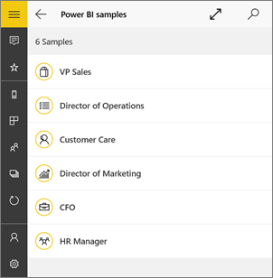

# Get started with the Power BI app for Windows 10
The Power BI app for Windows 10 brings Power BI to your Windows device. You get up-to-date, touch-enabled access to your business information. You can interact with all the Power BI reports, dashboards, and apps that are available to you in the Power BI service - both those that you've [created](../../fundamentals/service-get-started.md) yourself as well as those that have been created by others and shared with you. All this from the Power BI app for Windows 10.

## First things first
* [**Get the Power BI mobile app for Windows 10**](https://go.microsoft.com/fwlink/?LinkID=526478) from the Windows Store.
  
  Your device must run Windows 10. The app can run on devices with at least 3-GB RAM and 8-GB internal storage.

    The app is designed for a minimum resolution of 460x500.

>[!NOTE]
>Power BI mobile app support for **phones using Windows 10 Mobile** has been discontinued as of March 16, 2021. [Learn more](/legal/powerbi/powerbi-mobile/power-bi-mobile-app-end-of-support-for-windows-phones)
   
* Find out'[what's new in the Power BI mobile apps](mobile-whats-new-in-the-mobile-apps.md).

## Sign up for the Power BI service on the web
If you haven't signed up yet, go to the [Power BI service](https://powerbi.com/). Sign up for your own account to create and store dashboards and reports, and bring your data together. Then, sign in to Power BI from your Windows 10 device to see your own dashboards from anywhere.

1. In the Power BI service, tap [Sign up](https://go.microsoft.com/fwlink/?LinkID=513879) to create a Power BI account.
2. Start [creating your own dashboards and reports](../../fundamentals/service-get-started.md).

# [Classic look](#tab/classic-look)

## Get started with the Power BI app
1. On the Start screen of your Windows 10 device, open the Power BI app.
   
   
2. To view your Power BI dashboards and reports, tap **Power BI**. Sign in with the same credentials as your Power BI account on the web. 
   
   To view your Reporting Services mobile reports and KPIs, tap **SQL Server 2016 Reporting Services**. Sign in with your SQL Server Reporting Services credentials.
   
   
3. Tap **Start exploring**  to view your own dashboards.

## Try the Power BI and Reporting Services samples
Even without signing up, you can play with the Power BI and Reporting Services samples. After you download the app, you can view the samples or get started. Go back to the samples whenever you want from the dashboards home page.

### Power BI samples
You can view and interact with the Power BI dashboard samples. But, there are a few things you can't do with them. You can't open the reports behind the dashboards, share the samples with others, or make them your favorites.

1. Tap the global navigation button  in the upper-left corner.
2. Tap **Settings** icon , tap your name, then tap **View samples**.
   
   
3. Pick a role and explore the sample dashboard for that role.  
   
   

### Reporting Services mobile report samples
1. Tap the global navigation button  in the upper-left corner.
2. Tap **Settings** icon , right-click or tap and hold **Connect to server**, then tap **View samples**.
   
   
3. Open the Retail Reports or Sales Reports folder to explore their KPIs and mobile reports.
   
   

## Search for dashboards, reports, and apps
Find your dashboards, reports, and apps quickly by typing in the search box, always at the top of the app.

1. Tap the search icon in the upper-right corner.
   
   
   
   Power BI displays your most recent dashboards, reports, and apps.
   
   
2. As you start typing, Power BI displays all relevant results.
   
   

## Find your content in the Power BI mobile apps
Your dashboards and reports are stored in different locations in the Power BI mobile apps, depending on where they came from. Read  about [finding your content in the mobile apps](mobile-apps-quickstart-view-dashboard-report.md). Plus you can always search for anything you have in the Power BI mobile apps. 

## View your favorite dashboards, KPIs, and reports
View your favorite Power BI dashboards, together with Reporting Services KPIs and mobile reports, on the Favorites page in the mobile apps. When you make a dashboard a *favorite* in the Power BI mobile app, you can access it from all of your devices, including the Power BI service in your browser. 

* Tap **Favorites**.
  
   
  
   Your Power BI favorites and your favorites from the Reporting Services web portal are all on this page.
  
   

Read more about [favorites in the Power BI mobile apps](mobile-apps-favorites.md).

# [New look](#tab/new-look)

## Get started with the Power BI app
1. On the Start screen of your Windows 10 device, open the Power BI app.
   
   
2. To view your Power BI dashboards and reports, tap **Power BI**. Sign in with the same credentials as your Power BI account on the web. 
   
   To view your Reporting Services mobile reports and KPIs, tap **SQL Server 2016 Reporting Services**. Sign in with your SQL Server Reporting Services credentials.
   
   
3. Tap **Start exploring**  to view your own dashboards.

## Try the Power BI and Reporting Services samples
Even without signing up, you can play with the Power BI and Reporting Services samples. After you download the app, you can view the samples or get started. Go back to the samples whenever you want from the dashboards home page.

To see the samples, tap the global navigation button in the upper-left corner and then select **Samples**.

Six sample dashboards are available for Power BI, and two folders containing KPIs and mobile reports are available for Reporting Services.

### Power BI samples
Pick a role to start exploring one of the sample dashboards Power BI. You can view and interact with the Power BI dashboard samples, but you can't open the reports behind the dashboards, share the samples with others, or make them your favorites.

### Reporting Services mobile report samples

Open the Retail Reports or Sales Reports folder to explore their KPIs and mobile reports.

## Search for dashboards, reports, and apps
Click the magnifying glass icon at the top right of the app to find your dashboards, reports, and apps quickly. In the search pane that opens, start typing the name of what your looking for. Matching results will appear as you type. You can filter the results by selecting one of the tabs.

   

## Find your content in the Power BI mobile apps

Your dashboards and reports are stored in different locations in the Power BI mobile apps, depending on where they came from. You can get to them from the left-hand navigation bar, or from the home page, which shows you some of your frequent content, and also provides tabs that get you to lists of your recents, favorites, apps, shared with me, and workspaces. Read more about [finding your content in the mobile apps](mobile-apps-quickstart-view-dashboard-report.md). In addition, you can use the search to find anything you have in the Power BI mobile apps. 

## View your Power BI and Reporting Services favorites
Tap **Favorites** on the left-hand navigation pane to view your favorite Power BI and Reporting Services content on the Favorites page. When you make a report, dashboard, or app a *favorite* in the Power BI mobile app, you can access it from all of your devices, including the Power BI service in your browser. 

   

Read more about [favorites in the Power BI mobile apps](mobile-apps-favorites.md).

---

## Other tasks
Here are some other things you can do in the Power BI app for Windows 10 devices with reports, dashboards, and apps in Power BI, and with Reporting Services mobile reports and KPIs in the Reporting Services web portal.

### Power BI content
* View [your apps](../../collaborate-share/service-create-distribute-apps.md).
* View your [dashboards](mobile-apps-view-dashboard.md).
* [Pin Power BI tiles and dashboards](mobile-pin-dashboard-start-screen-windows-10-phone-app.md) to your device's Start screen as live tiles.
* [Share tiles](mobile-windows-10-phone-app-get-started.md).
* Share [dashboards](mobile-share-dashboard-from-the-mobile-apps.md).

### Reporting Services mobile reports and KPIs
* [View Reporting Services mobile reports and KPIs](mobile-app-windows-10-ssrs-kpis-mobile-reports.md) in the Power BI app for Windows 10 devices.
* Create [KPIs on the Reporting Services web portal](/sql/reporting-services/working-with-kpis-in-reporting-services).
* [Create your own mobile reports with the SQL Server Mobile Report Publisher](/sql/reporting-services/mobile-reports/create-mobile-reports-with-sql-server-mobile-report-publisher), and publish them to the Reporting Services web portal.

## Next steps
* [Download the Power BI app](https://go.microsoft.com/fwlink/?LinkID=526478) from the Windows Store  
* [What is Power BI?](../../fundamentals/power-bi-overview.md)
* Questions? [Try asking the Power BI Community](https://community.powerbi.com/)