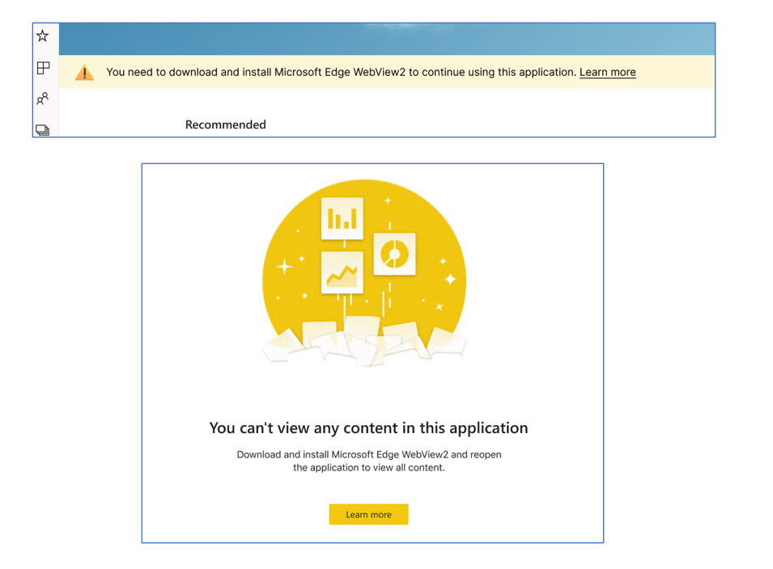

# Install WebView2

>[!NOTE]
> The Power BI Windows app was retired on December 31st, 2023, and is no longer supported. It's been removed from the Microsoft apps store, and no further product updates for it will be released. Please use [the Power BI service](https://app.powerbi.com/) to view your Power BI content on Windows devices.
>
> This notice only applies to the Power BI Windows app. It does not affect the Power BI Desktop app.

The Power BI app for Windows requires that WebView2 be installed on your computer to correctly display Power BI content. If your Windows operating system version is at least the [minimum required version](./mobile-windows-10-phone-app-get-started.md#first-things-first), the chances are that WebView2 is installed and Power BI content will display correctly. If however you get one of the following messages when you try to view Power BI content, there may be a problem with the WebView2 installation. This article describes what to do in such cases.

## Why am I getting this message?

If you got one of the messages shown above, it means that you need to install WebView2 on your computer.

## How do I install WebView2?

It takes just a minute to install WebView2. You can get and install it from [Download Microsoft Edge WebView2](https://developer.microsoft.com/microsoft-edge/webview2/consumer/).

After installing WebView2, close the Power BI Windows app and then open it again.

## I installed WebView2, but the Power BI Windows app still doesn't show content

WebView2 must be installed at the machine level rather than per user. To install WebView2 at the machine level, install WebView2 as an administrator, as described in the steps below.

1. Uninstall WebView2 if you just installed it. Don't delete the download file. If you deleted the download file, download WebView2 again.

1. Right click the WebView2 download and select **Run as administrator**.

After installing WebView2 as an administrator, close the Power BI Windows app and then open it again.

## Related content

* [Download the Power BI app](https://go.microsoft.com/fwlink/?LinkID=526478) from the Windows Store  
* [What is Power BI?](../../fundamentals/power-bi-overview.md)
* Questions? [Try asking the Power BI Community](https://community.powerbi.com/)
