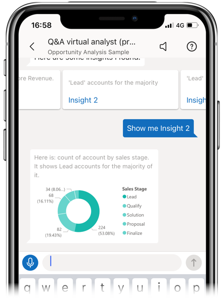

# Tutorial: Ask questions about your data with the Q&A virtual analyst in the Power BI iOS apps

The easiest way to learn about your data is to ask questions about it in your own words. In this tutorial, you ask questions and view featured insights about sample data with the Q&A virtual analyst in the Microsoft Power BI mobile app on your iPad, iPhone, and iPod Touch. 

Applies to:

|  |  |
|:--- |:--- |
| iPhones |iPads |

The Q&A virtual analyst is a conversational BI experience that accesses underlying Q&A data in the Power BI service [(https://powerbi.com)](https://powerbi.com). It suggests data insights, and you can type or speak your own questions.

In this tutorial, you will:

> [!div class="checklist"]
> * Install the Power BI mobile app for iOS
> * Download a Power BI sample dashboard and report
> * See what featured insights the mobile app suggests

If you're not signed up for Power BI, [sign up for a free trial](https://app.powerbi.com/signupredirect?pbi_source=web) before you begin.

## Prerequisites

### Install the Power BI for iOS app
[Download the iOS app](http://go.microsoft.com/fwlink/?LinkId=522062 "Download the iPhone app")  from the Apple App Store to your iPad, iPhone, or iPod Touch.

These versions support the Power BI for iOS app:
- iPad with iOS 10 or later.
- iPhone 5 and above, with iOS 10 or later. 
- iPod Touch with iOS 10 or later.

### Download the Opportunity Analysis sample
The first step in the tutorial is to download the Opportunity Analysis sample in the Power BI service.

1. Open the Power BI service in your browser (app.powerbi.com) and sign in.

1. Select the global navigation icon to open the left navigation.

    

2. In the left navigation pane, select **Workspaces** > **My Workspace**.

    

3. In the lower-left corner select **Get data**.
   
    

3. On the Get Data page, select the **Samples** icon.
   
   

4. Select the **Opportunity Analysis sample**.
 
    
 
8. Select **Connect**.  
  
   
   
5. Power BI imports the sample, adding a new dashboard, report, and dataset to your My Workspace.
   
   

OK, you're ready to view the sample on your iOS device.

## Try featured insights
1. On your iPhone or iPad, open the Power BI app and sign in with your Power BI account credentials, the same ones you used in the Power BI service in the browser.

1.  Tap the global navigation button  > **Workspaces** > **My Workspace**, and open the Opportunity Analysis Sample dashboard.

2. Tap the Q&A virtual analyst icon  from the action menu at the bottom of the page (at the top of the page on an iPad).

     

     The Power BI Q&A virtual analyst offers some suggestions to get started.

     
3. Tap **featured insights**.

     The Q&A virtual analyst suggests some insights.
4. Scroll to the right and tap **Insight 2**.

    

     The Q&A virtual analyst displays Insight 2.

    
5. Tap the chart to open it in focus mode.

    
6. Tap the arrow in the upper-left corner to go back to the Q&A virtual analyst experience.

## Clean up resources

When you've finished the tutorial, you can delete the Opportunity Analysis sample dashboard, report, and dataset.

1. Open the Power BI service (app.powerbi.com) and sign in.

2. In the left navigation pane, select **Workspaces** > **My Workspace**.

3. On the **Dashboards** tab, select the garbage can **Delete** icon next to the Opportunity Analysis dashboard.

    

4. Select the **Reports** tab and do the same for the Opportunity Analysis report.

5. Select the **Datasets** tab and do the same for the Opportunity Analysis dataset.

## Next steps

You've tried the Q&A virtual assistant in the Power BI mobile apps for iOS. Learn more about Q&A in the Power BI service.
> [!div class="nextstepaction"]
> [Q&A in the Power BI service](../end-user-q-and-a.md)

