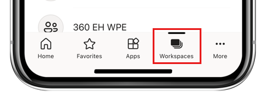
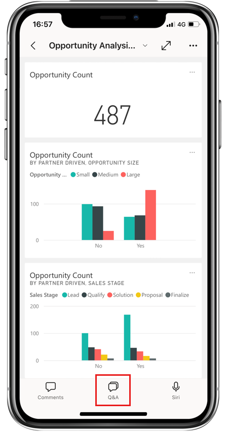
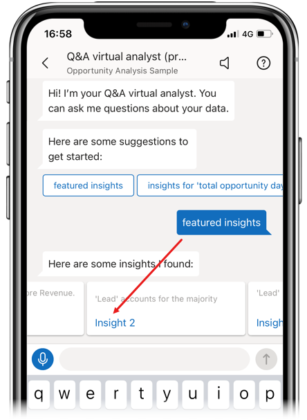
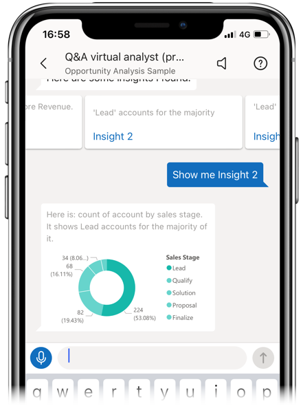

# Tutorial: Ask questions about your data with the Q&A virtual analyst in the Power BI iOS apps

The easiest way to learn about your data is to ask questions about it in your own words. In this tutorial, you ask questions and view featured insights about sample data with the Q&A virtual analyst in the Microsoft Power BI mobile app on your iPad or iPhone. 

Applies to:

|  |  |
|:--- |:--- |
| iPhones |iPads |

The Q&A virtual analyst is a conversational BI experience that accesses underlying Q&A data in the [Power BI service](https://powerbi.com). It suggests data insights, and you can type or speak your own questions.

In this tutorial, you will:

> [!div class="checklist"]
> * Install the Power BI mobile app for iOS
> * Download a Power BI sample dashboard and report
> * See what featured insights the mobile app suggests

## Prerequisites

* **Sign up for Power BI**: If you're not already signed up for Power BI, [sign up for a free trial](https://app.powerbi.com/signupredirect?pbi_source=web) before you begin.
* **Install the Power BI app for iOS**: [Download the iOS app](https://apps.apple.com/app/microsoft-power-bi/id929738808) from the Apple App Store to your iPad or iPhone.
* **Download sample data**: The first step is to download the **Opportunity Analysis Sample** into your Power BI service account. See [Install built-in samples](../../create-reports/sample-datasets.md#install-built-in-samples) for instructions. Be sure to choose the **Opportunity Analysis Sample**.

Once you've completed the prerequisites and downloaded the sample data, you're ready to view the samples on your iOS device.

## Try featured insights
1. On your iPhone or iPad, open the Power BI app and sign in with your Power BI account credentials, the same ones you used in the Power BI service in the browser.

2. On the home page navigation bar, tap the  **Workspaces** icon.

    

3. When the Workspaces page opens, tap **My Workspaces** and then the **Opportunity Analysis Sample** dashboard to open it.

3. On the Opportunity Analysis Sample dashboard, tap the Q&A virtual analyst icon on the action menu.

    

    The Q&A virtual analyst offers some suggestions to get started.

    

3. Tap **featured insights**.

4. The Q&A virtual analyst suggests some insights. Scroll to the right and tap **Insight 2**.

    

   The Q&A virtual analyst displays Insight 2.

    

5. Tap the chart to open it in focus mode.

    

6. Tap the arrow in the upper-left corner to go back to the Q&A virtual analyst experience.

## Clean up resources

When you've finished the tutorial, you can delete the Opportunity Analysis sample dashboard, report, and semantic model. See [Clean up resources](../../fundamentals/service-get-started.md#clean-up-resources) for instructions about how to do this.

## Related content

You've tried the Q&A virtual assistant in the Power BI mobile apps for iOS. Learn more about Q&A in the Power BI service.
> [!div class="nextstepaction"]
> [Q&A in the Power BI service](../end-user-q-and-a.md)