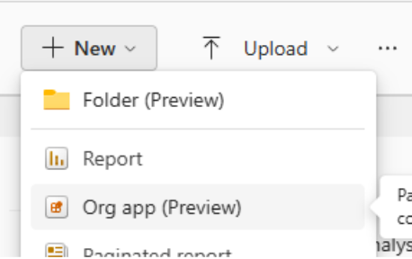

# Get started with org apps (preview)

Welcome to the preview for org apps as items - Power BI workspace apps rebuilt for Fabric as a new item type. By using org apps as items, you can create multiple org apps per workspace. You can manage org apps the same way you manage any other item type. You can create a new org app, manage access, and share the org app. All the things you find familiar and easy about managing other items, such as reports, are all familiar with org apps as items.

> [!NOTE]
> **What are org apps?** Org apps are a Microsoft Fabric item type that content creators use to bundle Power BI reports, paginated reports, Fabric notebooks, maps, and real-time dashboards into customized, shareable packages for consumers within an organization.

:::image type="content" source="media/org-app-items/org-app-item-management-collage.png" alt-text="Collage image of managing an org app item.":::

Power BI workspace apps are a great way for content creators, like report authors, to craft secure, beautiful, customized data experiences for your colleagues and consumers. By using org apps as items, you can create as many org apps as you need to ensure your team is working efficiently. By using org apps, you can customize the consumer experience with any theme color, configure navigation, and build unique landing experiences.

:::image type="content" source="media/org-app-items/org-app-consumer-view.png" alt-text="Consumer view of an org app.":::

## Prerequisites for creating org app items

The preview for org apps is off by default for tenants. To enable the preview, you must be a Microsoft Fabric administrator. From **Settings > Admin portal > Tenant settings** a Microsoft Fabric administrator needs to enable the switch entitled **Users can discover and create org apps (preview)**. Administrators can use security group inclusion and exclusion settings to control who can or can't create org apps.

:::image type="content" source="media/org-app-items/org-app-fabric-admin-portal-tenant-settings.png" alt-text="Screenshot of the Fabric admin portal tenant settings for org apps.":::

### Workspace type set to Pro, Fabric trial, or capacity

To create an org app item, a workspace must be in a specific workspace type: Pro, Fabric trial, Premium capacity, or Fabric capacity. To configure a workspace type:

1. Create or open the workspace where you want to create org app items.
1. Select **workspace settings**.
1. Depending on your tenant, select the **Premium** tab or **License info** tab.
1. Select **Edit** to change the workspace type.
1. Select **Pro**, **Trial**, **Premium capacity**, or **Fabric capacity** (depending on what your tenant administrator configured).

:::image type="content" source="media/org-app-items/org-app-workspace-license-mode-setting.png" alt-text="Screenshot of Fabric trial and capacity workspace types.":::

When Microsoft tenant administrators turn on Fabric trials, users who create an org app are prompted to start a trial.

:::image type="content" source="media/org-app-items/org-app-fabric-trial-upgrade-modal.png" alt-text="Screenshot of the Upgrade to Fabric trial modal.":::

### Workspace roles for creating an org app item

Users in the workspace with an **admin, member, or contributor (with share permissions)*** role can create and manage org app items, although contributors might not have full permissions for managing access on an org app. For more information, see [org app access management](#insufficient-permissions-when-managing-an-org-app). Workspace viewers can't create org app items.

 See also [Contributors and access management and sharing](#contributors-and-access-management--sharing).

## How org app items work, and how they're different from workspace apps

By using org app items, you can create **multiple org apps per workspace**.

By using org app items, you can package up items from the **same workspace** and share them with others in your organization who don't have access to the workspace.

After you create an org app item, you can include **Power BI reports, paginated reports, Fabric notebooks, maps, and real-time dashboards** in the org app. **These items are referred to as included items**.

When you give users access to the org app item, **at a minimum they gain read access** to the included items as well. For Power BI reports in an org app, **users gain read access to the semantic models associated with the report**. For new org apps in preview, **even if a semantic model is in a different workspace** users gain access to that model.

### Key ways that org app items are different from workspace apps (also known as Power BI apps)

- You can create multiple org app items per workspace.
  - With workspace apps, you could create only one app per workspace. If you needed different apps within a workspace, you could create audiences that would show or hide content in your app based on permissions. By using org app items, you can create a unique app per need.
- The included items, like reports, that you add to an org app aren't versioned copies of the source item. They're the original items in the same workspace as the org app item. Users who have access to the org app have access to the original version of the items added to the org app.
  - With workspace apps, all items you added to an app were automatically versioned when you published the app.
- Since users have access to the source items, if they're given a direct link to an included item, org app users can view the source items outside of the org app.
  - With workspace apps, users couldn't view items outside the app, unless they had access to the original source item via another method, like direct access.
- If a paginated report is built on a semantic model, a user given access to an org app automatically gets access to the model.
  - With workspace apps, users aren't automatically granted access to semantic models associated with paginated reports. App authors had to manually manage access to models.
- If a report or paginated report is built on a semantic model in a different workspace, a user given access to an org app automatically gets access to the model in the different workspace.
  - With workspace apps, app authors had to manually manage access to models in a different workspace.
- If you grant a user share permission on an org app item, that user can share the org app with others.
  - With workspace apps, only specific roles within the workspace could manage access and share the app.
- Users who have access to an org app don't have to install the org app to view it. The org app item appears in lists like other items do, **Recent on Home**.
  - With workspace apps, a user had to install an app to see it in lists.
- If a user is removed from an org app, that user’s org app-based access to included items and any related semantic model items associated with that org app is automatically revoked. If a user has another form of access to included items or related semantic model items that form of access is unaffected.
  - With workspace apps, if a user was removed from an app their access to semantic models remained. Revoking access to semantic models had to be done manually. App authors had to be sure that they weren't breaking that user's ability to view other reports when removing model access.

### Workspace apps continue to work alongside org app items (preview)

If you configure and publish a workspace app, org app items don't affect how your workspace app works. You can continue to use workspace apps alongside org app items.

Create and manage workspace apps at the workspace level:

:::image type="content" source="media/org-app-items/org-app-workspace-app-toolbar-entry.png" alt-text="Screenshot of the workspace toolbar entry for Power BI apps, not org apps.":::

Create and manage org app items from the **New** menu and workspace list:

Org app items appear in your workspace list:

:::image type="content" source="media/org-app-items/org-app-items-in-workspace-list.png" alt-text="Screenshot of org app items in workspace list.":::

## How to create and share an org app

### Create a new org app item and add content

From a shared workspace with the right workspace type, select **New > Org app (preview)**.
:::image type="content" source="media/org-app-items/org-app-workspace-new-menu.png" alt-text="Screenshot of the workspace new menu with org app item hovered.":::

Enter a name for your app.

:::image type="content" source="media/org-app-items/org-app-name-new-item.png" alt-text="Screenshot of the Name a new org app modal.":::

Select **Add content** and select org app-supported items from your workspace, and then select **Add to app**.

:::image type="content" source="media/org-app-items/org-app-add-content.png" alt-text="Screenshot of the Add content button.":::

Screenshot of workspace item picker:

:::image type="content" source="media/org-app-items/org-app-item-picker-add-to-app.png" alt-text="Screenshot of the org app item picker for adding content.":::

### Adding more elements to your org app and arranging the navigation

You can add more elements to your org app, like links and an overview page that lists everything in your org app. You can also arrange the navigation as you like by creating sections and reordering elements.

Add links to your org app navigation from **Add > Link**.

:::image type="content" source="media/org-app-items/org-app-new-link-modal.png" alt-text="Screenshot of the Add a link to an org app modal.":::

Add an overview page to your org app that lists everything added to your org app. Select **Add > Overview**. You can have one overview page in an org app.

:::image type="content" source="media/org-app-items/org-app-add-overview.png" alt-text="Screenshot of the Add menu with overview hovered.":::

Once you add the overview page, you can add a custom header by selecting **Add header**.

:::image type="content" source="media/org-app-items/org-app-overview-add-header.png" alt-text="Screenshot showing how to add header to overview.":::

Enter a header title and body, and choose whether to apply the org app theme color as the header’s background color.

:::image type="content" source="media/org-app-items/org-app-edit-overview-header.png" alt-text="Screenshot showing how to edit org app overview header.":::

You can add only one overview page to an org app:

:::image type="content" source="media/org-app-items/org-app-only-one-overview-tooltip.png" alt-text="Screenshot showing tooltip for one only overview per org app.":::

Organize your navigation by adding sections from **Add > Section** and naming the section.

:::image type="content" source="media/org-app-items/org-app-add-section.png" alt-text="Screenshot of the Add org app section menu.":::

Move elements to a section by selecting **... > Move to section**.

:::image type="content" source="media/org-app-items/org-app-move-nav-element-to-section-menu.png" alt-text="Screenshot showing the menu for moving navigation element to section.":::

To change how elements appear in your org app navigation, rename any element added to your org app by hovering over an element and selecting **... > Rename**.

:::image type="content" source="media/org-app-items/org-app-rename-nav-element-menu.png" alt-text="Screenshot showing how to rename a navigation element in an org app.":::

To change the order of elements in your app navigation, reorder elements by selecting **... >** and then **Move up** or **Move down**.

:::image type="content" source="media/org-app-items/org-app-move-up-nav-element.png" alt-text="Screenshot showing how to move up a navigation element in an org app.":::

The first element in your navigation is the landing experience for your org app.

### Adjust the settings for your org app

From **Settings**, change the name, description, and endorsement level.

:::image type="content" source="media/org-app-items/org-app-authoring-settings-menu-item.png" alt-text="Screenshot of the org app settings button from authoring view.":::

From the **About** tab, rename your org app, add a description, and see the details of who the owner and creator of the org app are, plus the last time the item was modified.

Changes you make from this pane instantly apply to the org app.

:::image type="content" source="media/org-app-items/org-app-edit-settings-about-tab-from-authoring.png" alt-text="Screenshot showing editing org app settings.":::

To set the endorsement level on your org app item, view the **Endorsement** tab. If you have permissions, you can make changes to the endorsement level. The endorsement level set on the org app item is unique to the org app item, not the included items you add to the org app.

### Customizing your org app

To change the app image (icon) or theme (color), select **Customize**.

:::image type="content" source="media/org-app-items/org-app-authoring-customize-menu-item.png" alt-text="Screenshot of the org app customize button from authoring.":::

From the **Branding** tab, upload your own image as the app icon and select a custom color for your org app. The icon and colors you select customize the org app experience your consumers see once you save the org app.

:::image type="content" source="media/org-app-items/org-app-edit-customize-branding-tab-from-authoring.png" alt-text="Screenshot of the org app customize pane from authoring.":::

To add a custom app image, select **Upload**. Upload a .jpg or .png file of up to 45 KB. If you need to remove the app image you uploaded, select **Reset to default**.

:::image type="content" source="media/org-app-items/org-app-image-reset.png" alt-text="Screenshot showing how to reset the org app image.":::

To add a custom color to your app, select the **down arrow** to open the color picker. Use the color picker to select any color or enter a hexadecimal or RGB value for a color of your choice.

:::image type="content" source="media/org-app-items/org-app-app-them-color-picker.png" alt-text="Screenshot of the org app theme color picker.":::

As you make image and theme selections, a sneak peek preview gives you a sense of what your org app looks like for consumers once saved.

:::image type="content" source="media/org-app-items/org-app-sneak-peek-preview-of-theme-color.png" alt-text="Screenshot of the org app sneak peek preview.":::

Before closing the pane, select **Apply**. Your changes aren't available or visible to consumers until you save your org app.

### Preview your org app before saving changes

To get a sense for what your org app looks like for consumers, select **Preview app**.

:::image type="content" source="media/org-app-items/org-app-preview-app-button-with-tooltip-.png" alt-text="Screenshot of the org app preview button.":::

A preview of your org app is shown. select **Close preview** to make more changes or save your changes.

:::image type="content" source="media/org-app-items/org-app-preview.png" alt-text="Screenshot of the org app in preview.":::

### Saving, viewing, and sharing your org app with others

After you add content, adjust the navigation, review settings, and customize your org app, save and share it with others.

#### Saving and viewing your org app

When you're ready, select **Save**.

:::image type="content" source="media/org-app-items/org-app-authoring-save.png" alt-text="Screenshot of the org app save button from authoring view.":::

If you see a warning that you can't save changes because you don't have share permissions, see **managing org app permissions**.

To view your published org app, select **View app** from the confirmation dialog that appears:

:::image type="content" source="media/org-app-items/org-app-save-toast.png" alt-text="Screenshot of the org app save toast message with manage and view links.":::

Or, visit the workspace where you saved your org app item and select the org app you want to view:

:::image type="content" source="media/org-app-items/org-app-item-workspace-list-hover.png" alt-text="Screenshot of the org app item hovered in workspace list view.":::

#### Granting others access to and sharing your org app

You have several ways to share your published org app.

:::image type="content" source="media/org-app-items/org-app-consumption-share-menu.png" alt-text="Screenshot of the org app share menu.":::

Select **Share** to see several options:

- Copy link to this app
- Link to this app page
- Manage access
- Add person or group

To share with users who already have access to the org app:

- Select **Copy link to this app** to share the org app item. Users who use the link you send must already have access. Users who use the link land on the first item in your org app.
- Select **Link to this app page** and users go directly to the item you have in view when copying the link.

To share with users who don't have access to the org app, manage access to the org app item the same way you manage access for any other item, like reports.

Select **Share > Add person or group** to add users from your organization in the modal displayed, without leaving your app:

:::image type="content" source="media/org-app-items/org-app-grant-access-share-modal.png" alt-text="Screenshot of the org app grant access modal.":::

In the modal, you can grant share permissions or notify the recipients by email, with an optional message.

For the full access management experience, select **Share > Manage access** to see the full access management page with users who have access to the org app and an opportunity to add new users. To add a new user, select **Add user** and the same modal is displayed.

:::image type="content" source="media/org-app-items/org-app-direct-access-tab-access-management.png" alt-text="Screenshot of the org app access management add user button.":::

Remember, when you give a user access to an org app item, they automatically get access to:

- Items included in the org app from the same workspace.
- The semantic models reports source from in the same workspace *and* different workspaces.

## Managing org app permissions, like removing users

Managing permissions on an org app item is similar to managing permissions for any other item, like Power BI reports.

First, view the access management screen:

- From the org app, select **Share > Manage access**
- From the workspace, select **... > Manage permissions**

Screenshot of the "more" menu on an org app item:

:::image type="content" source="media/org-app-items/org-app-item-contextual-menu-from-workspace.png" alt-text="Screenshot of the more menu from an org app item in a workspace list.":::

By default, users granted access to an org app get read permissions for the org app item, included items, and underlying items.

Want to grant extra permissions to a user? Find the user you want to manage and choose what you want to manage. Manage permissions like share or removing the user's access:

:::image type="content" source="media/org-app-items/org-app-item-permissions-modification-menu.png" alt-text="Screenshot of the org app permissions modification menu.":::

- **Add reshare** allows users to share the org app item, included items, and underlying items with others. This permission means they can grant others access to the org app and propagate access to all items the org app is dependent on. Items include reports, paginated reports, notebooks, maps, and real-time dashboards. Plus the underlying semantic models the report items depend on.
- **Remove reshare** removes a user's ability to share the org app item with others. Though anyone who has access to the org app by that user maintains access.
- **Remove access** removes that user's access to the org app item, the included report items, and the semantic model items that reports in the org app source from. Unique to new org app items, access to the underlying semantic model items is removed when a user loses access to an org app. However, if a user has another form of access to an item, such as a semantic model, they maintain access to that item. Only their org app-based access is removed.

> [!NOTE]
> There are select cases where your org app doesn't automatically propagate or revoke access to items the org app is dependent on.
> **Access propagation**: For example, a report with a paginated report visual, also known as a report definition language (RDL) visual, is dependent on a paginated report item. Org apps don't propagate access to underlying paginated reports at this time. If your org app consumers have a broken view in an org app, consider all the items your consumers need access to, grant necessary access, and have your consumers view the org app again.

Here are the items an org app propagates and revokes access to:

- The org app item itself
  - Included Power BI report and paginated report items
    - The underlying semantic model for a report or paginated report item (for a model in the same workspace or separate workspace)
  - Included Fabric notebook, map, or real-time dashboard items

Refer to the list for included items and underlying items org apps propagate and revoke access to. There are underlying item scenarios, like the RDL visual scenario noted, where org apps don't propagate or revoke access. Other scenarios include Fabric sources like lakehouses and data warehouses. For those scenarios, manage access on those underlying sources directly.

### Insufficient permissions when managing an org app

Org app items are built to automatically manage access for included items and underlying items. You don't have to independently manage access for items individually. Your org app works as expected for your consumers, without broken views in the org app.

This means org apps check a user’s share permissions to add or remove items from an org app plus add, modify, or remove a user’s access to an org app. A user who attempts to manage and org app in these ways must have full share permissions on the org app item, included items, and underlying items. Otherwise their changes or attempt to manage access fails.

Screenshot of a save scenario where a user doesn't have permissions to manage access on included or underlying items.

:::image type="content" source="media/org-app-items/org-app-save-error-then-details-flow.png" alt-text="Screenshot showing the save error flow when user has insufficient share permissions.":::

Screenshot of a share scenario where a user doesn't have permissions to manage access on included or underlying items.

:::image type="content" source="media/org-app-items/org-app-permissions-error-toast.png" alt-text="Screenshot showing the share error when user has insufficient share permissions.":::

If you encounter these messages, ask for share permissions on items associated with the org app. Or ask someone with share permissions to make changes or manage access for you.

### Contributors and access management / sharing

Workspace contributors can create and edit org app items in the workspace. Power BI apps setting that allows contributors to manage and share apps don't apply to org apps.

For org apps, some, but not all, workspace contributors have permissions to manage access for included items. Those contributors might experience messages covered in the section, **Insufficient permissions when managing an org app**. When contributors add or remove items from an org app that have nonworkspace users, the app update fails if the contributor user doesn't have permissions to share the included items. Same with sharing an org app. If a user doesn't have permissions to reshare the included items or semantic models associated with the org app the share fails. When expecting contributors to edit org app items or manage access, consider a different workspace role for the user. Or grant them share permissions on necessary items.

## How to edit an org app

Users with permissions (workspace admins, members, and contributors with share permissions) can edit an org app by starting from two places:

- workspace list > **edit**
- viewing the org app > **edit**

From the workspace list, find the org app you want to edit. Select the **more** menu **... > Edit**.

:::image type="content" source="media/org-app-items/org-app-item-contextual-menu-edit-hover.png" alt-text="Screenshot of the org app more menu with edit hover.":::

While viewing an org app, select **Edit app**.

:::image type="content" source="media/org-app-items/org-app-edit-app-button-hover.png" alt-text="Screenshot of the org app edit button hover.":::

When you're in the edit view for the org app, you can add content, change the navigation structure, adjust settings, and customize your app.

If you want to remove items from an app, hover over the item you want to remove and select the **more** menu **... > Remove from app**.

:::image type="content" source="media/org-app-items/org-app-remove-element-from-app-menu.png" alt-text="Screenshot showing how to remove an element from an org app.":::

When you finish making changes, select **Save**.

If you remove items from your app, all users who have access to the org app item automatically lose their org app-based access to the removed items and their associated semantic models.

## How to delete an org app

To delete an org app, go to the workspace where the org app is located. Select the **more** menu on the org app item you want to delete, and then select **... > Delete**.

:::image type="content" source="media/org-app-items/org-app-delete-item.png" alt-text="Screenshot showing how to delete an org app.":::

The org app is deleted. Users who had access to the org app lose their access to items that were included in the org app and the associated semantic models.

## Org app consumer experience

### Viewing or returning to org apps

Users receive an email notification when an org app is shared.

:::image type="content" source="media/org-app-items/org-app-grant-notify-email-flow.png" alt-text="Screenshot showing the flow for granting a user access to an org app and seeing share email.":::

Users can grant others access to an org app and then choose to share a link.

Users with access to org apps can find their org apps listed in a few places:

- **Home > Recents** – if they viewed the org app recently.
- **Home > Favorites** – if they favorited the org app.
- **Apps** – org app items a user has access to are listed with Power BI apps the user installed.

In list views, org app items are labeled as "org app" while Power BI apps are labeled as "app."

:::image type="content" source="media/org-app-items/org-app-and-app-type-labels.png" alt-text="Screenshot showing item type labels on apps and org apps.":::

Org app consumers without permissions to edit the org app can view, favorite, and share the org app. If a consumer doesn't have share permissions, they can only share links with users who already have access.

## Considerations and limitations

Some report capabilities available in workspace apps aren't supported in org apps. For example:
- Org apps don't support all report toolbar capabilities available in workspace apps, such as subscriptions, bookmarks, and comments.
- In org apps, the Fabric or Power BI navigation sidebar remains visible by default, unlike in workspace apps. To create a focused, distraction‑free experience, select Focus mode in the global header. [Focus mode](/fabric/fundamentals/fabric-home#maximize-editing-space-with-focus-mode) collapses both the navigation sidebar and the object explorer to maximize the available viewing area.
