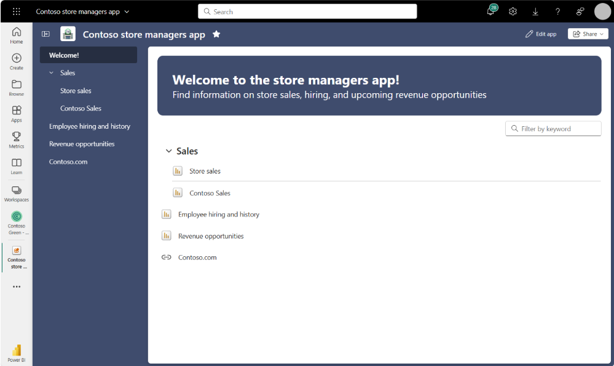
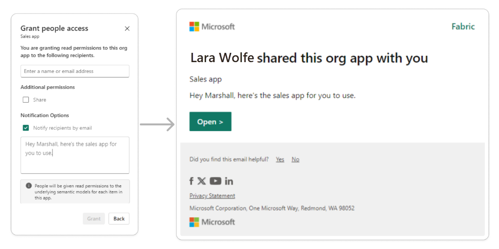

# Get started with org apps (preview) 

Welcome to the preview for org apps as items, Power BI workspace apps rebuilt for Fabric as a new item type. With org apps as items, you can create multiple org apps per workspace. And you can manage org apps the way you would any other item type - from creating a new org app, to managing access, or sharing an org app - what you find familiar and easy about managing other items, like a report, are all familiar with org apps as items.

Power BI workspace apps are a great way for content creators, like report authors, to craft secure, beautiful, customized data experiences for your colleagues and consumers. With org apps as items, you can create as many org apps as you need to ensure your team is working efficiently. And with org apps you can customize the consumer experience with any theme color, configure navigation, and build unique landing experiences.

## Prerequisites for creating org app items 

The preview for org apps is off by default for tenants. To enable the preview, you must be a Microsoft Fabric administrator. From **Settings > Admin portal > Tenant settings** a Microsoft Fabric administrator needs to enable the switch entitled **Users can discover and create org apps (preview)**. Administrators can use security group inclusion/exclusion settings to control who can or can't create org apps.

### Workspace license mode set to Fabric trial or capacity

A workspace must be in a specific license mode to create an org app item: trial or Fabric capacity. To configure a workspace:

1. Create or open the workspace where you want to create org app items.
1. Select **workspace settings**.
1. Depending on your tenant, select the **Premium** tab or **License info** tab. 
1. Select **Edit** to change the license mode for the workspace.
1. Select **Trial** or **Fabric capacity** (depending on what your tenant administrator configured). 

Users who create an org app are prompted to start a trial when a Microsoft tenant administrator turns on Fabric trials.

### Workspace roles for creating an org app item

Users in the workspace with an **admin, member, or contributor (with share permissions)*** role can create and manage org app items, although contributors might not have full permissions for managing access on an org app. See [org app access management](#insufficient-permissions-when-managing-an-org-app) for more details. Workspace viewers can't create org app items. 

 See also [Contributors and access management and sharing](#contributors-and-access-management--sharing).

## How org app items work, and how they're different from workspace apps

With org app items, you can create **multiple org apps per workspace**.

With org app items, you can package up items from the **same workspace** and share them with others in your organization who don't have access to the workspace. 

Once you create an org app item, you can include **Power BI reports, Fabric notebooks, and real-time dashboards** in the org app. **These items are referred to as included items**.

When you give users access to the org app item, **at a minimum they gain read access** to the included items as well. For Power BI reports in an org app, **users gain read access to the semantic models associated with the report**. For new org apps in preview, **even if a semantic model is in a different workspace** users gain access to that model.

### Key ways that org app items are different from workspace apps (also known as Power BI apps)

- Multiple org app items can be created per workspace.
  - With workspace apps, only one app could be created per workspace. If you had the need for different apps within a workspace, you could create audiences that would show or hide content in your app based on permissions. With org app items, you can create a unique app per need.
- The included items, like reports, added to an org app aren't versioned copies of the source item. They're the original items in the same workspace as the org app item. Users who have access to the org app have access to the original version of the items added to the org app.
  - With workspace apps, all items added to an item were automatically versioned when the app was published.
- Since users have access to the source items, if provided a direct link to an included item, org app users can view the source items outside of the org app.
  - With workspace apps users couldn't view items outside the app, unless they had access to the original source item via another method, like direct access.
- If a report is built on a semantic model in a different workspace, users who are given access to an org app are automatically granted access to the model in the different workspace.
  - With workspace apps, org app authors had to manually manage access to models in a different workspace.
- If you grant a user share permission on an org app item, that user can share the org app with others.
  - With workspace apps, only specific roles within the workspace could manage access and share the app.
- Users who have access to an org app don't have to install the org app to view it. The org app item appears in lists like other items do, **Recent on Home**.
  - With workspace apps, a user had to install an app to see it in lists.
- If a user is removed from an org app, that user loses their org app-based access to included items and semantic models associated with that org app. If a user has another form of access to included items or semantic models that form of access is unaffected.
  - With workspace apps, if a user was removed from an app their access to semantic models remained. Revoking access to semantic models had to be done manually. App authors had to be sure that they weren't breaking that user's ability to view other reports when removing model access.
  
### Workspace apps continue to work alongside org app items (preview)

If you have a workspace app configured and published, your org app items don't affect how your workspace app works. You can continue to use workspace apps alongside org app items.

Workspace apps are created and managed at the workspace level:

Org app items are created and managed from the New menu and workspace list:

Org app items appear in your workspace list:

## How to create and share an org app

### Creating a new org app item and adding content

From a shared workspace in the right license mode, select **New > Org app (preview)**

Name your app

Select **Add content** and select reports and notebooks from your workspace, then select **Add to app.**

Screenshot of workspace item picker:

### Adding more elements to your org app and arranging the navigation

You can add more elements to your org app, like links and an overview page that lists everything in your org app. And you can arrange the navigation as you’d like in sections and reordering elements. 

Add links to your org app navigation from **Add > Link.**

Add an overview page to your org app that lists everything added to your org app. Select **Add > Overview**. You can have one overview page in an org app.

Once the overview page is added, you can add a custom header by selecting **Add header**.

You can enter a header title, body, and choose to apply the org app theme color as the header’s background color.

Only one overview page can be added to an org app: 

Organize your navigation by adding sections from **Add > Section** and naming the section.

Move elements to a section by selecting **... > Move to section**.

To change how elements show up in your org app navigation, you can rename any element added to your org app by hovering over an element added to your app and selecting **... > Rename**.

To change the order of elements in your app navigation, you can reorder elements by selecting **... >** and then **Move up** or **Move down**.

The first element in your navigation is the landing experience for your org app. 

### Adjust the settings for your org app

From **Settings** you can change the name, description, and endorsement level.

From the **About** tab you can rename your org app, add a description, and see the details of who the owner and creator of the org app is, plus the last time the item was modified. 

Changes you make from this pane are instantly applied to the org app.

To set the endorsement level on your org app item, view the **Endorsement** tab and, if you have permissions, you can make changes to the endorsement level. Note, the endorsement level set on the org app item is unique to the org app item, not the included items you add to the org app.

### Customizing your org app

To change the app image (icon) or theme (color), select **Customize**.

From the **Branding** tab, you can upload your own image as the app icon and select a custom color for your org app. The icon and colors you select are used to customize the org app experience your consumers see once the org app is saved.

To add a custom app image, select **Upload**. Upload a .jpg or .png file of up to 45 KB. If you need to remove the app image you uploaded, select **Reset to default**.

To add a custom color to your app, select the **down arrow** to open the color picker. From here, you can use the color picker to select any color you would like or enter a hexadecimal or RGB value for a color of your choice.

As you make image and theme selections, a sneak peek preview gives you a sense of what your org app looks like for consumers once saved.

Before closing the pane, select **Apply**. But note, your changes aren't available or visible to consumers until you save your org app. 

### Preview your org app before saving changes 

To get a sense for what your org app looks like for consumers, select **Preview app**.

A preview of your org app is shown. select **Close preview** to make more changes or save your changes.

### Saving, viewing, and sharing your org app with others

Once you add content, adjust the navigation, review settings, and customize your org app it's time to save and share it with others. 

#### Saving and viewing your org app

When you're ready, select **Save**.

If you get a warning that you couldn't save changes because you don't have share permissions, see more on **managing org app permissions.** 

To view your published org app, you can select **View app** from the confirmation dialog that appears:

Or you can visit the workspace your org app item was saved to and select the org app you would like to view:

#### Granting others access to and sharing your org app

You have several ways to share your published org app.

Selecting **Share** shows several options: 
- Copy link to this app
- Link to this app page 
- Manage access 
- Add person or group 

To share with users who already have access to the org app:

- Select **Copy link to this app** to share the org app item. Users who use the link you send must already have access. Users who use the link land on the first item in your org app.
- Select **Link to this app page** and users are taken directly to the item you have in view when copying the link 

To share with users who don't have access to the org app you can manage access to the org app item the way you do any other item, like reports. 

Select **Share > Add person or group** and you can add users from your organization from the modal displayed, without leaving your app:

From the modal displayed you have options to grant share permissions or notify the recipients by email, with an optional message. 

For the full access management experience, select **Share > Manage access** and to see the full access management page with users who have access to the org app and an opportunity to add new users. To add a new user, select **Add user** and the same modal is displayed.

Remember, users who are given access to an org app item are automatically granted access to:
- items included in the org app from the same workspace.
- semantic models that included reports source from in the same workspace *and* different workspaces. 

## Managing org app permissions, like removing users 

Managing permissions on an org app item is similar to managing permissions for any other item, like Power BI reports. 

First, view the access management screen: 
- From the org app, select **Share > Manage access** 
- From the workspace, select **... > Manage permissions** 

Screenshot of the "more" menu on an org app item:

By default, users granted access to an org app are given read permissions for the org app item, included items, and underlying items. 

Want to grant extra permissions to a user? Find the user you would like to manage and choose what you would like to manage. Manage permissions like share or removing the user's access:

- **Add reshare** allows users to share the org app item, included items, and underlying items with others. This means they can grant others access to the org app and propagate access to all items the org app is dependent on. Items like included reports, notebooks, and real-time dashboards. Plus the underlying semantic models the report items depend on.
- **Remove reshare** removes a user's ability to share the org app item with others. Though anyone who has access to the org app by that user maintains access. 
- **Remove access** removes that user's access to the org app item, the included items, and the semantic models that reports in the org app source from. Unique to new org app items, access to all lineage items is removed when a user loses access to an org app. Though if a user has another form of access to an item, like a semantic model, they maintain access to that item. Only their org app-based access is removed. 

> [!NOTE]
> There are select cases where your org app doesn't automatically propagate access to items the org app is dependent on. For example, a report with a paginated report visual, also known as a report definition language (RDL) visual, is dependent on a paginated report item. Org apps don't propagate access to underlying paginated reports at this time. If your org app consumers have a broken view in an org app, consider all the items your consumers need access to, grant necessary access, and have your consumers view the org app again. 

Here are the items org apps propagate and revoke access to: 
- The org app item itself 
  - Included report items 
    - The underlying semantic model for a report item (for a model in the same workspace or separate workspace)
  - Included notebook or real-time dashboard items 

### Insufficient permissions when managing an org app

Org app items are built to automatically manage access for included items and underlying items. You don't have to independently manage access for items individually. Your org app works as expected for your consumers, without broken views in the org app. 

This means org apps check a user’s share permissions to add or remove items from an org app plus add, modify, or remove a user’s access to an org app. A user who attempts to manage and org app in these ways must have full share permissions on the org app item, included items, and underlying items. Otherwise their changes or attempt to manage access fails. 

Screenshot of a save scenario where a user doesn't have permissions to manage access on included or underlying items.

Screenshot of a share scenario where a user doesn't have permissions to manage access on included or underlying items.

If you encounter these messages, ask for share permissions on items associated with the org app. Or ask someone with share permissions to make changes or manage access for you.

### Contributors and access management / sharing

Workspace contributors can create and edit org app items in the workspace. Power BI apps setting that allows contributors to manage and share apps don't apply to org apps. 

For org apps, some, but not all, workspace contributors have permissions to manage access for included items. Those contributors might experience messages covered in the section, **Insufficient permissions when managing an org app**. When contributors add or remove items from an org app that have nonworkspace users, the app update fails if the contributor user doesn't have permissions to share the included items. Same with sharing an org app. If a user doesn't have permissions to reshare the included items or semantic models associated with the org app the share fails. When expecting contributors to edit org app items or manage access, consider a different workspace role for the user. Or grant them share permissions on necessary items. 

## How to edit an org app

For users with permissions (workspace admins, members, and contributors with share permissions) you can edit an org app by starting from two places:

- workspace list > **edit** 
- viewing the org app > **edit** 

From the workspace list, find the org app you would like to edit, select the "more" menu **... > Edit**.

While viewing an org app, select **Edit app**.

Once in the edit view for the org app you can add content, change the navigation structure, adjust settings, and customize your app. 

If you would like to remove items from an app, hover over the item you would like to remove and select the "more" menu **... > Remove from app**.

Once your changes are made, select **Save**. 

If you removed items from your app, all users who have access to the org app item automatically lose their org app-based access to the removed items and their associated semantic models. 

## How to delete an org app

Need to delete an org app? From the workspace an org app is located in, select the "more" menu on the org app item you would like to delete, **... > Delete**.

The org app item is deleted. Users who have access to the org app lose their access to items that were included in the org app and the associated semantic models. 

## Org app consumer experience

### Viewing or returning to org apps

Users can be notified via email when an org app is shared.

Users can also grant others to an org app and then choose to share a link. 

Users with access to org apps can find their org apps listed in a few places: 
- Home > Recents – if they viewed the org app recently.
- Home > Favorites – if they favorited the org app.
- Apps – org apps items a user has access to are listed with Power BI apps the user installed.

In list views, org app items are labeled as "org app" while Power BI apps are labeled as "app."

Org app consumers without permissions to edit the org app are able to view, favorite, and share the org app. If a consumer doesn't have share permissions, they can only share links with users who already have access.

