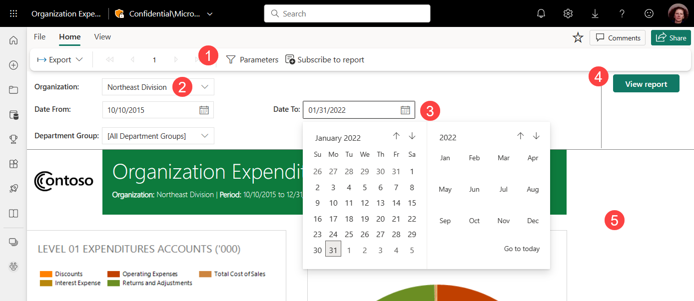

# View parameters for paginated reports in the Power BI service

In this article, you learn how to interact with parameters for paginated reports in the Power BI service.  A report parameter provides a way to filter report data. Parameters offer a list of available values. You can choose one or many values, or type in a parameter text box to search for values. Sometimes parameters have a default value, and sometimes you have to choose a value before you see the report.  

When you view a report that has parameters, the report viewer toolbar displays each parameter so you can interactively specify values. The following illustration shows the parameter area for a report with parameters for **Buying Group**, **Location**, a **From Date**, and a **To Date**.  

## Parameters pane in the Power BI service

  
1. **Parameters pane** Select **Parameters** to show or hide the Parameters pane.
  
1. **Organization parameter** The Organization parameter is set to allow you to select only one value.

1. **Date From / Date To parameters** The two date parameters have default values. To change the date, type a date in the text box, choose a date in the calendar, or select **Go to today**.  
 
1. **View Report**  After you enter or change parameter values, select **View Report** to run the report. 

1. **Default values** If all parameters have default values, the report runs automatically on first view. The parameters in this report have default values, so you see the report with those values.  

## Related content

- [Paginated reports in the Power BI service](end-user-paginated-report.md)
