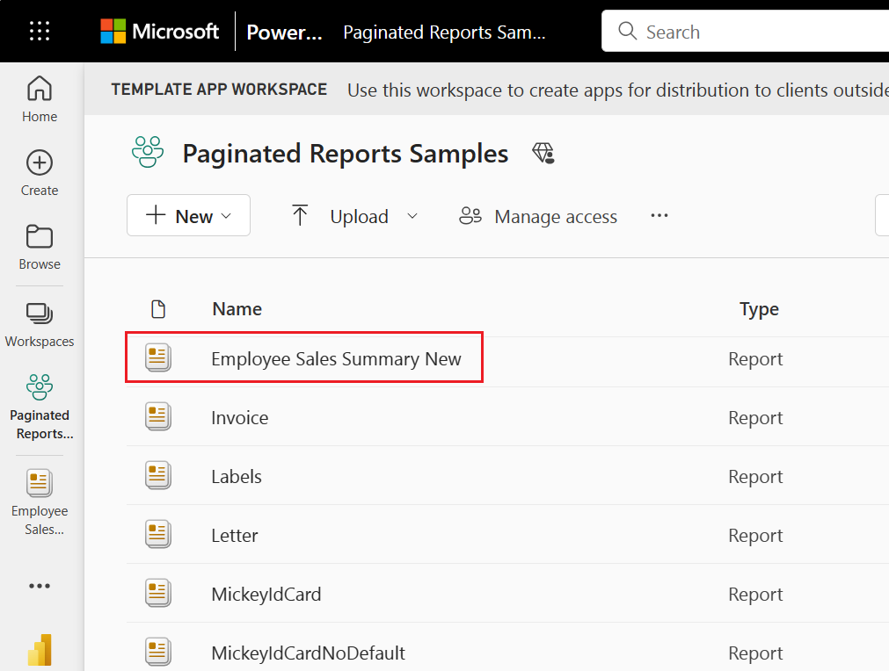
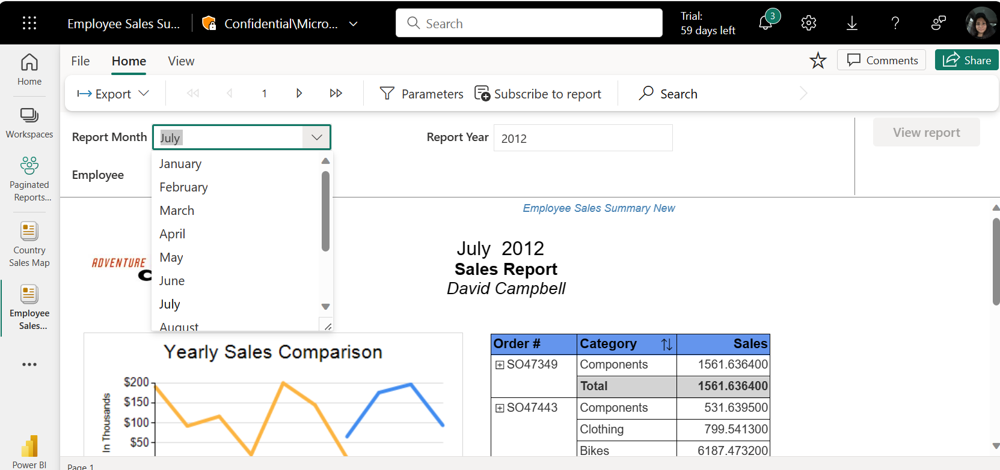
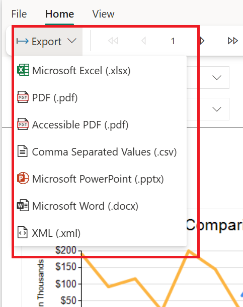

# View a paginated report in the Power BI service

In this article, you learn about viewing a paginated report to the Power BI service. Paginated reports are reports created in Report Builder and uploaded to any  workspace in a Premium capacity. Look for the diamond icon  next to the workspace name. 

Paginated reports have their own icon .

You can also export paginated reports to a number of formats: 

- Microsoft Excel
- Microsoft Word
- Microsoft PowerPoint
- PDF (and [Accessible PDF, or PDF/UA](../../report-server/rendering-extension-support.md))
- Comma-separated values
- XML
- Web archive (.mhtml)

## View a paginated report

1. Select the paginated report in the workspace.

    

2. If the report has parameters, as this one does, you may not see the report when you first open it. Select parameters, then select **View Report**. 

     

    You can also change the parameters at any time.

1. Page through the report by selecting the arrows at the top of the page, or by typing a page number in the box.
    
   

4. Select **Export** to find a format to export your paginated reports.

    

## Next steps

[Paginated reports in the Power BI service](end-user-paginated-report.md)
