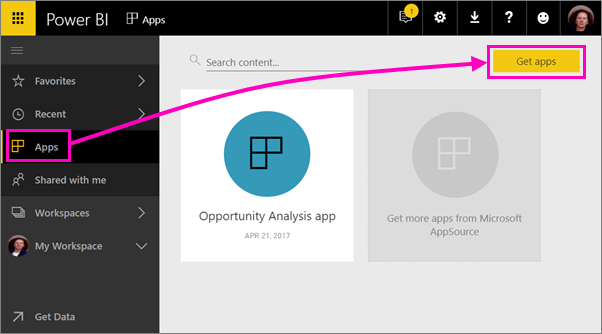
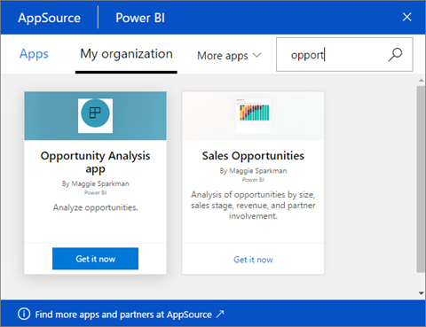
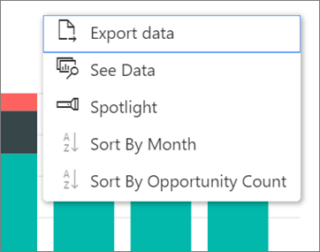

# Install and use apps with dashboards and reports in Power BI
In Power BI, *apps* bring related dashboards and reports together, all in one place. People in your organization can create and distribute apps with key business information. [External services](end-user-connect-to-services.md) you may already use, such as Google Analytics and Microsoft Dynamics CRM, also offer Power BI apps. 

Apps are easy to find and install in the Power BI service ([https://powerbi.com](https://powerbi.com)) and on your mobile device. After you install an app, you don't have to remember the names of a lot of different dashboards because they're all together in one app, in your browser or on your mobile device.

With apps, whenever the app author releases updates, you automatically see the changes. The author also controls how often the data is scheduled to refresh, so you don't need to worry about keeping it up to date. 

Planning to author an app? See [Create workspaces with your colleagues in Power BI](end-user-create-apps.md) for more information.

## Get a new app
You can get apps in a few different ways. The app author can install the app automatically in your Power BI account, or send you a direct link to an app, or you can search for it in AppSource, where you see all the apps that you can access. In Power BI on your mobile device, you can only install it from a direct link, and not from AppSource. If the app author installs the app automatically, you'll see it in your list of apps.

### Install an app from a direct link
The easiest way to install a new app yourself is to get a direct link from the app author. Power BI creates an installation link, which the author can send to you.

**On your computer** 

When you click the link in email the Power BI service ([https://powerbi.com](https://powerbi.com)) opens in a browser. You confirm you want to install the app and it opens to the app landing page.

**On your iOS or Android mobile device** 

When you click the link in email on your mobile device, the app installs automatically and opens the app content list in the mobile app. 

### Get the app from Microsoft AppSource
You can also find and install any apps that you have access to from Microsoft AppSource. 

1. Select **Apps**  > **Get apps**. 
   
     
2. In AppSource under **My organization**, you can search to narrow the results and find the app you're looking for.
   
     
3. Select **Get it now** to add it to your Apps page. 

## Interact with the dashboards and reports in the app
Now you can explore the data in the dashboards and reports in the app. You have access to all the standard Power BI interactions such as filtering, highlighting, sorting, and drilling down. You can also [export the data to Excel ](end-user-export-data.md) from a table or other visual in a report. Read about [interacting with reports in Power BI](end-user-reading-view.md). 

## Next steps
* [Create and publish apps in Power BI](end-user-create-apps.md)
* [Power BI apps for external services](end-user-connect-to-services.md)
* Questions? [Try asking the Power BI Community](http://community.powerbi.com/)

