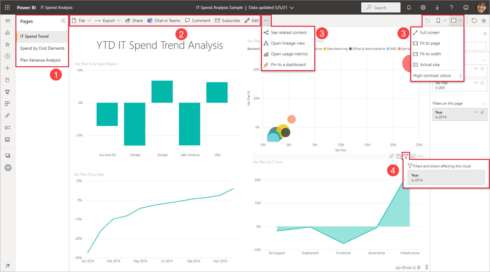
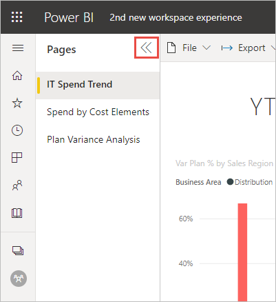
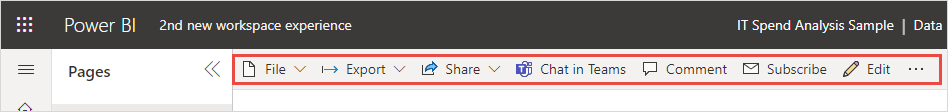
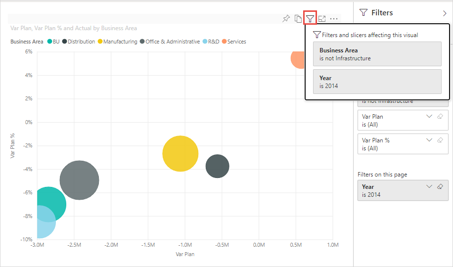
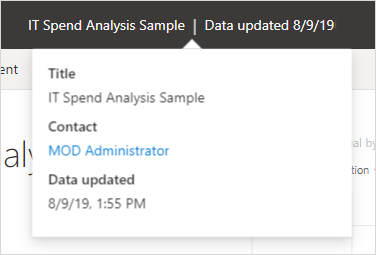

# The 'new look' of the Power BI service

The Power BI service (app.powerbi.com) has a new look that makes it easier to view and interact with your reports. The new look is simpler and builds on your familiarity with other Microsoft products. Across the Power BI service, we’ve made report content the main point of focus by switching to a lighter color theme and updating icons. 

Looking for information about the new look in **Power BI Desktop**? See [Use the updated ribbon in Power BI Desktop](../create-reports/desktop-ribbon.md).

Here's an overview of what’s changed in the new look. See the numbered sections for details:

## 1. Vertical list of pages 
In Reading view, report page names are in a list in a vertical pane. They're prominent, hard to miss, and similar to navigation in Word and PowerPoint. You can increase or decrease the rest of the report area: Resize the vertical pane, or select the double arrows to close it altogether.

If you have edit permission for a report, you can set it so the page names are across the bottom, as they are in report Editing view. See [Set the Pages pane](../create-reports/power-bi-report-settings.md#set-the-pages-pane) in the "Change settings for Power BI reports" article for details.

## 2. Simplified action bar 

The updated action bar across the top features the most relevant commands, front and center for report consumers. It's easier to export, share, chat in Teams, and subscribe. 

## 3. Where are the report commands?

We didn't remove any of the functionality from the old look. Select **More options (...)** for other, more advanced commands.

## 4. New filter experience

You see the new Filters pane for the report by default with the new look. And when you hover over the Filter icon for a visual, you see all the filters and slicers affecting that visual.

## View report details 

See details such as last refresh date and contact information quickly, right in the top banner.  Open the menu to view additional details about the report. You can even send an email to the report owner.

## No changes to report edit mode 

We’ve kept the authoring experience similar to the experience in Desktop. The new look changes only apply to the reading view.

## Dashboard 'new look' experience 

Dashboards also have a simplified action bar. It's just like reports and apps, for a consistent experience, but it retains the functional differences. Here's a walkthrough of actions in a dashboard.
 

## Next steps

- [Use the updated ribbon in Power BI Desktop](../create-reports/desktop-ribbon.md)
- [Power BI for consumers](end-user-consumer.md)
