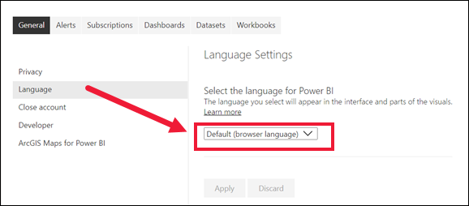

# Troubleshooting Power BI subscriptions

Here are some common issues that may come up when you're subscribing yourself or others to a dashboard or report. Please also refer to the Considerations and Limitations section in [Subscribe to reports and dashboards](end-user-subscribe.md#considerations-and-limitations)

If you encounter a scenario that is not listed below, and it's causing you issues, you can ask for further assistance on the [community site](https://community.powerbi.com/), or you can create a [support ticket](https://powerbi.microsoft.com/support/). 

## I can’t use the subscription feature  

The **Subscribe** option is missing or greyed out.

### Contact your Power BI administrator or IT help desk.

- If you can’t use the subscription feature, contact your Power BI administrator or IT help desk. Your organization may have disabled this feature, generally or specifically for external users, or a maximum subscriber limit may have been reached. 

- Your organization may configure certain settings in Azure Active Directory that limit the ability to use email subscriptions in Power BI. These limitations include, but aren't limited to, having multi-factor authentication or IP range restrictions when accessing resources. 

### You've reached the maximum of 24 subscriptions
There is a limit of 24 scheduled subscription runs per day per report or dashboard.  

## I’ve stopped receiving a subscription 
I've set up a subscription but am not receiving the subscription emails.

### Account or license issues
- A subscription will end if the Power BI Pro or Premium Per User (PPU) license expires, the report or dashboard is deleted by the owner, or the user account used to create the subscription is deleted. 

### Email issues
- To avoid subscription emails going to your spam folder, add the Power BI email alias (no-reply-powerbi@microsoft.com) to your contacts. If you're using Microsoft Outlook, right-click the alias and select **Add to Outlook contacts**. 

- Subscriptions may fail on reports or dashboards with extremely large images due to email size limits. 

- Make sure that your User Principal Name (UPN) can receive emails. 

- Though you have a Power BI Pro or Premium Per User (PPU) license, you may not have a Microsoft Exchange license. If not, your Azure Active Directory account may not have an email or alternate email address specified. In this case, though the subscription appears to go out, you never receive a copy. If your Power BI admin assigns an email address, Power BI will synchronize the update the next time you sign in, and use that email address for the subscription. 
- If you have an alternate email address but no primary, Power BI uses that to deliver the subscription. 

### Admin portal settings
- Email subscriptions are not supported when Block Public Internet Access is enabled in the Power BI admin portal. 

## The links in my email subscription no longer work

If the links in your email (to the content) stop working, it may be that the content was deleted. In the email, beneath the screenshot, you can look to see if you subscribed yourself or if someone else subscribed you. If someone else, ask that co-worker to either cancel the emails or re-subscribe you.

## The language in my subscription is not correct  

The email and snapshot will use the language set in Power BI settings (see[Supported languages and countries/regions for Power BI](../fundamentals/supported-languages-countries-regions.md)). If no language is defined, Power BI uses English as a fallback. To see or set your language preference, select the cog icon  > **Settings > General > Language**. 

## My dashboard subscription is missing tiles 
You receive your subscription email, open the dashboard, and notice that one or more tiles are missing

### Too many dashboard tiles
Dashboards with more than 25 pinned tiles, or four pinned live report pages, may not render fully in subscription emails sent to users. We suggest that you contact the dashboard designer and ask them to reduce pinned tiles to less than 25 and pinned live reports to less than four to ensure that the email renders correctly. 

### Row level security (RLS)
- For dashboard email subscriptions, if any tiles have row level security (RLS) applied, those tiles will not display. 

- For paginated and Power BI report email subscriptions, if the dataset uses row-level security (RLS), you can create subscriptions for yourself and others. Those subscriptions will run using your security context.

### Tile type not supported
For dashboard subscriptions, certain types of tiles aren't yet supported. These include: streaming tiles, video tiles, custom web content tiles. 

## My subscription is delayed  
You notice that your subscription emails aren't being delivered as expected. 

### Periods of peak demand
- The time you set your subscription to begin is when the subscription starts to process. Once the report processing is complete, the subscription is queued and sent to the e-mail recipients. At times of peak demand, you may see a delay, but not more than 15 minutes. On occasion, it may take up to 30 minutes, but should never exceed 60 minutes. If you experience a longer delay, ensure that the address no-reply-powerbi@microsoft.com is on the safe sender list. If the email isn't being blocked, contact your Power BI administrator or IT help desk for assistance. 

- On rare occasions, email subscriptions may take longer than fifteen minutes to be delivered to their recipients. If this happens, we recommend running your data refresh and email subscription at different times to ensure timely delivery. If the issue persists, contact Power BI support.

### Email software is blocking delivery
Another possibility is that your email software is blocking the Power BI sender. To avoid subscription emails going to your spam folder, add the Power BI email alias (no-reply-powerbi@microsoft.com) to your contacts. If you're using Microsoft Outlook, right-click the alias and select **Add to Outlook contacts**. 

## My report or dashboard has multiple data refreshes
I'm not receiving subscription emails each time my data refreshes. 

### Check the **Frequency** setting for your subscription
Subscriptions set to **After Data Refresh** for the report or dashboard will only send an email after the first scheduled refresh on that day. 

### Your data uses a live connection

Currently, email subscriptions for reports and dashboards using live connection datasets aren't supported when subscribing users other than yourself, except for paginated reports. Read more about [subscribing to paginated reports](end-user-subscribe.md#subscribe-to-paginated-reports). 

## My subscription has over 200 recipients 

There's a limit to the number of subscribers for one report or dashboard. After you pass 200 subscribers, you may encounter issues with delivery. To reduce the number, use group email aliases instead. Each email alias counts as one subscriber. 

## I get an error that my subscription has over 20 pages
You may get an error message that the report has more than 20 pages even though your view of the report shows less than 20. One reason for this is that the report designer has hidden pages in the report. When Power BI counts the report pages, it includes hidden pages in that count.

## Data security for subscription email content  
You can choose to give subscription recipients access to open and view the content in Power BI by selecting **Access to this report/dashboard** and whether to include a link to this content by selecting **Link to report/dashboard in Power BI**. 

### Row level security
For dashboard subscriptions, if any tiles have row level security (RLS) applied, those tiles will not display.  

### Recipients don't have access to the report or dashboard
If you choose to include a link, ensure that all users also have access to the content. Subscribed users receive report attachments, with data based on your permissions. 

:::image type="content" source="media/end-user-subscribe/power-bi-troubleshoot.png" alt-text="Screenshot showing 2 options selected under the heading Also include.":::

### I removed access for others, but they can still open the report or dashboard
Clearing the **Access to this report/dashboard** option does not revoke access for users who have already been granted access this report in the Power BI service (app.powerbi.com). To remove access, see [Manage permissions to a dashboard](../collaborate-share/service-share-dashboards.md#manage-permissions-to-a-dashboard) and see  [Manage permissions to a report](../collaborate-share/service-share-dashboards.md#manage-permissions-to-a-report).

### I can't tell if access is enabled or disabled
The option to provide **Access to this report/dashboard** always shows as enabled when you edit an existing subscription. If you clear this option and save the subscription, this state is saved. However, if you edit the subscription again, the option will be checked again by default. 

## On a mobile device, the email link opens the app instead of the Power BI service website

### If you have the Power BI app installed, this is expected behavior
When you receive the subscription email, it includes a link to **Go to report or dashboard**. On mobile devices with Power BI apps installed, selecting this link launches the app (as opposed to the default action of opening the report or dashboard on the Power BI website).

## I can't create a report attachment, full report attachment greyed out

The full report attachment feature is available for reports that meet the following three conditions. Any existing subscriptions with full reports as attachments that do not meet these conditions are disabled and you will receive an email explaining the error.
- They're in an upgraded workspace with [Power BI Premium or Premium Per User](../admin/service-premium-what-is.md). 
- The report has fewer than 20 pages (see [this issue described above](#i-get-an-error-that-my-subscription-has-over-20-pages).
- The attachment file is under 25 MB in size.
 
## Which Power BI features are not supported in subscriptions?
There are certain Power BI features that will not work when using the subscription feature.

- Email subscriptions do not support most [custom visuals](../developer/visuals/develop-power-bi-visuals.md).  The exception is those Power BI custom visuals that have been [certified](../developer/visuals/power-bi-custom-visuals-certified.md).

- For dashboard subscriptions, certain types of tiles aren't yet supported. These include: streaming tiles, video tiles, custom web content tiles.

- For dashboard subscriptions, if any tiles have row level security (RLS) applied, those tiles will not display.  

    
## Next steps
- [Share Power BI dashboards and reports with coworkers and others](../service-share-dashboards.md)
- [How should I collaborate on and share dashboards and reports?](../service-how-to-collaborate-distribute-dashboards-reports.md)
- [Share a filtered Power BI report](../service-share-reports.md)
- Questions? [Try the Power BI Community](https://community.powerbi.com/) 

