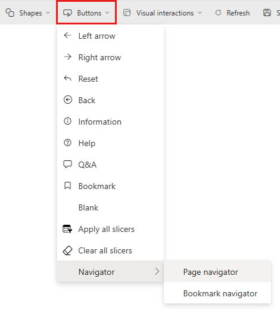

# Create Apply all and Clear all slicers buttons in Power BI reports

[!INCLUDE [applies-yes-desktop-yes-service](../includes/applies-yes-desktop-yes-service.md)]

If you have a report page with a number of slicers, consider adding *Apply all slicers* and *Clear all slicers* buttons to the page. These buttons apply all the slicers or clear all the slicers on a page, with one click, reducing the number of unnecessary visual queries the slicers send.

## Why add an Apply all slicers button

Performance is the main reason to add an Apply all slicers button to your reports.  Say you have a report with five slicers and six other visuals. Every time you make a selection in the slicers, the six other visuals change. You pick two different options in the first three slicers, one option in the fourth slicer, and four options in the last one. You made eleven different selections. Ten of those different selections updated the other six visuals on the page unnecessarily, resulting in 60 unnecessary visual queries. You can bring this down to just the six *necessary* visual queries with the Apply all slicers button.

This basic scenario demonstrates significant query reduction, reducing 66 visual queries down to just six.

See [Optimize Power BI Desktop](desktop-optimize-ribbon.md) for more ways to improve report performance.

## Create an Apply all slicers button in a report

### [Power BI Desktop](#tab/powerbi-desktop)

In Power BI Desktop, on the **Insert** ribbon, select **Buttons** to reveal a drop-down menu, then select the **Apply all slicers** button.

### [Power BI service](#tab/powerbi-service)

In the Power BI service, open the report in Editing view. Select **Buttons** in the top menu bar to reveal a drop-down menu, then select the **Apply all slicers** button.

---

After you create the Apply all slicers button, you can customize it as you would any other button. See [Customize buttons in Power BI reports](power-bi-customize-button.md) for details.

## Add a Clear all slicers button

A Clear all slicers button allows you to quickly and efficiently clear all slicer selections at once. This button is also a query reduction feature. Clearing the slicers one by one with the slicer’s **Clear selections** means for a five-slicer report, the first four times you clear the slicers, the visuals update before you're done.  You've created four times six visual queries, or 24 unnecessary visual queries. With the Clear all slicers button, all the slicers are cleared, and then the other visuals update.

## Hide the Apply all slicers button with a bookmark

You might want to let your report consumers decide how they want to apply their slicers: if they want to apply them one at a time or all at once. You can do that by hiding the Apply all slicers button with a bookmark. If the report page has more than one Apply all slicers button, when the last one on the page is hidden, the slicers revert to instantly applying as you make selections. To hide the button, you create two bookmarks: one to show the button and one to hide the button. Then you surface those bookmarks with the bookmark navigator.

### Create bookmarks

1. On the **View** tab > **Show panes**, select **Selection**.
1. Select the **Apply all slicers** button on the canvas, so it's highlighted in the Selection pane.

    :::image type="content" source="media/buttons-apply-all-clear-all-slicers/selection-pane-button.png" alt-text="highlighting the Apply all slicers button.":::

1. On the **View** tab > **Show panes**, select **Bookmarks**.
1. In the Bookmarks pane, select **Add**.
1. Adjust the new bookmark to **Selected visuals**, then **Update** and rename to **Apply all slicers**.

    :::image type="content" source="media/buttons-apply-all-clear-all-slicers/bookmark-selected-visuals.png" alt-text="Bookmarks pane, Selected visuals.":::

1. In the Selection pane, select the little eye next to the button to hide it on the report page. You see a warning that "This change will affect slicer behavior."

    :::image type="content" source="media/buttons-apply-all-clear-all-slicers/hide-apply-all-slicer-button.png" alt-text="hide Apply all slicer button.":::

1. In the Selection pane, select the now hidden Apply all slicers button again so it's highlighted.
1. In the Bookmarks pane, select **Add** again, then adjust the bookmark to **Selected visuals**, then **Update** and finally rename to **Instantly apply**.

### Add a bookmark navigator

1. Now you've set up the bookmarks, go to **Insert** > **Buttons** > **Bookmark navigator**.

1. If you want the bookmarks to look like little tabs above your left section, change the shape to a trapezoid with 10 px rounding and 20% slant. Then for the default state you make the text DIN 8 centered top with 8 px padding in black with a grey 0% transparent fill and no border. For the selected state you make it the same, except with a white 0% transparent fill. Then you position it behind your left section and change it to maintain layer order.
 
    :::image type="content" source="media/buttons-apply-all-clear-all-slicers/hidden-apply-all-slicer-button.png" alt-text="hidden Apply all slicers button.":::

1. Because you're in Power BI Desktop, you need to press Ctrl + click to engage either bookmark.

1. When you select the **Instantly apply** bookmark and the button is hidden, the slicers instantly apply every selection you make. 

    When you select the **Apply all slicers** bookmark tab, the button comes back, and you have the experience of the first scenario: full query reduction while you make your selections.

## Considerations and limitations

### Considerations about the buttons

Some things to keep in mind with these buttons:

- **Apply all slicers** and **Clear all slicers** buttons impact all the slicers on the report page. You can't pick and choose which slicers you want each button to control. They also don't control the Filters pane.

- You can have as many of these buttons on your report page as you like. If you have most of your slicers in one section, with one or two slicers in another section, you can have a button in both sections. When you press either button it applies to all the slicers on the report page.

- Hiding the last Apply all slicers button releases its control over the slicers. They revert to instantly applying selections as you make selections.

### Considerations about the slicers

Some things to keep in mind with the slicers:

- The slicers with selections not yet applied to other visuals are in a pending state.
- This pending state of the slicer is indicated in the Slicer header with a pending clock icon and some customizable text.
- The slicer pending icon can't be changed. However, you can change the pending icon color, size, transparency, if it’s to the left or right of the header, or even if it’s shown at all, in the formatting pane.
- If the slicer header is turned off, then there's no indication of the pending state of the selections on the slicer itself. However, the Apply all slicers button is in a disabled state until one or more of the slicers has a pending change.

## Related content

For more information about features that are similar or interact with buttons, take a look at the following articles:

- [Optimize Power BI Desktop](desktop-optimize-ribbon.md)
- [Create page and bookmark navigators](button-navigators.md)
- [Identify and use buttons in the Power BI service](../consumer/end-user-buttons.md)
- [Use bookmarks to share insights and build stories in Power BI](desktop-bookmarks.md)

