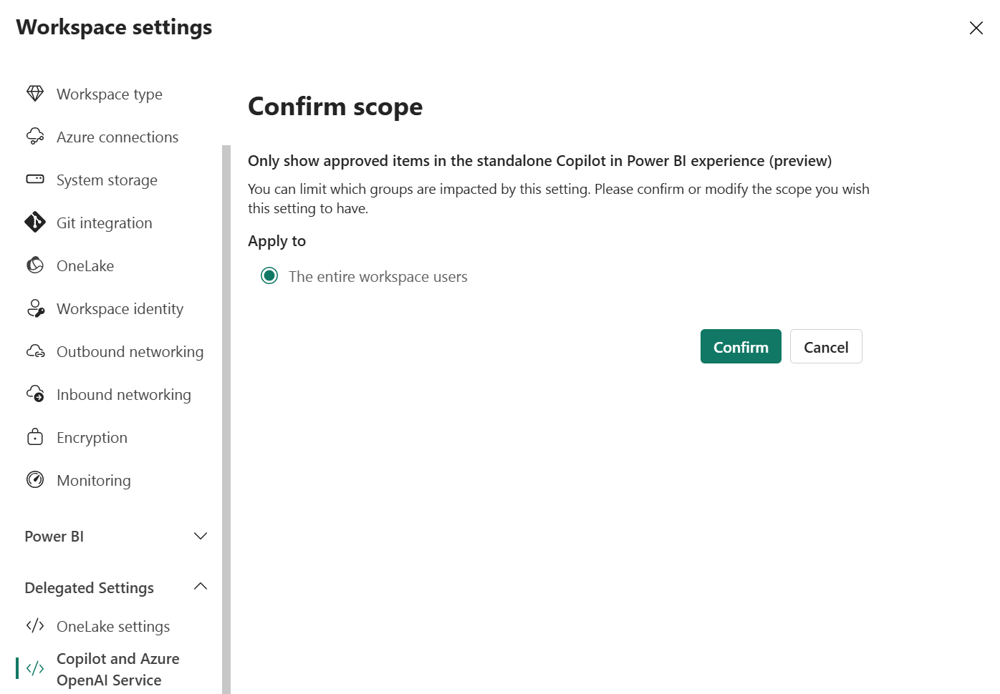

# Find content with Power BI Copilot search

As colleagues share Power BI content with you, you might find yourself having access to an extensive list of content. It can be difficult to recall specific items that you want to navigate back to in order to get an answer to your data question.

Through the [standalone Copilot experience](copilot-chat-with-data-standalone.md), you can easily find Power BI content and chat with your data. In Power BI's Copilot search, the terms *content* and *items* refer to reports, semantic models, workspace apps, organizational apps, and data agents. This page explains when Copilot needs to search for content, the metadata Copilot can look at to find your content, the signals used to boost and increase the relevancy of certain items, and what you can do to make items more discoverable for your end users.

:::image type="content" source="media/copilot-introduction/copilot-standalone-screen.png" alt-text="Screenshot of the standalone Copilot experience in Power BI, showing a chat interface for interacting with data." lightbox="media/copilot-introduction/copilot-standalone-screen.png":::

## Enable Power BI Copilot search

Copilot search is only available through the standalone Copilot experience. To access this feature, a few tenant settings need to be enabled. To use Power BI's Copilot search, both [Fabric Copilot](copilot-enable-power-bi.md#enable-fabric-copilot-for-power-bi-in-your-tenant) and the [standalone Copilot experience](copilot-enable-power-bi.md#enable-the-standalone-power-bi-copilot-experience-preview) must be enabled for your tenant.

For an improved search experience, enable the [global search](/fabric/admin/service-admin-portal-integration#use-global-search-for-power-bi) setting and the setting to [share data across geographic boundaries](copilot-enable-power-bi.md#enable-sharing-data-across-geographic-boundaries). The latter setting allows Copilot to semantically search on similar terms and is only necessary if Azure OpenAI isn't available in your home tenant's region.

## Use search to find an item

In the standalone Copilot, notice the **Find an item** section in the starter prompts. These are examples of the kind of questions you can ask to get Copilot to search for content.

:::image type="content" source="media/copilot-introduction/copilot-standalone-find-item.png" alt-text="Screenshot of the standalone Copilot experience in Power BI, showing a chat interface for interacting with data with the find item section highlighted." lightbox="media/copilot-introduction/copilot-standalone-find-item.png":::

When you ask a question like "Find items about sales revenue," Copilot responds with a list of items related to your topic:  

:::image type="content" source="media/copilot-introduction/copilot-standalone-search-results.png" alt-text="Screenshot of the standalone Copilot experience in Power BI, showing a list of search results for reports, semantic models, and data agents." lightbox="media/copilot-introduction/copilot-standalone-search-results.png":::

In these search results, Copilot shows the item types that were found through the icons, the title of the item, the workspace the item belongs to, when you last opened it, the description if it has one, the metadata this item matched with from your input, and whether a report is part of an app.

Copilot will generate a description of the item's content if the author hasn't added one. This description is generated from the [item's metadata](/power-bi/create-reports/copilot-search-new-content).

The title includes a hyperlink that opens the item in a new tab. This lets you look at your item contents while still maintaining chat history to browse the other items or to continue chatting with your data.  

> [!TIP]
> After getting back search results, continue the conversation by asking Copilot to "Summarize report 1" or ask Copilot, "What is revenue for the month to date using 2?"

## Use search to find the right item to answer a question

Power BI's standalone Copilot searches for content when you ask a question without attaching a report or semantic model. If you start by asking a broad question like "How many tourists visited in January?" you see a list of items that Copilot could use to answer the question.  

:::image type="content" source="media/copilot-introduction/copilot-standalone-item-suggestions.png" alt-text="Screenshot of the standalone Copilot experience in Power BI, showing item suggestions based on a search query." lightbox="media/copilot-introduction/copilot-standalone-item-suggestions.png":::

Copilot asks for confirmation to ensure that you recognize the content it uses to answer your question. If these items aren't what you expect, provide feedback using the thumbs down icon. To direct Copilot to use a specific item, you can either type "Use 1" or select the suggested input prompts displayed above the chat input field.

## Find content through metadata

Copilot looks at a breadth of metadata to find content. Power BI Copilot search can find reports, semantic models, data agents, workspace apps, and organizational apps.

To determine the most relevant items, Copilot looks through metadata, such as the following:

- Title of an item
- Description of an item
- Name of the item's workspace
- Content within an item, which is explained in the next section

### Content types Copilot looks at

Copilot can search through content metadata to find the most relevant item. The following list includes the **information within an item** that Copilot looks at:

- **For reports**:
  - Page names
  - Visual titles
  - Filter pane titles
  - Text boxes
- **For semantic models**:
  - Table names  
  - Table descriptions  
  - Column names  
  - Column descriptions  
  - Measure names  
  - Measure descriptions  
  - [Verified answer prompts](copilot-prepare-data-ai-verified-answers.md)
  - [Verified answer charts](copilot-prepare-data-ai-verified-answers.md)
- **For data agents**:
  - Published descriptions
  - Example queries
  - Data source schema information
- **For workspace apps and org apps**:
  - Reports that are included within the app

## Use signals to boost content in search results

You might have an abundance of content. When multiple items are found, Copilot ranks items with the following attributes higher than items without these attributes:

- If you marked the item as a *favorite*
- If you recently opened the item
- If the item is endorsed
- If the item is popular or frequently viewed in your organization
- If part of a workspace app or org app
- If the item has been marked as approved for Copilot

## Make items more discoverable to Copilot

Here are some best practices to make your items more discoverable in the standalone Copilot experience:

- **Add item descriptions**: Give context to your business users by adding a description. Use natural language when writing item descriptions to help Copilot and your business users to understand what an item is about.

- **Use unique keywords**: Many items are named similarly, and it can be hard to distinguish one from the other. Use unique keywords to help your business users better recall and navigate to an item.  
- **Apply an endorsement label**: Endorsement labels are a sign that content is trustworthy. Any creator with *edit access* can add a [**Promoted** label](../collaborate-share/service-endorsement-overview.md).  
- ***Favorite*** **an item**: Marking an item as a *Favorite* is an explicit signal to Copilot that it's important to you. By marking an item as a *Favorite*, you're more likely to see it in your search results.

## Limit Copilot search to items Approved for Copilot

Workspace admins control whether Copilot can search all workspace content or just content that has been Approved for Copilot. Workspace admins can make this change themselves in Workspace settings under __Delegated settings__ under the heading __Copilot and Azure OpenAI service__. Tenant admins can also make a default selection for the entire tenant, using the tenant setting **Only show approved items in the standalone Copilot in Power BI experience (preview)**. Changes to these settings will take up to 24 hours to reflect in the search experiences. 

### When is an item Approved for Copilot?
- For search purposes, Fabric data agents are always considered approved for Copilot. 
- Power BI semantic models must have the [Approved for Copilot](/power-bi/create-reports/copilot-prepare-data-ai) checkbox selected by a creator. 
- Once that setting is selected, then all reports that use that model will also be considered as approved for Copilot. 
- Power BI workspace & org apps are considered as Approved for Copilot, but the reports inside those apps are only considered as approved if the report's semantic model was marked explicitly. This may result in users finding apps using search prompts, but they may not be able to answer data questions from those apps using the standalone Copilot experience. 

In standalone Copilot, users will always be able to [manually attach items](/power-bi/create-reports/copilot-chat-with-data-standalone) to which they have access and ask questions of those items directly, even if the item is not marked as Approved for Copilot. 

## Considerations and limitations

- Copilot respects user permissions and only searches over attributes you have access to and doesn't provide search results containing items you can't access.
  - Copilot respects app audiences, if defined, and only searches over reports that you have access to within an app.
  - Copilot doesn't find semantic models [marked as discoverable](../collaborate-share/service-discovery.md#how-to-mark-a-semantic-model-as-discoverable) unless you already have direct access to the model.
  - Users with only view access to semantic models will not see models in their search result listings, but can attach models directly to questions. Search lists will expand to include semantic models in a future release.
  - Users with access to items via [M365 groups](/microsoft-365/admin/create-groups/compare-groups?view=o365-worldwide&preserve-view=true) (sometimes called unified groups) will not be able to find those items with Copilot. Search lists will expand to show items users have access to via M365 groups in a future release.
    
- Copilot respects hidden elements such as hidden table and column names, and doesn't search over these fields.
- Copilot will generate descriptions for reports to show in search responses alongside information like the report's name & workspace location to help users choose relevant reports. Copilot descriptions are refreshed at most daily when the report is updated. 

- Copilot does not generate descriptions for other item types, like semantic models or Fabric data agents. 

- Copilot best understands natural language. When you're searching for items through the standalone Copilot, adding more context can help with finding more relevant content. For example, searching for "Find reports about Q4 revenue over time" yields better results than a search for the keyword "Q4."
- If edits are made directly to an item (for example, updating a visual, renaming titles), these changes are reflected in search results within five minutes. If edits are made indirectly to an item (such as renaming the workspace), the changes might take up to 24 hours to reflect in the search results.
- Reports may not reflect the approved status of the associated semantic model for up to 24 hours.
- Search is a part of the standalone Copilot experience, subject to the same [limitations](/power-bi/create-reports/copilot-chat-with-data-standalone). 

