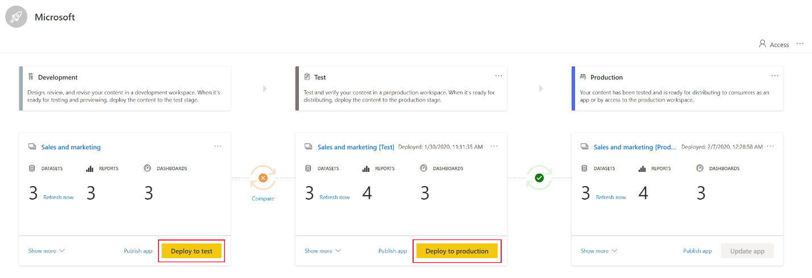
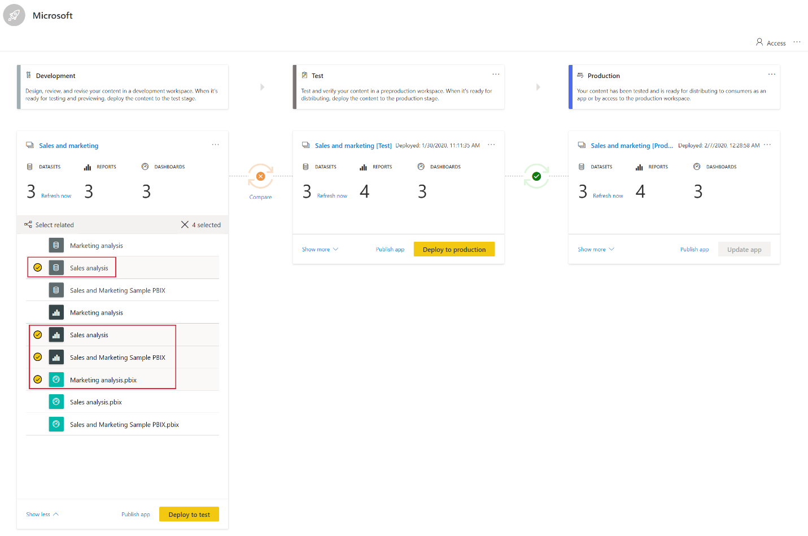
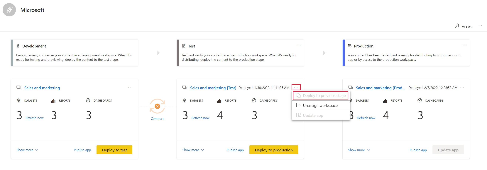
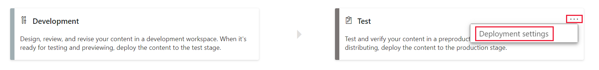
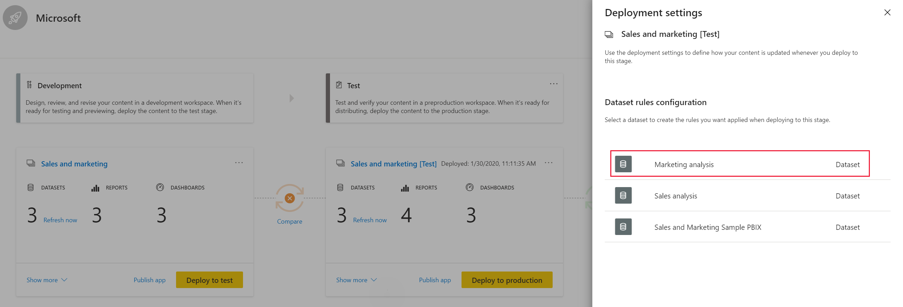
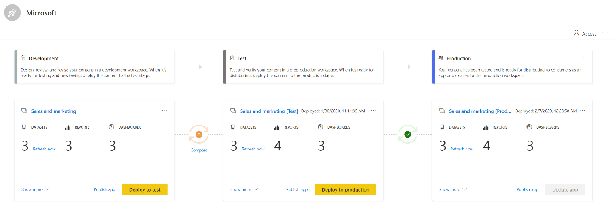
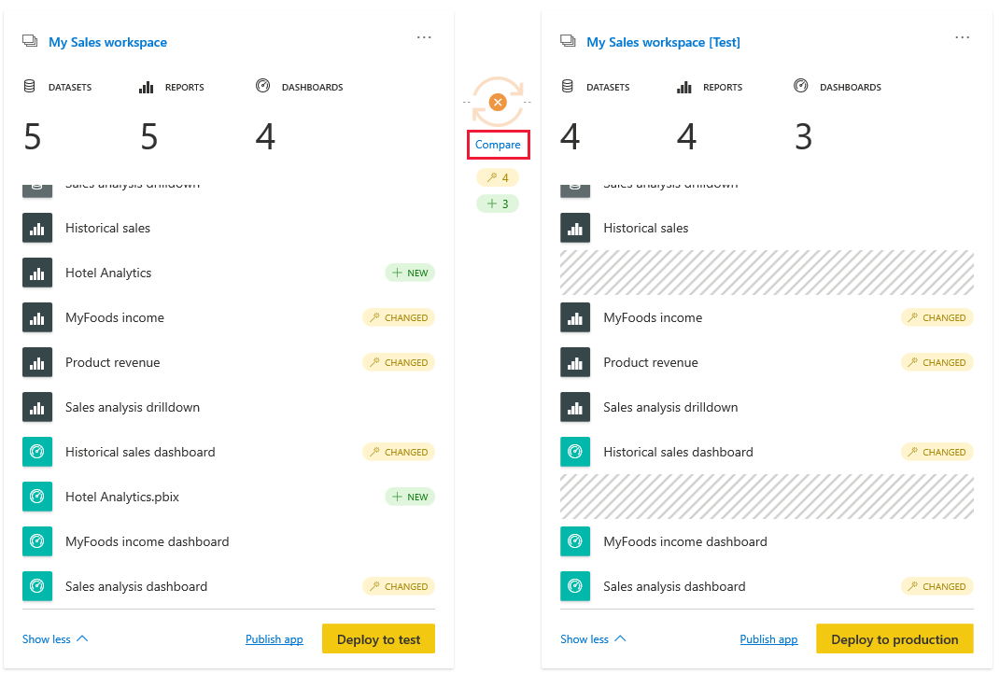

# Get started with deployment pipeline

This article walks you through the basic settings required for using a deployment pipeline.

## Step 1 - Create a deployment pipeline

1. In Power BI service, from the navigation pane, select **Deployment pipeline** and click **Create pipeline**.

2. In the *Create a deployment pipeline* dialog box, enter a name and description for the pipeline, and click **Create**.

## Step 2 - Assign a workspace to a deployment pipeline

You can only assign a [new version workspace](../service-create-the-new-workspaces.md) that you’re an admin of, to a deployment pipeline. Older version workspaces and workspaces you’re not an admin of, will not show on the list of workspaces that you can select from. The workspace must reside on a [premium account](../service-premium-what-is.md).

Only one workspace can be assigned to a pipeline. New workspaces will be automatically created when content is deployed for the first time from one stage to another. If you assign a workspace to a test environment and deploy it for the first time, a new workspace for this stage will be created.

Follow these steps to assign a workspace in a deployment pipeline:

1. In the newly created deployment pipeline, click **Assign a workspace**.

2. In the *Choose the workspace* drop-down menu, select the workspace you want to assign to the pipeline.

3. Select the stage you want to assign the pipeline to.

## Step 3 - Deploy your content

There are two ways to deploy content from one stage to the next one. You can deploy all the content, or you can select which content items to deploy.

You can also deploy content backwards, from a later stage in the deployment pipeline, to an earlier one.

After the deployment is complete, refresh the datasets so that you can use the newly copied content. The dataset refresh is required because data isn’t copied from one stage to another. To understand what is copied during the deployment process, review the [deployment process](deployment-pipeline-process.md).

### Deploying all content

Select the stage to deploy from and click the deployment button. The deployment process creates a duplicate workspace in the target stage. This workspace includes all the content existing in the current stage.

### Selective deployment

To deploy only specific items, click the **Show more** link, and select the items you wish to deploy. When clicking the deploy button, only the selected items are deployed to the next stage.

Since dashboards, reports and datasets are related and have dependencies, you can use the select related button to check all items that those items are dependent on. For example, if you want to deploy a report to the next stage, clicking the select related button will mark the dataset that the report is connected to, so that both will be deployed at once and the report will not break. You might get unexpected results if you choose to deploy a report or dashboard without its dataset. This can happen when the dataset in the stage you’re deploying to, has changed and is no longer identical to the one in the stage you’re deploying from.

>[!NOTE]
>You can’t deploy a report or dashboard to next stage if the items it’s dependent on do not exist in the stage you are deploying to

### Backwards deployment

You can choose to deploy to a previous stage, for example in a scenario where you assign an existing workspace to a production stage and then deploy it backwards, first to the test stage, and then to the development one.

Deploying to a previous stage works only if the previous stage is empty of content. When deploying to previous stage, you can’t select specific items. All content in the stage will be deployed.

## Step 4 – Create dataset rules

When working in a deployment pipeline, different stages may have different configurations. For example, each stage can have different databases or different query parameters. The development stage might query sample data from the database, while the test and production stages query the entire database.

When you deploy content between pipeline stages, configuring dataset rules enables you to allow changes to content, while keeping some settings intact.

Dataset rules are defined on data sources and parameters, in each dataset. They determine the values of the data sources or parameters for a specific dataset. For example, if you want a dataset in a production stage to point to a production database, you can define a rule for this. The rule is defined in the production stage, under the appropriate dataset. Once the rule is defined, content deployed from test to production, will inherit the value as defined in the dataset rules.

### Create a dataset rule

1. In the pipeline stage you want to create a dataset rule for, click **Deployment settings**.

    

2. From the Deployment settings pane, select the dataset you want to create a rule for.

    

### Dataset rule types

There are two type of rules you can create:

* **Data source rules**
    The data source list is taken from the dataset of the source pipeline stage. From the data source list, select a data source to be replaced. Use one of the following methods to select a value to replace the one from the source stage:

    1. Select from a list.

    2. Click **Other** and manually add the new data source. You can only change to a data source from the same type.

* **Parameter rules**
    Select a parameter from the list of parameters; a default value is shown. Edit the value to the value you want to take effect after each deployment.

### Limitations

* You must be the dataset owner to create a dataset rule.

* When an item is removed or deleted, its rules are deleted too. These rules cannot be restored.

* Dataset rules can only be defined for the following data sources:
    * Azure SQL Server
    * Azure Data Warehouse
    * Azure Analysis services
    * SharePoint Online data sources
    * Odata Feed

    For other data sources, we recommend using parameters.

## Step 5 – Manage your deployed content

Once you upload your content to a specific stage, you can deploy it to the next stage. A typical workflow for moving content from stage to stage, is development to test, and then test to deployment.

To deploy content to the next stage in the deployment pipeline, click the **Deploy** button at the bottom of the stage.

## Deployment time

When reviewing the test and production stage cards, you can see the last deployment time. This indicates the last time content was deployed to the stage.

Deployment time is useful for establishing when a stage was last updated. It can also be helpful if you want to track time between test and production deployments.

## Comparing stages

When two sequential stages have content, the content is compared based on the content items metadata. This comparison doesn’t include comparing data or refresh time between stages.

To allow a quick visual insight into the differences between two sequential stages, a comparison icon indicator appears between them. The comparison indicator has two states:

* **Green indicator** – the metadata for each content item in both stages, is the same.

* **Orange indicator**
    * Some of the content items in each stage, were changed or updated (have different metadata).
    * There is a difference in the number of items between the stages.

When two sequential stages aren’t the same, a **compare** link appears underneath the orange comparison icon. Clicking the link opens the content item list in both stages in Compare view. Compare view helps you track changes or differences between items, in each deployment stage. Changed items get one of the following labels:

* **New** – A new item in the source stage. This is an item that doesn’t exist in the target stage. After deployment, this item will be cloned to the target stage.

* **Changed** – An item that exists both in the source and the target stage, were one of the versions was changed after the last deployment. After deployment, the item in the source stage will overwrite the item in the target stage, regardless of where the change was made.

* **Missing from** – This label indicates that an item appears in the target stage, but not in the source stage. Deployment will not impact this item.

## Next steps

If you're new to embedding in Power BI, review these tutorials to learn how to embed your Power BI content:
* [Deployment pipeline introduction](deployment-pipeline-overview.md)
* [Understand the deployment pipeline process](deployment-pipeline-process.md)