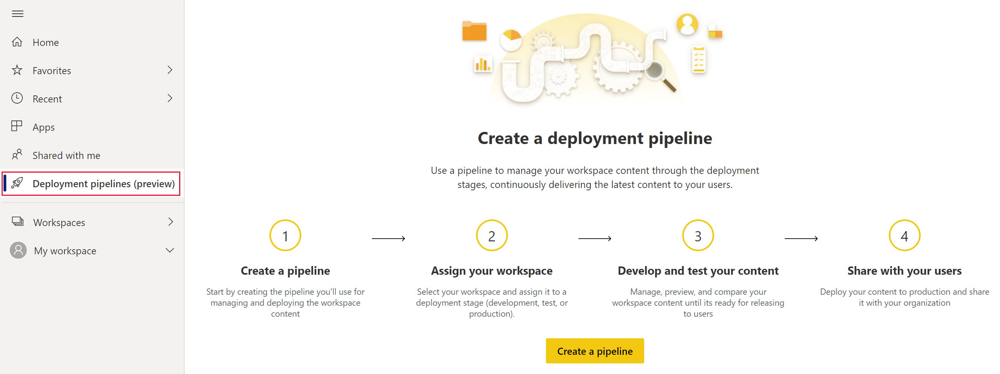

# Introduction to deployment pipeline

Deployment pipeline is a tool that enables report designers in an enterprise with Premium capacity, manage the lifecycle of organizational content. This allows developing and testing Power BI content such as reports, dashboards and datasets, before they’re moved to production.

Deployment pipeline is an efficient and reusable process, enabling business users to get new content in the highest quality.

The tool is designed as a pipeline with three stages:

* **Development** – This stage is used to explore content, make changes and upload new content. Typically, this is the first stage where new content is uploaded to, and changes are made.

* **Test** – After the content is uploaded and all changes are made in the development stage, the content can be moved to this stage for testing. Here are three examples of what can be done in the testing environment:
    * Share content with QA
    * Load and run tests with larger volumes of data
    * Test your content in real-life environments

* **Production** – After testing the content, use the production stage to share the final version of your content with business users across the organization.

## Accessing the deployment pipeline

You’ll be able to access the deployment pipeline if the following conditions are met:
* You’re a Power BI Pro user
* You belong to an organization that has Premium capacity
* You’re an admin of a new workspace

## Next steps

If you're new to embedding in Power BI, review these tutorials to learn how to embed your Power BI content:
* [Get started with deployment pipeline](deployment-pipeline-get-started.md)
* [Understand the deployment pipeline process](deployment-pipeline-process.md)