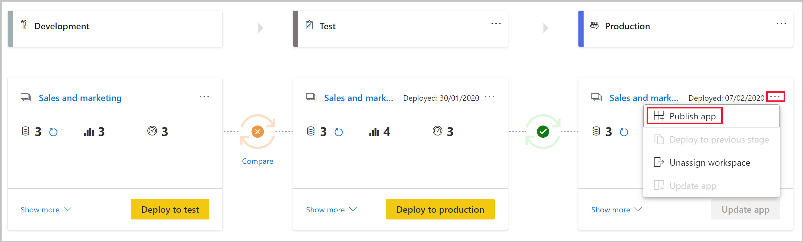

# Understand the deployment process

The deployment process lets you clone content from one stage in the pipeline to another, typically from development to test, and from test to production.

During deployment, Power BI copies the content from the current stage, into the target one. The connections between the copied items are kept during the copy process. Power BI also applies the configured dataset rules to the updated content in the target stage. Deploying content may take a while, depending on the number of items being deployed. During this time, you can navigate to other pages in the Power Bi portal, but you cannot use the content in the target stage.

## Deploying content to an empty stage

Any [Pro user](../service-admin-purchasing-power-bi-pro.md) that’s a member or admin in the source workspace, can deploy content to an empty stage (a stage that doesn’t contain content). The content must reside on a capacity.

Once the deployment is complete, refresh the dataset.

### What is deployed?

When you deploy content from one pipeline stage to another, the copied content contains the following Power BI items:

* Datasets

* Reports

* Dashboards

### What isn’t deployed?

During the deployment process, the following attributes are not copied to the target stage:

* **Data** – Data isn’t being copied, only metadata is copied

* **Workspace settings** – Each stage has its own workspace

* **Power BI App definitions** – see [Deploying Power BI apps]()

* **Permissions** – For a workspace or a specific item

* **Unsupported items** – These include:
    * Paginated reports
    * Dataflows
    * PUSH datasets
    * Workbooks

* **Dashboard data classification**

* The following **dataset attributes**:
    * Role assignment
    * Refresh schedule
    * Data source credentials
    * Query caching settings (can be inherited from the capacity)
    * Endorsement settings

### Who owns the deployment pipeline stage workspace?

The deploying user automatically becomes the dataset owner of the cloned datasets, and the admin of the new workspace.

## Deploy content to an existing workspace

Deploying content in a working production pipeline, to a stage that has an existing workspace, includes the following:

* Deploying new content as an addition, to a stage that already contains content.

* New content deployed to replace old content, in a current working production stage.

### How does deployment work?

Content from the current stage is copied over to the target stage. Power BI identifies existing content in the target stage and overwrites it. To identify which content item needs to be overwritten, the deployment pipeline uses the connection between the parent item and its clones. This connection is kept when new content is created. The overwrite operation only overwrites the content of the item. The item’s ID, URL and permissions remain unchanged.

In the target stage, [attributes that are not being copied](#What-isn’t-deployed), remain as they were before deployment. New content and new items are copied from the current stage to the target stage.

### Do I need to refresh my dataset?

Data in the target dataset is kept when possible. If there are no changes to a dataset, the data is kept as it was before the deployment.

With small changes, such as adding a table or calculated measures, Power BI keeps the original data, and the refresh is optimized to refresh only what’s needed. For breaking schema changes, or changes in the data source connection, a full refresh is required.

### Who can deploy to a stage with an existing workspace?

As long as the deployed content resides on a [premium account](../service-premium-what-is.md), the following users can deploy it to a stage with an existing workspace:

* Any [Pro user](../service-admin-purchasing-power-bi-pro.md) who’s a member of both workspaces in the source and target deployment stages.

* An owner of all the datasets in the target workspace.

## Deploying Power BI apps

[Power BI apps](../consumer/end-user-apps.md) are the recommended way of distributing content to free Power BI consumers. Deployment pipeline lets you manage Power BI apps in a deployment pipeline, so that you have more control and flexibility when it comes to your app’s lifecycle.

Create an app for each deployment pipeline stage, so that you can test each app update from an end user’s point of view. The deployment pipeline allows you to manage this process easily. Use the publish or view button in the workspace card, to publish or view the app in a specific pipeline stage.

In the production stage, the main action button on the bottom-left corner opens the update app page in Power BI, so that any content updates become available to app users.

>[!IMPORTANT]
>The deployment process does not include updating the app content or settings. To apply changes to content or settings, you need to manually update the app in the required pipeline stage.

## Next steps

If you're new to embedding in Power BI, review these tutorials to learn how to embed your Power BI content:
* [Introduction to deployment pipeline](deployment-pipeline-overview.md)
* [Get started with deployment pipeline](deployment-pipeline-get-started.md)