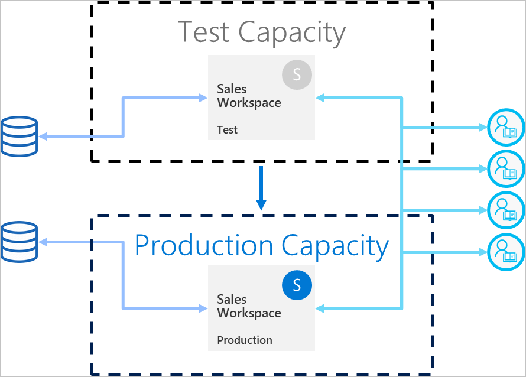

# Deployment pipelines best practices

This article provides guidance for BI creators who are managing their content throughout its lifecycle. It focuses on leveraging deployment pipelines as a BI content lifecycle management tool.

The article is divided into four sections:

* **Content preparation** - Prepare your content for lifecycle management.

* **Development** - Learn about the best ways of creating content in the deployment pipelines development stage.

* **Test** - Understand how to use the deployment pipelines test stage, to test your environment.

* **Production** - Utilize the deployment pipelines production stage when making your content available for consumption.

## Content preparation

Prepare your content for on-going management throughout its lifecycle. Make sure you review the information in this section, before you do any of the following:

* Release your content to production

* Start using a deployment pipeline for a specific workspace

* Publish your work

### Treat each workspace as a complete package of analytics

Ideally, a workspace should contain a complete view of one aspect (such as department, business unit, project, or vertical) in your organization. This makes it easier to manage permissions for different users, and allows content releases for the entire workspace to be controlled according to a planned schedule.  

If you're using [centralized datasets](../connect-data/service-datasets-across-workspaces.md) that are used across the organization, we recommend that you create two types of workspaces:

* **Modeling and data workspaces** - These workspaces will contain all the centralized datasets

* **Reporting workspaces** - These workspaces will contain all dependent reports and dashboards

### Plan your permission model

A deployment pipeline is a Power BI object, with its own [permissions](deployment-pipelines-process.md#permissions). In addition, the pipeline contains workspaces, that have their own permissions.

To implement a secure and easy workflow, plan who gets access to each part of the pipeline. Some of the considerations to take into account are:

* Who should have access to the pipeline?

* Which operations should users with pipeline access be able to perform in each stage?

* Who's reviewing content in the test stage?

* Should the test stage reviewers have access to the pipeline?

* Who will oversee deployment to the production stage?

* Which workspace are you assigning?

* Which stage are you assigning your workspace to?

* Do you need to make changes to the permissions of the workspace you're assigning?

### Connect different stages to different databases

A production database should always be stable and available. It's better not to overload it with queries generated by BI creators for their development or test datasets. Build separate databases for development and testing. This helps protect production data, and doesn't overload the development database with the entire volume of production data, which can slow down things.

>[!NOTE]
>If your organization is using [shared centralized datasets](../connect-data/service-datasets-share.md), you can skip this recommendation.

### Use parameters in your model

As you can't edit datasets data sources in Power BI service, we recommend using [parameters](/power-query/power-query-query-parameters) to store connection details such as instance names and database names, instead of using a static connection string. This allows you to manage the connections through the Power BI service web portal, or [using APIs](/rest/api/power-bi/datasets/updateparametersingroup), at a later stage.

In deployment pipelines, you can configure parameter rules to set specific values for the development, test, and production stages.

If you don’t use parameters for your connection string, you can define data source rules to specify a connection string for a given dataset. However, in deployment pipelines, this isn't supported for all data sources. To verify that you can configure rules for your data source, see [deployment rules limitations](deployment-pipelines-get-started.md#deployment-rule-limitations).

Parameters have additional uses, such as making changes to queries, filters, and the text displayed in the report.

## Development

This section provides guidance for working with the deployment pipelines development stage.

### Use Power BI Desktop to edit your reports and datasets

Consider Power BI Desktop as your local development environment. Power BI Desktop allows you to try, explore, and review updates to your reports and datasets. Once the work is done, you can upload your new version to the development stage. Due to the following reasons, it's recommended to edit PBIX files in the Desktop (and not in Power BI service):

* It is easier to collaborate with fellow creators on the same PBIX file, if all changes are being done on the same tool.

 * Making online changes, downloading the PBIX file, and then uploading it again, creates reports and datasets duplication.

* You can use version control to keep your PBIX files up to date.

### Version control for PBIX files

If you want to manage the version history of your reports and datasets, use [Power BI's autosync with OneDrive](../collaborate-share/service-connect-to-files-in-app-workspace-onedrive-for-business.md). This will keep your files updated with the latest version. It will also enable you to retrieve older versions if needed.

>[!NOTE]
>Use auto-sync with OneDrive (or any other repository) only with the PBIX files in the deployment pipeline's development stage. Do not sync PBIX files into the deployment pipeline's test and production stages. This will cause problems with deploying content across the pipeline.

### Separate modeling development from report and dashboard development

For enterprise scale deployments, it's recommended to separate dataset development, and the development of reports and dashboards. To promote changes to only a report or a dataset, use the deployment pipelines selective deploy option.  

This approach should start from Power BI Desktop, by creating a separate PBIX file for datasets and reports. For example, you can create a dataset PBIX file and uploaded it to the development stage. Later, your report authors can create a new PBIX only for the report, and [connect it to the published dataset](../connect-data/service-datasets-discover-across-workspaces.md) using a live connection. This technic allows different creators to separately work on modeling and visualizations, and deploy them to production independently.

With [shared datasets](../connect-data/service-datasets-share.md), you can also use this method across workspaces.

### Manage your models using XMLA read/write capabilities

Separating modeling development from report and dashboard development, allows you to use advanced capabilities such as source control, merging diff changes, and automated processes. These changes should be done in the development stage, so that finalized content can be deployed to the test and production stages. This allows changes to go through a unified process with other dependent items, before they're deployed to the production stage.

You can separate modeling development from visualizations, by managing a [shared dataset](../connect-data/service-datasets-share.md) in an external workspace, using XMLA r/w capabilities. The shared dataset can connect to multiple reports in various workspaces that are managed in multiple pipelines.

## Test

This section provides guidance for working with the deployment pipelines test stage.

### Simulate your production environment

Other than verifying that new reports or dashboards look alright, it's also important to see how they perform from an end user's perspective. The deployment pipelines test stage, allows you to simulate a real production environment for testing purposes.

Make sure that these three factors are addressed in your test environment:

* Data volume

* Usage volume

* A similar capacity as in production

When testing, you can use the same capacity as the production stage. However, this can make production unstable during load testing. To avoid unstable production, use another capacity similar in resources to the production capacity, for testing. To avoid extra costs, you can use [Azure A capacities](../developer/embedded/azure-pbie-create-capacity.md) to pay only for the testing time.

### Use deployment rules with a real-life data source

If you're using the test stage to simulate real life data usage, it's recommended to separate the development and test data sources. The development database should be relatively small, and the test database should be as similar as possible to the production database. Use [data source rules](deployment-pipelines-get-started.md#step-4---create-deployment-rules) to switch data sources in the test stage.

Controlling the amount of data you import from your data source, is useful if you're using a production data source in the test stage. To do this, add a parameter to your data source query in Power BI Desktop. Use parameter rules to control the amount of imported data, or edit the parameter's value.
You can also use this approach if you don't want to overload your capacity.

### Measure performance

When you simulate a production stage, [check the report load and the interactions](../guidance/monitor-report-performance.md), and find out if the changes you made impact them.

You also need to [monitor the load on the capacity](../admin/service-admin-premium-monitor-capacity.md), so that you can catch extreme loads before they reach production.  

>[!NOTE]
>It's recommended to monitor capacity loads again, after deploying updates to the production stage.

### Check related items

Related times can be affected by changes to datasets or reports. During testing, verify that your changes don't impact or break the performance of existing items, which can be dependent on the updated ones.

You can easily find the related items using the workspace [lineage view](../collaborate-share/service-data-lineage.md).

### Test your app

If you are distributing content to your end users through an app, review the app's new version, before it's in production. As each deployment pipeline stage has its own workspace, you can easily publish and update apps for development and test stages. This will allow you to test the app from an end user's point of view.

>[!IMPORTANT]
>The deployment process does not include updating the app content or settings. To apply changes to content or settings, you need to manually update the app in the required pipeline stage.

## Production

This section provides guidance to the deployment pipelines production stage.

### Manage who can deploy to production

As deploying to production should be handled carefully, it's good practice to let only specific people manage this sensitive operation. However, you probably want all BI creators for a specific workspace to have access to the pipeline. This can be managed using production [workspace permissions](deployment-pipelines-process.md#permissions).  

To deploy content between stages, users need to have either member or admin permissions for both stages. Make sure that only the people you want deploying to production, will have production workspace permissions. Other users can have production workspace contributor or viewer roles. They will be able to see content from within the pipeline but won't be able to deploy.

In addition, you should limit access to the pipeline by only enabling pipeline permissions to users that are part of the content creation process.

### Set rules to ensure production stage availability

[Deployment rules](deployment-pipelines-get-started.md#step-4---create-deployment-rules) are a powerful way to ensure the data in production is always connected and available to users. Once deployment rules are applied, deployments can run while you have the assurance that end users will see the relevant info without disturbance.

Make sure that you set production deployment rules for data sources and parameters defined in the dataset.

### Update the production app

Deployment in a pipeline updates the workspace content, but it doesn't update the associated app automatically. If you're using an app for content distribution, don't forget to update the App after deploying to production, so that end users will immediately be able to use the latest version.  

### Quick fixes to content

In case there are bugs in production that require a quick fix, don't be tempted to either upload a new PBIX version directly to the production stage, or make an online change in Power BI service. Deploying backwards to test and development stages isn't possible when there's already content in those stages. Furthermore, deploying a fix without testing it first is bad practice. Therefore, the correct way to treat this problem, is to implement the fix in the development stage, and push it to the rest of the deployment pipeline stages. This allows checking that the fix works, before deploying it to production. Deploying across the pipeline takes only a few minutes.

## Next steps

>[!div class="nextstepaction"]
>[Introduction to deployment pipelines](deployment-pipelines-overview.md)

>[!div class="nextstepaction"]
>[Get started with deployment pipelines](deployment-pipelines-get-started.md)

>[!div class="nextstepaction"]
>[Understand the deployment pipelines process](deployment-pipelines-process.md)

>[!div class="nextstepaction"]
>[Automate your deployment pipeline using APIs and DevOps](deployment-pipelines-automation.md)

>[!div class="nextstepaction"]
>[Deployment pipelines troubleshooting](deployment-pipelines-troubleshooting.md)