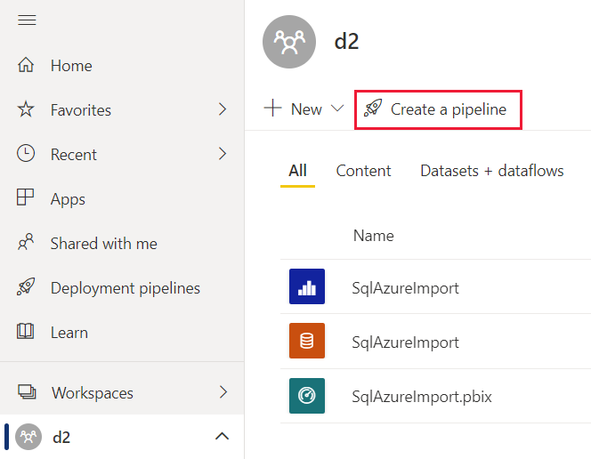

# Get started with deployment pipelines

This article walks you through the basic settings required for using deployment pipelines in Power BI service. It's recommended to read the [deployment pipelines introduction](deployment-pipelines-overview.md), before you proceed.

In a deployment pipeline, one workspace is assigned to each stage. Before you start working with your pipeline in production, review the [capacity requirements](deployment-pipelines-troubleshooting.yml#what-type-of-capacity-can-i-assign-to-a-workspace-in-a-pipeline-) for the pipeline's workspaces.

## Accessing deployment pipelines

You'll be able to access the deployment pipelines feature, if the following conditions are met:

* You have one of the following Premium licenses:

    * You're a Power BI [Pro user](../admin/service-admin-purchasing-power-bi-pro.md), and you belong to an organization that has Premium capacity.

    * [Premium Per User (PPU)](../admin/service-premium-per-user-faq.yml).

* You're an admin of a [new workspace experience](../collaborate-share/service-create-the-new-workspaces.md).

>[!NOTE]
> You'll also be able to see the deployment pipelines button, if you previously created a pipeline, or if a pipeline was shared with you.

:::image type="content" source="media/deployment-pipelines-get-started/creating-pipeline.png" alt-text="A screenshot of the deployment pipelines landing page.":::

## Step 1 - Create a deployment pipeline

You can create a pipeline from the deployment pipelines tab, or from a workspace.

After the pipeline is created, you can share it with other users or delete it. When you share a pipeline with others, the users you share the pipeline with will be given [access to the pipeline](deployment-pipelines-process.md#user-with-pipeline-access). Pipeline access enables users to view, share, edit, and delete the pipeline.

### Create a pipeline from the deployment pipelines tab

To create a pipeline from the deployment pipelines tab, do the following:

1. In Power BI service, from the navigation pane, select **Deployment pipelines** and then select **Create pipeline**.

2. In the *Create a deployment pipeline* dialog box, enter a name and description for the pipeline, and select **Create**.

### Create a pipeline from a workspace

You can create a pipeline from an existing workspace, providing you're the admin of a [new workspace experience](../collaborate-share/service-create-the-new-workspaces.md).

1. From the workspace, select **Create a pipeline**.

    > [!div class="mx-imgBorder"]
    > 

2. In the *Create a deployment pipeline* dialog box, enter a name and description for the pipeline, and select **Create**.

>[!NOTE]
>If the workspace isn't assigned to your organization's Premium capacity, or to your PPU capacity, you'll get a notification to [assign it to a capacity](../admin/service-admin-premium-manage.md#assign-a-workspace-to-a-capacity).  

## Step 2 - Assign a workspace

After creating a pipeline, you need to add the content you want to manage to the pipeline. Adding content to the pipeline is done by assigning a workspace to the pipeline stage. You can assign a workspace to any stage.

Follow the instructions in the link to [assign a workspace to a pipeline](deployment-pipelines-assign.md#assign-a-workspace-to-any-vacant-pipeline-stage).

>[!NOTE]
>If you're creating a pipeline from a workspace, you can skip this stage as the workspace is already selected.

## Step 3 - Deploy to an empty stage

Any [Pro user](../admin/service-admin-purchasing-power-bi-pro.md) that's a member or admin in the source workspace, can deploy content to an empty stage (a stage that doesn't contain content). The workspace must reside on a capacity for the deployment to be completed.

You can also use the [deployment pipelines REST APIs](/rest/api/power-bi/pipelines) to programmatically perform deployments. For more information, see [Automate your deployment pipeline using APIs and DevOps](deployment-pipelines-automation.md).

If you already have a workspace that you'd like to use with a specific stage, instead of deploying you can [assign](deployment-pipelines-assign.md) that workspace to the appropriate stage.

>[!NOTE]
>To deploy a paginated report, you'll need a [capacity that supports paginated reports](./../paginated-reports/paginated-reports-faq.yml#what-size-premium-capacity-do-i-need-for-paginated-reports-).

When deploying content to an empty stage, the relationships between the items are kept. For example, a report that is bound to a dataset in the source stage, will be cloned alongside its dataset, and the clones will be similarly bound in the target workspace.

Once the deployment is complete, refresh the dataset. For more information, see [deploying content to an empty stage](deployment-pipelines-process.md#deploying-content-to-an-empty-stage).

### Deploying all content

Select the stage to deploy from and then select the deployment button. The deployment process creates a duplicate workspace in the target stage. This workspace includes all the content existing in the current stage.

:::image type="content" source="media/deployment-pipelines-get-started/deploy.png" alt-text="A screenshot showing the deploy button for the development and test stages in a deployment pipeline." lightbox="media/deployment-pipelines-get-started/deploy.png":::

### Selective deployment

To deploy only specific items, select the **Show more** link, and then select the items you wish to deploy. When clicking the deploy button, only the selected items are deployed to the next stage.

Since dashboards, reports, datasets and dataflows are related and have dependencies, you can use the select related button to check all items that those items are dependent on. For example, if you want to deploy a report to the next stage, clicking the select related button will mark the dataset that the report is connected to, so that both will be deployed at once and the report will not break.

:::image type="content" source="media/deployment-pipelines-get-started/selective-deploy.png" alt-text="A screenshot showing the selective deploy option in deployment pipelines, available after selecting the show more option." lightbox="media/deployment-pipelines-get-started/selective-deploy.png":::

>[!NOTE]
> * You can't deploy a Power BI item to the next stage, if the items it's dependent on doesn't exist in the stage you are deploying to. For example, deploying a report without a dataset will fail, unless the dataset already exists in the target stage.
> * You might get unexpected results if you choose to deploy a Power BI item without the item it's dependent on. This can happen when a dataset or a dataflow in the target stage, has changed and is no longer identical to the one in the stage you're deploying from.

### Backwards deployment

You can choose to deploy to a previous stage, for example in a scenario where you assign an existing workspace to a production stage and then deploy it backwards, first to the test stage, and then to the development one.

Deploying to a previous stage works only if the previous stage is empty. When deploying to a previous stage, you can't select specific items. All content in the stage will be deployed.

:::image type="content" source="media/deployment-pipelines-get-started/deploy-back.png" alt-text="A screenshot showing the deploy to previous stage button, available from the test or production stage menus." lightbox="media/deployment-pipelines-get-started/deploy-back.png":::

## Step 4 - Create deployment rules

When working in a deployment pipeline, different stages may have different configurations. For example, each stage can have different databases or different query parameters. The development stage might query sample data from the database, while the test and production stages query the entire database.

When you deploy content between pipeline stages, configuring deployment rules enables you to allow changes to content, while keeping some settings intact. For example, if you want a dataset in a production stage to point to a production database, you can define a rule for this. The rule is defined in the production stage, under the appropriate dataset. Once the rule is defined, content deployed from test to production, will inherit the value as defined in the deployment rule, and will always apply as long as the rule is unchanged and valid.

You can configure rules fo data source rules and parameter rules. The following table lists the type of Power BI items you can configure rules for, and the type of rule you can configure for each one.

||Data source rule  |Parameter rule  |Details  |
|---------|---------|---------|---------|
|**Dataflow**         | | |Use to determine the values of the data sources or parameters for a specific dataflow. |
|**Dataset**          | | |Use to determine the values of the data sources or parameters for a specific dataset.         |
|**Paginated report** | | |Defined for the data sources of each paginated report. You can use these rules to determine the data sources of the paginated report. |

>[!NOTE]
> Data source rules only work when you change data sources from the same type.

### Create a deployment rule

To create a deployment rule, follow the steps in this section. After you create all the deployment rules you need, deploy the datasets with the newly created rules from the source stage to the target stage where the rules were created. Your rules will not apply until you deploy the datasets from the source to the target stage.

1. In the pipeline stage you want to create a deployment rule for, select **Deployment settings**.

    :::image type="content" source="media/deployment-pipelines-get-started/deployment-settings-screenshot.png" alt-text="A screenshot of the deployment settings button, located in the deployment settings.":::

2. You can set rules to **dataflows**, **datasets** and **paginated reports**. In the Deployment settings pane, select the type of rule you want to set.

    :::image type="content" source="media/deployment-pipelines-get-started/deployment-rules.png" alt-text="A screenshot of the deployment rules pane, showing that you can set rules for dataflows, datasets and paginated reports.":::

3. Select the dataflow, dataset or paginated report you want to create a rule for.

    :::image type="content" source="media/deployment-pipelines-get-started/deployment-rules-selection.png" alt-text="A screenshot of the deployment rules pane, showing two datasets in the datasets tab. To configure a rule select an item from one of the tabs.":::

4. Select the type of rule you want to create, expand the list, and then select **Add rule**. There are two types of rules you can create:

    :::image type="content" source="media/deployment-pipelines-get-started/deployment-rule-types.png" alt-text="A screenshot of the deployment rules pane, showing a selected dataset and the two rule types, data source and parameter, you can configure for it.":::

    * **Data source rules**

        From the data source list, select a data source name to be updated. Use one of the following methods to select a value to replace the one from the source stage:

        * Select from a list.

        * Select *Other* and manually add the new data source. You can only change to a data source from the same type.

        >[!NOTE]
        >* *Data source rules* will be grayed out if you're not the owner of the Power BI item you're creating a rule for, or if your Power BI item doesn't contain any data sources.
        >* For *dataflows*, *datasets* and *paginated reports*, the data source list is taken from the source pipeline stage.

    * **Parameter rules** - Select a parameter from the list of parameters; the current value is shown. Edit the value to the value you want to take effect after each deployment.

### Deployment rule limitations

This section lists the limitations for the deployment rules.

* To create a deployment rule, you must be the owner of the dataflow, dataset or paginated report you're creating a rule for.

* Deployment rules cannot be created in the development stage.

* When an item is removed or deleted, its rules are deleted too. These rules cannot be restored.

* Rules for dataflows that have other dataflows as sources, are not supported.

* Data source rules for common data model (CDM) folders in a dataflow, are not supported.

* Rules for datasets that use dataflows as their source, are not supported.

* If the data source defined in a rule is changed or removed from the item it points to in the source stage, the rule will not be valid and the deployment will fail.

* If the parameter defined in a rule is changed or removed from the item it points to in the source stage, the rule will not be valid and the deployment will fail.

>[!NOTE]
>Parameter rules are not supported for paginated reports.

### Supported data sources for dataflow and dataset rules

Data source rules can only be defined for the following data sources:

* Azure Analysis Services

* Azure Synapse

* SQL Server Analysis Services (SSAS)

* Azure SQL Server

* SQL server

* Odata Feed

* Oracle

* SapHana (only supported for import mode; not direct query mode)

* SharePoint

* Teradata

For other data sources, we recommend [using parameters to configure your data source](deployment-pipelines-best-practices.md#use-parameters-in-your-model).

## Step 5 - Deploy content from one stage to another

Once you have content in a pipeline stage, you can deploy it to the next stage. Deploying content to another stage is usually done after you've performed some actions in the pipeline. For example, made development changes to your content in the development stage, or tested your content in the test stage. A typical workflow for moving content from stage to stage, is development to test, and then test to production. You can learn more about this process, in the [deploy content to an existing workspace](deployment-pipelines-process.md#deploy-content-to-an-existing-workspace) section.

To deploy content to the next stage in the deployment pipeline, select the deploy button at the bottom of the stage.

When reviewing the test and production stage cards, you can see the last deployment time. This indicates the last time content was deployed to the stage.

Deployment time is useful for establishing when a stage was last updated. It can also be helpful if you want to track time between test and production deployments.

## Comparing stages

When two sequential stages have content, the content is compared based on the content items metadata. This comparison doesn't include comparing data or refresh time between stages.

:::image type="content" source="media/deployment-pipelines-get-started/deployment-flow.png" alt-text="A screenshot showing a deployment pipeline with its comparison indicators." lightbox="media/deployment-pipelines-get-started/deployment-flow.png":::

To allow a quick visual insight into the differences between two sequential stages, a comparison icon indicator appears between them. The comparison indicator has two states:

* **Green indicator** – The metadata for each content item in both stages, is the same.

* **Orange indicator** - Appears if one of these conditions is met:
    * Some of the content items in each stage, were changed or updated (have different metadata).
    * There is a difference in the number of items between the stages.

When two sequential stages aren't the same, a **compare** link appears underneath the orange comparison icon. Clicking the link opens the content item list in both stages in Compare view. Compare view helps you track changes or differences between items, in each pipeline stage. Changed items get one of the following labels:

* **New** – A new item in the source stage. This is an item that doesn't exist in the target stage. After deployment, this item will be cloned to the target stage.

* **Different** – An item that exists both in the source and the target stage, were one of the versions was changed after the last deployment. After deployment, the item in the source stage will overwrite the item in the target stage, regardless of where the change was made.

    Datasets with configured deployment rules that haven't been deployed, are also marked as *different*. This is because deployment rules are not applied until the datasets are deployed from the source stage to the target stage, which includes the configured rules.

* **Missing from** – This label indicates that an item appears in the target stage, but not in the source stage.

    >[!NOTE]
    >Deployment will not impact *missing from* items.

:::image type="content" source="media/deployment-pipelines-get-started/compare.png" alt-text="A screenshot showing the compare option which expands the compare view and allows comparing items between deployment pipeline stages." lightbox="media/deployment-pipelines-get-started/compare.png":::

## Overriding content

When you deploy after making changes to content in the source stage, the content you changed in the target stage is overwritten. After clicking *deploy*, you'll get a warning listing the number of items that will be overwritten.

:::image type="content" source="media/deployment-pipelines-get-started/replaced-content.png" alt-text="A screenshot of the replaced content warning which is displayed when a deployment is about to cause changes to items in the stage you're deploying to.":::

You can learn more about [which items are copied to the next stage](deployment-pipelines-process.md#deployed-items), and [which items are not copied](deployment-pipelines-process.md#unsupported-items), in [Understand the deployment process](deployment-pipelines-process.md).

## Next steps

>[!div class="nextstepaction"]
>[Introduction to deployment pipelines](deployment-pipelines-overview.md)

>[!div class="nextstepaction"]
>[Assign a workspace to a pipeline stage](deployment-pipelines-assign.md)

>[!div class="nextstepaction"]
>[Understand the deployment pipelines process](deployment-pipelines-process.md)

>[!div class="nextstepaction"]
>[Automate your deployment pipeline using APIs and DevOps](deployment-pipelines-automation.md)

>[!div class="nextstepaction"]
>[Deployment pipelines troubleshooting](deployment-pipelines-troubleshooting.yml)

>[!div class="nextstepaction"]
>[Deployment pipelines best practices](deployment-pipelines-best-practices.md)
