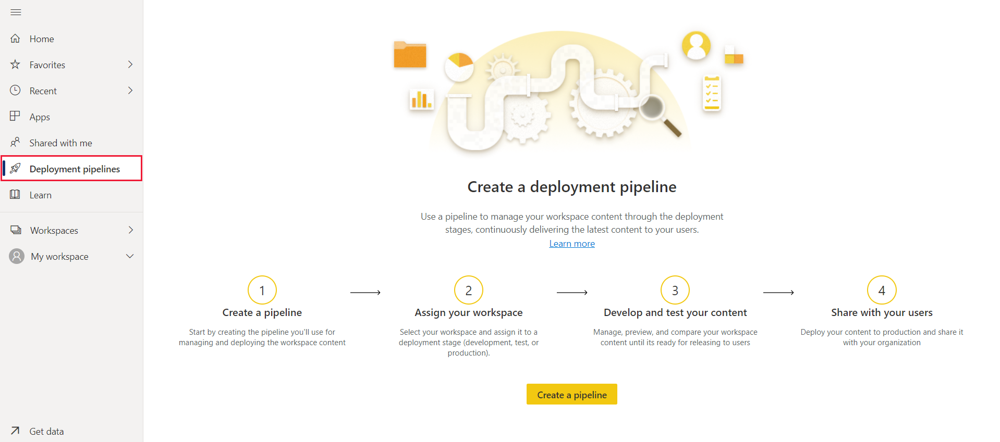
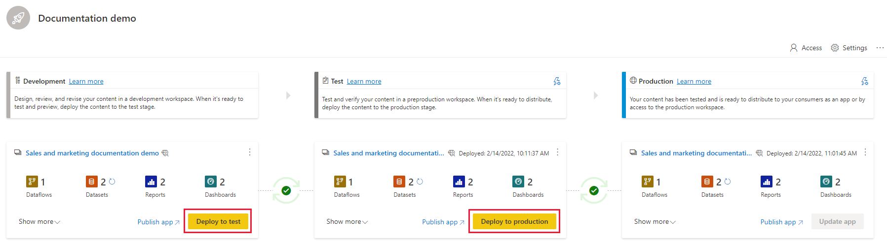
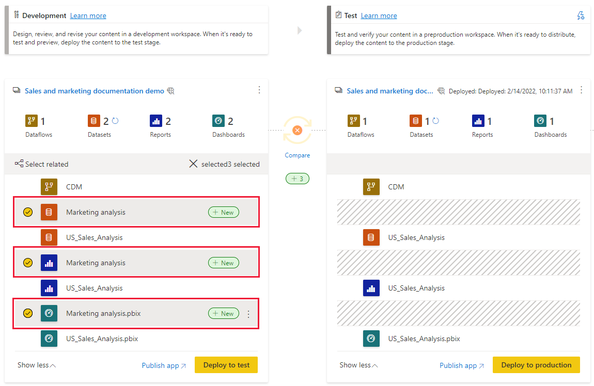
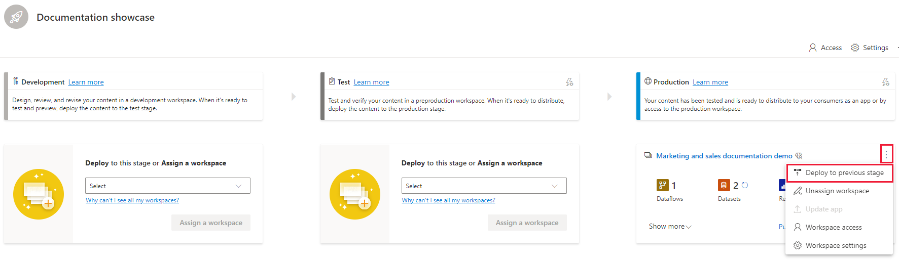
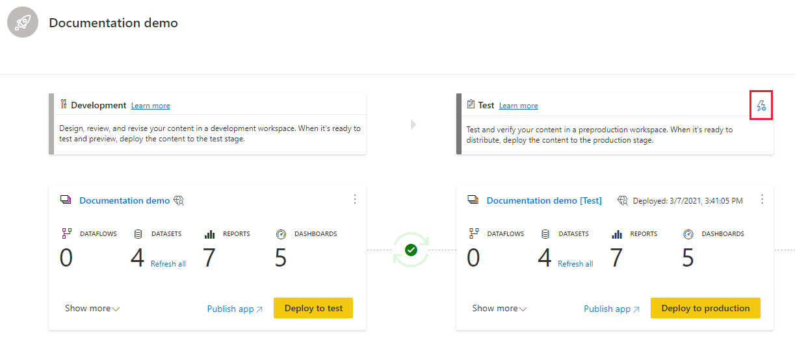
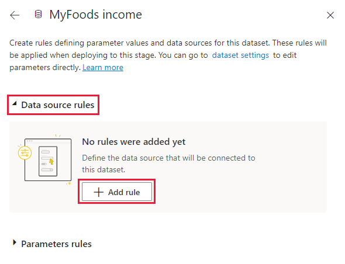
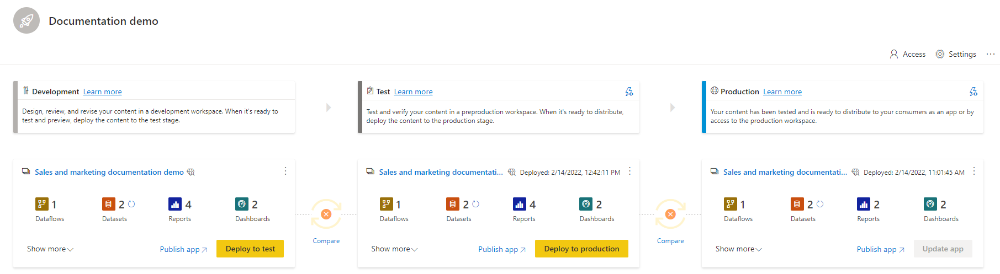
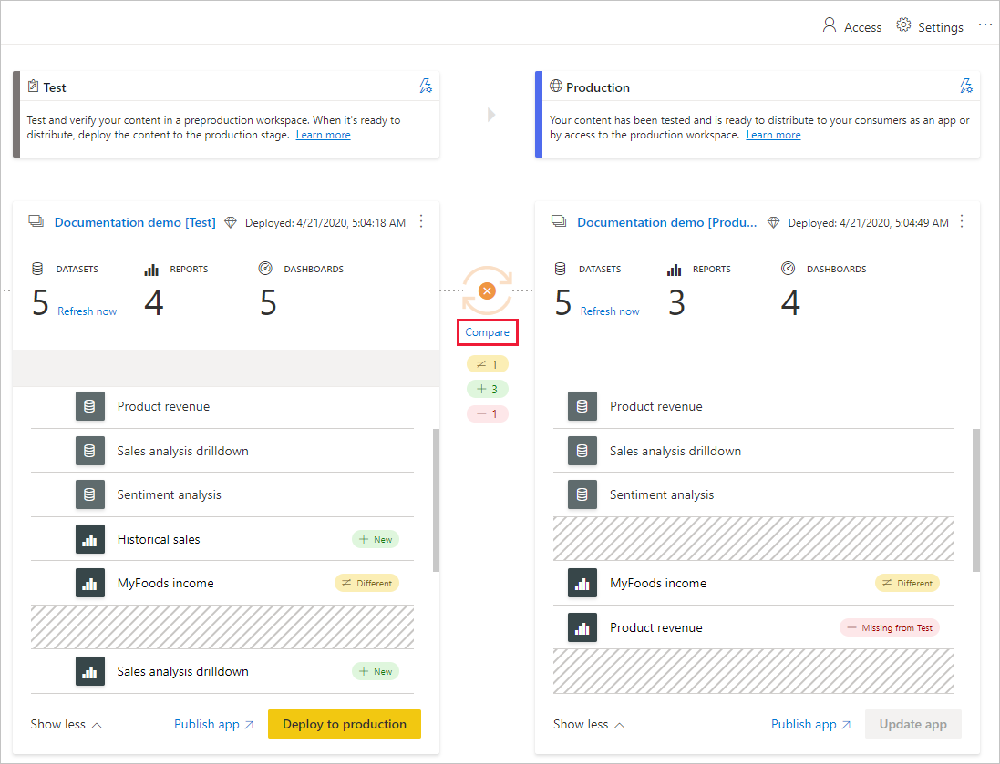
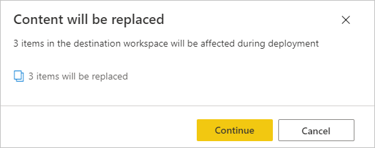

# Get started with deployment pipelines

This article walks you through the basic settings required for using deployment pipelines.

## Accessing deployment pipelines

You'll be able to access the deployment pipelines feature, if the following conditions are met:

* You have one of the following Premium licenses:

    * You're a Power BI [Pro user](../admin/service-admin-purchasing-power-bi-pro.md), and you belong to an organization that has Premium capacity.

    * Premium Per User (PPU).

* You're an admin of a [new workspace experience](../collaborate-share/service-create-the-new-workspaces.md).

>[!NOTE]
> You'll also be able to see the deployment pipelines button, if you previously created a pipeline, or if a pipeline was shared with you.

## Step 1 - Create a deployment pipeline

You can create a pipeline from the deployment pipelines tab, or from a workspace.

After the pipeline is created, you can share it with other users or delete it. When you share a pipeline with others, the users you share the pipeline with will be given [access to the pipeline](deployment-pipelines-process.md#user-with-pipeline-access). Pipeline access enables users to view, share, edit, and delete the pipeline.

### Create a pipeline from the deployment pipelines tab

To create a pipeline from the deployment pipelines tab, do the following:

1. In Power BI service, from the navigation pane, select **Deployment pipelines** and then select **Create pipeline**.

2. In the *Create a deployment pipeline* dialog box, enter a name and description for the pipeline, and select **Create**.

### Create a pipeline from a workspace

You can create a pipeline from an existing workspace, providing you're the admin of a [new workspace experience](../collaborate-share/service-create-the-new-workspaces.md).

1. From the workspace, select **Create a pipeline**.

    > [!div class="mx-imgBorder"]
    > 

2. In the *Create a deployment pipeline* dialog box, enter a name and description for the pipeline, and select **Create**.

>[!NOTE]
>If the workspace isn't assigned to your organization's Premium capacity, or to your PPU capacity, you'll get a notification to [assign it to a capacity](../admin/service-admin-premium-manage.md#assign-a-workspace-to-a-capacity).  

## Step 2 - Assign a workspace to a deployment pipeline

After creating a pipeline, you need to add the content you want to manage to the pipeline. Adding content to the pipeline is done by assigning a workspace to the pipeline stage. You can assign a workspace to any stage. 

You can assign one workspace to a deployment pipeline. Deployment pipelines will create clones of the workspace content, to be used in different stages of the pipeline.

Follow these steps to assign a workspace in a deployment pipeline:

1. In the newly created deployment pipeline, select **Assign a workspace**.

2. In the *Choose the workspace* drop-down menu, select the workspace you want to assign to the pipeline.

    >[!NOTE]
    >If you're creating a pipeline from a workspace, you can skip this stage as the workspace is already selected.

3. Select the stage you want to assign the workspace to.

### Workspace assignment limitations

* The workspace must be a [new workspace experience](../collaborate-share/service-create-the-new-workspaces.md).

* You must be an admin of the workspace.

* The workspace is not assigned to any other pipeline.

* The workspace must reside on a [Premium capacity](../admin/service-premium-what-is.md).

* You cannot assign a workspace with [Power BI samples](../create-reports/sample-datasets.md) to a pipeline stage.

>[!NOTE]
>Only workspaces that can be used with deployment pipelines, will show in the list of workspaces you can select from.

## Step 3 - Deploy to an empty stage

Any [Pro user](../admin/service-admin-purchasing-power-bi-pro.md) that's a member or admin in the source workspace, can deploy content to an empty stage (a stage that doesn't contain content). The workspace must reside on a capacity for the deployment to be completed.

When deploying content to an empty stage, the relationships between the items are kept. For example, a report that is bound to a dataset in the source stage, will be cloned alongside its dataset, and the clones will be similarly bound in the target workspace.

Once the deployment is complete, refresh the dataset. For more information, see [deploying content to an empty stage](deployment-pipelines-process.md#deploying-content-to-an-empty-stage).

### Deploying all content

Select the stage to deploy from and then select the deployment button. The deployment process creates a duplicate workspace in the target stage. This workspace includes all the content existing in the current stage.

### Selective deployment

To deploy only specific items, select the **Show more** link, and then select the items you wish to deploy. When clicking the deploy button, only the selected items are deployed to the next stage.

Since dashboards, reports and datasets are related and have dependencies, you can use the select related button to check all items that those items are dependent on. For example, if you want to deploy a report to the next stage, clicking the select related button will mark the dataset that the report is connected to, so that both will be deployed at once and the report will not break.

>[!NOTE]
> * You can't deploy a report or dashboard to next stage if the items it's dependent on do not exist in the stage you are deploying to.
> * You might get unexpected results if you choose to deploy a report or dashboard without its dataset. This can happen when the dataset in the target stage, has changed and is no longer identical to the one in the stage you're deploying from.

### Backwards deployment

You can choose to deploy to a previous stage, for example in a scenario where you assign an existing workspace to a production stage and then deploy it backwards, first to the test stage, and then to the development one.

Deploying to a previous stage works only if the previous stage is empty. When deploying to a previous stage, you can't select specific items. All content in the stage will be deployed.

## Step 4 - Create dataset rules

When working in a deployment pipeline, different stages may have different configurations. For example, each stage can have different databases or different query parameters. The development stage might query sample data from the database, while the test and production stages query the entire database.

When you deploy content between pipeline stages, configuring dataset rules enables you to allow changes to content, while keeping some settings intact.

Dataset rules are defined on data sources and parameters, in each dataset. They determine the values of the data sources or parameters for a specific dataset. For example, if you want a dataset in a production stage to point to a production database, you can define a rule for this. The rule is defined in the production stage, under the appropriate dataset. Once the rule is defined, content deployed from test to production, will inherit the value as defined in the dataset rule, and will always apply as long as the rule is unchanged and valid.

>[!NOTE]
> Dataset rules work only when the source and target data source are of the same type.

### Create a dataset rule

1. In the pipeline stage you want to create a dataset rule for, select **Deployment settings**.

    

2. From the Deployment settings pane, select the dataset you want to create a rule for.

    

3. Select the type of rule you want to create, expand the list, and then select **Add rule**.

     

### Dataset rule types

There are two types of rules you can create:

* **Data source rules**
    The data source list is taken from the dataset of the source pipeline stage. From the data source list, select a data source to be replaced. Use one of the following methods to select a value to replace the one from the source stage:

    1. Select from a list.

    2. Select **Other** and manually add the new data source. You can only change to a data source from the same type.

* **Parameter rules**
    Select a parameter from the list of parameters; the current value is shown. Edit the value to the value you want to take effect after each deployment.

### Dataset rule limitations

* You must be the dataset owner to create a dataset rule.

* Dataset rules cannot be created in the development stage.

* When an item is removed or deleted, its rules are deleted too. These rules cannot be restored.

* If the data source or parameters defined in a rule are changed or removed from the source dataset, the rule will not be valid and the deployment will fail.

* Parameter rules cannot be defined for parameters that are of type *Any* or *Binary*. For more information, see [datasets update parameters restrictions](/rest/api/power-bi/datasets/updateparameters).

* Data source rules can only be defined for the following data sources:
    * Azure Analysis Services
    * SQL Server Analysis Services (SSAS)
    * Azure SQL Server
    * SQL server
    * Odata Feed
    * Oracle
    * SapHana (only supported for import mode; not direct query mode)
    * SharePoint
    * Teradata

    For other data sources, we recommend [using parameters to configure your data source](deployment-pipelines-best-practices.md#use-parameters-in-your-model).

## Step 5 - Deploy content from one stage to another

Once you have content in a pipeline stage, you can deploy it to the next stage. Deploying content to another stage is usually done after you've performed some actions in the pipeline. For example, made development changes to your content in the development stage, or tested your content in the test stage. A typical workflow for moving content from stage to stage, is development to test, and then test to production. You can learn more about this process, in the [deploy content to an existing workspace](deployment-pipelines-process.md#deploy-content-to-an-existing-workspace) section.

To deploy content to the next stage in the deployment pipeline, select the deploy button at the bottom of the stage.

When reviewing the test and production stage cards, you can see the last deployment time. This indicates the last time content was deployed to the stage.

Deployment time is useful for establishing when a stage was last updated. It can also be helpful if you want to track time between test and production deployments.

## Comparing stages

When two sequential stages have content, the content is compared based on the content items metadata. This comparison doesn't include comparing data or refresh time between stages.

 

To allow a quick visual insight into the differences between two sequential stages, a comparison icon indicator appears between them. The comparison indicator has two states:

* **Green indicator** – The metadata for each content item in both stages, is the same.

* **Orange indicator** - Appears if one of these conditions is met:
    * Some of the content items in each stage, were changed or updated (have different metadata).
    * There is a difference in the number of items between the stages.

When two sequential stages aren't the same, a **compare** link appears underneath the orange comparison icon. Clicking the link opens the content item list in both stages in Compare view. Compare view helps you track changes or differences between items, in each pipeline stage. Changed items get one of the following labels:

* **New** – A new item in the source stage. This is an item that doesn't exist in the target stage. After deployment, this item will be cloned to the target stage.

* **Different** – An item that exists both in the source and the target stage, were one of the versions was changed after the last deployment. After deployment, the item in the source stage will overwrite the item in the target stage, regardless of where the change was made.

* **Missing from** – This label indicates that an item appears in the target stage, but not in the source stage.

    >[!NOTE]
    >Deployment will not impact *missing from* items.

 

## Overriding content

When you deploy after making changes to content in the source stage, the content you changed in the target stage is overwritten. After clicking *deploy*, you'll get a warning listing the number of items that will be overwritten.

You can learn more about [which items are copied to the next stage](deployment-pipelines-process.md#deployed-items), and [which items are not copied](deployment-pipelines-process.md#unsupported-items), in [Understand the deployment process](deployment-pipelines-process.md).

## Next steps

>[!div class="nextstepaction"]
>[Introduction to deployment pipelines](deployment-pipelines-overview.md)

>[!div class="nextstepaction"]
>[Understand the deployment pipelines process](deployment-pipelines-process.md)

>[!div class="nextstepaction"]
>[Deployment pipelines troubleshooting](deployment-pipelines-troubleshooting.md)

>[!div class="nextstepaction"]
>[Deployment pipelines best practices](deployment-pipelines-best-practices.md)