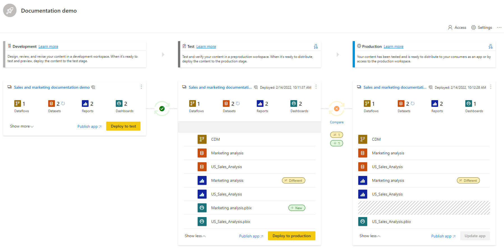

# Introduction to deployment pipelines (preview)

In today’s world, analytics is a vital part of decision making in almost every organization. The growing use of Power BI as an analytics tool, requires it to use more data, look appealing and  be user-friendly. Above all however, Power BI needs to always be available and reliable. To meet these requirements, BI creators must collaborate effectively.

Deployment pipelines is an efficient and reusable tool that enables BI creators in an enterprise with Premium capacity, to manage the lifecycle of organizational content. This allows developing and testing Power BI content such as reports, dashboards, and datasets, before they're consumed by end users.

The tool is designed as a pipeline with three stages:

* **Development**
    
    This stage is used to design, build, and upload new content with  fellow creators. This is the first stage in deployment pipelines.

* **Test**

    After the content is uploaded and all changes are made in the development stage, the content can be moved to this stage for testing. Here are three examples of what can be done in the testing environment:

    * Share content with testers and reviewers

    * Load and run tests with larger volumes of data

    * Test your app to see how it will look for your end users

* **Production**

    After testing the content, use the production stage to share the final version of your content with business users across the organization.

## Next steps

>[!div class="nextstepaction"]
>[Get started with deployment pipelines](deployment-pipelines-get-started.md)

>[!div class="nextstepaction"]
>[Understand the deployment pipelines process](deployment-pipelines-process.md)

>[!div class="nextstepaction"]
>[Deployment pipelines troubleshooting](deployment-pipelines-troubleshooting.md)

>[!div class="nextstepaction"]
>[Deployment pipelines best practices](deployment-pipelines-best-practices.md)