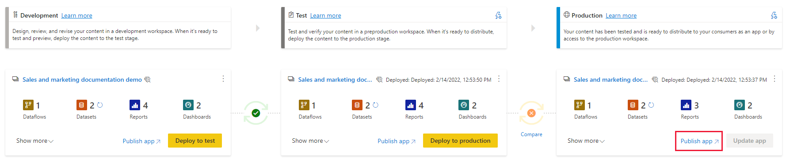
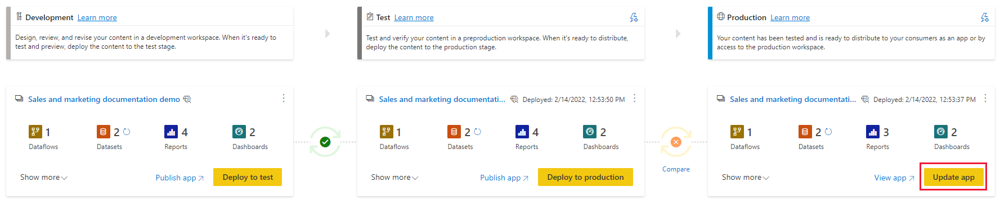

# Understand the deployment process (preview)

The deployment process lets you clone content from one stage in the pipeline to another, typically from development to test, and from test to production.

During deployment, Power BI copies the content from the current stage, into the target one. The connections between the copied items are kept during the copy process. Power BI also applies the configured dataset rules to the updated content in the target stage. Deploying content may take a while, depending on the number of items being deployed. During this time, you can navigate to other pages in the Power BI portal, but you cannot use the content in the target stage.

## Deploying content to an empty stage

When you deploy content to an empty stage, the metadata of the reports, dashboards, and datasets in the workspace you're deploying from, is copied to the stage you're deploying to. A new workspace for the stage you deployed to, is created on a Premium capacity.

There are two ways to deploy content from one stage to the next one. You can deploy all the content, or you can [select which content items to deploy](deployment-pipelines-get-started.md#selective-deployment).

You can also deploy content backwards, from a later stage in the deployment pipeline, to an earlier one.

After the deployment is complete, refresh the datasets so that you can use the newly copied content. The dataset refresh is required because data isn't copied from one stage to another. To understand which item properties are copied during the deployment process, and which item properties are not copied, review the [item properties copied during deployment](#item-properties-copied-during-deployment) section.

### Creating a Premium capacity workspace

During first-time deployment, deployment pipelines checks if you have Premium capacity permissions.  

If you have capacity permissions, the content of the workspace is copied to the stage you're deploying to, and a new  workspace for that stage is created on the Premium capacity.

If you don't have capacity permissions, the workspace is created but the content isn’t copied. You can ask a capacity admin to add your workspace to a capacity, or ask for assignment permissions for the capacity. Later, when the workspace is assigned to a capacity, you can deploy content to this workspace.

### Workspace and content ownership

The deploying user automatically becomes the dataset owner of the cloned datasets, and the only admin of the new workspace.

## Deploy content to an existing workspace

Deploying content in a working production pipeline, to a stage that has an existing workspace, includes the following:

* Deploying new content as an addition, to a stage that already contains content.

* New content deployed to replace old content, in a current working  stage.

### Deployment process

Content from the current stage is copied over to the target stage. Power BI identifies existing content in the target stage and overwrites it. To identify which content item needs to be overwritten, deployment pipelines uses the connection between the parent item and its clones. This connection is kept when new content is created. The overwrite operation only overwrites the content of the item. The item's ID, URL, and permissions remain unchanged.

In the target stage, [item properties that are not copied](deployment-pipelines-process.md#item-properties-that-are-not-copied), remain as they were before deployment. New content and new items are copied from the current stage to the target stage.

### Refreshing the dataset

Data in the target dataset is kept when possible. If there are no changes to a dataset, the data is kept as it was before the deployment.

With small changes, such as adding a table or measures, Power BI keeps the original data, and the refresh is optimized to refresh only what's needed. For breaking schema changes, or changes in the data source connection, a full refresh is required.

### Requirements for deploying to a stage with an existing workspace

As long as the deployed content resides on a [premium capacity](../admin/service-premium-what-is.md), a user that meets the following conditions, can deploy it to a stage with an existing workspace:

* A [Pro user](../admin/service-admin-purchasing-power-bi-pro.md) who's a member of both workspaces in the source and target deployment stages.

* An owner of all the datasets in the target workspace that are about to be deployed.

For more information, review the [permissions](#permissions) section.

## Deployed items

When you deploy content from one pipeline stage to another, the copied content contains the following Power BI items:

* Datasets

* Reports

* Dashboards

### Unsupported items

Deployment pipelines doesn't support the following items:

* Datasets that do not originate from a .pbix

* Reports based on unsupported datasets

* The workspace cannot use a template app

* Paginated reports

* Dataflows

* PUSH datasets

* Workbooks

## Item properties copied during deployment

During deployment, the following item properties are copied and overwrite the item properties at the target stage:

* Data sources ([dataset rules](deployment-pipelines-get-started.md#step-4---create-dataset-rules) are supported)

* Parameters​ ([dataset rules](deployment-pipelines-get-started.md#step-4---create-dataset-rules) are supported)

* Report visuals​

* Report pages​

* Dashboard tiles​

* Model metadata​

* Item relationships

### Item properties that are not copied

The following item properties are not copied during deployment:

* Data - Data isn't being copied, only metadata is copied

* URL

* ID

* Permissions - For a workspace or a specific item

* Workspace settings - Each stage has its own workspace

* App content and settings - To deploy your apps, see [deploying Power BI apps](#deploying-power-bi-apps)

The following dataset properties are also not copied during deployment:

* Role assignment
    
* Refresh schedule
    
* Data source credentials
    
* Query caching settings (can be inherited from the capacity)
    
* Endorsement settings

## Deploying Power BI apps

[Power BI apps](../consumer/end-user-apps.md) are the recommended way of distributing content to free Power BI consumers. Using deployment pipelines you can manage Power BI apps in a deployment pipeline, so that you have more control and flexibility when it comes to your app's lifecycle.

Create an app for each deployment pipeline stage, so that you can test each app update from an end user's point of view. A deployment pipeline allows you to manage this process easily. Use the publish or view button in the workspace card, to publish or view the app in a specific pipeline stage.

In the production stage, the main action button on the bottom-left corner opens the update app page in Power BI, so that any content updates become available to app users.

>[!IMPORTANT]
>The deployment process does not include updating the app content or settings. To apply changes to content or settings, you need to manually update the app in the required pipeline stage.

## Permissions

Pipeline permissions and workspace permissions are granted and managed separately. For example, a user with pipeline access that doesn't have workspace permissions, will be able to view the pipeline and share it with others. However, this user will not be able to view the content of the workspace in the pipeline, or in the workspace page, and will not be able to perform deployments.

### User with pipeline access

Users with pipeline access have the following permissions:

* View the pipeline​
    
* Share the pipeline with others
    
* Edit and delete the pipeline

>[!NOTE]
>Pipeline access doesn't grant permissions to view or take actions on the workspace content.

### Workspace viewer

Workspace viewers that have *pipeline access*, can also do the following:

* Consume content

>[!NOTE]
>Workspace viewers cannot access the dataset or edit workspace content.

### Workspace contributor

Workspace contributors that have *pipeline access*, can also do the following:

* Consume content

* Compare stages

* View datasets

### Workspace member

Workspace members that have *pipeline access*, can also do the following:

* View workspace content​
    
* Compare stages
    
* Deploy reports and dashboards

* Remove workspaces

### Workspace admin

Workspace administrators that have *pipeline access*, can perform *workspace member* actions, and also do the following:

* Assign workspaces

* Remove workspaces

### Dataset owner

Dataset owners that are either workspace members or admins, can also do the following:

* Update datasets
    
* Configure rules

>[!NOTE]
>This section describes user permissions in deployment pipelines. The permissions listed in this section may have different applications in other Power BI features.

## Limitations

This section lists most of the limitations in deployment pipelines.

* The workspace must reside on a [premium capacity](../admin/service-premium-what-is.md).

* Power BI items such as reports and dashboards that have Power BI [sensitivity labels](../admin/service-security-data-protection-overview.md#sensitivity-labels-in-power-bi), cannot be deployed.

* Datasets that are configured with [incremental refresh](../admin/service-premium-incremental-refresh.md), cannot be deployed.

* For a list of workspace limitations, see [workspace assignment limitations](deployment-pipelines-get-started.md#workspace-assignment-limitations).

* For a list of dataset rule limitations, see [dataset rule limitations](deployment-pipelines-get-started.md#dataset-rule-limitations)

* For a list of unsupported items, see [unsupported items](#unsupported-items).

## Next steps

>[!div class="nextstepaction"]
>[Introduction to deployment pipelines](deployment-pipelines-overview.md)

>[!div class="nextstepaction"]
>[Deployment pipelines best practices](deployment-pipelines-best-practices.md)

>[!div class="nextstepaction"]
>[Get started with deployment pipelines](deployment-pipelines-get-started.md)

>[!div class="nextstepaction"]
>[Deployment pipelines troubleshooting](deployment-pipelines-troubleshooting.md)