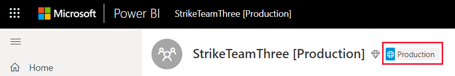
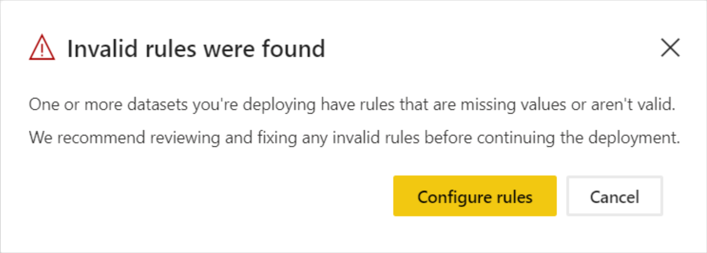
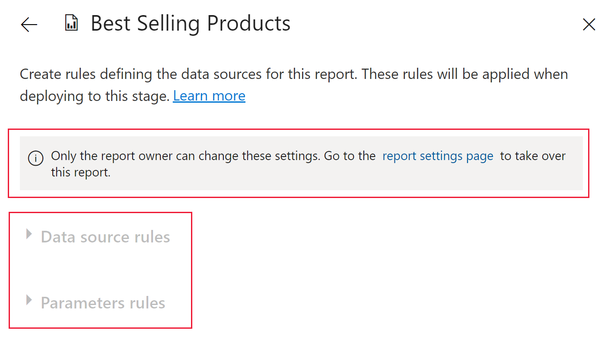

# Deployment pipelines troubleshooting

Use this article to troubleshoot issues in deployment pipelines.

## General

### What's deployment pipelines in Power BI?

To understand what's deployment pipelines in Power BI, refer to the [deployment pipelines overview](deployment-pipelines-overview.md).

### How do I get started with deployment pipelines?

Get started with deployment pipelines using the [get started instructions](deployment-pipelines-get-started.md).

### Why can't I see the deployment pipelines button?

If the following conditions are not met, you'll not be able to see the deployment pipelines button.

* You have one of the following Premium licenses:

    * You're a Power BI [Pro user](../admin/service-admin-purchasing-power-bi-pro.md), and you belong to an organization that has Premium capacity.

    * [Premium Per User (PPU)](../admin/service-premium-per-user-faq.yml).

* You're an admin of a [new workspace experience](../collaborate-share/service-create-the-new-workspaces.md).

### Why can't I see the pipeline stage tag in my workspace?

Deployment pipelines displays a pipeline stage tag in workspaces that are assigned to a pipeline. Tags for the *Development* and *Test* stages are always visible. However, you'll only see the *Production* tag if you have [access to the pipeline](deployment-pipelines-process.md#user-with-pipeline-access) or if you're a [workspace admin](deployment-pipelines-process.md#workspace-admin).

> [!div class="mx-imgBorder"]
> 

## Licensing

### What licenses are needed to work with deployment pipelines?

To use deployment pipelines, you need to have one of the following licenses:

* A [Pro user](../admin/service-admin-purchasing-power-bi-pro.md) license, with a workspace that resides on a [Premium capacity](../admin/service-premium-what-is.md).

* [Premium Per User (PPU)](../admin/service-premium-per-user-faq.yml).

For more information, see [accessing deployment pipelines](deployment-pipelines-get-started.md#accessing-deployment-pipelines).

### What type of capacity can I assign to a workspace in a pipeline?

All workspaces in a deployment pipeline must reside within a capacity for the pipeline to be functional. However, you can use different capacities for different workspaces in a pipeline. You can also use different capacity types for different workspaces in the same pipeline.

For development and testing, you can use A or EM capacity alongside a Pro Power BI account for each user. You can also use a PPU for each user in the development and test stages.

For production workspaces, you need a P capacity. If you're an ISV distributing content through embedded applications, you can also use A or EM capacities for production. PPUs can also be used for production workspaces.

>[!NOTE]
>When you create a workspace with a PPU, only other PPU users will be able to access the workspace and consume its content.

## Technical

### Why can't I see all my workspaces when I try to assign a workspace to a pipeline?

To assign a workspace to a pipeline, the following conditions must be met:

* The workspace is a [new workspace experience](../collaborate-share/service-create-the-new-workspaces.md)

* You're an admin of the workspace

* The workspace is not assigned to any other pipeline

* The workspace resides on a [premium capacity](../admin/service-premium-what-is.md)

Workspaces that don't meet these conditions, are not displayed in the list of workspaces you can select from.

### How can I assign workspaces to all the stages in a pipeline?

You can assign one workspace per pipeline. Once a workspace is assigned to a pipeline, you can deploy it to the next pipeline stages. During first-time deployment, a new workspace is created with copies of the items in the source stage. The relationships of the copied items are kept. For more information, see how to [assign a workspace to a deployment pipeline](deployment-pipelines-get-started.md#step-2---assign-a-workspace-to-a-deployment-pipeline).

### Why did my first deployment fail?

Your first deployment may have failed due to a number of reasons. Some of these reasons are listed in the table below.

|Error  |Action  |
|---------|---------|
|You don't have [premium capacity permissions](deployment-pipelines-process.md#creating-a-premium-workspace).     |If you work in an organization that has a Premium capacity, ask a capacity admin to add your workspace to a capacity, or ask for assignment permissions for the capacity. After the workspace is in a capacity, redeploy.  If you don't work in an organization with Premium capacity, consider purchasing [Premium Per User (PPU)](../admin/service-premium-per-user-faq.yml).        |
|You don't have workspace permissions.     |To deploy, you need to be a workspace member. Ask your workspace admin to grant you the appropriate permissions.         |
|Your Power BI admin disabled the creation of workspaces.     |Contact your Power BI admin for support.         |
|Your workspace isn't a [new workspace experience](../collaborate-share/service-create-the-new-workspaces.md).     |Create your content in the new workspace experience. If you have content in a classic workspace, you can [upgrade](../collaborate-share/service-upgrade-workspaces.md) it to a new workspace experience.         |
|You're using [selective deployment](deployment-pipelines-get-started.md#selective-deployment) and are not selecting your content's dataset.     |Do one of the following:   Unselect the content that is linked to your dataset. Your unselected content (such as reports or dashboards) will not be copied to the next stage.   Select the dataset that's linked to the selected content. Your dataset will be copied to the next stage.         |

### I'm getting a warning that I have 'unsupported artifacts' in my workspace when I'm trying to deploy. How can I know which artifacts are not supported?

For a comprehensive list of items and artifacts that are not supported in deployment pipelines, see the following sections:

* [Unsupported items](deployment-pipelines-process.md#unsupported-items)

* [Item properties that are not copied](deployment-pipelines-process.md#item-properties-that-are-not-copied)

### Why did my deployment fail due to broken rules?

If you have problems configuring deployment rules, visit [deployment rules](deployment-pipelines-get-started.md#step-4---create-deployment-rules), and make sure you follow the [deployment rules limitations](deployment-pipelines-get-started.md#deployment-rules-limitations).

If your deployment was previously successful, and is suddenly failing with broken rules, it may be due to a dataset being republished. The following changes to the source dataset, result in a failed deployment:

**Parameter rules**

* A removed parameter

* A changed parameter name

**Data source rules**

Your deployment rules are missing values. This may have happened if your dataset changed.

When a previously successful deployment fails due to broken links, a warning is displayed. You can select **Configure rules** to navigate to the deployment settings pane, where the failed dataset is marked. When you select the dataset, the broken rules are marked.

To deploy successfully, fix or remove the broken rules, and redeploy.

### How can I change the data source in the pipeline stages?

You can’t change the data source connection in Power BI service.

If you want to change the data source in the test or production stages, you can use [deployment rules](deployment-pipelines-get-started.md#step-4---create-deployment-rules) or [APIs](/rest/api/power-bi/datasets/updateparametersingroup). Deployment rules will only come into effect after the next deployment.

### I fixed a bug in production, but now I can't select the 'deploy to previous stage' button. Why is it greyed out?

You can only deploy backwards to an empty stage. If you have content in the test stage, you will not be able to deploy backwards from production.

After creating the pipeline, use the development stage to develop your content, and the test stages to review and test it. You can fix bugs in these stages, and then deploy the fixed environment to the production stage.

>[!NOTE]
>Backwards deployment only supports [full deployment](deployment-pipelines-get-started.md#deploying-all-content). It doesn't support [selective deployment](deployment-pipelines-get-started.md#selective-deployment)

### Why do I need to deploy after configuring deployment rules?

Deployment rules are not applied immediately after they're configured. To apply deployment rules, you have to deploy the datasets from the source stage to the target stage which includes the created deployment rules. After configuring deployment rules, and before you deploy, the *different* indicator is shown next to the dataset with the configured rules. This indicates that you need to deploy that dataset from the source stage to the target stage. Once you deploy, if no other changes were made, the *different* indicator will disappear signifying that the rules were applied successfully.

### Why are the deployment rules greyed out?

To create a [deployment rule](deployment-pipelines-get-started.md#step-4---create-deployment-rules), you must be the owner of the Power BI item you're creating a deployment rule for. If you're not the owner of the Power BI item, deployment rules will be greyed out.

>[!div class="mx-imgBorder"]
>

If one of the rule options is greyed out, it could be because of the reasons listed below:

* **Data source rules** - There are no data sources that a rule can be configured on.

* **Parameters rules** - There are no parameters a rule can be configured for.

### Why am I getting the message *continue the deployment?*

Source stage schema breaking changes, such as replacing a column type from an integer to a string, cause data loss in the target dataset after deployment.

During deployment, the metadata in the source dataset is checked against the target metadata. Schema breaking changes will cause the deployment to stop. When this happens, you'll receive the *continue the deployment* message.

:::image type="content" source="media/deployment-pipelines-troubleshooting/deployment-was-stopped-error.png" alt-text="A screenshot of the continue the deployment message in deployment pipelines":::

If you continue with the deployment, you'll loose the data in the target stage. You can use this option if the changes you made to the dataset were intentional. After the deployment completes, you'll need to refresh the target dataset.

If the changes were not intentional, close the message window, upload a fixed PBIX file to the source workspace and redeploy.

After a deployment fails due to schema changes, the target stage displays the *Deployment failed* message, followed by the *Show details* link. The link opens the same *continue the deployment* message that was displayed during the failed deployment.

### Does deployment pipelines support multi-geo?

Multi-geo is supported. It may take longer to deploy content between stages in different geos.

### How can I delete a pipelines that doesn't have an owner?

When working with deployment pipelines, you might end up with a pipeline that doesn't have an owner. For example, a pipeline can be left without an owner when a user that owned it leaves the company without transferring ownership. When a pipeline doesn't have an owner, other users will not be able to access it. As a workspace can only be assigned to one pipeline, if it's assigned to a pipeline without an owner, nobody will be able to unassign it, and you'll not be able to use the workspace in another pipeline.

When a pipeline is left without an owner, you can use the [admin Power BI REST APIs](/rest/api/power-bi/admin) to add an owner to the pipeline, or delete it. To add an owner to the pipeline, use the [Admin - Pipelines UpdateUserAsAdmin](/rest/api/power-bi/admin/pipelines-update-user-as-admin) API. To delete a pipeline, use the [Admin - Pipelines DeleteUserAsAdmin](/rest/api/power-bi/admin/pipelines-delete-user-as-admin) API.

You can also review our PowerShell script, [AddUserToWorkspacePipeline](link), which shows how to add a user to a pipeline.

## Paginated reports

### Why can't I deploy a paginated report?

To deploy a paginated report, both of these conditions must be met:

* You need to be a workspace member in the workspace you're deploying from (the source stage workspace). If you're not a workspace member in the source stage, you'll not be able to deploy the paginated report.

* In your target stage capacity, you need to [enable paginated reports workload](./../developer/embedded/embed-paginated-reports-organization.md#enable-paginated-reports-workload).

### Who's the owner of a deployed paginated report?

When you're deploying a paginated report for the first time, you become the owner of the report.

If you're deploying a paginated report to a stage that already contains a copy of that paginated report, you'll override the previous report and become its owner, instead of the previous owner. In such cases, you'll need to have credentials to the underlying data source, so that the data can be used in the paginated report.

### Why does my target stage paginated report display data from a Power BI dataset in the source stage?

At present, datasets are treated as an external Analysis Services data source, and connections to datasets aren't switched automatically after deployment.

When you deploy a paginated report that's connected to a Power BI dataset, it continues to point to the dataset it was originally connected to. Use [deployment rules](deployment-pipelines-get-started.md#step-4---create-deployment-rules) to point your paginated report to any dataset you want, including for example the target stage dataset.

If you're using a paginated report with a Power BI dataset, see [How do I create a deployment rule for a paginated report with a Power BI dataset?](#how-do-i-create-a-deployment-rule-for-a-paginated-report-with-a-power-bi-dataset)

### Where are my paginated report subreports?

Paginated report subreports are kept in the same folder that holds your paginated report. To avoid rendering problems, when using [selective copy](deployment-pipelines-get-started.md#selective-deployment) to copy a paginated report with subreports, select both the parent report and the subreports.

### How do I create a deployment rule for a paginated report with a Power BI dataset?

Paginated report rules can be created if you want to [point the paginated report to the dataset in the same stage](#why-does-my-target-stage-paginated-report-display-data-from-a-power-bi-dataset-in-the-source-stage). When creating a deployment rule for a paginated report, you need to select a database and a server.

If you're setting a deployment rule for a paginated report that doesn't have a Power BI dataset, because the target data source is external, you need to specify both the server and the database.

However, paginated reports that use a Power BI dataset use an internal dataset. In such cases, you cannot rely on the data source name to identify the Power BI dataset you're connecting to. The data source name doesn't change when you update it in the target stage, by creating a data source rule or by calling the [update datasource](/rest/api/power-bi/datasets/updatedatasourcesingroup) API. When you set a deployment rule, you need to keep the database format and replace the dataset object ID in the database field. As the dataset is internal, the server stays the same.

* **Database** - The database format for a paginated report with a Power BI dataset, is `sobe_wowvirtualserver-<dataset ID>`. For example, `sobe_wowvirtualserver-d51fd26e-9124-467f-919c-0c48a99a1d63`. Replace the `<dataset ID>` with your dataset's ID. You can get the dataset ID from the URL, by selecting the GUID that comes after `datasets/` and before the next forward slash.

    :::image type="content" source="media/deployment-pipelines-troubleshooting/datasets-id.png" alt-text="A screenshot of the dataset I D as it appears in a Power B I U R L.":::

* **Server** - The server that hosts your database. Keep the existing server as is.

## Permissions

### What is the deployment pipelines permissions model?

The deployment pipelines permissions model is described the [permissions](deployment-pipelines-process.md#permissions) section.

### Who can deploy content between stages?

Content can be deployed to an empty stage or to a stage that contains content. The content must reside on a [premium capacity](../admin/service-premium-what-is.md).

* **Deploying to an empty stage** - Any [Pro](../admin/service-admin-purchasing-power-bi-pro.md) or [PPU](../admin/service-premium-per-user-faq.yml) user, that's a member or admin in the source workspace.

* **Deploying to a stage with content** - Any [Pro](../admin/service-admin-purchasing-power-bi-pro.md) or [PPU](../admin/service-premium-per-user-faq.yml) user, who's a member or admin of both workspaces in the source and target deployment stages.

* **Overriding a dataset** - Deployment overrides each dataset that is included in the target stage, even if the dataset wasn't changed. The user must be the owner of all the target stage datasets specified in the deployment.

### Which permissions do I need to configure deployment rules?

To configure deployment rules in deployment pipelines, you must be the dataset owner.

### Why can't I see workspaces in the pipeline?

Pipeline and workspace permissions are managed separately. You may have pipeline permissions, but not workspace permissions. For more information, review the [permissions](deployment-pipelines-process.md#permissions) section.

## Next steps

>[!div class="nextstepaction"]
>[Introduction to deployment pipelines](deployment-pipelines-overview.md)

>[!div class="nextstepaction"]
>[Get started with deployment pipelines](deployment-pipelines-get-started.md)

>[!div class="nextstepaction"]
>[Understand the deployment pipelines process](deployment-pipelines-process.md)

>[!div class="nextstepaction"]
>[Deployment pipelines best practices](deployment-pipelines-best-practices.md)