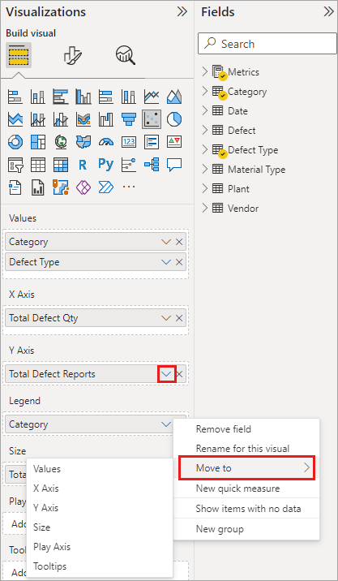
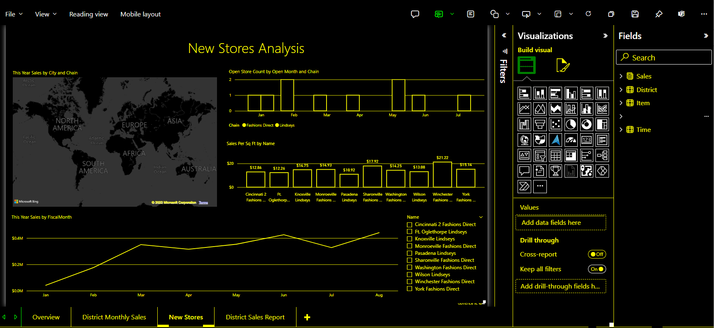
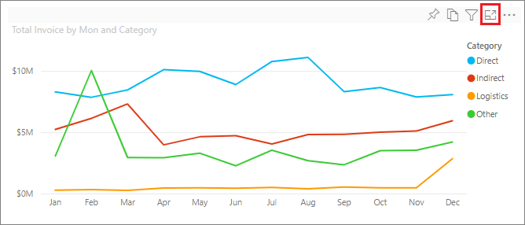
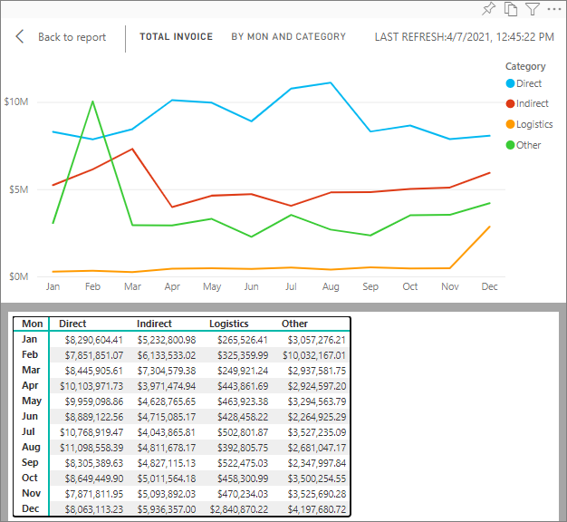
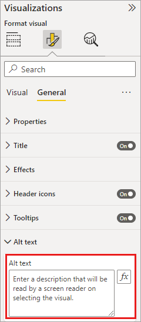
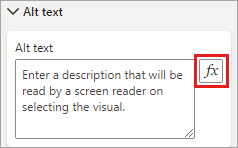
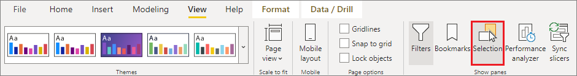
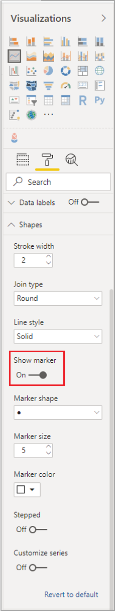
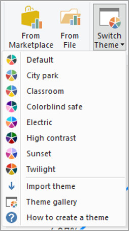

# Design Power BI reports for accessibility

[!INCLUDE [applies-yes-desktop-yes-service](../includes/applies-yes-desktop-yes-service.md)]

You can design and create compelling reports while also designing for accessibility. Whenever building a report, no matter who your audience is, you should create your reports to be usable by as many people as possible, without the need for the report to be adapted for a sort of special design.

For Windows users, select high contrast from the **Settings** app.

This article describes the accessibility features and tools for creating accessible reports in Power BI.

In general, when using Power BI with a screen reader, we recommend turning off scan mode or browse mode.

To improve the process of creating reports with screen readers, a context menu is available. The menu allows fields in the well to be moved up or down in the **Fields** list. The menu also allows moving the field to other wells, such as **Legend** or **Value** or others.

## Types of accessibility features

Power BI provides the capability to create accessible reports, but as the report author, it's up to you to incorporate that capability into your reports. There are three categories of accessibility features described in this article:

* Built-in accessibility features (no configuration required)
* Built-in accessibility features (requiring configuration)
* Other tips and considerations

We discuss each of these categories in the following sections.

## Built-in accessibility features

Power BI has accessibility features built into the product, which don't require any configuration from the report author. These features are the following:

* Keyboard navigation
* Screen-reader compatibility
* High contrast colors view
* Focus mode
* Show data table

There are also features that help with the report consumption experience. Articles describing those features can be found in the [Related content](#related-content) section at the end of this article.

Let's take a look at each of these built-in accessibility features, in turn.

### Keyboard navigation

As a report author, you don't have to worry whether your consumers can use their keyboard to navigate through a report. Power BI visuals are all keyboard navigable. Your report consumer can walk through the data points in visuals, switch between page tabs, and have access to interactive capabilities including cross-highlighting, filtering, and slicing.

As a report consumer navigates around a report, focus shows up to indicate where the user is in the report. Depending on the browser being used, focus mode might appear differently.

To access the most frequently used keyboard shortcuts, you can press **Shift + ?** to display a keyboard shortcut dialog. To learn more, see the articles on accessible consumption experiences and keyboard shortcuts in the [Related content](#related-content) section at the end of this article.

### Screen reader compatibility

In general, every object in Power BI that has keyboard navigation is also compatible for screen readers. When a report consumer navigates to a visual, the screen reader will read out the title, visual type, and any alt text if that has been set.

### High contrast color view

Power BI has high contrast support for reports. If you're using a high contrast mode in Windows, Power BI Desktop automatically detects which high contrast theme is being used in Windows and applies those settings to your reports. Those high contrast colors follow the report when published to the Power BI service or elsewhere.

The Power BI service also attempts to detect the high contrast settings selected for Windows, but the effectiveness and accuracy of that detection depends on the browser being used for the Power BI service. If you want to set the theme manually in the Power BI service, you can select **View** > **High contrast colors** while in Edit mode and then select the theme you would like to apply to the report.

### Focus mode

If a report consumer is looking at a visual in a dashboard, they can expand the visual to fill up more of their screen by selecting the **Focus mode** icon in the context menu of the visual.

### Show data table

Report consumers can also view the data in a visual in a tabular format by pressing **Alt+Shift+F11**. This table is similar to pressing **Show Data** in the visual context menu, but it shows a table that is screen reader friendly.

## Built-in accessibility features requiring configuration

Power BI has accessibility features that are built into the product and require configuration from the report author. These features include:

* Alt text
* Tab order
* Titles & labels
* Markers
* Report themes

## Alt text

Alt text (an alternative text description) is used to describe the appearance and function of visuals and images on the report page to screen reader users. Report authors should add alt text to every object that conveys meaningful information on a report. Providing alt text ensures that consumers of your report understand what you're trying to communicate with a visual, even if they can't see the visual, image, shape, or textbox. You can provide alt text for any object on a Power BI Desktop report by selecting the object (such as a visual, shape, and so on) and in the **Visualizations** pane, select the **Format** section, expand **General**, scroll to the bottom, and fill in the **Alt Text** textbox. The **Alt Text** textbox has a limit of 250 characters.

Alt text should include information about the insight that you'd like the report consumer to take away from a visual. Because a screen reader reads out the title and type of a visual, you only need to fill in a description. An example of alt text for the following visual could be: *Net user satisfaction by color of product sold, further broken down by product class.*

Keep in mind that calling out an insight or specific data points might not be the best thing to put in static alt text because data in Power BI is dynamic. If you'd like to use dynamic alt text, see the next section that describes conditional formatting for alt text.

> [!NOTE]
> When you export a report to PowerPoint, PowerPoint adds alt text for each item on the page. If you don't specify alt text for each item, the default alt text in PowerPoint is "No alt text provided."

### Conditional formatting for alt text

One feature that makes Power BI so compelling is that its data is dynamic. You can use DAX measures and conditional formatting to create dynamic alt text. Screen readers are then able to call out values specific to the data that a report consumer is viewing.

### Tab order

Setting the tab order helps keyboard users navigate your report in an order that matches the way users visually process the report visuals. If you're including decorative shapes and images in your report, you should remove those from the tab order.

To set the tab order, select the **View** tab in the ribbon and under **Show panes**, select **Selection** to display the **Selection** pane.

In the **Selection pane**, selecting **Tab order** displays the current tab order for your report. You can select an object, then use the up and down arrow buttons to move the object in the hierarchy. You can also select an object with your mouse and drag it to the position you'd like in the list. Clicking on the number next to an object hides the object from the tab order.

:::image type="content" source="media/desktop-accessibility/accessibility-creating-reports-18.png" alt-text="Screenshot of Tab order in the Selection pane" lightbox="media/desktop-accessibility/accessibility-creating-reports-18.png":::

### Titles and labels

Visual and report page titles are important accessibility features that serves as a point of reference for the report consumer. Avoid using acronyms or jargon in your report titles; if you share the report with a new user or someone who is external to your organization, they might not know what your terms or acronyms mean. The following image shows a visual with an acronym in the title (on the left), and a clearer title for the visual on the right.

Within a visual, make sure that any titles, axis labels, legend values, and data labels are easy to read and understand. Compare the following images, where the first image has few numbers or descriptions of the data, and the second has many.

With data labels, you can even choose to turn on or off the labels for each series in your visual or position them above or below a series. While Power BI does its best to place data labels above or below a line, sometimes it isn't clear. In the following visual, the data labels are jumbled and not easy to read.

Positioning your data labels above or below your series can help, especially if you're using a line chart with multiple lines. With a few adjustments, the data labels now look much better.

### Markers

It's a best practice to avoid using color (including features conditional formatting) as the only way of conveying information. Instead, you can use markers to convey different series.

For Line, Area, and Combo visuals, as well as for Scatter and Bubble visuals, you can turn markers on and use a different Marker shape for each line.

To turn markers on, select the Format section in the Visualizations pane, expand the **Shapes** section, then scroll down to find the **Show Markers** toggle and turn it to **On**, as shown in the following image.

You can also use **Customize Series** to select the name of each line (or area, if using an Area chart) from the drop-down box in that Shapes section. Below the drop-down, you can then adjust many aspects of the marker used for the selected line, including its shape, color, and size.

While we suggest report authors to turn on data labels and markers, turning them all on for every visual might be distracting and make your report less accessible. In the following image, you can compare a visual that has data labels and markers both on, and then a more understandable version with data labels off.

If you're not sure whether your visual or report is too busy, test that by doing a [squint test](https://chromewebstore.google.com/detail/blurry-eye-test/panidpjdcjkdhjamnogampinhbkjdkpo?hl=en). If your eyes are drawn more to the data labels than the data points, turn off your data labels.

### Themes, contrast and colorblind-friendly colors

You should ensure that your reports have enough contrast between text and any background colors. WCAG 2.1 success criterion 1.4.3 delineates that text and background color should have a contrast ratio of at least 4.5:1. You can use tools such as [Color Contrast Analyzer](https://developer.paciellogroup.com/resources/contrastanalyser/), [WebAIM](https://webaim.org/resources/contrastchecker/), and [Accessible Colors](https://accessible-colors.com/) to check your report colors.

You should also consider that some report viewers might have difficulty with color. Tools like [Coblis](https://www.color-blindness.com/coblis-color-blindness-simulator/) and [Vischeck](https://www.vischeck.com/vischeck/vischeckImage.php) simulate what report viewers with different visual abilities see. Using fewer colors or a monochrome palette in your report can help mitigate creating reports that are inaccessible.

Certain color combinations can be difficult for users to distinguish. These combinations include the following:

* green and red
* green and brown
* blue and purple
* green and blue
* light green and yellow
* blue and grey
* green and grey
* green and black

Avoid using these colors together in a chart or on the same report page.
Power BI has some built-in themes to help make your report more accessible, but it's best practice to check your report with some of the other tools suggested in this article.

## Tips and considerations

This section provides some guidance, tips, and considerations to keep in mind when creating reports with accessibility in mind.

### Understand what your audience wants

Creating a report is an iterative process. Before you begin placing visuals on the page, speak to some of your report consumers to have a better understanding of what information they want to get from your report and how they want to see it.

Building in accessibility should be part of this process. You might find out that your vision isn't what your report consumers have in mind. Once you've prepared an initial draft of your report, show it to a report consumer and gather more feedback. As a report author, gathering feedback can help mitigate a future deluge of requests for changes from unhappy report consumers.

### Keep your report simple and consistent

Keep your report as simple as possible. People often try to put too much into a single visual. Often breaking it into multiple visuals makes it simpler and easier to understand. Consider using multiple visuals if they show different facets of the data and use filters or visual interactions to create a rich experience. At the same time, keep the number of visuals on a page to a minimum. Try to avoid unnecessary redundancy and page clutter. You don't need two visuals to show the same thing. Report consumers might get overwhelmed from all the information being given from too many visuals, or they might have a limited attention span and get distracted. Not only does this make your report easier to consume, but also having too many visuals on a page can slow down the performance of your report.

Keep your report consistent by using the same font color and style for the visual elements across your report. Use the same font size for all visual titles, just as you should for data labels and axis titles. If you're using slicers on multiple report pages, keep them in the same location on every page of your report.

### Test for low vision

A quick way to test what a report would look like for consumers with low vision would be to turn down the brightness of your screen or mobile device. There are browser add-ons you can use that can help you perform a squint test.

## Report accessibility checklist

In addition to providing accessibility tools and functionality, Power BI provides the following checklist you can use when creating reports. This checklist helps ensure your reports are accessible and available to the largest audience before you publish it.

### All visuals

* Ensure color contrast between title, axis label, and data label text and the background are at least 4.5:1.
* Avoid using color as the only means of conveying information. Use text or icons to supplement or replace the color.
* Replace unnecessary jargon or acronyms.
* Ensure **alt text** is added to all non-decorative visuals on the page.
* Check that your report page works for users with color vision deficiency.

### Slicers

* If you have a collection of several slicers on your report pages, ensure your design is consistent across pages. Use the same font, colors, and spatial position as much as possible.

### Textbox

* Ensure color contrast between font and background are at least 4.5:1.
* Make sure to put text contents in the **alt text** box so screen readers can read them.

### Visual interactions

* Is key information only accessible through an interaction? If so, rearrange your visuals so they're pre-filtered to make the important conclusion more obvious.
* Are you using bookmarks for navigation? Try navigating your report with a keyboard to ensure the experience is acceptable for keyboard-only users.

### Sort order

* Have you purposefully set the sort order of each visual on the page? The accessible **Show Data** table shows the data in the sort order you have set on the visual.

### Tooltips

* Don't use tooltips to convey important information. Users with motor issues and users who don't use a mouse will have difficulties accessing them.
* Do add tooltips to charts as ancillary information. It's included in the accessible **Show Data** table for each visual.

### Video

* Avoid video that automatically starts when the page is rendered.
* Ensure your video has captions, or provide a transcript.

### Audio

* Avoid audio that automatically starts when the page is rendered.
* Provide a transcript for any audio.

### Shapes

* Make sure any decorative shapes are marked as hidden in tab order, so they aren't announced by a screen reader.
* Avoid using too many decorative shapes to the point where they're distracting.
* When using shapes to call out data points, use **alt text** to explain what is being called out.

### Images

* When using images to call out data points, use **alt text** to explain what is being called out.
* Make sure any decorative images are marked as hidden in tab order, so they aren't announced by a screen reader.
* Avoid using too many decorative images, to the point where they're distracting.

### Power BI visuals

* Check the accessible **Show Data** table for Power BI visuals. If the information shown isn't enough, look for another visual.
* If you use the *Play Axis* custom visual, ensure it doesn't auto play. Make it obvious that the user must press the play/pause button to start/stop the changing values.

### Across visuals on the page

* Set tab order and turn off tab order (mark the item as hidden) on any decorative items.

## Considerations and limitations

There are a few known issues and limitations with the accessibility features. Descriptions of those issues and limitations are in the following list:

* When using screen readers with **Power BI Desktop**, you'll have the best experience if you open your screen reader before opening any files in **Power BI Desktop**.

## Related content

The collection of articles for Power BI accessibility are the following:

* [Overview of accessibility in Power BI](desktop-accessibility-overview.md)
* [Consume Power BI reports by using accessibility features](desktop-accessibility-consuming-tools.md)
* [Creating reports in Power BI by using accessibility tools](desktop-accessibility-creating-tools.md)
* [Keyboard shortcuts in Power BI Desktop](desktop-accessibility-keyboard-shortcuts.md)
* [Report accessibility checklist](#report-accessibility-checklist)
