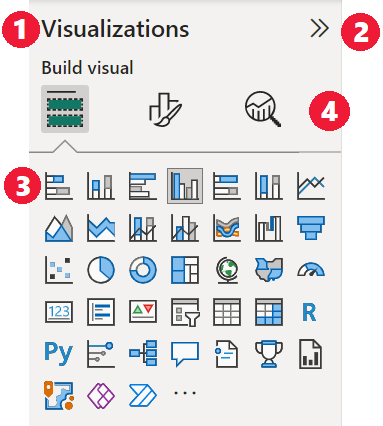
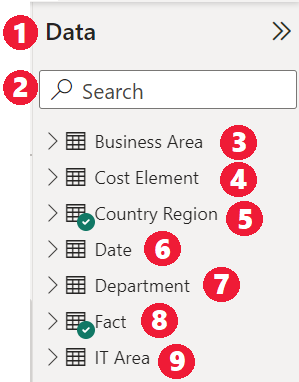
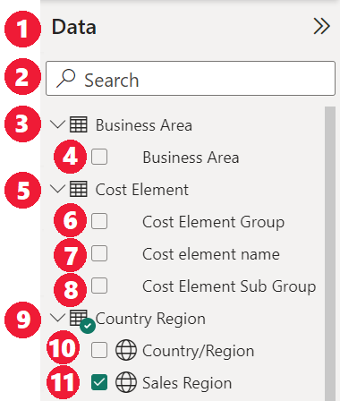
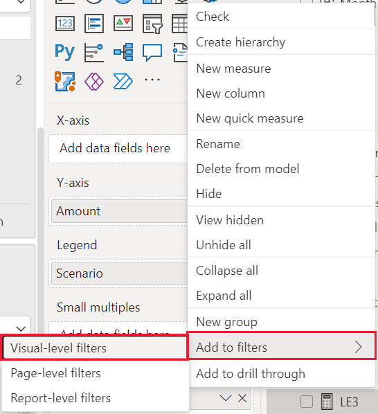

# Creating reports in Power BI using accessibility tools

For report creators who use accessibility tools to create reports, Power BI has many built-in capabilities that can help in the process.

This article describes the many types of accessibility tools available for report creators in Power BI Desktop.

## App-level navigation
When navigating in Power BI Desktop, you can move focus to the main areas of the app by pressing **Ctrl + F6**. Shifting focus in the main area of Power BI Desktop progresses in the following order:

1. Objects on canvas
2. Page tabs
3. Panes (each one separately, left to right for whatever ones are open)
4. View navigator
5. Footer
6. Sign in
7. Yellow warning / error / updates bar

In most cases, using **Enter** to select, or enter an area, and then using **Esc** to exit are common procedures in Power BI.

## Ribbon navigation

Press **Alt** to see the little boxes called *KeyTips* over each command available in the current view of the ribbon. Then you can press the letter shown in the *KeyTip* that hovers over the command you want to use. 

For example, in the following image the **Alt** key has been pressed to display KeyTips, which contain the letters for available accessible commands. Then pressing **M** would open the **Modeling** tab on the ribbon.

Depending on which letter you press, you might see additional KeyTips. For example, if the **Home** tab is active and you press **W**, the **View** tab is displayed along with the KeyTips for the groups in that **View** ribbon tab. You can continue pressing letters displayed in KeyTips until you press the letter of the specific command you want to use. To move to the previous set of KeyTips, press **Esc**. To cancel the action you’re taking and hide the KeyTips, press the **Alt** key.

## Visual pane navigation

To navigate the **Visualizations** pane, you first must make sure your focus is on the pane, by pressing **Ctrl + F6** until you reach that pane. When a user navigates through the visualizations pane, the focus first lands on the header. Starting from the top, the tab order is the following, and is shown in the following image:

1. The header title
2. The expand / collapse carat
3. The first visual icon

When you get to the visuals, you can use arrow keys to navigate to a particular visual, and press **Enter** to select it. If you’re using a screen reader, it calls out if you’ve created a new chart and tell you what type it is, or it tells you that you’ve changed a chart of a particular type to another type of chart. 

After the visuals section of the pane, the focus order then shifts to the pane pivots, as shown in the following image.

When focus is on the pane pivots, tabbing lands only on the icon for the pane that is selected. To switch to other panes, use arrow keys.

## Field well

When focus is on the pane pivots, as described in the previous section, pressing tab again advances focus to the **Field Well**. 

In the **Field well**, focus order moves to:

1. Each well's title (first)
2. Followed by a given field in each well (next)
3. The dropdown button to open the field menu (after that)
4. Then the removal button (last)

The following image shows this focus progression ordering.

A screen reader will read out the well’s name and its tooltip. For each field in a well, a screen reader reads the field name and its tooltip. If a well is empty, the focus should move to the entire empty well. The screen reader should read the well name, tooltip, and that it is empty.

When the field menu is open, you can move through it by using **Tab** or **Shift + Tab** or **Up** / **Down** arrow keys. A screen reader will call out the option names.

If you’d like to move a field from one bucket in the field well to another bucket, you can use your keyboard, and use the **Move** to option in the field well menu, as shown in the following image.

## Formatting pane

The focus order for the **Formatting** pane moves from the top, then down, in card order. The focus goes around the card name, followed by its **On / Off** toggle button, if it exists. When the focus is on the card name, a screen reader reads out the name of the card, and whether the card is expanded or collapsed. You can press **Enter** to expand or collapse the card. The **Enter** key also works to switch **On** or **Off** the toggle button.

If a card is open, **Tab** moves through the controls in the card before going on to the next card. For the controls in a card, a screen reader calls out the title, the current value, and the control type.  

## Fields list navigation

You can press **Tab** to navigate around the **Fields** list. Similar to the formatting pane, if tables are collapsed the focus order cycles through in the following order:

1. The **Fields** list header
2. The search bar
3. Each table name

To expand all the tables in the **Fields** well, press **Alt + Shift + 9**. To collapse all the tables press **Alt + Shift + 1**. To expand a single table, press the **Right arrow** key. To collapse a single table, press the **Left arrow** key. Similar to the formatting pane, if a table is expanded, then tabbing and navigating through the fields list includes the fields that are being shown. A screen reader calls out whether you have expanded or collapsed a table.

You can checkmark a field by navigating to the desired field and pressing **Enter**.   A screen reader calls out the field the focus is on, and whether the field is checked or unchecked.

Mouse users typically drag-and-drop fields to the canvas, or to the relevant filter buckets they desire. If you’d like to use your keyboard, you can add a field to a filter bucket by entering a field’s context menu by pressing **Shift + F10**, using arrow keys to navigate to **Add to filters**, and then pressing **Enter** on the type of filter to which you’d like to add the field.

## Selection pane navigation
The **Selection** pane has the following focus order progression:

1. Header title
2. Exit button
3. Layer / tab order switcher
4. Move up in layer button
5. Move down in layer button
6. Show button
7. Hide button
8. Objects

You can tab through the focus order and press **Enter** to select the element you're interested in.  

When you get to the layer / tab order switcher, use the left and right arrow keys to switch between the layer order and tab order.

When you get to the objects in the **Selection** pane, press **F6** to activate the **Selection** pane. After activating the **Selection** pane, you can use the up / down arrow keys to navigate to the different objects in the **Selection** pane.
Once you’ve navigated to an object of interest, there are a few different actions you can take:

* Press **Ctrl + Shift + S** to hide / show an object
* Press **Ctrl + Shift + F** to move an object up in the layer order
* Press **Ctrl + Shift + B** to move an object down in the layer order
* Press **Ctrl + Space** to multi-select objects

## Power BI Desktop dialogs

All dialogs in Power BI Desktop are accessible through keyboard navigation and work with screen readers.

Dialogs in Power BI Desktop include the following:

* Quick Measures dialog
* Conditional Formatting & data bars dialog
* Q&A Explorer dialog
* Getting Started dialog
* File menu and About dialog
* Warning bar
* File Restore dialog
* Frowns dialog

## High contrast support

When you use high contrast modes in Windows, those settings and the palette you select are also applied to reports in Power BI Desktop.

Power BI Desktop automatically detects which high contrast theme Windows is using and applies those settings to your reports. Those high contrast colors follow the report when published to the Power BI service, or elsewhere.

## Next steps

The collection of articles for Power BI accessibility are the following:

* [Overview of accessibility in Power BI](desktop-accessibility-overview.md) 
* [Creating accessible Power BI reports](desktop-accessibility-creating-reports.md) 
* [Consuming reports in Power BI with accessibility tools](desktop-accessibility-consuming-tools.md)
* [Accessibility keyboard shortcuts for Power BI reports](desktop-accessibility-keyboard-shortcuts.md)
* [Report accessibility checklist](desktop-accessibility-creating-reports.md#report-accessibility-checklist)

