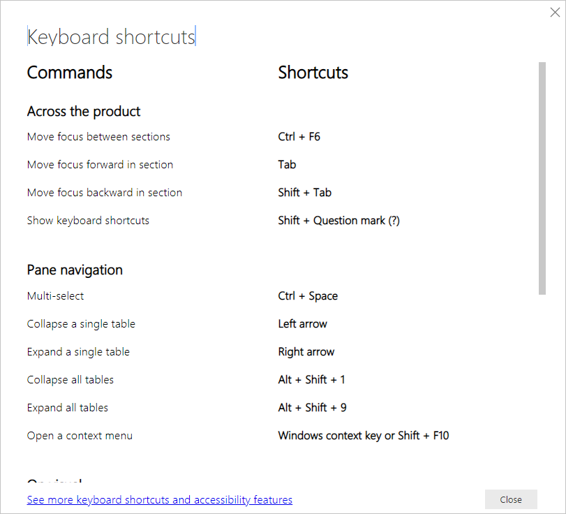

# Keyboard shortcuts in Power BI Desktop

[!INCLUDE [applies-yes-desktop-no-service](../includes/applies-yes-desktop-no-service.md)]

Keyboard shortcuts are helpful for moving around in Power BI reports using a keyboard. The tables in this article describe the shortcuts available in a Power BI report.

When using Power BI Desktop, you can press **Shift + ?** to show keyboard shortcuts, as shown in the following image.

In addition to using these keyboard shortcuts in **Power BI Desktop**, these shortcuts work in the following experiences as well:

* **Q&A Explorer** dialog
* **Getting Started** dialog
* **File** menu and **About** dialog
* **Warning** bar
* **File Restore** dialog
* **Frowns** dialog

In our continued effort to improve accessibility, the previous list of experiences also supports screen readers and high contrast settings.

## Frequently used shortcuts

| To do this action           | Press                |
| :------------------- | :------------------- |
| Move focus between sections  | **Ctrl + F6** |
| Move focus forward in a section | **Tab**         |
| Move focus backward in a section | **Shift + Tab** |
| Select or clear selection of an object | **Enter** or **spacebar** |
| Multi-select objects | **Ctrl + spacebar** |
| Keytips to navigate and select ribbon buttons | **Alt** |

## On visual

| To do this action           | Press                |
| :------------------- | :------------------- |
| Move focus to visual menu | **Alt + Shift + F10** |
| Show data | **Alt + Shift + F11**  |
| Enter a visual | **Ctrl + Right arrow** |
| Enter a layer | **Enter** |
| Exit a layer or visual | **Esc** |
| Select or clear selection of a data point | **Enter** or **spacebar** |
| Multi-select | **Ctrl + Enter** or **Ctrl + spacebar** |
| Right-click | <ul><li>Windows keyboard: **Windows context key + F10**. The Windows context key is between the Left Alt key and the Left Arrow Key</li><li>Other keyboard: **Shift + F10**</li></ul> |
| Clear selection | **Ctrl + Shift + C** |
| Show or hide tooltip | **Ctrl + H** |
| Move a visual on the canvas (small moves)* | **Arrow keys (up, down, right, left**) |
| Move a visual on the canvas (bigger moves)* | **Shift + arrow keys** |
| Resize a visual* | **Arrow keys**  |
| Maintain aspect ratio*  | **Shift** + drag the resize handles |
| Group Visuals*  | Select visuals + **Ctrl + G** |

\* Must be in editing mode

## Table navigation

| To do this action          | Press                |
| :------------------- | :------------------- |
| Move focus up / down one cell (across all cells in all areas)  | **Up arrow key** / **Down arrow key** |
| Move focus left / right one cell (across all cells in all areas)  | **Left arrow key** / **Right arrow key** |
| Moves the focus to the last cell in the current row | **Ctrl + Right arrow key** / **End key** |
| Moves the focus to the first cell in the current row | **Ctrl + Left arrow key** / **Home key** |
| Moves the focus to the last element in the current column | **Ctrl + Down arrow key** |
| Moves the focus to the first element in the current column | **Ctrl + Up arrow key** |
| Moves the focus to the first element in the table (top left corner) | **Ctrl + Home key** |
| Moves the focus to the last element in the table (bottom right corner) | **Ctrl + End key** |
| Moves the focus to the last row displayed in the current column | **Page down key** |
| Moves focus to the first row displayed in the current column | **Page up key** |
| Selecting multiple noncontiguous rows | **Ctrl + Enter** / **Ctrl + Space** |
| Selecting multiple contiguous rows | **Shift + Down arrow key or Up arrow key** |
| Clear selected rows | **Ctrl + Shift + C** |
| Open URL links | **Ctrl + Alt + O** |
| Open Context Menu| **Shift + F10** |

## Matrix navigation

| To do this action          | Press                |
| :------------------- | :------------------- |
| Expand matrix | **Shift + Right arrow key** |
| Collapse matrix | **Shift + Left arrow key** |

## Pane navigation

| To do this action           | Press                |
| :------------------- | :------------------- |
| Multi-select | **Ctrl + Spacebar** |
| Collapse a single table | **Left arrow key** |
| Expand a single table | **Right arrow key** |
| Collapse all tables | **Alt + Shift + 1** |
| Expand all tables | **Alt + Shift + 9** |
| Open a context menu | <ul><li>Windows keyboard: **Windows context key + F10**.  The Windows context key is between the Left Alt key and the Left Arrow Key</li><li>Other keyboard: **Shift + F10**</li></ul> |

## Canvas zoom

| To do this action           | Press                |
| :------------------- | :------------------- |
| Zoom in | **Ctrl + Plus** or **Ctrl + (mouse scroll wheel forward)** |
| Zoom out | **Ctrl + Minus** or **Ctrl + (mouse scroll wheel backward)** |
| Scroll canvas up | **Page up key** |
| Scroll canvas down | **Page down key** |
| Scroll canvas left | **Alt + Page up key** |
| Scroll canvas right | **Alt + Page down key** |

## Slicer

| To do this action         | Press                |
| :------------------- | :------------------- |
| Interact with a slicer | **Enter** |
| Move focus between menu items | **Up arrow key / Down arrow key** |
| Move focus to first menu item	| **Home** |
| Move focus to last menu item | **End** |
| Select multiple contiguous items | **Shift + Up arrow key / Down arrow key** |
| Open context menu | **Shift + F10** |

## Selection pane

| To do this action           | Press                |
| :------------------- | :------------------- |
| Activate selection pane | **F6** |
| Move up an object in the layering | **Ctrl + Shift + F** |
| Move down an object in the layering | **Ctrl + Shift + B** |
| Hide / show (toggle) an object | **Ctrl + Shift + S** |

## DAX formula bar

| To do this action          | Press                |
| :------------------- | :------------------- |
| Submit | **Ctrl + Enter** or **Enter** |
| Go to line number | **Ctrl + G** |
| Move line up / down | **Alt + Up arrow key** / **Down arrow key** |
| Copy line up / down | **Shift + Alt + Up arrow key** / **Down arrow key** |
| Insert line below | **Shift + Enter** or **Alt + Enter** |
| Insert line above | **Ctrl + Shift + Enter** |
| Delete selected word | **Ctrl + Del**|
| Delete all selected lines | **Ctrl + Shift + K**|
| Jump to matching bracket | **Ctrl + Shift +** \ |
| Jump to start of a line of code | **Ctrl + Home**  |
| Jump to the end of a line of code | **Ctrl + End** |
| Indent line / Extend line into the margin | **Ctrl + ]** or **Ctrl + [** |
| Insert cursor | **Alt + Click** |
| Select current line | **Ctrl + L** |
| Select all occurrences of current selection | **Ctrl + Shift + L** |
| Select all occurrences of current word | **Ctrl + F2** |
| Select next occurrences of current selection | **Ctrl + D** |
| Select the line above | **Shift + Up arrow key** |
| Select the line below | **Shift + Down arrow key** |
| Enter multiple lines of code up / down |**Ctrl + Alt + Up arrow key** / **Down arrow key**|
| Comment a line | **Ctrl + /** or **Ctrl + K + C** |
| Uncomment a line | **Ctrl + /** or **Ctrl + K + U** |
| Increase font size | **Ctrl + +** or **Scroll Up** |
| Decrease font size | **Ctrl + -** or **Scroll Down** |
| Show or hide "Read more" tooltips | **Ctrl + I** |
| Show accessiblity widget | **Alt + F1** |
| Close widget, suggestions, other dialogs, or closes DAX formula bar | **Esc** |
| Show suggestions | **Ctrl + Space** |
| Expand or Collapse DAX formula bar | **Ctrl + J** |
| Focus on the DAX fomula bar itself to tab to next UI element | **Ctrl + M** |

## Enter data
| To do this action           | Press                |
| :------------------- | :------------------- |
| Exit editable grid | **Ctrl + Tab** |

## Model view navigation

| To do this action           | Press                |
| :------------------- | :------------------- |
| Move focus to first card in relationship diagram | **Tab** |
| Move focus to the next card | **Tab** / **Right arrow key** / **Down arrow key** |
| Move focus to the previous card | **Shift + Tab** / **Left arrow key** / **Up arrow key** |

## On card in model view

| To do this action           | Press                |
| :------------------- | :------------------- |
| Move focus to relationship line connected to card | **Ctrl + Alt + R** |
| Move focus to first field list item on the card | **Enter** |
| Move focus to next item within the card | **Tab** |
| Move focus back to entire card | **Esc** |
| Open context menu | **Shift + F10** |
| Move focus to the next field list item | **Right arrow key** / **Down arrow key** |
| Move focus to the previous field list item | **Up arrow key** / **Left arrow key** |

## On relationship in model view

| To do this action           | Press                |
| :------------------- | :------------------- |
| Move focus to next card connected to relationship line | **Ctrl + Alt + R** |
| Move focus to previously focused card connected to relationship line | **Shift + Alt + R** |
| Open relationship properties pane | **Enter** |
| Move focus to next relationship line connected to card | **Tab** / **Right arrow key** / **Down arrow key** |
| Move focus to previous relationship line connected to card | **Shift + Tab** / **Left arrow key** / **Up arrow key** |
| Select focused relationship | **Enter** |

## Considerations and limitations

There are a few known issues and limitations with the accessibility features. You can view descriptions of those issues and limitations in the following list:

* When using screen readers with **Power BI Desktop**, you'll have the best experience if you open your screen reader before opening any files in **Power BI Desktop**.
* If you're using Narrator, you'll have some limitations around navigating **Show data** as an HTML table.

## Related content

The collection of articles for Power BI accessibility are the following:

* [Overview of accessibility in Power BI](desktop-accessibility-overview.md)
* [Design Power BI reports for accessibility](desktop-accessibility-creating-reports.md)
* [Consume Power BI reports by using accessibility features](desktop-accessibility-consuming-tools.md)
* [Creating reports in Power BI using accessibility tools](desktop-accessibility-creating-tools.md)
* [Report accessibility checklist](desktop-accessibility-creating-reports.md#report-accessibility-checklist)

You might also be interested in the following:

* [Use Report Themes in Power BI Desktop](desktop-report-themes.md)
