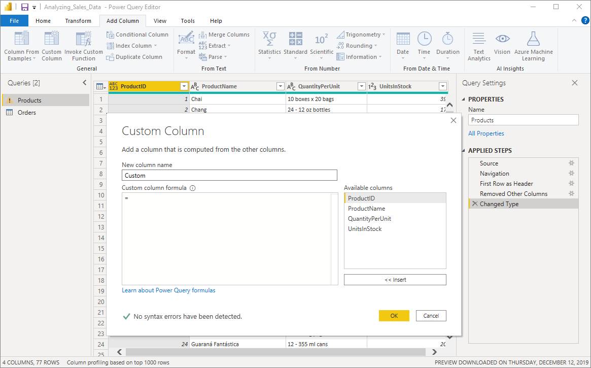
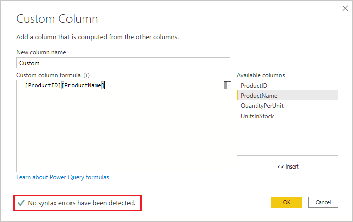
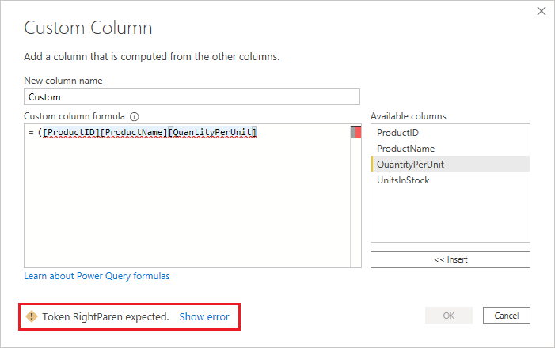
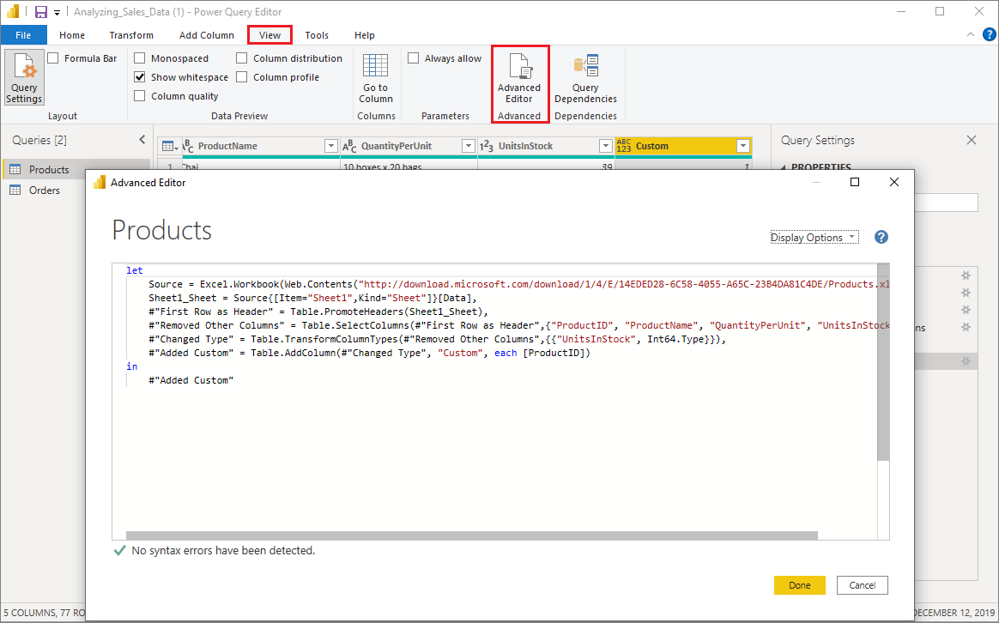

# Add a custom column in Power BI Desktop

[!INCLUDE [applies-yes-desktop-no-service](../includes/applies-yes-desktop-no-service.md)]

In Power BI Desktop, you can add a new custom column of data to your model by using Power Query Editor. With Power Query Editor, you can create and rename your custom column to create [PowerQuery M formula queries](/powerquery-m/quick-tour-of-the-power-query-m-formula-language) to define your custom column. PowerQuery M formula queries have a [comprehensive function reference content set](/powerquery-m/power-query-m-function-reference).
When you create a custom column in Power Query Editor, Power BI Desktop adds it as an **Applied Step** in the **Query Settings** of the query. You can change, move, or modify the column at any time.

## Use Power Query Editor to add a custom column

To create a custom column, follow these steps:

1. Launch Power BI Desktop and load some data.

2. From the **Home** tab on the ribbon, select **Transform data**, and then select **Transform data** from the menu.

   

   The **Power Query Editor** window appears.

3. From the **Add Column** tab on the ribbon, select **Custom Column**.

   

   The **Custom Column** window appears.

## The Custom Column window

The **Custom Column** window has the following features:

- An **Available columns** list on the right.

- The initial name of your custom column, in the **New column name** box. You can rename this column.

- [PowerQuery M formula queries](/powerquery-m/power-query-m-function-reference), in the **Custom column formula** box. You create these queries by building the formula on which your new custom column is defined.

   

## Create formulas for your custom column

1. Select columns from the **Available columns** list on the right, and then select **Insert** below the list to add them to the custom column formula. You can also add a column by double-clicking it in the list.

2. As you enter the formula and build your column, note the indicator in the bottom of the **Custom Column** window.

   If there are no errors, there are a green check mark and the message *No syntax errors have been detected*.

   

   If there's a syntax error, there is a warning, along with a link to where the error occurred in your formula.

   

3. Select **OK**.

   Power BI Desktop adds your custom column to the model and adds the **Added Custom** step to your query's **Applied Steps** list in **Query Settings**.

   

4. To modify your custom column, double-click the **Added Custom** step in the **Applied Steps** list.

   The **Custom Column** window appears with the custom column formula you created.

## Use the Advanced Editor for custom columns

After you've created your query, you can also use the **Advanced Editor** to modify any step of your query. To do so, follow these steps:

1. In the **Power Query Editor** window, from the **View** tab on the ribbon, select **Advanced Editor**.

   The **Advanced Editor** window appears, which gives you full control over your query.

   
2. Make any changes and then select **Done**.

## Related content

- You can create a custom column in other ways, such as creating a column based on examples you provide to Power Query Editor. For more information, see [Add a column from an example in Power BI Desktop](desktop-add-column-from-example.md).

- For Power Query M reference information, see [Power Query M function reference](/powerquery-m/power-query-m-function-reference).
