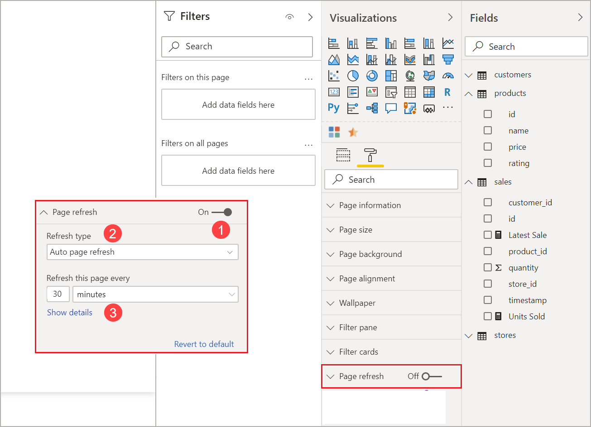
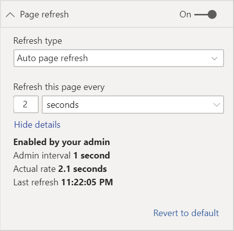
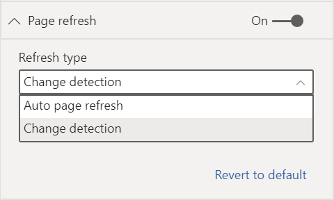
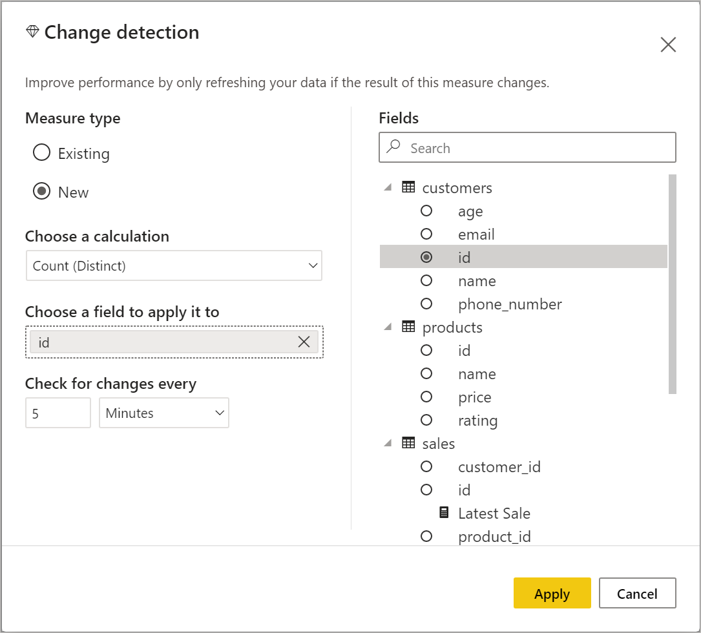
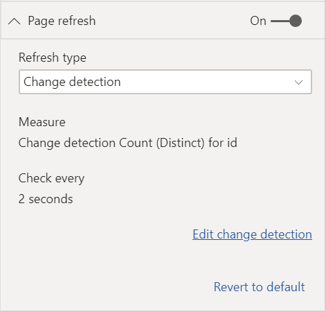
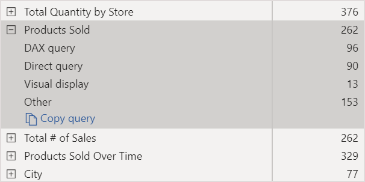
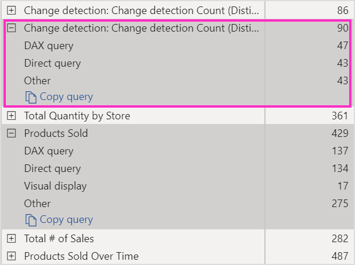
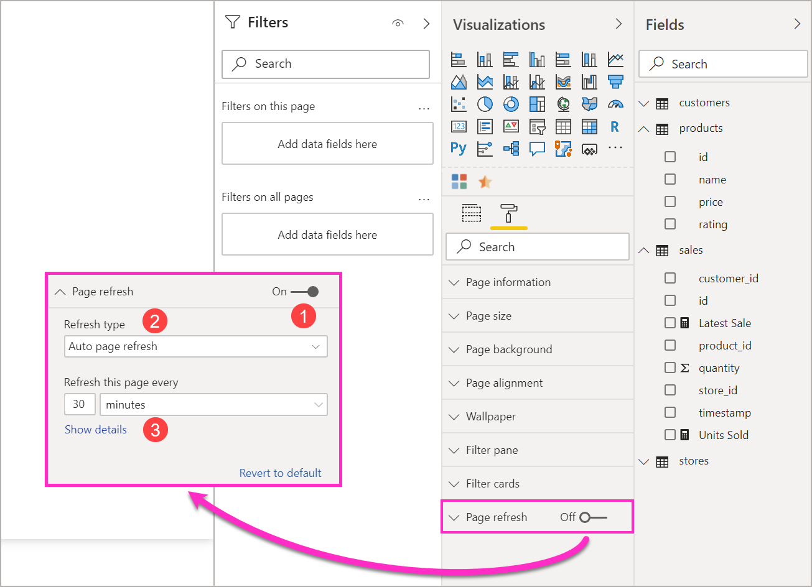

# Automatic page refresh in Power BI

[!INCLUDE [applies-yes-desktop-yes-service](../includes/applies-yes-desktop-yes-service.md)]

When you monitor critical events, you want data to be refreshed as soon as the source data is updated. For example, in the manufacturing industry, you need to know when a machine is malfunctioning or is close to malfunctioning. If you're monitoring signals like social media sentiment, you want to know about sudden changes as soon as they happen.

Automatic page refresh in Power BI enables your active report page to query for new data, at a predefined cadence, for [DirectQuery sources](../connect-data/desktop-directquery-about.md). Furthermore, Automatic Page Refresh supports Proxy Models as well.

## Refresh types

When using automatic page refresh, there are two refresh types available: fixed interval and change detection.

### Fixed interval

This refresh type allows you to update all visuals in a report page based on a constant interval such as one second or five minutes. When that specific interval is reached, all visuals in that page send an update query to the data source and update accordingly.

### Change detection

This refresh type allows you to refresh visuals on a page based on detecting changes in the data rather than a specific refresh interval. Specifically, this measure polls for changes to your [DirectQuery source](../connect-data/desktop-directquery-about.md). Besides defining the measure, you must also select how frequently Power BI Desktop checks for changes. When publishing to the service, this refresh type is only supported in workspaces that are part of a Premium capacity. LiveConnect sources such as Analysis Services and Power BI semantic models aren't supported.

## Authoring reports with automatic page refresh in Power BI Desktop

Automatic page refresh is available for [DirectQuery sources](../connect-data/desktop-directquery-about.md) and some LiveConnect scenarios, so it will only be available when you're connected to a supported data source. This restriction applies to both automatic page refresh types.

To use automatic page refresh in Power BI Desktop, select the report page for which you want to enable automatic page refresh. In the **Visualizations** pane, select the **Formatting** button (a paint roller) and find the **Page refresh** section near the bottom of the pane.

1. Turns page refresh on or off.
2. Refresh type
3. Inputs and information (depending on refresh type)

The **Page refresh** card will only be available if you're connected to a [DirectQuery source](../connect-data/desktop-directquery-about.md). To enable automatic page refresh, the toggle needs to be on the "On" position. The inputs needed and information provided will depend on the refresh type selected.

### Fixed interval setup

When selecting **Auto page refresh** as the refresh type, you must provide the desired refresh interval. The default value is 30 minutes. (The minimum refresh interval is one second.) Your report will begin refreshing at the interval you set.

If you're the administrator and need to make changes to the refresh interval, visit [Configure workloads in a Premium capacity](../enterprise/service-admin-premium-workloads.md).

When clicking on show details, Power BI provides further information on:

- If the feature is enabled by your admin (only when logged into your Power BI account).
- The minimum interval allowed by your admin (only when logged into your Power BI account).
- The actual rate of refresh (usually longer than your selected interval).
- The last refresh time.

### Change detection setup

When selecting **Change detection** as your refresh type, you're presented with a link to **Add change detection**. You can also access the **change detection** window from the Modeling tab in the ribbon. Then click on the **Change detection** icon on the **Page refresh** section. Finally, you can right-click or select the dropdown arrow next to any value in the Values well, and select **Change detection** from the menu.

Once the window is open, you're presented with the **Measure type** option where you can select an existing measure or create a new one. When selecting an existing measure, you just have to select the desired measure from the fields list or drag and drop it into the **Choose existing measure** section. When creating a new measure, you can **Choose a calculation** for the measure between count, count distinct, minimum, maximum, and sum. For example, you can use count distinct to count customer IDs and only refresh when a new customer is added to the list. Once you have a measure selected, you must define how often Power BI will **Check for changes**. That's the interval on how often Power BI will calculate the measure and poll changes. Once you click apply, a new measure with the change detection icon appears in your field list.

Then, back on the page refresh section, you see the information of which measure is being used for change detection and the defined interval for your reference.

> [!NOTE]
> Only one change detection measure is allowed per model.

## Determining the refresh interval

When automatic page refresh is enabled, Power BI Desktop is constantly sending queries to your DirectQuery source. After the query is sent, there's a delay before data is returned. Therefore, for short refresh intervals, you should confirm that queries are successfully returning the queried data within the configured interval. If data isn't returned within the interval, visuals will update less frequently than configured.

These considerations apply for both fixed interval and change detection refresh types. The main difference is that for change detection there's only one query going back to the source at a fixed interval and the visuals refresh is triggered only when the value of the change detection measure changes.

As a best practice, the refresh interval should match your expected new data arrival rate:

- If new data arrives at the source every 20 minutes, your refresh interval can't be less than 20 minutes.
- If new data arrives every second, set the interval to one second.

For low refresh intervals like one second, take factors like the following into consideration:

- The type of the DirectQuery data source.
- The load your queries create on it.
- The distance of your report viewers from the capacity's datacenter.

You can estimate return times by using the [Performance Analyzer](desktop-performance-analyzer.md) in Power BI Desktop and the show details menu in the page refresh section for the fixed interval refresh type. Performance Analyzer lets you check if each visual query has enough time to come back with results from the source. It also lets you determine where time is spent. Based on the results from Performance Analyzer, you can adjust the data source, or you can experiment with other visuals and measures in your report.

This image shows the results of a DirectQuery source in Performance Analyzer:

Other characteristics of this data source:

- The data arrives at a rate of 2 seconds.
- The Performance Analyzer shows a maximum query + display time of approximately 4.9 seconds (4,688 milliseconds).
- The data source is configured to handle approximately 1,000 concurrent queries per second.
- You expect approximately 10 users to be viewing the report concurrently.

These characteristics result in the following equation:

- **5 visuals x 10 users = approximately 50 queries**

The result of this calculation shows a higher load than the data source can support. The data arrives at a rate of two seconds, so that should be your refresh rate. However, because the query takes around five seconds to complete, you should set it to more than five seconds.

Also note that this result might differ as you publish your report to the service. This difference occurs because the report uses the Azure Analysis Services instance that's hosted in the cloud. You might want to adjust your refresh rates accordingly.

To account for queries and refresh timing, Power BI only runs the next refresh query when all the remaining refresh queries are complete. So even if your refresh interval is shorter than the time your queries take to process, Power BI refreshes only after remaining queries complete.

In the case of change detection refresh type, these considerations still apply. Also, the [Performance Analyzer](desktop-performance-analyzer.md) shows you the results for the change detection measure query even though it doesn't match any visual in your report. We have provided this capability for you to be able to troubleshoot this type of measure following the same guidance we mentioned previously. The main difference for this refresh type is that only one query is going to the data source instead of all queries from all visuals. This is still the case if multiple users are viewing the report.

For the same scenario we discussed before:

- **1 change detection measure query for 5 visuals generates only one query for any number of viewers**

- **When the change detection measure triggers an update assuming the same scenario as before with 5 visuals x 10 users = approximately 50 queries**

To summarize, when using change detection, only one query is sent to the data source until a change is detected. When that happens, the same logic used for a fixed interval refresh type applies for updating all visuals for all users generating the same number of queries. This approach should be more efficient in the long run.

You can check the [Frequently asked questions](#frequently-asked-questions) section, later in this article, for more questions and answers about performance and troubleshooting.

## Automatic page refresh in the Power BI service

You can also set automatic page refresh for reports that have been published to the Power BI service as long as the data source is [DirectQuery](../connect-data/desktop-directquery-about.md).

When configuring automatic page refresh for reports in the Power BI service, the steps are similar to those for Power BI Desktop. When configured in the Power BI service, automatic page refresh also supports [embedded Power BI](../developer/embedded/embedded-analytics-power-bi.md) content. This image shows the **Page refresh** configuration for the Power BI service:

1. Turns page refresh on or off.
2. Refresh type.
3. Inputs and information (depending on refresh type).

> [!NOTE]
> When you publish your automatic page refresh-enabled report from Power BI Desktop to the service, you'll have to provide the credentials for the DirectQuery data source on the semantic model settings menu. You can set up the credentials so that report viewers access this data source with their own identities, respecting any security setup at the source. A change detection measure is evaluated with the author's credentials.

### Page refresh intervals

The page refresh types and intervals allowed in the Power BI service are affected by the report's workspace type. This applies to these scenarios:

- Publishing a report into a workspace that has automatic page refresh enabled.
- Editing a page refresh interval that's already in a workspace.
- Creating a report directly in the service.

Power BI Desktop has no restrictions for refresh intervals and can be as frequent as every second. However, when reports are published to the Power BI service, certain restrictions apply which are described in the following sections.

### Restrictions on refresh intervals

In the Power BI service, restrictions on automatic page refresh apply based on the workspace where the report is published, whether you're using Premium services, the Premium capacity admin settings, and the type of data source.

To clarify how these restrictions work, start with background on capacities and workspaces.

*Capacities* represent a set of resources (storage, processor, and memory) that are used to host and deliver Power BI content. Capacities are either shared or reserved. A *shared capacity* is shared with other Microsoft customers. A *reserved capacity* is reserved for a single customer. For an introduction to reserved capacities, see [Managing Premium capacities](../enterprise/service-premium-capacity-manage.md).

In a shared capacity, workloads run on computational resources shared with other customers. Because the capacity needs to share resources, limitations are imposed to ensure *fair play*, such as setting a maximum model size (1 GB) and maximum daily refresh frequency (eight times per day).

Power BI *workspaces* reside within capacities. They represent security, collaboration, and deployment containers. Each Power BI user has a personal workspace known as **My Workspace**. Additional workspaces can be created to enable collaboration and deployment. They're known as *workspaces*. By default, workspaces, including personal workspaces, are created in the shared capacity.

Here are details for the two workspace scenarios:

**Shared workspaces**. For regular workspaces (workspaces that aren't part of a Premium capacity), automatic page refresh has a minimum interval of 30 minutes (the lowest interval allowed). Change detection refresh type isn't available in shared capacities.

**Premium workspaces**. The availability of automatic page refresh in Premium workspaces (both for fixed interval and change detection) depends on the workload settings your Premium administrator has set up for the Power BI Premium capacity. There are two variables that might affect your ability to set up automatic page refresh:

 - **Feature on/off**. If your capacity administrator has disabled the feature, you won't be able to set up any type of page refresh in your published report. Fixed interval and change detection can be turned on and off separately.

 - **Minimum refresh interval**. When enabling automatic page refresh for a fixed interval, your capacity administrator needs to set up a minimum refresh interval (the default value is five minutes). If your interval is lower than the minimum, the Power BI service overrides your interval to respect the minimum interval set by your capacity administrator.

 - **Minimum execution interval**. When enabling change detection, your capacity administrator needs to set up a minimum execution interval (default value is five seconds). If your interval is lower than the minimum, the Power BI service overrides your interval to respect the minimum interval set by your capacity administrator.

> [!WARNING]
> When enabled in your semantic model, the change detection measure will open a connection to your DirectQuery data source to calculate the measure and poll for changes. This connection is different from the low priority refresh connections Power BI already makes.

This table describes with more detail where this feature is available and the limits for each capacity type and [storage mode](../connect-data/service-dataset-modes-understand.md):

| Storage mode                                  | Dedicated capacity                                                                                     | Shared capacity                                                                                       |
|-----------------------------------------------|--------------------------------------------------------------------------------------------------------|-------------------------------------------------------------------------------------------------------|
| DirectQuery                                   | **FI supported**: Yes  **CD supported**: Yes  **Minimum**: 1 second  **Admin override**: Yes  | **FI supported**: Yes  **CD supported**: No  **Minimum**: 30 minutes  **Admin override**: No |
| Import                                        | **FI supported**: No  **CD supported**: No  **Minimum**: N/A  **Admin override**: N/A         | **FI supported**: No  **CD supported**: No  **Minimum**: N/A  **Admin override**: N/A        |
| Mixed mode (DirectQuery + other data sources) | **FI supported**: Yes  **CD supported**: Yes  **Minimum**: 1 second  **Admin override**: Yes  | **FI supported**: Yes  **CD supported**: No  **Minimum**: 30 minutes  **Admin override**: No |
| Analysis Services (Azure and On Premises)     | **FI supported**: Yes  **CD supported**: No  **Minimum**: 30 minutes  **Admin override**: Yes | **FI supported**: Yes  **CD supported**: No  **Minimum**: 30 minutes  **Admin override**: No |
| Power BI semantic models (connected live)   | **FI supported**: Yes  **CD supported**: No  **Minimum**: 1 second  **Admin override**: Yes  | **FI supported**: Yes  **CD supported**: No  **Minimum**: 30 minutes  **Admin override**: No |
| Power BI semantic models (DirectQuery connection)   | **FI supported**: No  **CD supported**: No  **Minimum**: N/A  **Admin override**: N/A  | **FI supported**: No  **CD supported**: No  **Minimum**: N/A  **Admin override**: N/A |
| Power BI Push semantic models                        | **FI supported**: Yes  **CD supported**: No  **Minimum**: 30 minutes  **Admin override**: Yes | **FI supported**: Yes  **CD supported**: No  **Minimum**: 30 minutes  **Admin override**: No        |
| Power BI streaming semantic models                        | **FI supported**: No  **CD supported**: No  **Minimum**: N/A  **Admin override**: N/A | **FI supported**: No  **CD supported**: No  **Minimum**: N/A  **Admin override**: N/A        |

*Table legend:*
1. *FI: Fixed interval*
2. *CD: Change detection*

> [!WARNING]
> We have a known issue when connected from Power BI Desktop to Analysis Services or Power BI semantic models and the refresh interval is 30 minutes or more. Visuals in a report page might show an error after 30 minutes.

## Refreshed data and open reports

When a report page is open and a semantic model is refreshed, the open report page refreshes to reflect the most recent data. Showing refreshed data for open reports resolves issues related to stale data, and is similar to automatic page refresh. Only users with write permissions will see their open reports updated automatically when the semantic model is refreshed.

If the semantic model has a large number of uses with Write permissions, for example more than a thousand users with Write permissions, automatic refresh for open reports can become unreliable.

## Considerations and limitations

There are a few things to keep in mind when you use automatic page refresh in Power BI Desktop or in the Power BI service:

* Import storage mode isn't supported for automatic page refresh, but open reports update automatically if the underlying semantic model is refreshed and the user has Write permissions. Refer to the [previous section](#refreshed-data-and-open-reports) for situations when the refresh may become unreliable.
* Composite models that have at least one DirectQuery data source are supported.
* You can only have one change detection measure per semantic model.
* There can only be a maximum of 10 models with change detection measure in a Power BI tenant.

### Performance diagnostics

Automatic page refresh is useful for monitoring scenarios and exploring fast-changing data. However, it can put undue load on the capacity or data source.

To prevent undue load on data sources, Power BI has the following safeguards:

- All automatic page refresh queries run at a lower priority to ensure that interactive queries, like page load and cross-filtering visuals, take precedence.
- If a query hasn't finished before the next refresh cycle, Power BI doesn't issue new refresh queries until the previous query completes. For example, if you have a refresh interval of one second and your queries take an average of four seconds, Power BI effectively only issues a query every four seconds.

There are two areas where you could still encounter performance bottlenecks:

1. **The capacity**. The query first hits the Premium capacity, which will fold and evaluate the DAX query generated from the report visualizations into the source queries.
2. **The DirectQuery data source**. The translated queries in the previous step are then run against the source. The source would be your SQL Server instances, SAP Hana sources, and so on.

By using the [Microsoft Fabric Capacity Metrics app](/fabric/enterprise/metrics-app) that's available to admins, you can visualize how much of the capacity is being used by low-priority queries.

Low-priority queries consist of automatic page refresh queries and model refresh queries. There's currently no way to distinguish between the load from automatic page refresh and model refresh queries.

If your capacity is overloaded with low-priority queries, you can take these actions:

- Request a larger premium SKU.
- Ask the report owner to lower the refresh interval.
- In the capacity admin portal, you can:
   - Turn off automatic page refresh for that capacity.
   - Raise the minimum refresh interval, which will affect all reports on that capacity.

### Frequently asked questions

**I'm a report author. I defined my report refresh interval to one second on Power BI Desktop, but after publishing, my report isn't refreshing in the service.**

* Ensure that automatic page refresh is turned on for the page. Because this setting is per page, you need to ensure it's turned on for each page in the report you want to refresh.
* Check whether you uploaded to a workspace with an attached Premium capacity. If you haven't, your refresh interval will be locked at 30 minutes for fixed interval, and it will not be available for change detection.
* If your report is on a Premium workspace, ask your admin if this feature is enabled for the attached capacity. Also, ensure that the minimum refresh interval for the capacity is equal or lower than the interval for your report. This applies separately for both fixed interval and change detection

**I'm a capacity admin. I changed the settings for my automatic page refresh interval, but the changes aren't reflected. Reports are still refreshing at a rate they shouldn't be, or they are not refreshing even though I turned on automatic page refresh.**

* It takes up to 5 minutes for automatic page refresh setting changes made in the capacity admin UI to propagate to reports.
* In addition to turning on automatic page refresh for the capacity, you also need to turn it on for the pages of a report where you want to enable it.
* Both refresh types are managed separately, so make sure that the type of refresh you're enabling is turned on.
* For more information on enabling and configuring workloads in a Premium capacity, visit [Configure workloads in a Premium capacity](../enterprise/service-admin-premium-workloads.md).

**My report is operating in mixed mode. (Mixed mode means the report has a DirectQuery connection and an Import data source.) Some visuals aren't refreshing.**

- If your visuals reference Import tables, this behavior is expected. Automatic page refresh isn't supported for Import.
- See the first question in this section.

**My report was refreshing in the service, but then it suddenly stopped.**

* Try refreshing the page to see if the problem resolves itself.
* Check with your capacity admin. The admin might have turned off the feature or raised the minimum refresh interval. (See the second question in this section.)

**I'm a report author. My visuals aren't refreshing at the cadence I specified. They're refreshing at a slower rate.**

* If your queries are taking longer to run, your refresh interval will be delayed. Automatic page refresh waits for all queries to finish before running new ones.
* Your capacity admin might have set a minimum refresh interval that's higher than the one you set in your report. Ask your capacity admin to lower the minimum refresh interval.

**Are automatic page refresh queries served from the cache?**

* No. All automatic page refresh queries bypass any cached data.

**My change detection measure is not triggering any updates**

* Ensure that change detection is turned on for the page. Because this setting is per page, you need to ensure it's turned on for each page in the report you want to refresh.
* Check whether you uploaded to a workspace with an attached Premium capacity. If you haven't, change detection won't work.
* If your report is on a Premium workspace, ask your admin if this feature is enabled for the attached capacity. Also, ensure that the minimum execution interval for the capacity is equal or lower than the interval for your report.
* If you have checked for all of the items mentioned before, check in Power BI Desktop or in edit mode if the measure is changing at all. To do this, drag it into the canvas and check if the value changes. If it doesn't, the measure might not be a good choice to poll for data source changes.

**When connected to analysis services, I cannot see the APR toggle**

* Make sure your Analysis Services model is in [Direct Query mode](/analysis-services/tabular-models/directquery-mode-ssas-tabular).

## Related content

For more information, see these articles:

* [Using DirectQuery in Power BI](../connect-data/desktop-directquery-about.md)
* [Use composite models in Power BI Desktop](../transform-model/desktop-composite-models.md)
* [Use Performance Analyzer to examine report element performance](desktop-performance-analyzer.md)
* [Deploying and managing Power BI Premium capacities](../guidance/whitepaper-powerbi-premium-deployment.md)
* [Data sources in Power BI Desktop](../connect-data/desktop-data-sources.md)
* [Shape and combine data in Power BI Desktop](../connect-data/desktop-shape-and-combine-data.md)
* [Connect to Excel workbooks in Power BI Desktop](/power-query/connectors/excel)
* [Enter data directly into Power BI Desktop](../connect-data/desktop-enter-data-directly-into-desktop.md)
