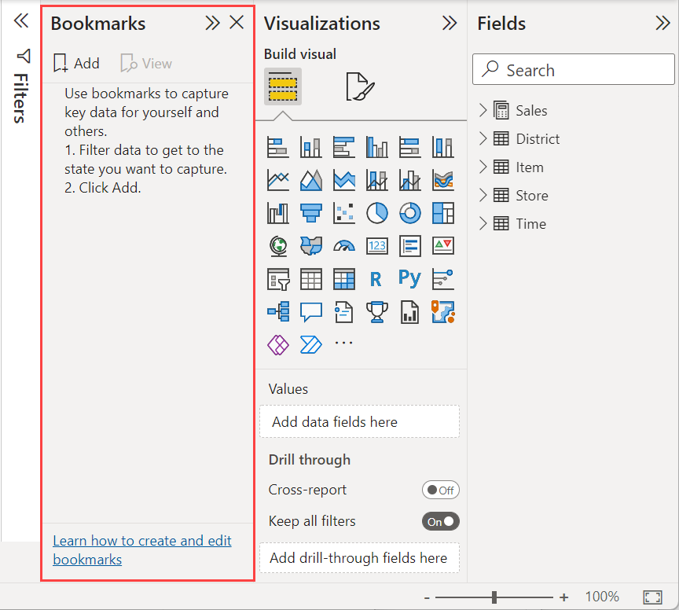
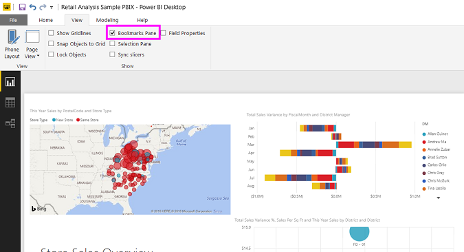
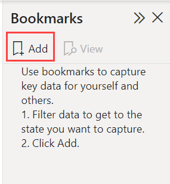
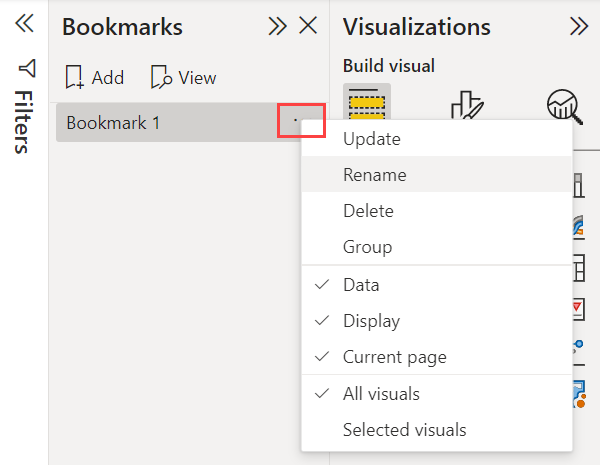
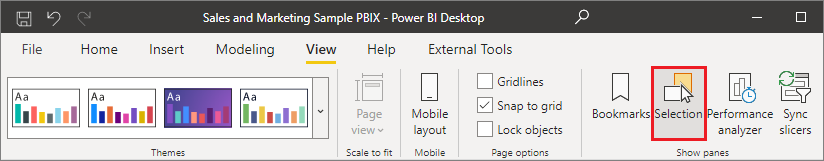
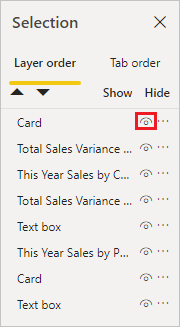
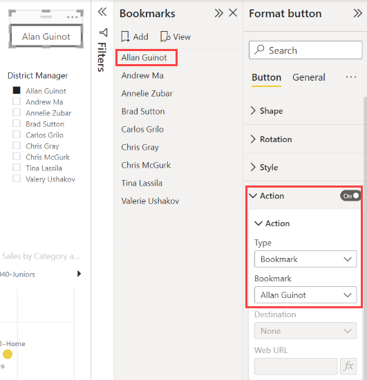
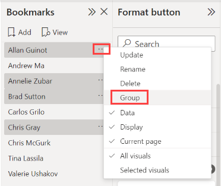
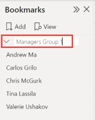
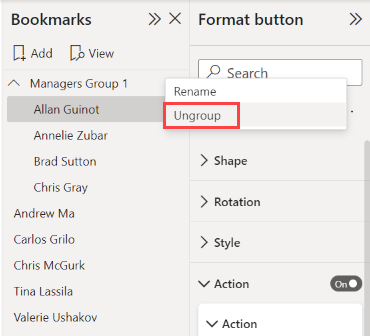

# Create report bookmarks in Power BI to share insights and build stories

[!INCLUDE [applies-yes-desktop-yes-service](../includes/applies-yes-desktop-yes-service.md)]

When you edit a report in Power BI Desktop and the Power BI service, you can add *bookmarks* to capture the current state of a report page. Bookmarks save the current filters and slicers, cross-highlighted visuals, sort order, and so on. There are two types of bookmarks: *personal* and *report*. This article covers creating and using **report** bookmarks. When you add report bookmarks to a report and others view your report, they can get back to that exact state by selecting your saved report bookmark.

There are many uses for bookmarking. For example, you can create a collection of bookmarks and arrange them in the order you want. Later,  step through each bookmark in a presentation to highlight a series of insights, or the story you want to tell with your visuals and reports. You can also use bookmarks to keep track of your own progress in creating reports (bookmarks are easy to add, delete, and rename).

## Other articles about bookmarks

- In the Power BI service, anyone viewing a report can create a *personal bookmark*. For more about personal bookmarks, read about [personal bookmarks in the Power BI service](../consumer/end-user-bookmarks.md#use-personal-bookmarks-to-save-insights-and-build-stories-in-power-bi).
- After you create your report bookmarks, you and your report readers can do more with them. You can quickly build a [bookmark navigation experience](button-navigators.md#bookmark-navigator) with a few more clicks.

## Create report bookmarks

To create report bookmarks, you must have edit permissions for the report.  

## Power BI Desktop

On the **View** tab, select **Bookmarks**.

## [Power BI service](#tab/powerbi-service)

Open a report in Editing view.

:::image type="content" source="media/desktop-bookmarks/power-bi-edit.png" alt-text="Screenshot showing a red box around the menu item for Edit.":::

Select **View** and enable **Bookmarks pane**.

:::image type="content" source="media/desktop-bookmarks/service-view-bookmarks.png" alt-text="Screenshot showing how to turn on the Bookmarks pane in the Power BI service.":::

---

When you create a bookmark, the following elements are saved with the bookmark:

- The current page
- Filters
- Slicers, including slicer type (for example, dropdown or list) and slicer state
- Visual selection state (such as cross-highlight filters)
- Sort order
- Drill location
- Visibility of an object (by using the **Selection** pane)
- The focus or [Spotlight mode of any visible object](../consumer/end-user-spotlight.md)

Configure a report page as you want it to appear in the bookmark. After your report page and visuals are arranged how you want them, select **Add** from the **Bookmarks** pane to add a bookmark.

Power BI creates a bookmark and gives it a generic name. Easily **Rename**, **Delete**, or **Update** a bookmark by selecting **More options (...)** next to the bookmark's name, then selecting an action from the menu that appears.

After you create a bookmark, display it by selecting it in the **Bookmarks** pane.

:::image type="content" source="media/desktop-bookmarks/power-bi-select-bookmark.png" alt-text="Screenshot of Bookmarks pane with one report bookmark outlined in red.":::

You can also select whether each bookmark applies other properties in the report. To make these changes, select **More options (...)** next to the bookmark name, then select or clear the check marks next to **Data**, **Display**, and other controls. The options are:

- **Data** properties, such as filters and slicers.
- **Display** properties, such as spotlight and its visibility.
- **Current page** changes, which present the page that was visible when the bookmark was added.
- Choose between **All visuals** and **Selected visuals**.

:::image type="content" source="media/desktop-bookmarks/power-bi-bookmark-display.png" alt-text="Screenshot of a bookmark selected and the More options menu displayed.":::

These capabilities are useful when you use bookmarks to switch between report views or selections of visuals. Because of this, you likely want to turn off data properties, so that filters aren't reset when users switch views by selecting a bookmark.

## Arranging bookmarks

As you create report bookmarks, you might find that the order in which you create them is different from the order you'd like to present to your audience. No problem, you can easily rearrange the order of bookmarks.

- In the **Bookmarks** pane, drag and drop bookmarks to change their order.

   The yellow bar between bookmarks designates where you're placing the dragged bookmark.

   

The order of your bookmarks can be important when you use the **View** feature of bookmarks, as described in the next section, [Bookmarks as a slide show](#bookmarks-as-a-slide-show).

> [!NOTE]
> You can't rearrange personal bookmarks except to choose the **default** view.

## Bookmarks as a slide show

When you have a collection of bookmarks you'd like to present in order, you can view them as a slide show in Power BI Desktop, and in the Power BI service in either **Edit** or **Reading mode**.  

- In the **Bookmarks** pane, select **View**.

    :::image type="content" source="media/desktop-bookmarks/service-bookmarks-pane-view-slide-show.png" alt-text="Select View this content in the Bookmarks pane.":::

Read more about [using bookmarks as a slideshow](../consumer/end-user-bookmarks.md#bookmarks-as-a-slideshow) in the Power BI service.

## Visibility: Using the Selection pane

The **Selection** pane is similar to the **Bookmarks** pane. They both display a list of all objects on the current page and allow you to select an object and specify whether it's visible.

## [Power BI Desktop](#tab/powerbi-desktop)

In Power BI Desktop, the Selection pane is on the **View** tab.

## [Power BI service](#tab/powerbi-service)

When you're editing a report in the Power BI service, the **Selection pane** is on the **View** menu. You don't see it if you can't edit the report.

:::image type="content" source="media/desktop-bookmarks/power-bi-service-selection-pane.png" alt-text="Screenshot showing how to turn on the Selection pane in the Power BI service.":::

---

In the **Selection** pane, you select an object and toggle whether the object is currently visible by selecting the eye icon to the right of the object.

When you add a bookmark, the visibility status of each object is also saved, based on its setting in the **Selection** pane.

It's important to note that slicers continue to filter a report page, regardless of whether they're visible. As such, you can create many different bookmarks, with different slicer settings, and make a single report page appear different (and highlight different insights) in various bookmarks.

> [!NOTE]
> When using the **Selection** pane in combination with bookmarks, changing the visibility of a selection results in its visibility reverting to the default setting. After making such changes, right-click a bookmark and select **Update** to update its visibility.

## Assign bookmarks to buttons

You can link bookmarks to shapes and images. With this feature, when you select an object, it shows the bookmark associated with that object. This feature can be especially useful when you work with buttons. Read more about [using buttons in Power BI](desktop-buttons.md). Consider also creating a [bookmark navigator](button-navigators.md#bookmark-navigator), which creates a set of buttons all linked automatically to a group of bookmarks.

## [Power BI Desktop](#tab/powerbi-desktop)

To assign a bookmark to a button in Power BI Desktop:

1. On the **Insert** ribbon, select **Buttons** > **Blank**.
1. In the **Format button** pane, toggle the **Action** slider to **On**.

1. Expand the **Action** section. Under **Type**, select **Bookmark**.

1. Under **Bookmarks**, select a bookmark.

   

## [Power BI service](#tab/powerbi-service)

To assign a bookmark to a button in the Power BI service:

1. From the top menu bar, select the **Buttons** icon and choose  **Blank**.

:::image type="content" source="media/desktop-bookmarks/power-bi-button.png" alt-text="Screenshot showing how to select the Button options.":::

1. In the **Format button** pane, toggle the **Action** slider to **On**.

2. Expand the **Action** section. Under **Type**, select **Bookmark**.

3. Under **Bookmarks**, select a bookmark.

    :::image type="content" source="media/desktop-bookmarks/power-bi-button-action.png" alt-text="Screenshot showing how to add a bookmark as a button action.":::

---

There are all sorts of interesting things you can do with object-linked bookmarking. You can create a visual table of contents on your report page, or you can provide different views (such as visual types) of the same information.

When you're in editing mode, press **Ctrl** and select the link to follow it. When you're not in editing mode, select the object to follow the link.

## Bookmark groups

When editing a report, you can create and use bookmark groups. A bookmark group is a collection of bookmarks that you specify, which can be shown and organized as a group. You can't create groups of personal bookmarks.

### Create a bookmark group

1. Press **Ctrl** and select the bookmarks you want to include in the group.

2. Select **More options (...)** next to your selected bookmarks, and then select **Group** from the menu that appears.

   

    Power BI Desktop automatically names the group *Group 1*. You can select **More options (...)** next to this name, select **Rename**, and rename it to whatever you want.

    

Expanding the bookmark group's name only expands or collapses the group of bookmarks, and doesn't represent a bookmark by itself.

### Bookmark groups in View mode

When you use the **View** feature of bookmarks, the following details apply:

- If the selected bookmark is in a group when you select **View** from bookmarks, only the bookmarks *in that group* are shown in the viewing session.

- If the selected bookmark isn't in a group, or is on the top level (such as the name of a bookmark group), then all bookmarks for the entire report are played, including bookmarks in any group.

### Ungroup bookmarks

1. Select any bookmark in a group and select **More options (...)**.

2. Select **Ungroup** from the menu that appears.

   

   Selecting **Ungroup** for any bookmark from a group removes all bookmarks from the group; it deletes the group, but not the bookmarks themselves.

### Remove a single bookmark from a group

1. **Ungroup** any member from that group, which deletes the entire grouping.

2. Select the members you want in the new group by pressing **Ctrl** and selecting each bookmark, then and select **Group** again.

## Considerations and limitations

In this release of bookmark features, there are a few considerations and limitations to keep in mind.

- Most Power BI visuals work well with bookmarks. However, if you encounter problems with bookmarks and a custom visual, contact the creator of that custom visual and ask them to add support for bookmarks to their visual. 
- If you add a slicer to a page where you previously created bookmarks, the slicer is cleared.
- Bookmarks apply to the state of the visuals on a report page, and not to the visuals' location on the report page. You can create a bookmark and then move visuals on that page. Selecting the bookmark doesn't return those visuals to their previous locations.

## Related content

For more information about features that are similar or interact with bookmarks, see the following articles:

- [Personal bookmarks in the Power BI service](../consumer/end-user-bookmarks.md)
- [Build a bookmark navigation experience](button-navigators.md)
- [Use drillthrough in Power BI Desktop](desktop-drillthrough.md)
