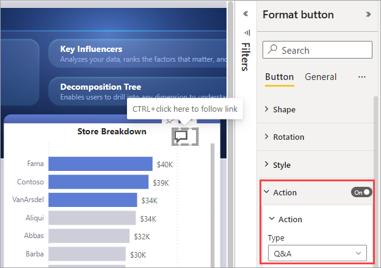

# Create buttons in Power BI reports

[!INCLUDE [applies-yes-desktop-yes-service](../includes/applies-yes-desktop-yes-service.md)]

With *buttons* in Power BI, you can create reports that behave similar to apps, and create an environment where users can hover, click, and further interact with Power BI content. This article explains how to add buttons to reports in Power BI Desktop and in the Power BI service. When you share your reports in the Power BI service, buttons provide an app-like experience. The article [Identify and use buttons in the Power BI service](../consumer/end-user-buttons.md) describes how report readers experience buttons in your reports.

## Create buttons in reports

# [Power BI Desktop](#tab/powerbi-desktop)

In Power BI Desktop, on the **Insert** ribbon, select **Buttons** and a drop-down menu appears, where you can select the button you want from a collection of options, as shown in the following image. 

# [Power BI service](#tab/powerbi-service)

In the Power BI service, open the report in Editing view. Select **Buttons** in the top menu bar and a drop-down menu appears, where you can select the button you want from a collection of options, as shown in the following image.

---

## Customize a button

Whether you create the button in Power BI Desktop or the Power BI service, the rest of the process is the same. When you select the button on the report canvas, the **Format** pane shows you the many ways you can customize the button to fit your requirements. For example, you can add a custom image.

:::image type="content" source="media/power-bi-customize-button/power-bi-customize-shape-parallelogram.png" alt-text="Screenshot showing Customize the shape of a button.":::

See [Customize buttons in Power BI reports](power-bi-customize-button.md) for more information.

## Set button properties when idle, hovered over, selected, or disabled

Buttons in Power BI have four states: 

- **Default**: How they appear when not hovered over or selected.
- **On hover**: How they appear when hovered over.
- **On press**: How they appear when selected.
- **Disabled**: How they appear when they can't be selected.

You can modify many of the cards in the **Format** pane individually based on those four states, providing plenty of flexibility for customizing your buttons.

The following cards in the **Format** pane let you adjust formatting of a button for each of its four states:

- Shape
- Text style
- Icon
- Fill
- Border
- Shadow
- Glow
- Rotation applies to all states.

To select how the button should appear for each state, in **Apply settings to**, select the state you want to set, then expand one of those cards and select the drop-down that appears at the top of the card. In the following image, you see the **Icon** card expanded. The **State** is **On hover**, and the **Icon type** is **Right arrow**.

## Select the action for a button

You can select which action is taken when a user selects a button in Power BI. You access the options for button actions from the **Action** card in the **Format** pane.

Here are the options for button actions:

- **Back** returns the user to the previous page of the report. This is useful for drillthrough pages.
- **Bookmark** presents the report page that's associated with a bookmark that is defined for the current report. Learn more about [bookmarks in Power BI](desktop-bookmarks.md). 
- **Drillthrough** navigates the user to a drillthrough page filtered to their selection, without using bookmarks. Learn more about [drillthrough buttons in reports](desktop-drill-through-buttons.md).
- **Page navigation** navigates the user to a different page within the report, also without using bookmarks. See [Create page navigation](#create-page-navigation) in this article for details.
- **Q&A** opens a **Q&A Explorer** window. When your report readers select the Q&A button, the Q&A Explorer opens, and they can ask natural-language questions about your data.
- **Web URL** opens a web page in a browser.

Certain buttons have a default action selected automatically. For example, the **Q&A** button type automatically selects **Q&A** as the default action.

You can try or test the buttons you create for your report by selecting *Ctrl* and selecting the button.

## Create page navigation

With the **Action** type **Page navigation**, you can create a button that links to another page in your report, without creating a bookmark. 

> [!TIP]
> If you want to build an entire navigation experience for the report, without having to save or manage any bookmarks, [create page and bookmark navigators](button-navigators.md) instead.

To set up a single page navigation button, create a button with **Page navigation** as the action type, and select the **Destination** page.

Additionally, you can conditionally format the tooltip as you can do with other button types.

Remember, if you want a custom navigation pane, [create page and bookmark navigators](button-navigators.md) instead.

## Set the navigation destination conditionally

This navigation you have to create in Power BI Desktop, because you have to create a table. You can use conditional formatting to set the navigation destination, based on the output of a measure. For example, you may want to save space on your report canvas by having a single button to navigate to different pages based on the user’s selection.

:::image type="content" source="media/desktop-buttons/button-navigate-go.png" alt-text="Screenshot showing Navigate with a Go button.":::
 
To create the example shown above, start by creating a single-column table with the names of the navigation destinations.

On the **Home** tab, select **Enter data**. The **Create Table** dialog box opens:

:::image type="content" source="media/desktop-buttons/button-create-table.png" alt-text="Screenshot showing Create a table.":::

Type the names of your pages in the column. Power BI uses exact string match to set the drillthrough destination, so double-check that the values you entered exactly match your drillthrough page names.

After you've created the table, add it to the page as a single-select slicer:

:::image type="content" source="media/desktop-buttons/button-navigate-slicer.png" alt-text="Screenshot showing Navigate slicer.":::

Then create a page navigation button and select the conditional formatting option for the destination:

:::image type="content" source="media/desktop-buttons/button-set-page-nav-destination.png" alt-text="Screenshot showing Page navigation button.":::
 
Select the name of the column you created, in this case, **Select a page**:

:::image type="content" source="media/desktop-buttons/button-select-destination.png" alt-text="Screenshot showing Select a destination.":::

Now the button can navigate to different pages, depending on the user’s selection.

:::image type="content" source="media/desktop-buttons/button-navigate-go.png" alt-text="Screenshot showing Navigate with a Go button.":::
 
### Shapes and images for navigation

Page navigation action is supported for shapes and images, not just buttons. Here’s an example using one of the built-in shapes:

:::image type="content" source="media/desktop-buttons/button-navigation-arrow.png" alt-text="Screenshot showing Use an arrow for navigation.":::
 
Here’s an example using an image:

:::image type="content" source="media/desktop-buttons/button-navigation-image.png" alt-text="Screenshot showing Use an image for navigation.":::
 
## Buttons support fill images

Buttons support fill images. You can customize the look and feel of your button with fill images combined with the built-in button states: default, on hover, on press, and disabled (for drillthrough).

:::image type="content" source="media/desktop-drill-through-buttons/drill-through-fill-images.png" alt-text="Screenshot showing Drill-through button fill images.":::

Set **Fill** to **On**, then create images for the different states.

:::image type="content" source="media/desktop-drill-through-buttons/drill-through-fill-state-settings.png" alt-text="Screenshot showing Fill image settings.":::

## Next steps
For more information about features that are similar or interact with buttons, take a look at the following articles:

- [Create page and bookmark navigators](button-navigators.md)
- [Identify and use buttons in the Power BI service](../consumer/end-user-buttons.md)
- [Use drillthrough in Power BI reports](desktop-drillthrough.md)
- [Use bookmarks to share insights and build stories in Power BI](desktop-bookmarks.md)
- [Create a drillthrough button](desktop-drill-through-buttons.md)

