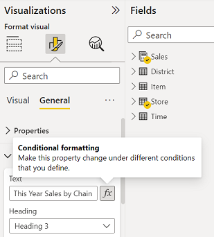
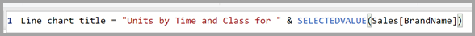
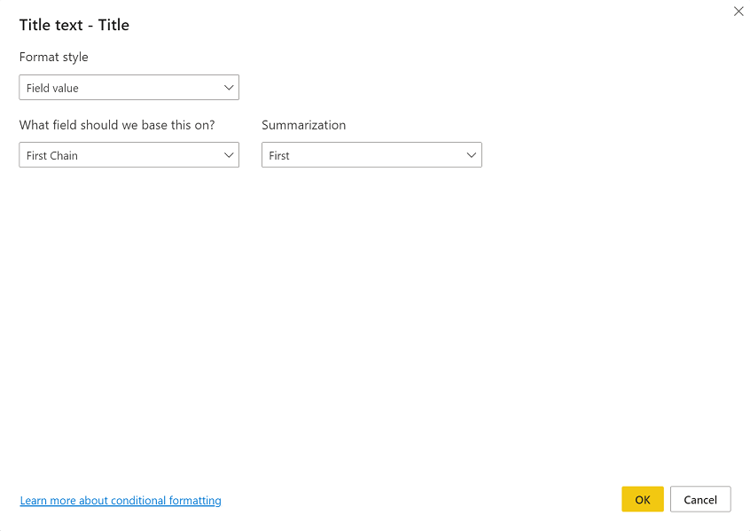

# Expression-based titles in Power BI Desktop

You can create dynamic, customized titles for your Power BI visuals. By creating Data Analysis Expressions (DAX) based on fields, variables, or other programmatic elements, your visuals' titles can automatically adjust as needed. These changes are based on filters, selections, or other user interactions and configurations.

Creating dynamic titles, sometimes called *expression-based titles*, is straightforward. 

## Create a field for your title

The first step in creating an expression-based title is to create a field in your model to use for the title. 

There are all sorts of creative ways to have your visual title reflect what you want it to say, or what you want to express. Let's take a look at an example.

You can create an expression that changes based on the filter context that the visual receives for the product's brand name. The following image shows the DAX formula for such a field.

This is just one example you can use to create dynamic, expression-based titles for your visuals in Power BI Desktop. What you can do with your titles are limited only by your imagination, and your model.

## Select your field for your title

After you've created the DAX expression for the field you create in your model, you need to apply it to your visual's title.

To select the field and apply it, go to the **Visualizations** pane. In the **Format** area, select **Title** to show the title options for the visual. 

When you right-click **Title text**, a context menu appears that allows you to select **<em>fx</em>Conditional formatting**. When you select that menu item, a **Title text** dialog box appears. 

From that window, you can select the field that you created to use for your title.

## Considerations and limitations

There are a few limitations to the current implementation of expression-based titles for visuals:

* Expression-based formatting isn’t currently supported on Python visuals, R visuals, or the Key Influencers visual.
* The field you create for the title must be a string data type. Measures that return numbers or date/time (or any other data type) aren't currently supported.
* Expression based titles aren't carried over when you pin a visual to a dashboard.

## Next steps

This article described how to create DAX expressions that turn the titles of your visuals into dynamic fields that can change as users interact with your reports. You might find the following articles useful as well.

* [Conditional formatting in tables](desktop-conditional-table-formatting.md)
* [Use cross-report drillthrough in Power BI Desktop](desktop-cross-report-drill-through.md)
* [Use drillthrough in Power BI Desktop](desktop-drillthrough.md)
