# Use conditional formatting in tables 

With conditional formatting for tables in Power BI Desktop, you can specify customized cell colors, including color gradients, based on field values. You can also represent cell values with data bars or KPI icons, or as active web links. You can apply conditional formatting to any text or data field, as long as you base the formatting on a field that has numeric, color name or hex code, or web URL values. 

To apply conditional formatting, select a **Table** or **Matrix** visualization in Power BI Desktop. In the **Visualizations** pane, right-click or select the down-arrow next to the field in the **Values** well that you want to format. Select **Conditional formatting**, and then select the type of formatting to apply.

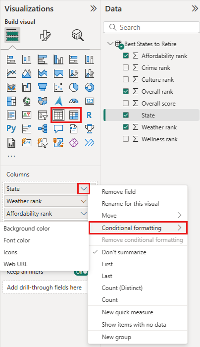

> [!NOTE]
> Conditional formatting overrides any custom background or font color you apply to the conditionally formatted cell.

To remove conditional formatting from a visualization, select **Remove conditional formatting** from the field's drop-down menu, and then select the type of formatting to remove.

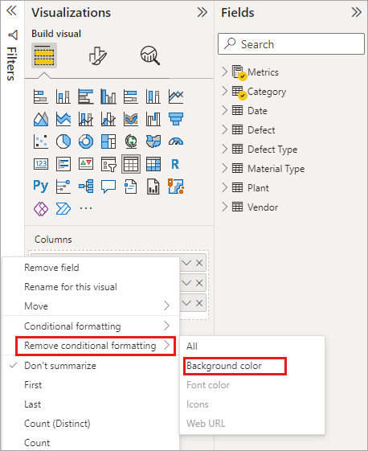

The following sections describe each conditional formatting option. You can combine more than one option in a single table column.

## Format background or font color

To format cell background or font color, select **Conditional formatting** for a field, and then select either **Background color** or **Font color** from the drop-down menu. 

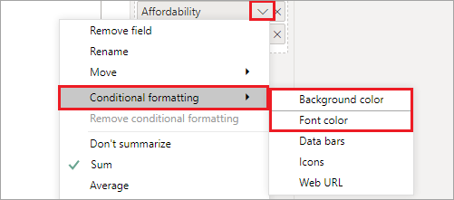

The **Background color** or **Font color** dialog box opens, with the name of the field you're formatting in the title. After selecting conditional formatting options, select **OK**. 

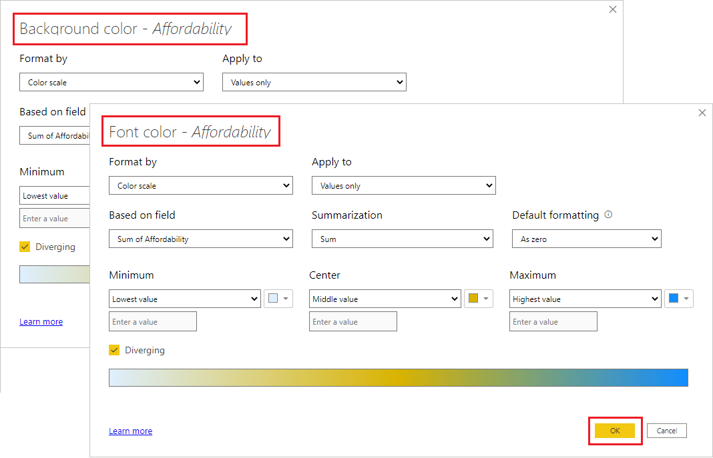

The **Background color** and **Font color** options are the same, but affect the cell background color and font color, respectively. You can apply the same or different conditional formatting to a field's font color and background color. If you make a field's font and background the same color, the font blends into the background so the table column shows only the colors.

## Color by color scale

To format cell background or font color by color scale, in the **Format by** field of the **Background color** or **Font color** dialog box, select **Color scale**. Under **Based on field**, select the field to base the formatting on. You can base the formatting on the current field, or on any field in your model that has numerical or color data. 

Under **Summarization**, specify the aggregation type you want to use for the selected field. Under **Default formatting**, select a formatting to apply to blank values. 

Under **Minimum** and **Maximum**, choose whether to apply the color scheme based on the lowest and highest field values, or on custom values you enter. Drop down and select the colors swatches you want to apply to the minimum and maximum values. Select the **Diverging** check box to also specify a **Center** value and color. 

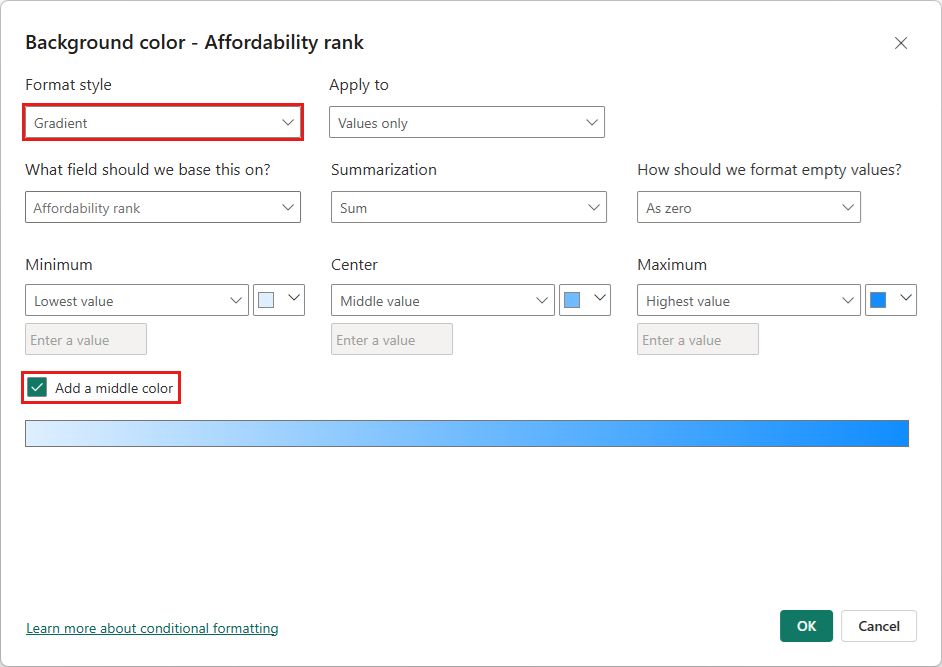

An example table with color scale background formatting on the **Affordability** column looks like this:

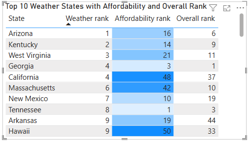

The example table with color scale font formatting on the **Affordability** column looks like this:

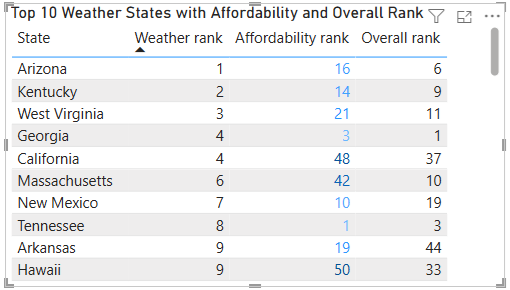

## Color by rules

To format cell background or font color by rules, in the **Format by** field of the **Background color** or **Font color** dialog box, select **Rules**. Again, **Based on field** shows the field to base the formatting on, and **Summarization** shows the aggregation type for the field. 

Under **Rules**, enter one or more value ranges, and set a color for each one. Each value range has an *If value* condition, an *and* value condition, and a color. Cell backgrounds or fonts in each value range are colored with the given color. The following example has three rules:

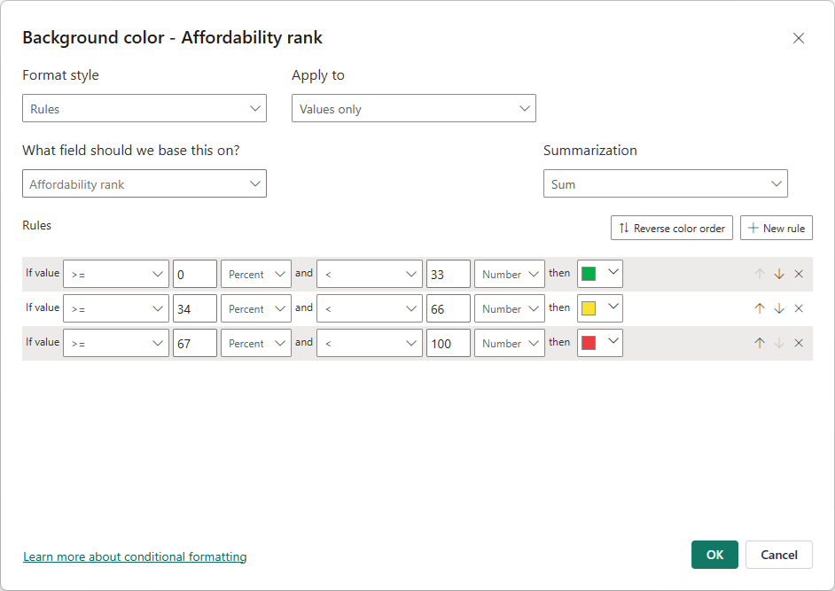

An example table with rules-based background color formatting on the **Affordability** column looks like this:

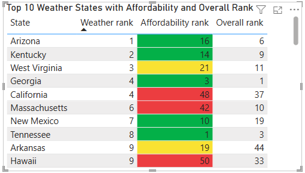

## Color by color values

If you have a field or measure with color name or hex value data, you can use conditional formatting to automatically apply those colors to a column's background or font color. You can also use custom logic to apply colors to the font or background.

The field can use any color values listed in the CSS color spec at [https://www.w3.org/TR/css-color-3/](https://www.w3.org/TR/css-color-3/). These color values can include:
- 3, 6 or 8-digit hex codes, for example #3E4AFF. Make sure you include the # symbol at the start of the code. 
- RGB or RGBA values, like RGBA(234, 234, 234, 0.5).
- HSL or HSLA values, like HSLA(123, 75%, 75%, 0.5).
- Color names, such as Green, SkyBlue, or PeachPuff. 

The following table has a color name associated with each state: 

To format the **Color** column based on its field values, select **Conditional formatting** for the **Color** field, and then select **Background color** or **Font color**. 

In the **Background color** or **Font color** dialog box, select **Field value** from the **Format by** drop-down field.

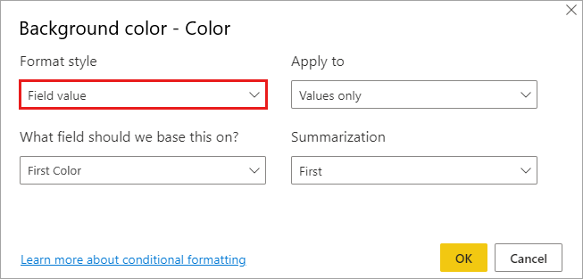

An example table with color field value-based **Background color** formatting on the **Color** field looks like this:

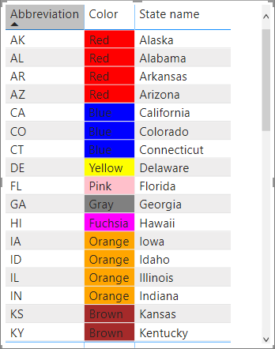

If you also use **Field value** to format the column's **Font color**, the result is a solid color in the **Color** column:

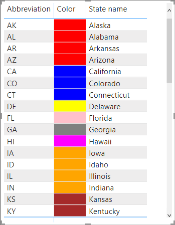

## Color based on a calculation

You can create a calculation that outputs different values based on business logic conditions you select. Creating a formula is usually faster than creating multiple rules in the conditional formatting dialog. 

For example, the following formula applies hex color values to a new **Affordability rank** column, based on existing **Affordability** column values:

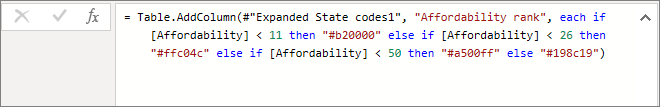

To apply the colors, select **Background color** or **Font color** conditional formatting for the **Affordability** column, and base the formatting on the **Field value** of the **Affordability rank** column. 

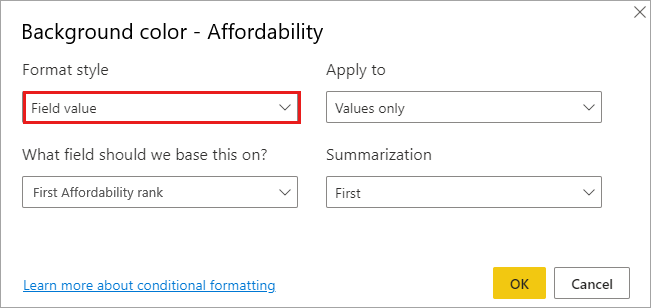

The example table with **Affordability** background color based on calculated **Affordability rank** looks like this:

You can create many more variations, just by using your imagination and some calculations.

## Add data bars

To show data bars based on cell values, select **Conditional formatting** for the **Affordability** field, and then select **Data bars** from the drop-down menu. 

In the **Data bars** dialog, the **Show bar only** option is unchecked by default, so the table cells show both the bars and the actual values. To show the data bars only, select the **Show bar only** check box.

You can specify **Minimum** and **Maximum** values, data bar colors and direction, and axis color. 

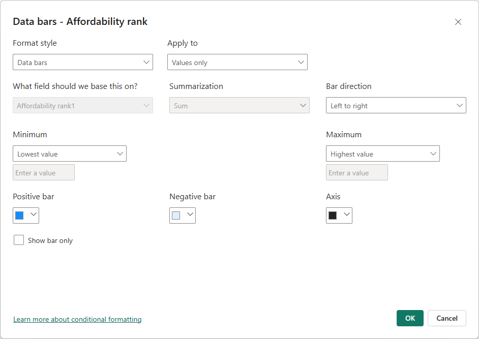

With data bars applied to the **Affordability** column, the example table looks like this:

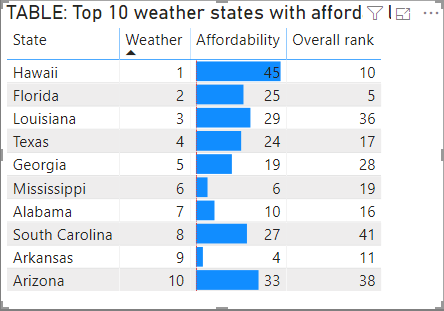

## Add icons

To show icons based on cell values, select **Conditional formatting** for the field, and then select **Icons** from the drop-down menu. 

In the **Icons** dialog, under **Format by**, select either **Rules** or **Field value**. 

To format by rules, select a **Based on field**, **Summarization** method, **Icon layout**, **Icon alignment**, icon **Style**, and one or more **Rules**. Under **Rules**, enter one or more rules with an *If value* condition and an *and* value condition, and select an icon to apply to each rule. 

To format by field values, select a **Based on field**, **Summarization** method, **Icon layout**, and **Icon alignment**.

The following example adds icons based on three rules:

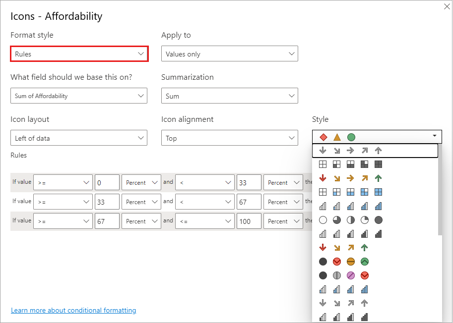

Select **OK**. With icons applied to the **Affordability** column by rules, the example table looks like this:

## Format as web URLs

If you have a column or measure that contains website URLs, you can use conditional formatting to apply those URLs to fields as active links. For example, the following table has a **Website** column with website URLs for each state:

To display each state name as a live link to its website, select **Conditional formatting** for the **State** field, and then select **Web URL**. In the **Web URL** dialog box, under **Based on field**, select **Website**, and then select **OK**. 

With **Web URL** formatting applied to the **State** field, each state name is an active link to its website. The following example table has **Web URL** formatting applied to the **State** column, and conditional **Data bars** and **Background formatting** applied to the **Affordability** column. 

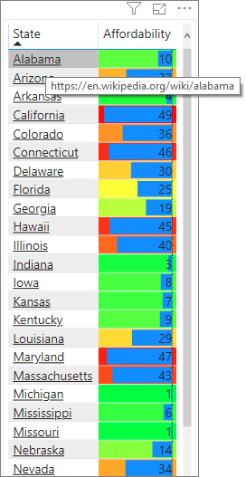

## Totals and subtotals

You can apply conditional formatting rules to totals and subtotals, for both table and matrix visuals. 

You apply the conditional formatting rules by using the **Apply to** drop-down in conditional formatting, as shown in the following image.

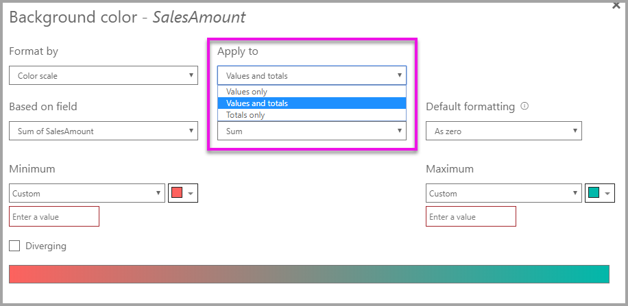

You must manually set the thresholds and ranges for conditional formatting rules. For matrices, **Values** will refer to the lowest visible level of the matrix hierarchy.

## Considerations and limitations
There are a few considerations to keep in mind when working with conditional table formatting:

- Any table that doesn't have a grouping is displayed as a single row that doesn't support conditional formatting.
- You can't apply gradient formatting with automatic maximum/minimum values, or rule-based formatting with percentage rules, if your data contains *NaN* values. NaN means "Not a number," most commonly caused by a divide by zero error. You can use the [DIVIDE() DAX function](/dax/divide-function-dax) to avoid these errors.
- Conditional formatting needs an aggregation or measure to be applied to the value. That's why you see 'First' or 'Last' in the **Color by value** example. If you're building your report against an Analysis Service multidimensional cube, you won't be able to use an attribute for conditional formatting unless the cube owner has built a measure that provides the value.

## Next steps

For more information about color formatting, see [Tips and tricks for color formatting in Power BI](../visuals/service-tips-and-tricks-for-color-formatting.md)