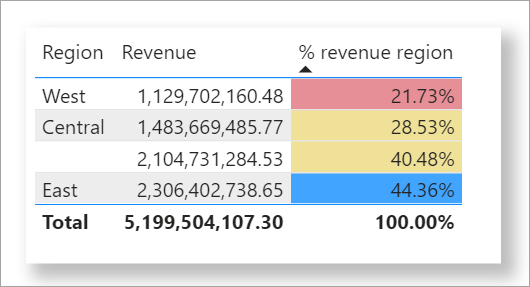

# Apply conditional formatting in tables and matrices

[!INCLUDE [applies-yes-desktop-yes-service](../includes/applies-yes-desktop-yes-service.md)]

Conditional formatting in Power BI is a powerful way to make your data more engaging and easier to interpret. By applying customized colors, data bars, icons, or even web links to your tables and matrices, you can highlight trends, outliers, and key insights at a glance. Whether you're looking to emphasize high-performing metrics, visually rank data, or create interactive reports, this guide shows you how to bring your data to life with conditional formatting.

## Apply conditional formatting in Power BI

You can apply conditional formatting to any text or data field, as long as you base the formatting on a field that has numeric values, color name or hex code values, or web URL values.

To apply conditional formatting:

1. Select a **Table** or **Matrix** visualization in Power BI Desktop or the Power BI service.
1. In the **Visualizations** pane, right-click or select the down-arrow next to the field that you want to format.
1. In the menu that opens, select **Conditional formatting**, then choose the type of formatting to apply.


To remove conditional formatting from a visualization, select **Remove conditional formatting** from the field's dropdown menu, then select the type of formatting to remove.

> [!NOTE]
> Conditional formatting overrides any custom background or font color you apply to the cell with conditional formatting.

The following sections describe each conditional formatting option. You can combine more than one option in a single table column.

## Format background or font color

Using conditional formatting for the font color or cell background in a table column enhances data readability and helps users quickly identify trends, outliers, or key insights. Formatting with specific colors applies distinct colors to predefined conditions or categories, making it easier to differentiate between discrete data points.

To format the cell background or font color:

1. Select **Conditional formatting** for a field, then select either **Background color** or **Font color** from the menu.
1. The **Background color** or **Font color** dialog opens with the name of the field you're formatting in the title.
1. Set the conditional formatting options, then select **OK**.

The **Background color** and **Font color** options are the same, but affect the cell background color and font color, respectively. You can apply the same or different conditional formatting to a field's font color and background color. If you make a field's font and background the same color, the font blends into the background so the table column shows only the colors.

When you use the conditional formatting commands to open the **Background color** or **Font color** dialog, you can choose from the following **Format style** options:

* [Color by color scale](#color-by-color-scale), or color gradient.
* [Color by rules](#color-by-rules).
* [Color by field values](#color-by-color-values).

## Color by color scale

Formatting with a color scale provides a gradient that visually represents the range of values, helping users quickly understand the distribution and magnitude of data.

To format the cell background or font color by color scale:

1. Select **Conditional formatting** for a field, then select either **Background color** or **Font color** from the menu.
1. In the **Format style** field of the **Background color** or **Font color** dialog, select **Gradient**.
1. Under **What field should we base this on?**, select the field to base the formatting on. You can base the formatting on the current field, or on any field in your model that has numerical or color data.
1. Under **Summarization**, specify the aggregation type you want to use for the selected field.
1. Under **How should we format empty values?**, select a formatting to apply to blank values.
1. Under **Minimum** and **Maximum**, choose whether to apply the color scheme based on the lowest and highest field values, or on custom values you enter. Select the dropdown menu and select the colors swatches you want to apply to the minimum and maximum values.
1. Optionally, select the **Add a middle color** checkbox to also specify a **Center** value and color.


An example table with color scale background formatting on the **Affordability rank** column looks like this:


The example table with color scale font formatting on the **Affordability rank** column looks like this:


## Color by rules

You can create rules to format the cell background or font color in a table according to specific conditions that you define, making it easier to visually categorize and interpret data. You might use this feature, for example, to highlight sales performance by coloring cells green for values above a target threshold, yellow for values near the target, and red for values below the target.

To format the cell background or font color by rules:

1. Select **Conditional formatting** for a field, then select either **Background color** or **Font color** from the menu.
1. In the **Format style** field of the **Background color** or **Font color** dialog, under **Format style**, select **Rules**. Again, **What field should we base this on?** shows the field to base the formatting on, and **Summarization** shows the aggregation type for the field.
1. Under **Rules**, enter one or more value ranges, and set a color for each one. Each value range has an *If value* condition, an *and* value condition, and a color. Cell backgrounds or fonts in each value range are colored with the given color. The following example has three rules that have been set for the **Affordability rank** field:


When you select **Percent** in the dropdown, you’re setting the rule boundaries as a percent of the overall range of values from minimum to maximum. So, for example, if the lowest data point was 100 and the highest was 400, the above rules would color any point less than 200 as green, anything from 200 to 300 as yellow, and anything above 300 as red.

An example table with rules-based background color formatting based on **Percent** in the **Affordability** column looks like this:


You can apply conditional formatting rules to totals and subtotals, for both table and matrix visuals. For matrices, *Values* will refer to the lowest visible level of the matrix hierarchy.

## Color by rules for percentages

If the field that the formatting is based on contains percentages, write the numbers in the rules as decimals, which are the actual values. For example, ".25" instead of "25". Also, select **Number** instead of **Percent** for the number format. For example, "If value is greater than or equal to 0 Number and is less than .25 Number" returns values less than 25%.


In this example, the following table has a rules-based background color on the **% revenue region** column, where 0 to 25% is red, 26% to 41% is yellow, and 42% and more is blue:



> [!NOTE]
> If you use **Percent** instead of **Number** for fields containing percentages, you might get unexpected results. In the above example, in a range of percent values from 21.73% to 44.36%, 50% of that range is 33%. You should use **Number** instead.

## Color by color values

If you have a field or measure with color name or hex value data, you can use conditional formatting to automatically apply those colors to a column's background or font color. You can also use custom logic to apply colors to the font or background.

The field can use any color value listed in the CSS color spec at [https://www.w3.org/TR/css-color-3/](https://www.w3.org/TR/css-color-3/). These color values can include:

* 3-digit, 6-digit, or 8-digit hex codes, for example #3E4AFF. Make sure you include the # symbol at the start of the code.
* RGB or RGBA values, like RGBA(234, 234, 234, 0.5).
* HSL or HSLA values, like HSLA(123, 75%, 75%, 0.5).
* Color names, such as Green, SkyBlue, or PeachPuff.

The following table has a color name associated with each state:


To format the **Color** column based on its field values:

1. Select **Conditional formatting** for the **Color** field, then select **Background color** or **Font color**.
1. In the **Background color** or **Font color** dialog, select **Field value** from the **Format style** dropdown field.

An example table with color field value-based **Background color** formatting on the **Color** field looks like this:


## Color based on a calculation

You can create a calculation that outputs different values based on business logic conditions you select. Creating a formula is usually faster than creating multiple rules in the conditional formatting dialog.

For example, the following formula applies hex color values to a new **Affordability rank** column, based on existing **Affordability** column values:


To apply the colors in this scenario:

1. Select **Conditional formatting** for the **Affordability** field, then select **Background color** or **Font color**.
1. In the **Background color** or **Font color** dialog, select **Field value** from the **Format style** dropdown field.
1. Under **What field should we base this on?**, choose the **Affordability** column as the field to base the formatting on.

The example table with **Affordability** background color based on calculated **Affordability rank** looks like this:


You can create many more variations, just by using your imagination and some calculations.

## Add data bars

Data bars provide a visual representation of values directly within table or matrix cells, making it easier to compare data at a glance. The length of the bar corresponds to the value in the cell, offering an intuitive way to interpret numerical data.

If we take the same example used in the previous section on color-based calculations, you use the following steps to show data bars based on cell values:

1. Select **Conditional formatting** for a field, then select **Data bars**.
1. In the **Data bars** dialog, the **Show bar only** option is unchecked by default, so the table cells show both the bars and the actual values. To show the data bars only, without any values, select the **Show bar only** checkbox.
1. You can specify **Minimum** and **Maximum** values, data bar colors and direction, and axis color.


With data bars applied to the **Affordability** column, the example table looks like this:


## Add icons

Icons are another conditional formatting option you can use to help users visually interpret and assess table data. You can choose from an assortment of styles and base the conditional formatting on rules that you create or base it on a field value.

To show icons based on cell values:

1. Select **Conditional formatting** for a field, then select **Icons**.
1. In the **Icons** dialog, under **Format style**, select either **Rules** or **Field value**.
1. Make your selections, then select **OK** to close the dialog and apply the conditional formatting.

With icons applied to the **Affordability** column by rules, the example table looks like this:


## Format as web URLs

If you have a column or measure that contains website URLs, you can use conditional formatting to apply those URLs to fields as active links. For example, the following table has a **Website** column with website URLs for each state:


To display each state name as a live link to its website:

1. Select the **State** field, then use the dropdown arrow or right-click to open the menu and select **Conditional formatting** > **Web URL**.
1. In the **Web URL** dialog, under **What field should we based this on?**, select **Website**.
1. Select **OK** to close the dialog and apply the conditional formatting.

With **Web URL** formatting applied to the **State** field, each state name is an active link to its website. The following example table has **Web URL** formatting applied to the **State** column, and conditional **Data bars** applied to the **Overall rank** column.


For more on formatting URLs in a table, see [Add hyperlinks (URLs) to a table or matrix](power-bi-hyperlinks-in-tables.md).

## Color code based on text

Unlike in Excel, you can't color code text values to display as a particular color, such as "Accepted"=blue, "Declined"=red, "None"=grey. You create measures related to these values and apply formatting based on those instead.

For example:

```dax
StatusColor = SWITCH('Table'[Status], "Accepted", "blue", "Declined", "red", "None", "grey")
```

Then, in the **Background color** dialog, you format the **Status** field based on the values in the **StatusColor** field.


In the resulting table, the formatting is based on the value in the **StatusColor** field, which in turn is based on the text in the **Status** field.


## Considerations and limitations

There are a few considerations to keep in mind when working with conditional table formatting:

* Any table that doesn't have a grouping is displayed as a single row that doesn't support conditional formatting.
* You can't apply gradient formatting with automatic maximum/minimum values, or rule-based formatting with percentage rules, if your data contains *NaN* values. NaN means "not a number," and is most commonly caused by a divide by zero error. You can use the [DIVIDE() DAX function](/dax/divide-function-dax) to avoid these errors.
* Conditional formatting needs an aggregation or measure to be applied to the value. That's why you see 'First' or 'Last' in the [color by color values example](#color-by-color-values). If you're building your report against an Analysis Service multidimensional cube, you won't be able to use an attribute for conditional formatting unless the cube owner builds a measure that provides the value.
* When printing a report including data bars and background color, you must enable *Background graphics* in the print settings of the browser for the data bars and background colors to print properly.

## Related content

For more information about color formatting, see [Tips and tricks for formatting in reports](../visuals/service-tips-and-tricks-for-color-formatting.md).
