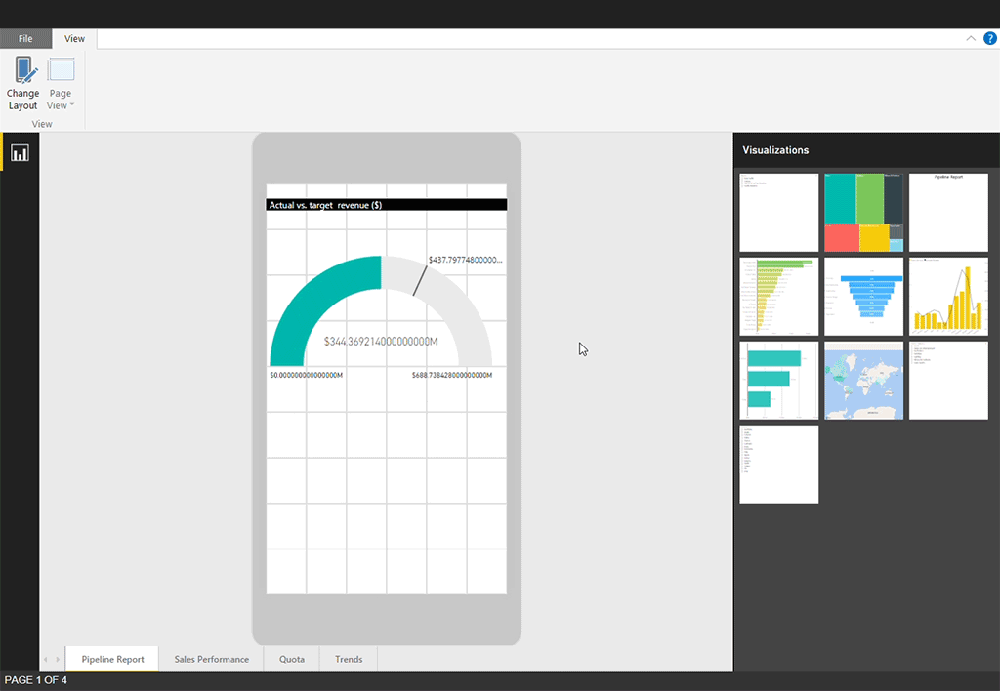

# Optimize Power BI reports for the mobile app
You can improve the experience of viewing reports in the mobile apps by creating a mobile-optimized version of the report. Power BI Desktop and the Power BI service provide a mobile layout view where you can choose, rearrange, and resize report visuals for an optimal experience on a mobile device.

.

The mobile layout view provides
* A phone emulator with a long canvas with a fine-grained grid. This makes it possible to include many visuals, and to scale and shape them finely. A fine-grained grid gives you more flexibility in resizing and placing visuals, and a longer canvas allows you to add more visuals to your page.
* A visualization pane that shows the name of each visual and its visibility status. Now, you can find your desired visual by looking for its name, and you can also easily differentiate between hidden and shown visuals.
* The ability to overlay visuals one on top of another. This lets you use the same design techniques used in the web layout for building interactive reports using bookmarks. You can also create attractive reports by layering visuals over images.

You can create responsive visuals and responsive slicers that resize anywhere. If you add filters to your report, they show up automatically in the optimized report.

## Lay out a portrait version of a report page

The first step is to create the report in the regular web view. After you've created the report, you can optimize it for phones and tablets.

To create the mobile-optimized view:

1. In **Report** view in Power BI Desktop, in the **View** ribbon, select **Mobile layout**.

   
 
   In the Power BI service, select **Edit report > Mobile Layout**.

   You see a blank canvas shaped like a phone. All of the visuals on the original report page are listed in the **Visualizations** pane on the right.

1. To add a visual to the mobile layout, drag it from the **Visualizations** pane to the phone canvas. When you drag the visual to the canvas, it snaps to the grid.
   
   Update visual
   
   
   You can add some or all the master report page visuals to the mobile-optimized report page. You can add each visual only once, and you don't have to include all the visuals.

1. You can resize your visuals on the grid by dragging the handles that appear around the edge of the visual when you select it. The phone report grid scales across phones of different sizes, so your report looks good on small- and large-screen phones.

## Optimize a visual for any size

By default, visuals in your report or dashboard are responsive. That is, they change dynamically to display the maximum amount of data and insight, no matter the screen size.

As a visual changes size, Power BI gives priority to the data. For example, it might remove padding and move the legend to the top of the visual automatically so that the visual remains informative even as it gets smaller.

 
If for some reason you want to turn responsiveness off, you can do that in the [format settings of the visual](). Read more about [optimizing visuals]().

## Enhance slicers to work well in mobile-optimized reports

Slicers offer on-canvas filtering of report data. When designing slicers in the regular report authoring mode, you can modify some slicer settings to make them more usable in mobile-optimized reports:
* You can decide whether to allow report readers to select only one item or multiple items.
* It is recommended to put a box around the slicer to make the report easier to scan.
* You can make the slicer vertical, horizontal, or responsive (responsive slicers must be horizontal).

If you make the slicer responsive, as you change its size and shape it shows more or fewer options. It can be tall, short, wide, or narrow. If you make it small enough, it becomes just a filter icon on the report page.

Create animated image

 
Read more about [creating responsive slicers]().

## Remove a visual from the mobile layout

To remove a visual from the mobile layout, click the X in the top-right corner of the visual on the phone canvas, or select the visual and press **Delete**.

You can remove all the visualizations from the canvas by clicking the eraser on the Visualization pane.

Removing visuals from the mobile layout canvas removes them from the canvas only. The visuals still appear in the visualization pane, and the original report remains unaffected.

## Considerations when creating phone report layouts
* For reports with multiple pages, you can optimize all the pages or just a few.
* If you've defined a background color for a report page, the mobile-optimized report will have the same background color.
* You can't modify format settings just for the mobile-optimized report. Formatting is consistent between the master and mobile layouts. For example, the font sizes will be the same.
* To change a visual, such as changing its formatting, dataset, filters, or any other attribute, return to the regular report authoring mode.

++++++++++++++++++++++++++++++++++++++++++++++++++++

You can improve the experience of viewing reports in the mobile apps by creating a portrait layout. In Power BI Desktop and the Power BI service, you rearrange and resize report visuals for an optimal experience in portrait mode.  

Looking for information about viewing reports on a mobile device instead? Try this quickstart [Explore dashboards and reports in the Power BI mobile apps](../consumer/mobile/mobile-apps-quickstart-view-dashboard-report.md).

You can create [responsive visuals](#optimize-a-visual-for-any-size) and [responsive slicers](#enhance-slicers-to-work-well-in-phone-reports) that resize anywhere. If you add filters to your report, they show up automatically in the optimized report.

## Lay out a portrait version of a report page

After you create a report, you can optimize it for phones and tablets.

1. In **Report** view in Power BI Desktop, on the **View** tab, select **Phone Layout**.  
   
    
   
    In the Power BI service, select **Edit report** > **Mobile Layout**.

    You see a blank canvas shaped like a phone. All of the visuals on the original report page are listed in the **Visualizations** pane on the right.

1. To add a visual to the phone layout, drag it from the **Visualizations** pane to the phone canvas.
   
    Phone reports use a grid layout. As you drag visuals to the mobile canvas, they snap to that grid.
   
    
   
    You can add some or all the master report page visuals to the phone report page. You can add each visual only once and you don't have to include all the visuals.

1. You can resize your visuals on the grid, as you would for tiles on dashboards and mobile dashboards.
   
   The phone report grid scales across phones of different sizes, so your report looks good on small- and large-screen phones.
   
   

## Optimize a visual for any size
You can set the visuals in your dashboard or report to be *responsive*. Visuals change dynamically to display the maximum amount of data and insight, no matter the screen size. 

As a visual changes size, Power BI prioritizes the data view. For example, it can remove padding and move the legend to the top of the visual automatically, so the visual remains informative even as it gets smaller.

You choose whether to turn on responsiveness for each visual. Read more about [optimizing visuals](../visuals/power-bi-report-visualizations.md).

## Considerations when creating phone report layouts
* For reports with multiple pages, you can optimize all the pages or only a few. 
* If you've defined a background color for a report page, the phone report will have the same background color.
* You can’t modify formatting settings for just the phone. Formatting is consistent between master and mobile layouts. For example, font sizes will be the same.
* To change a visual, such as changing its formatting, dataset, filters, or any other attribute, return to the regular report authoring mode.
* Power BI provides default titles and page names for phone reports in the mobile app. If you’ve created text visuals for titles and page names in your report, consider not adding them to your phone reports.     

## Remove a visual from the phone layout
* To remove a visual, select the **X** in the top-right of the visual on the phone canvas, or select it and press **Delete**.
  
   Removing the visual here removes it only from the phone layout canvas. The visual and the original report aren't affected.
  
   

## Enhance slicers to work well in phone reports
Slicers offer on-canvas filtering of report data. When designing slicers in the regular report authoring mode, you can modify some slicer settings to make them more usable in phone reports:

* Decide if report readers can select only one item or multiple items.
* Put a box around the slicer to make the report easier to scan.
* Make the slicer vertical, horizontal, or *responsive*. 

If you make the slicer responsive, as you change its size and shape it shows more or fewer options. It can be tall, short, wide, or narrow. If you make it small enough, it becomes just a filter icon on the report page. 

Read more about [creating responsive slicers](power-bi-slicer-filter-responsive.md).

## Publish a phone report
To publish the phone version of a report, you [publish the main report from Power BI Desktop to the Power BI service](desktop-upload-desktop-files.md), and the phone version publishes at the same time.
  
Read more about [sharing and permissions in Power BI](../collaborate-share/service-how-to-collaborate-distribute-dashboards-reports.md).

## View optimized and unoptimized reports on a phone or tablet
In the mobile apps on phones, Power BI automatically detects optimized and unoptimized phone reports. If a phone-optimized report exists, the Power BI phone app automatically opens the report in phone report mode.

If a phone-optimized report doesn’t exist, the report opens in the unoptimized, landscape view.  

When in a phone report, changing the phone’s orientation to landscape opens the report in the unoptimized view with the original report layout, whether the report is optimized or not.

If you optimize only some pages, readers see a message in portrait view, indicating the report is available in landscape.

Report readers can turn their phones or tablets sideways to see the page in landscape mode. Read more about [interacting with Power BI reports optimized for portrait mode](../consumer/mobile/mobile-apps-view-phone-report.md).

## Next steps
* [Create a phone view of a dashboard in Power BI](service-create-dashboard-mobile-phone-view.md).
* [View Power BI reports optimized for your phone](../consumer/mobile/mobile-apps-view-phone-report.md).
* [Create responsive visuals optimized for any size](../visuals/power-bi-report-visualizations.md).
* More questions? [Try asking the Power BI Community](https://community.powerbi.com/).
