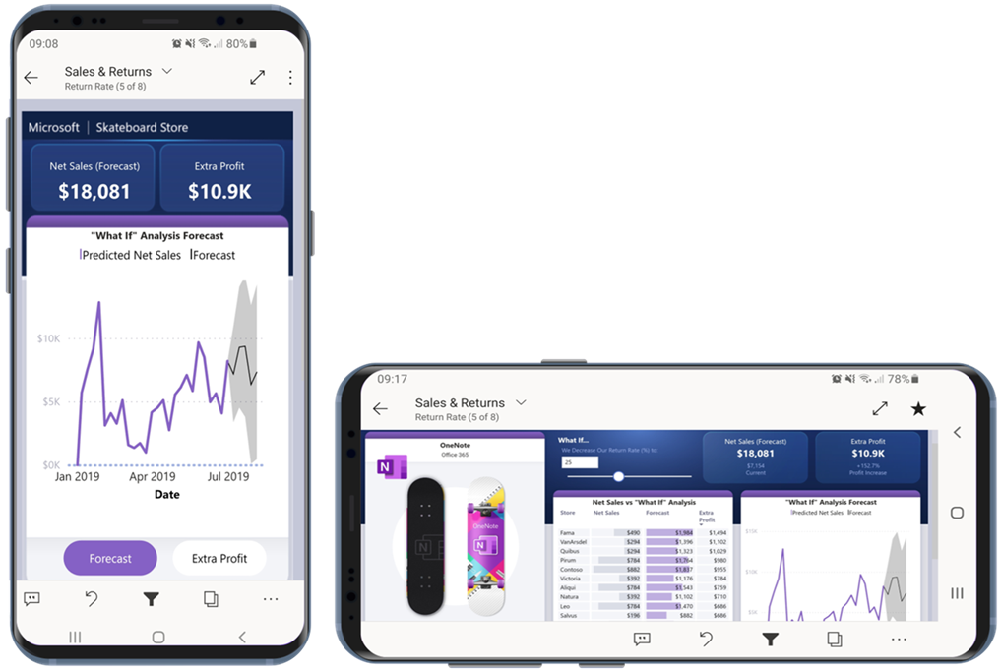

# Optimize Power BI reports for the mobile app
You can improve the experience of viewing reports in the mobile apps by creating mobile-optimized versions of your reports. In Power BI Desktop and the Power BI service, you use **Mobile layout** view to rearrange and resize report visuals for an optimal experience in portrait mode.

.

Power BI provides a number of features to help you create mobile-optimized versions of your reports:
* A mobile layout view where you can create your mobile-optimized report by dragging and dropping visuals onto a phone emulator canvas. This view supports overlaying visuals one on top of the other.
* Visuals and slicers that can be optimized for use on small, mobile screens.

These capabilities make it possible to use the same design techniques used in the web layout for building interactive reports using bookmarks. You can also create attractive reports by layering visuals over images.

## Create a mobile-optimized portrait version of a report page

The first step is to design and create the report in the regular web view. After you've created the report, you can optimize it for phones and tablets.

To create the mobile-optimized view, open the mobile layout view:
   * In Power BI Desktop, select the **View** ribbon and choose **Mobile layout**.
   * In the Power BI service, select **Edit report > Mobile Layout**.

   You see a scrollable, fine-grained canvas shaped like a phone, and a **Visualizations** pane that lists all of the visuals that are on the original report page.

   .

* Each visual in the **Visualizations** pane appears with its name for easy identification.
* Each visual also has a visibility indicator. The visibility indicator is useful when you work with bookmarks and switch back and forth between the Page and Mobile layout views. The visibility indicator of a visual changes depending on the visibility status of the visual in the bookmark you select in Page view.

## Add visuals to the mobile layout canvas
To add a visual to the mobile layout, drag it from the **Visualizations** pane to the phone canvas. When you drag the visual to the canvas, it snaps to the grid. Alternatively, you can double click the visual in the visualization pane and the visual will be added to the canvas.

   
   
   You can add some or all the master report page visuals to the mobile-optimized report page. You can add each visual only once, and you don't have to include all the visuals.

   You can overlay visuals one on top of another. This enables you to use the same design techniques used in the web layout for building interactive reports using bookmarks. You can also create attractive reports by layering visuals over images.

## Resize visuals
You can resize your visuals on the grid by dragging the handles that appear around the edge of the visual when you select it. 

To maintain the visual's aspect ratio while resizing, press the **Shift** key while dragging the resize handels.

   

The phone report grid scales across phones of different sizes, so your report looks good on small- and large-screen phones.

## Remove visuals from the mobile layout canvas
To remove a visual from the mobile layout, click the **X** in the top-right corner of the visual on the phone canvas, or select the visual and press **Delete**.

You can remove all the visualizations from the canvas by clicking the eraser on the **Visualization** pane.

Removing visuals from the mobile layout canvas removes them from the canvas only. The visuals still appear in the visualization pane, and the original report remains unaffected.

## Configure visuals and slicers for use in mobile-optimized reports

### Visuals

By default, many visuals, particularly chart-type visuals, are responsive.  That means they change dynamically to display the maximum amount of data and insight, no matter the screen size.

As a visual changes size, Power BI gives priority to the data. For example, it might remove padding and move the legend to the top of the visual automatically so that the visual remains informative even as it gets smaller.

 
If for some reason you want to turn responsiveness off, you can do that in the [format settings of the visual]().

### Slicers

Slicers offer on-canvas filtering of report data. When designing slicers in the regular report authoring mode, you can modify some slicer settings to make them more usable in mobile-optimized reports:
* You can decide whether to allow report readers to select only one item or multiple items.
* You can make the slicer vertical, horizontal, or responsive (responsive slicers must be horizontal).
* It is recommended to put a box around the slicer to make the report easier to scan.

If you make the slicer responsive, as you change its size and shape it shows more or fewer options. It can be tall, short, wide, or narrow. If you make it small enough, it becomes just a filter icon on the report page.

 
Read more about [creating responsive slicers](power-bi-slicer-filter-responsive.md).

## Considerations when creating mobile-optimized layouts
* For reports with multiple pages, you can optimize all the pages or just a few.
* If you've defined a background color for a report page, the mobile-optimized report will have the same background color.
* You can't modify format settings just for the mobile-optimized report. Formatting is consistent between the master and mobile layouts. For example, the font sizes will be the same.
* To change a visual, such as changing its formatting, dataset, filters, or any other attribute, return to the regular report authoring mode.

## Publish a mobile-optimized report
To publish a mobile-optimized version of a report, [publish the main report from Power BI Desktop to the Power BI service](desktop-upload-desktop-files.md). This publishes the mobile-optimized version at the same time.

## Viewing optimized and unoptimized reports on a phone or tablet

In the Power BI mobile apps, mobile-optimized reports are indicated by a special icon.

On phones, the app automatically detects whether the report is mobile-optimized or not.
* If a mobile-optimized report exists, the app automatically opens the report in mobile-optimized mode.
* If a mobile-optimized report doesn’t exist, the report opens in the unoptimized, landscape view.

Holding a phone in landscape orientation opens the report in the unoptimized view with the original report layout, regardless of whether the report is optimized or not.

If you optimize only some pages, when readers come to an unoptimized page they will be prompted to switch to landscape view. Turning the phone or tablet sideways will enable them to see the page in landscape mode. [Read more about interacting with Power BI reports optimized for portrait mode](../consumer/mobile/mobile-apps-view-phone-report.md).

## Next steps
* [Create a phone view of a dashboard in Power BI](service-create-dashboard-mobile-phone-view.md).
* [View Power BI reports optimized for your phone](../consumer/mobile/mobile-apps-view-phone-report.md).
* [Create responsive visuals optimized for any size](../visuals/power-bi-report-visualizations.md).
* More questions? [Try asking the Power BI Community](https://community.powerbi.com/).