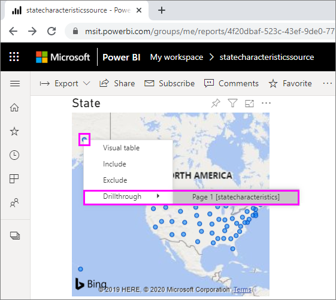
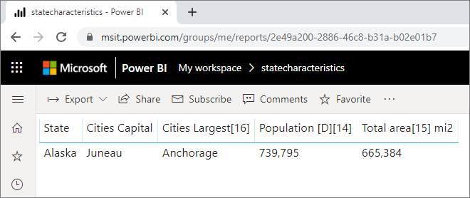
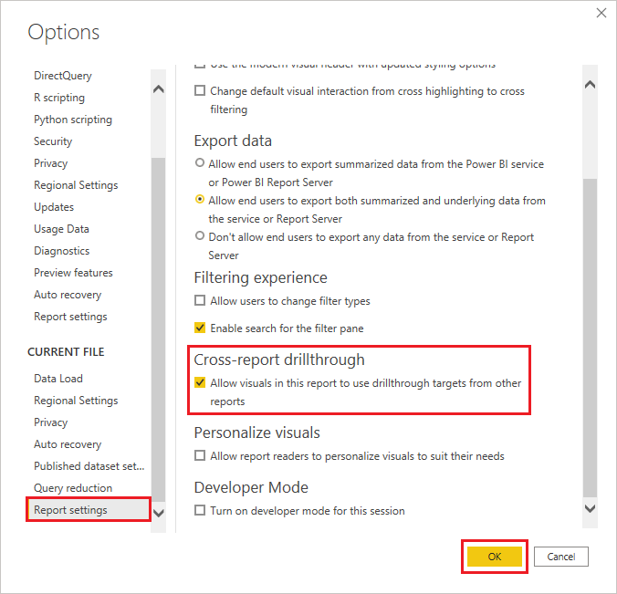
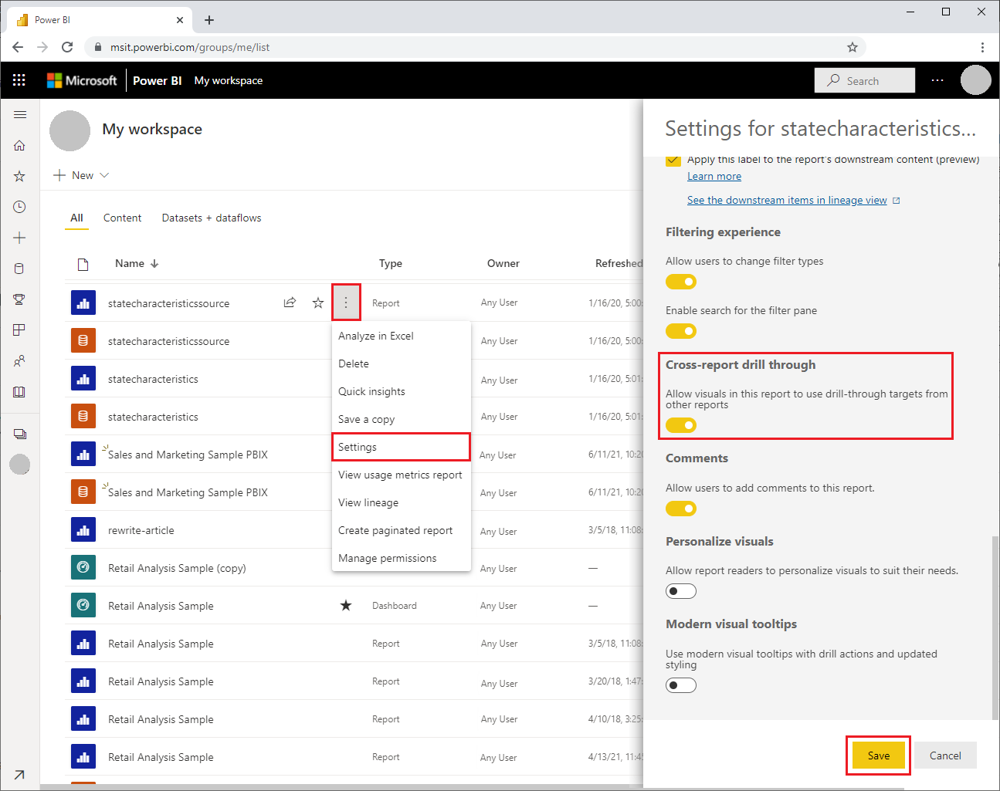
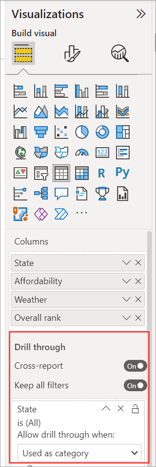

# Use cross-report drillthrough in Power BI

[!INCLUDE [applies-yes-desktop-yes-service](../includes/applies-yes-desktop-yes-service.md)]

With the Power BI *cross-report drillthrough* feature, you can contextually jump from one report to another report in the same Power BI service workspace or app. You can use cross-report drillthrough to connect two or more reports that have related content, and to pass filter context along with the cross-report connection. 

To initiate cross-report drillthrough, you select a data point in a *source visual* of a *source report*, and then select the cross-report **Drillthrough** target from the context menu. 

The drillthrough action opens the *target page* in the *target report*. 

This article shows you how to set up and use cross-report drillthrough for Power BI reports.

> [!NOTE]
> You can't use cross-report drillthrough with individually shared [Shared with me reports](../collaborate-share/service-share-dashboards.md#share-a-report-via-link). To use cross-report drillthrough, you must access reports in workspaces that you’re a member of.

## Enable cross-report drillthrough

The first step in enabling cross-report drillthrough is to validate the data models for the source and target reports. Although the schemas in each report don't have to be the same, the fields you want to pass must exist in both data models. The names of the fields, and the names of the tables they belong to, must be identical. The strings must match, and are case-sensitive.

For example, if you want to pass a filter on a field **State** within a table **US States**, both models must have a **US States** table, and a **State** field within that table. If not, you must update the field name or table name in the underlying model. Simply updating the display name of the fields won't work properly for cross-report drillthrough.

After you validate your models, enable the source report to use cross-report drillthrough. 

### Step 1: In Power BI Desktop
 
1. Go to **File** > **Options and settings** > **Options**. 
1. In the **Options** window left navigation, at the bottom of the **Current file** section, select **Report settings**. 
1. At bottom right, under **Cross-report drillthrough**, select **Allow visuals in this report to use drillthrough targets from other reports**. 
1. Select **OK**. 
   
   

### Step 2: In the Power BI service

1. Select the workspace that contains your target and source reports.
1. Next to the source report name in the workspace list, select the **More options** symbol, and then select **Settings**. 
1. Near the bottom of the **Settings** pane, under **Cross-report drillthrough**, select **Allow visuals in this report to use drill-through targets from other reports**, and then select **Save**.
   
   

## Set up a cross-report drillthrough target

Setting up a target page for cross-report drillthrough is similar to setting up drillthrough within a report. Enabling drillthrough on the target page allows other visuals to target the page for drillthrough. To create drillthrough within a single report, see [Use drillthrough in Power BI Desktop](desktop-drillthrough.md).

You can set up a target for cross-report drillthrough in Power BI Desktop or Power BI service. 
1. Edit the target file, and on the target page of the target report, select the **Fields** section of the **Visualizations** pane. 
1. Under **Drillthrough**, set the **Cross-report** toggle to **On**. 
1. Drag the fields you want to use as drillthrough targets into **Add drill-through fields here**. For each field, select whether you want to allow drillthrough when the field is used as a category, or when it's summarized like a measure. 
1. Select whether you want to **Keep all filters** for the visual. If you don't want to pass filters applied to the source visual to your target visual, select **Off**.
   
   
   
1. If you're using the page for cross-report drillthrough only, delete the **Back** button that's automatically added to the canvas. The **Back** button only works for navigation within a report. 
1. After you configure the target page, save the report if you're using the Power BI service, or save and publish the report if you're using Power BI Desktop.

That's it. Your reports are ready for cross-report drillthrough. 

## Use cross-report drillthrough

To use cross-report drillthrough, select the source report in the Power BI service, and then select a visual that uses the drillthrough field in the way you specified when you set up the target page. Right-click a data point to open the visual context menu, select **Drillthrough**, and then select the drillthrough target. Cross-report drillthrough targets are formatted as **Page name [Report name]**.

You see the results in the target cross-report drillthrough page, just as you set them up when you created the target. The results are filtered according to the drillthrough settings.

> [!IMPORTANT]
> Power BI caches cross-report drillthrough targets. If you make changes, be sure to refresh your browser if you don't see the drillthrough targets as expected. 

If you set **Keep all filters** to **On** when you set up the target page, filter context from the source visual can include the following: 

- Report, page, and visual level filters that affect the source visual 
- Cross-filter and cross-highlighting that affect the source visual 
- Slicers and sync-slicers on the page
- URL parameters

When you land on the target report for drillthrough, Power BI only applies filters for fields that have exact string matches for field name and table name. 

Power BI doesn't apply sticky filters from the target report, but it does apply your default personal bookmark if you have one. For example, if your default personal bookmark includes a report-level filter for *Country/Region = US*, Power BI applies that filter before applying the filter context from the source visual. 

For cross-report drillthrough, Power BI passes the filter context to all standard pages in the target report. Power BI doesn't pass filter context for tooltip pages, because tooltip pages are filtered based on the source visual that invokes the tooltip.

If you want to return to the source report after the cross-report drillthrough action, use the browser's **Back** button. 

## Considerations and limitations

Cross-report drillthrough doesn't work in Power BI reports in Power BI Report Server.

## Related content

You might also be interested in the following articles:

- [Slicers in Power BI](../visuals/power-bi-visualization-slicers.md)
- [Use drillthrough in Power BI Desktop](desktop-drillthrough.md)
