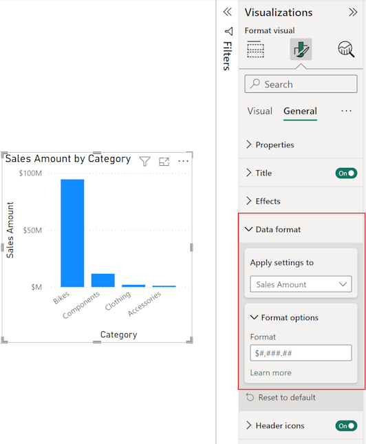

# Use custom format strings in Power BI Desktop

[!INCLUDE [applies-yes-desktop-no-service](../includes/applies-yes-desktop-no-service.md)]

With custom format strings in **Power BI Desktop**, you can customize how fields appear in visuals and make sure your reports look just the way you want them to.

Format strings exist on three levels:

-	**Model**. You can set a format string for fields in the model or use a [dynamic format string](../create-reports/desktop-dynamic-format-strings.md) to format your measure. Anywhere you use that field the format string is applied, unless overridden by a visual or element level format string. 
-	**Visual**. You can set format strings on any column, measure, or visual calculation that is on your visual, even if they already had a format string. In that case the model level format string is overridden, and the visual level format string is used. If you change the aggregation on a field, which invalidates a previously set visual level format string, the format string is removed. Visual level format strings for fields are persisted for fields, but not for visual calculations. If you set a visual level format string on a field and then remove and readd that field to the same visual, the visual level format string is reinstated. In contrast, for a visual calculation, the format string isn't reinstated. 
-	**Element**. You can set a format string for data labels and for specific elements of the new card and the new slicer visuals. This level will be expanded to include more in the future. Any format string you set here overrides the format string set on the visual and model level.

These levels are hierarchical, with the model level being the lowest level and the element level the highest. A format string defined on a column, measure, or visual calculation on a higher level overrides what was defined on a lower level. 

Since visual calculations aren't in the model, they can't have a format string set on the model level but can on the visual, or element level. Measures and columns can have format strings on all three levels:

| **Level** | **Impacts** | **Available for**|
| --- | --- | --- |
| Element | Selected element of the selected visual | Measures, Columns, Visual Calculations |
| Visual | Selected visual | Measures, Columns, Visual Calculations |
| Model | All visuals, all pages, all reports on the same model | Measures, Columns |

:::image type="diagram" source="media/desktop-custom-format-strings/custom-format-strings-levels.png" alt-text="Diagram showing the three levels of format strings available (model, visual, element). It shows that visual calculations can only have visual and element level format strings, while measures and columns can have format strings on all levels." lightbox="media/desktop-custom-format-strings/custom-format-strings-levels-larger.png":::

The element level format string is only available to specific visuals and data labels at this time.

## How to use custom format strings

To use custom format strings, you first need to decide which level you're going to work on: Model, Visual or Element.

### Add a model level format string
To create custom format strings in the model, select the field in the **Modeling** view, and then select the dropdown arrow under **Format** in the **Properties** pane.

Once you've selected **Custom** from the **Format** dropdown menu, choose from a list of commonly used format strings.

### Add a visual level format string
To create a visual level format string, first add the field or [visual calculation](../transform-model/desktop-visual-calculations-overview.md) to your visual. Then, with your visual selected, open the format pane and go to the **General** section of the format pane. Find the **Format data** settings and configure the format string there:

> [!NOTE]
> For now, you will need to enter a [.NET format string](/dotnet/standard/base-types/formatting-types#format-strings-and-net-types) instead of a [VBA format string](#supported-custom-format-syntax). This is a temporary issue that will be resolved in a future release.

### Add an element level format string
To create an element level format string, open the format pane and find the format string sections for the element you want to set the format on. Keep in mind that not all elements support format strings. To set a format string on a data label, open the **Visual** section of the format pane, set **Data Labels** > **Value** > **Display units** to custom and enter the format code:

## Supported custom format syntax

Custom format strings follow the VBA style syntax, common to Excel and other Microsoft products, but they don't support all syntax used in other products.

> [!NOTE]
> For now, visual level format strings require you to enter a [.NET format string](/dotnet/standard/base-types/formatting-types#format-strings-and-net-types) instead. This is a temporary issue that will be resolved in a future release.

The following tables define the syntax supported in Power BI.

### Supported Date symbols

| **Symbol** | **Range** |
| --- | --- |
| _d_ | 1-31 (Day of month, with no leading zero) |
| _dd_ | 01-31 (Day of month, with a leading zero) |
| _m_ | 1-12 (Month of year, with no leading zero, starting with January = 1) |
| _mm_ | 01-12 (Month of year, with a leading zero, starting with January = 01) |
| _mmm_ | Displays abbreviated month names (Hijri month names have no abbreviations) |
| _mmmm_ | Displays full month names |
| _yy_ | 00-99 (Last two digits of year) |
| _yyyy_ | 100-9999 (Three- or four-digit year) |

### Supported Time symbols

| **Symbol** | **Range** |
| --- | --- |
| _h_ | 0-23 (1-12 with "AM" or "PM" appended) (Hour of day, with no leading zero) |
| _hh_ | 00-23 (01-12 with "AM" or "PM" appended) (Hour of day, with a leading zero) |
| _n_ | 0-59 (Minute of hour, with no leading zero) |
| _nn_ | 00-59 (Minute of hour, with a leading zero) |
| _m_ | 0-59 (Minute of hour, with no leading zero). Only if preceded by _h_ or _hh_ |
| _mm_ | 00-59 (Minute of hour, with a leading zero). Only if preceded by _h_ or _hh_ |
| _s_ | 0-59 (Second of minute, with no leading zero) |
| _ss_ | 00-59 (Second of minute, with a leading zero) |

You can see an [example](/office/vba/language/reference/user-interface-help/format-function-visual-basic-for-applications#example) of how to format custom value strings.

A user-defined format expression for numbers can have one to three sections separated by semicolons. If you include semicolons with nothing between them, the missing section won't display (it will be ""). If you don't specify the semicolon, it uses the positive format.

Here are examples of different formats for different value strings:

|Values   | Format String | Format String  | Format String  | Format String  |
| --- | --- | --- | --- | --- |
| |**0.00;-0.0;"Zero"** | **0.00;;** | **0.00;-0.0;** | **0.00;** |
| **-1.234** | -1.2 | "" | -1.2 | "" |
| **0** | "Zero" | "" | "" | 0.00 |
| **1.234** | 1.23 | 1.23 | 1.23 | 1.23 |

The following table identifies the predefined **named date and time formats**:

| **Format name** | **Description** |
| --- | --- |
| **General Date** | Display a date and time, for example, 4/3/93 05:34 PM. If there's no fractional part, display only a date, for example, 4/3/93. If there's no integer part, display time only, for example, 05:34 PM. Date display is determined by your system settings. |
| **Long Date** | Display a date according to your system's long date format. |
| **Short Date** | Display a date using your system's short date format. |
| **Long Time** | Display a time using your system's long time format; includes hours, minutes, seconds. |
| **Short Time** | Display a time using the 24-hour format, for example, 17:45. |

Named numeric formats

The following table identifies the predefined **named numeric formats**:

| **Format name** | **Description** |
| --- | --- |
| **General Number** | Display number with no thousand separator. |
| **Currency** | Display number with a thousand separator. Display two digits to the right of the decimal separator. Output is based on system locale settings. |
| **Fixed** | Display at least one digit to the left and two digits to the right of the decimal separator. |
| **Standard** | Display number with thousand separator, at least one digit to the left and two digits to the right of the decimal separator. |
| **Percent** | Display number multiplied by 100 with a percent sign ( **%** ) appended to the right. Always display two digits to the right of the decimal separator. |
| **Scientific** | Use standard scientific notation. |

The following table identifies characters you can use to create **user-defined date/time formats**.

| **Character** | **Description** |
| --- | --- |
| ( **:** ) | Time separator. In some locales, other characters might be used to represent the time separator. The time separator separates hours, minutes, and seconds when time values are formatted. The actual character used as the time separator in formatted output is determined by your system settings. |
| ( **/** ) | Date separator. In some locales, other characters might be used to represent the date separator. The date separator separates the day, month, and year when date values are formatted. The actual character used as the date separator in formatted output is determined by your system settings. |
| d | Display the day as a number without a leading zero (1–31). |
| dd | Display the day as a number with a leading zero (01–31). |
| ddd | Display the day as an abbreviation (Sun–Sat). Localized. |
| dddd | Display the day as a full name (Sunday–Saturday). Localized. |
| m | Display the month as a number without a leading zero (1–12). If m immediately follows h or hh, the minute rather than the month is displayed. |
| mm | Display the month as a number with a leading zero (01–12). If m immediately follows h or hh, the minute rather than the month is displayed. |
| mmm | Display the month as an abbreviation (Jan–Dec). Localized. |
| mmmm | Display the month as a full month name (January–December). Localized. |
| yy | Display the year as a two-digit number (00–99). |
| yyyy | Display the year as a four-digit number (100–9999). |
| h | Display the hour as a number without a leading zero (0–23). |
| hh | Display the hour as a number with a leading zero (00–23). |
| n | Display the minute as a number without a leading zero (0–59). |
| nn | Display the minute as a number with a leading zero (00–59). |
| s | Display the second as a number without a leading zero (0–59). |
| ss | Display the second as a number with a leading zero (00–59). |
| tt | Use the 12-hour clock and display an uppercase AM with any hour before noon; display an uppercase PM with any hour between noon and 11:59 P.M. |

The following table identifies characters you can use to create **user-defined number formats**.

| **Character** | **Description** |
| --- | --- |
| None | Display the number with no formatting. |
| ( **0** ) | Digit placeholder. Display a digit or a zero. If the expression has a digit in the position where the 0 appears in the format string, display it. Otherwise, display a zero in that position. If the number has fewer digits than there are zeros (on either side of the decimal) in the format expression, display leading or trailing zeros. If the number has more digits to the right of the decimal separator than there are zeros to the right, round the number to as many decimal places as there are zeros. If the number has more digits to the left of the decimal separator than there are zeros to the left, display the extra digits without modification. |
| ( **#** ) | Digit placeholder. Display a digit or nothing. If the expression has a digit in the position where the # appears in the format string, display it; otherwise, display nothing in that position. This symbol works like the zero-digit placeholder, except that leading and trailing zeros aren't displayed if the number has the same or fewer digits than there are # characters on either side of the decimal separator in the format expression. |
| ( **.** ) | Decimal placeholder. In some locales, a comma is used as the decimal separator. The decimal placeholder determines how many digits are displayed to the left and right of the decimal separator. If the format expression contains only number signs to the left of this symbol, numbers smaller than 1 begin with a decimal separator. To display a leading zero displayed with fractional numbers, use 0 as the first-digit placeholder to the left of the decimal separator. The actual character used as a decimal placeholder in the formatted output depends on the Number Format recognized by your system. |
| (**%)** | Percentage placeholder. The expression is multiplied by 100. The percent character ( **%** ) is inserted in the position where it appears in the format string. |
| ( **,** ) | Thousand separators. In some locales, a period is used as a thousand separator. The thousand separator separates thousands from hundreds within a number that has four or more places to the left of the decimal separator. Standard use of the thousand separator is specified if the format contains a thousand separator surrounded by digit placeholders ( **0**  or  **#** ). Two adjacent thousand separators or a thousand separator immediately to the left of the decimal separator (whether or not a decimal is specified) means "scale the number by dividing it by 1000, rounding as needed." For example, you can use the format string "##0,," to represent 100 million as 100. Numbers smaller than 1 million are displayed as 0. Two adjacent thousand separators in any position other than immediately to the left of the decimal separator are treated simply as specifying the use of a thousand separator. The actual character used as the thousand separator in the formatted output depends on the Number Format recognized by your system. |
| ( **:** ) | Time separator. In some locales, other characters might be used to represent the time separator. The time separator separates hours, minutes, and seconds when time values are formatted. The actual character used as the time separator in formatted output is determined by your system settings. |
| ( **/** ) | Date separator. In some locales, other characters might be used to represent the date separator. The date separator separates the day, month, and year when date values are formatted. The actual character used as the date separator in formatted output is determined by your system settings. |
| ( **E- E+ e- e+** ) | Scientific format. If the format expression contains at least one digit placeholder ( **0**  or  **#** ) to the right of E-, E+, e-, or e+, the number is displayed in scientific format and E or e is inserted between the number and its exponent. The number of digit placeholders to the right determines the number of digits in the exponent. Use E- or e- to place a minus sign next to negative exponents. Use E+ or e+ to place a minus sign next to negative exponents and a plus sign next to positive exponents. |
| **- + $**  ( ) | Display a literal character. To display a different character, precede it with a backslash (\\) or enclose it in double quotation marks (" "). |
| ( **\\** ) | Display the next character in the format string. To display a character that has special meaning as a literal character, precede it with a backslash (\\). The backslash itself isn't displayed. Using a backslash is the same as enclosing the next character in double quotation marks. To display a backslash, use two backslashes (\\\\). Date-formatting and time-formatting characters (a, c, d, h, m, n, p, q, s, t, w, /, and :) can't be displayed as literal characters, the numeric-formatting characters (#, 0, %, E, e, comma, and period), and the string-formatting characters (@, &, <, >, and !). |
| ("ABC") | Display the string inside the double quotation marks (" "). |

## Considerations and limitations

- You can't set a custom format string for fields that are of type string or boolean.

## Related content

For more information, see:

* [VBA format strings](/office/vba/language/reference/user-interface-help/format-function-visual-basic-for-applications#example)
* [Measures in Power BI Desktop](../transform-model/desktop-measures.md)
* [Data types in Power BI Desktop](../connect-data/desktop-data-types.md)
* [Conditional formatting in tables](desktop-conditional-table-formatting.md)
