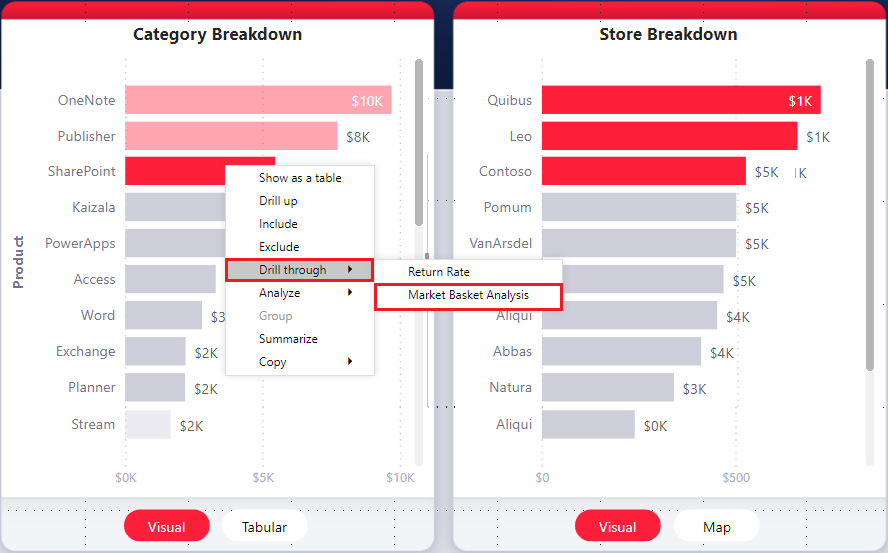
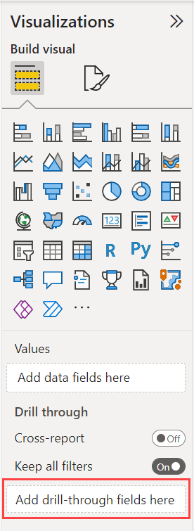
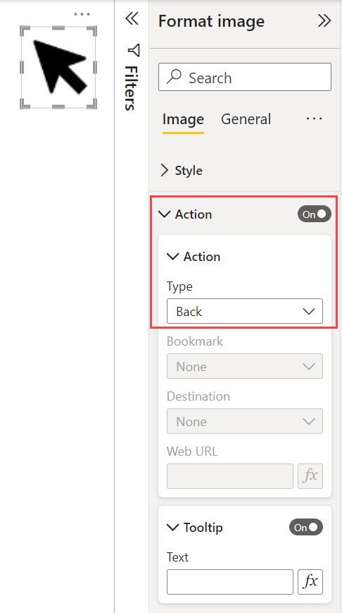
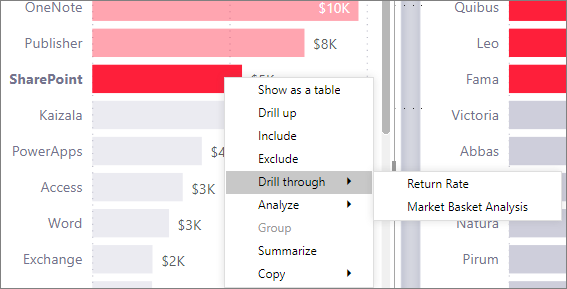
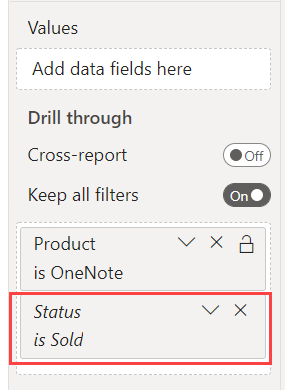

# Set up drillthrough in Power BI reports

[!INCLUDE [applies-yes-desktop-yes-service](../includes/applies-yes-desktop-yes-service.md)]

With *drillthrough* in Power BI reports, you can create a destination *target* page in your report that focuses on a specific entity such as a supplier, customer, or manufacturer. When your report readers right-click a data point in other *source* report pages, they drill through to the target page to get details that are filtered to that context. You can set up drillthrough in your reports in Power BI Desktop or the Power BI service.

Want to investigate this report yourself? Open this [GitHub repo for Power BI Desktop samples](https://github.com/microsoft/powerbi-desktop-samples/blob/main/Sample%20Reports/Sales%20%26%20Returns%20Sample%20v201912.pbix). Then select **Download** to download the Sales & Returns Sample .pbix file to your computer. This visual is on the Returns page of the report.

Here are some articles explaining other ways to use drillthrough.

- [Create a button that drills through](desktop-drill-through-buttons.md) to details when they click it.
- [Set up cross-report drillthrough](desktop-cross-report-drill-through.md) to jump from one report to another in the same Power BI service workspace or app.

## Set up the drillthrough target page

1. To set up drillthrough, create a *target report page* that has the visuals you want for the type of entity that you're going to provide drillthrough for.

    For example, suppose you want to provide drillthrough for manufacturers. You might create a drillthrough target page with visuals that show total sales, total units shipped, sales by category, and so on. That way, when you drill through to that page, the visuals are specific to the manufacturer you selected.

2. On the **Visualizations** pane for that drillthrough target page, select **Build visual**. Then, under **Drill through**:

    - Set **Keep all filters** to **On**.
    - In **Add drill-through fields here**, add the field that you want by dragging it from the Data pane.
    - In the expanded section for the added field, under **Allow drillthrough when:**, select **Used as category**.

    

When you add a field to the **Drill through** well, Power BI automatically creates a *back* button visual. That visual becomes a button in published reports. Users who view your report in the Power BI service use this button on the target page to get back to the original source report page from which they came.

## Use your own image for a back button

 Because the back button is an image, you can replace that image with any image you want. It still operates as a back button so that report consumers can go back to the original source page. You can only add your own images in Power BI Desktop, not in the Power BI service.

To use your own image for a back button, follow these steps:

1. In Power BI Desktop, on the **Insert** tab, select **Image**. Then, locate your image and place it on the drillthrough target page.

2. Select your new image on the drillthrough target page. Under the **Format image** pane, set the **Action** slider to **On**, and  then set the **Type** to **Back**. Your image now functions as a back button.

    

Now users can right-click a data point on the other source pages in your report and get a context menu that supports drillthrough to that target page.

When report readers choose to drill through, the target page is filtered to show information about the data point they right-clicked on. For example, suppose you right-click a data point about Contoso, a manufacturer, and select **Drill through**. The drillthrough page they go to is filtered to Contoso.

## Pass all filters in drillthrough

You can set up drillthrough to pass all applied filters to the drillthrough target page. For example, you can select only a certain category of products and the visuals filtered to that category, and then select drillthrough on a source. You might be interested in what the drillthrough target page would look like with all those filters applied.

To keep all applied filters, go to the destination page. In the **Visualizations** pane, select **Build visual**. Then, under **Drill through**, set **Keep all filters** to **On**.

When you then drill through on a visual on a source page, the temporary filters that you applied to the source visual are also applied to the drillthrough target page. On the **Filters** pane of the published report, those transient filters are shown in italics.

Although you could do this with tooltips pages, that would be an odd experience because the tooltip wouldn't appear to be working properly. For this reason, we don't recommend doing so with tooltips.

## Add a measure to drillthrough

Besides passing all filters to the drillthrough target page, you can also add a measure or a summarized numeric column to the drillthrough area. On the drillthrough target page, drag the drillthrough field to the **Drill through** well in the **Visualizations** pane's **Build visual** tab to apply it.

When you add a measure or summarized numeric column, you can drill through to the page when the field is used in the *Values* area of a visual.

That's all there is to setting up drillthrough in your reports. It's a great way to get an expanded view of the entity information that you selected for your drillthrough filter.

## Related content

You might also be interested in the following articles:

- [Use cross-report drillthrough in Power BI reports](desktop-cross-report-drill-through.md)
- [Using slicers Power BI Desktop](../visuals/power-bi-visualization-slicers.md)
