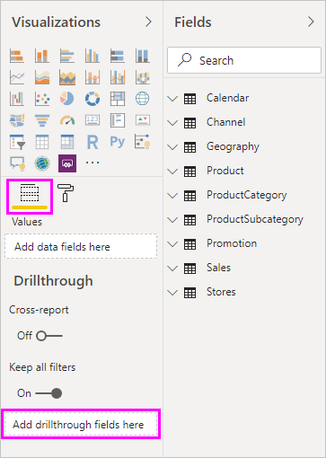
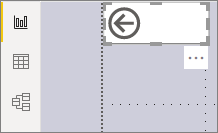
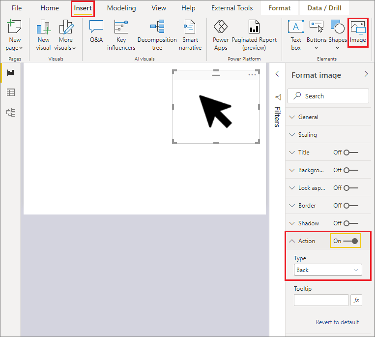
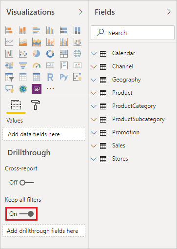
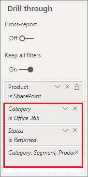

# Set up drillthrough in Power BI reports

[!INCLUDE [applies-yes-desktop-yes-service](../includes/applies-yes-desktop-yes-service.md)]

With *drillthrough* in Power BI reports, you can create a page in your report that focuses on a specific entity such as a supplier, customer, or manufacturer. When your report readers use drillthrough, they right-click a data point in other report pages, and drill through to the focused page to get details that are filtered to that context. You can also [create a button that drills through](desktop-drill-through-buttons.md) to details when they click it.

You can set up drillthrough in your reports in Power BI Desktop or the Power BI service.

## Set up the drillthrough destination page
1. To set up drillthrough, create a report page that has the visuals you want for the type of entity that you're going to provide drillthrough for. 

    For example, suppose you want to provide drillthrough for manufacturers. For this case, you might create a drillthrough page with visuals that show total sales, total units shipped, sales by category, sales by region, and so on. That way, when you drill through to that page, the visuals are specific to the manufacturer you selected.

2. Then, on that drillthrough page, in the **Fields** section of the **Visualizations** pane, drag the field for which you want to enable drillthrough into the **Drillthrough filters** well.

    

    When you add a field to the **Drillthrough filters** well, Power BI automatically creates a *back* button visual. That visual becomes a button in published reports. Users who consume your report in the Power BI service use this button to get back to the report page from which they came.

    

> [!IMPORTANT]
> You can configure and perform drillthrough to a page in the same report, however, you can't drill through to a page in a different report.  

## Use your own image for a back button    
 Because the back button is an image, you can replace the image of that visual with any image you want. It still operates as a back button so that report consumers can go back to their original page. 

To use your own image for a back button, follow these steps:

1. On the **Insert** tab, select **Image**. Then, locate your image and place it on the drillthrough page.

2. Select your new image on the drillthrough page. Under the **Format image** pane, set the **Action** slider to **On**, and  then set the **Type** to **Back**. Your image now functions as a back button.

    

    
     Now users can right-click a data point in your report and get a context menu that supports drillthrough to that page. 

    

    When report consumers choose to drill through, the page is filtered to show information about the data point on which they right-clicked. For example, suppose they right-clicked on a data point about Contoso, a manufacturer, and selected to drill through. The drillthrough page they go to is filtered to Contoso.

## Pass all filters in drillthrough

You can pass all applied filters to the drillthrough window. For example, you can select only a certain category of products and the visuals filtered to that category, and then select drillthrough. You might be interested in what that drillthrough would look like with all those filters applied.

To keep all applied filters, in the **Drillthrough** section of the **Visualizations** pane, set **Keep all filters** to **On**. 

When you then drill through on a visual, you can see which filters were applied as a result of the source visual having temporary filters applied. In the **Drillthrough** section of the **Visualization** pane, those transient filters are shown in italics. 

Although you could do this with tooltips pages, that would be an odd experience because the tooltip wouldn't appear to be working properly. For this reason, so doing so with tooltips isn't recommended.

## Add a measure to drillthrough

Besides passing all filters to the drillthrough window, you can also add a measure or a summarized numeric column to the drillthrough area. Drag the drillthrough field to the **Drillthrough** card to apply it. 

When you add a measure or summarized numeric column, you can drill through to the page when the field is used in the *Value* area of a visual.

That's all there is to using drillthrough in your reports. It's a great way to get an expanded view of the entity information that you selected for your drillthrough filter.

## Next steps

You might also be interested in the following articles:

* [Use cross-report drillthrough in Power BI reports](desktop-cross-report-drill-through.md)
* [Using slicers Power BI Desktop](../visuals/power-bi-visualization-slicers.md)
