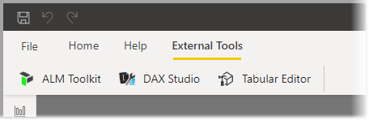
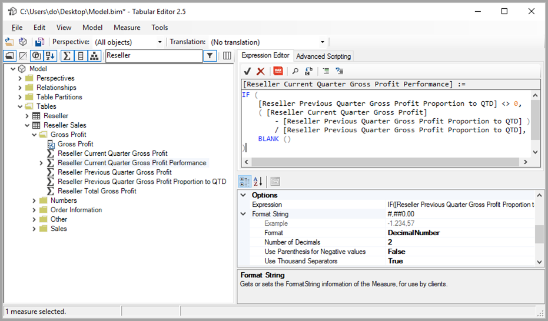
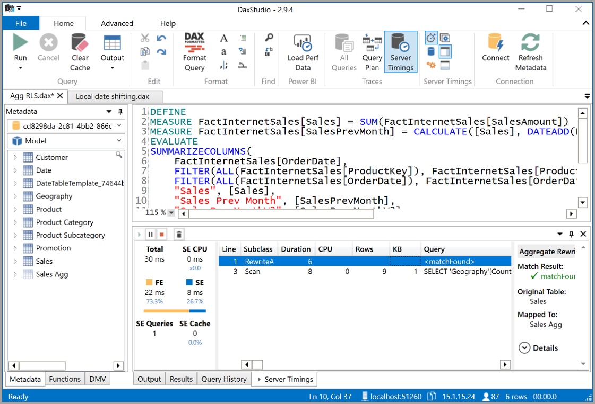
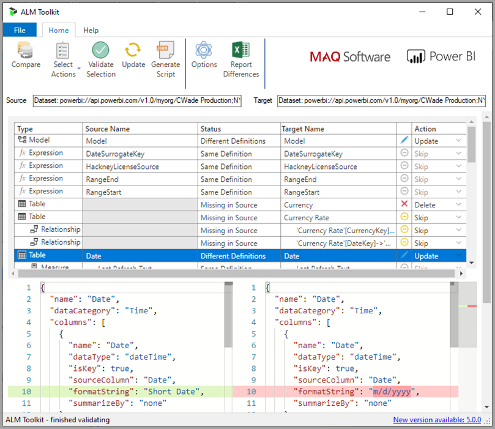

# Using external tools in Power BI Desktop (preview)

Beginning with the July 2020 release of Power BI Desktop, you can use external tools to provide additional functionality and value to Power BI Desktop. Support for external tools enables you to  leverage the multitude of community tools for Analysis Services for BI professionals, such DAX query/expression optimization and authoring, and application lifecycle management (ALM).

The **External Tools** ribbon in Power BI Desktop contains buttons for external tools installed on the machine, and registered with Power BI Desktop. External tools launched from Power BI Desktop are automatically connected to the Analysis Services engine that operates as part of Power BI Desktop, providing a seamless experience for users.



These featured external tools include the following, with links to their installation location. Each external tool is supported by their respective tool authors:

* [Tabular Editor](https://tabulareditor.com/)
* [DAX Studio](https://daxstudio.org)
* [ALM Toolkit](http://alm-toolkit.com)


The following sections describe the operations supported by external tools, a list of featured tools included in Power BI Desktop, and instructions on how to register additional tools.

> [!NOTE]
> External tools are not available for use with the Power BI Report Server version of Power BI Desktop.

## Supported write operations

External tools can connect to the Power BI Desktop dataset (Analysis Services model) to edit the following objects. Editing a Power BI Desktop template (PBIT) file is not supported.

* [Measures](/analysis-services/tabular-models/measures-ssas-tabular) for calculations
* [Calculation groups](/analysis-services/tabular-models/calculation-groups) for calculation reusability in complex models
* [Perspectives](/analysis-services/tabular-models/perspectives-ssas-tabular) to define focused, business-domain specific views of dataset metadata

Managing metadata translations using external tools may be possible, but is not currently supported in this preview version. If the current user’s locale is a translated locale, editing objects in the field list does not work correctly using the current version of Power BI Desktop. 

All [Tabular Object Model](/analysis-services/tom/introduction-to-the-tabular-object-model-tom-in-analysis-services-amo) dataset metadata can be accessed for read-only purposes, but objects not covered in the list described in the [Tabular Object Model](/analysis-services/tom/introduction-to-the-tabular-object-model-tom-in-analysis-services-amo) article are not yet supported for editing in the Power BI Desktop Analysis Services instance.


## Featured external tools

The following open-source community tools work with Power BI Desktop. They are supported by the respective tool authors. Each tool's respective installer registers it with Power BI Desktop upon installation:

* Tabular Editor
* DAX Studio
* ALM Toolkit

Let's take a look at each of these tools, in turn.

### Tabular Editor

You can install [Tabular Editor](https://tabulareditor.com/) from the following link: [Tabular Editor website](https://tabulareditor.com/)

Tabular Editor enables BI professionals to easily build, maintain, and manage tabular models using an intuitive and lightweight editor. A hierarchical view shows all objects in your tabular model, organized by display folders, with support for multi-select property editing and DAX syntax highlighting.



The source code for Tabular Editor can be found in the following GitHub repo: [Tabular Editor on GitHub](https://github.com/otykier/TabularEditor)

The primary tool author for Tabular Editor is [Daniel Otykier](https://www.linkedin.com/in/daniel-otykier-2231876).


### DAX Studio

You can install [DAX Studio](https://daxstudio.org) from the following link: [DAX Studio website](https://daxstudio.org)

DAX Studio is known for being a complete tool for DAX authoring, diagnosis, performance tuning and analysis. Its features include object browsing, integrated tracing, query execution breakdowns with detailed statistics, DAX syntax highlighting and formatting. The following image shows a Dax Studio screen. 



The source code for DAX Studio can be found in the following GitHub repo: [DAX Studio on GitHub](https://github.com/DaxStudio/DaxStudio)

The primary tool author for DAX Studio is [Darren Gosbell](https://www.linkedin.com/in/darrengosbell).

### ALM Toolkit

You can install [ALM Toolkit](http://alm-toolkit.com) from the following link: [ALM Toolkit website](http://alm-toolkit.com)

ALM Toolkit is a schema compare tool for Power BI datasets, used for application lifecycle management (ALM) scenarios. With it, you can perform straightforward deployment across environments and retain incremental refresh historical data. With ALM Toolkit, you can diff and merge metadata files, branches, and repos. You can also reuse common definitions between datasets.



The source code for ALM Toolkit can be found in the following GitHub repo: [ALM Toolkit on GitHub](https://github.com/microsoft/analysis-services)

The primary tool author for ALM Toolkit is [Christian Wade](https://www.linkedin.com/in/christianwade1).


## How to register external tools

To register other external tools with Power BI Desktop, create a JSON file with the following content:

```json
{
    "name": "<tool name>",
    "description": "<tool description>",
    "path": "<tool executable path>",
    "arguments": "<optional command line arguments>",
    "iconData": "image/png;base64,<encoded png icon data>"
}
```

The following list describes the list of elements in the JSON file:
 
* **name:** Provide a name for the tool, which will appear as a button caption in the External Tools ribbon within Power BI Desktop.
* **description:** (optional) Provide a description, which will appear as a tooltip on the External Tools ribbon button within Power BI Desktop.
* **path:** Provide the fully qualified path to the tool executable.
* **arguments:** (optional) Provide a string of command-line arguments that the tool executable should be launched with. You may use any of the following placeholders:
    * **%server%:** Replaced with the server name and portnumber of the local instance of Analysis Services Tabular for imported/DirectQuery data models.
    * **%database%:** Replaced with the database name of the model hosted in the local instance of Analysis Services Tabular for imported/DirectQuery data models.
* **iconData:** Provide image data, which will be rendered as a button icon in the External Tools ribbon within Power BI Desktop. The string should be formatted according to the syntax for Data URIs without the "data:" prefix.
 
Name the file `"<tool name>.pbitool.json"` and place it in the following folder:

* `%commonprogramfiles%\Microsoft Shared\Power BI Desktop\External Tools`

For 64-bit environments, place the files in the following folder:

* **Program Files (x86)\Common Files\Microsoft Shared\Power BI Desktop\External Tools**

Files in that specified location with the **.pbitool.json** extension are loaded by Power BI Desktop upon startup.

## Disabling external tools using the registry

External Tools can be disabled using **Group Policies** or by editing the registry, which is similar to the process for disabling **Custom Visuals**.

* Registry key: *Software\Policies\Microsoft\Power BI Desktop\\*

* Registry value: *EnableExternalTools*

A value of 1 (decimal) enables the use of external tools in Power BI, which is the default value.

A value of 0 (decimal) disable the use of external tools in Power BI.


## Next steps

You might also be interested in the following articles:

* [Use cross-report drill through in Power BI reports](desktop-cross-report-drill-through.md)
* [Using slicers Power BI Desktop](../visuals/power-bi-visualization-slicers.md)