# Use gridlines and snap-to-grid in Power BI reports
The report canvas in Power BI Desktop and the Power BI service provides gridlines that let you neatly align visuals on a report page and use snap-to-grid functionality so the visuals in your report look clean, aligned, and evenly spaced.

In **Power BI Desktop**, you can also adjust the z-order (bring forward, send backward) of objects on a report and align or evenly distribute selected visuals on the canvas.

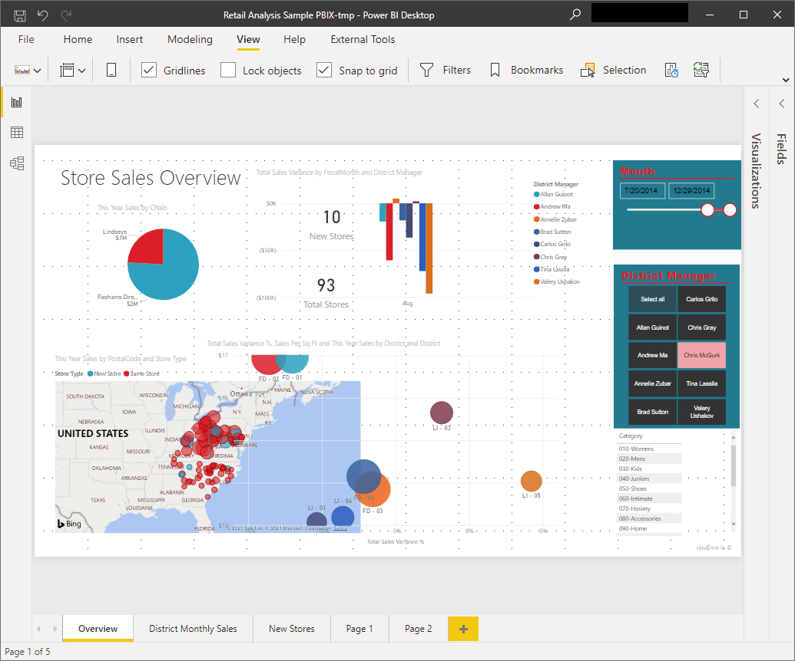

## Enabling gridlines and snap-to-grid
To enable gridlines and snap-to-grid, select the **View** ribbon, then enable the checkboxes for **Show gridlines** and **Snap objects to grid.** You can select one or both options; they operate independently.

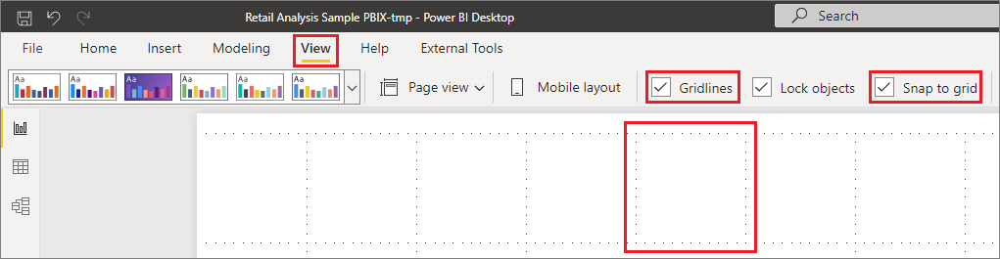

> [!NOTE]
> If **Show gridlines** and **Snap objects to grid** are disabled, connect to any data source and they become enabled.

## Using gridlines
Gridlines are visible guides that help you align your visuals. When you're trying to determine whether two (or more) visuals are aligned horizontally or vertically, use the gridlines to determine whether their borders align.

Use Ctrl+Click to select more than one visual at a time, which displays all selected visuals' borders and shows whether the visuals are properly aligned.

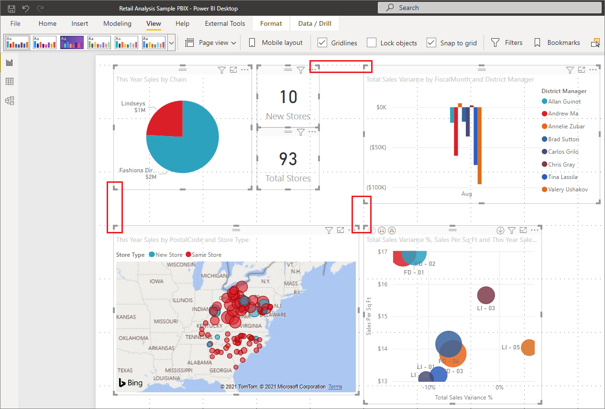

### Using gridlines inside visuals
In Power BI there are also gridlines inside visuals that provide visible guides for comparing data points and values. You can manage the gridlines within visuals using the **X axis** or **Y axis** card (as appropriate based on visual type), found in the **Format** section of the **Visualizations** pane. You can manage the following elements of gridlines within a visual:

* Turn gridlines on or off
* Change the color of gridlines
* Adjust the stroke (the width) of gridlines
* Select the line style of the gridlines in the visual, such as solid, dashed, or dotted

Modifying certain elements of gridlines can be especially useful in reports where dark backgrounds are used for visuals. The following images show the **Gridlines** section in the **Y axis** card.

1. With a visual selected, select the drop-down carat next to **Y axis** in the **Format** section of the **Visualizations** pane.
   
   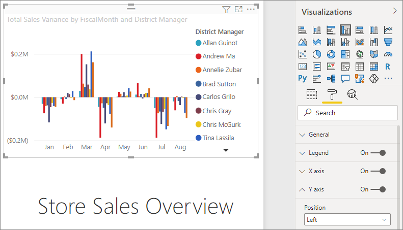
   
1. Scroll to the **Gridlines** setting and set it to **On**.
   
   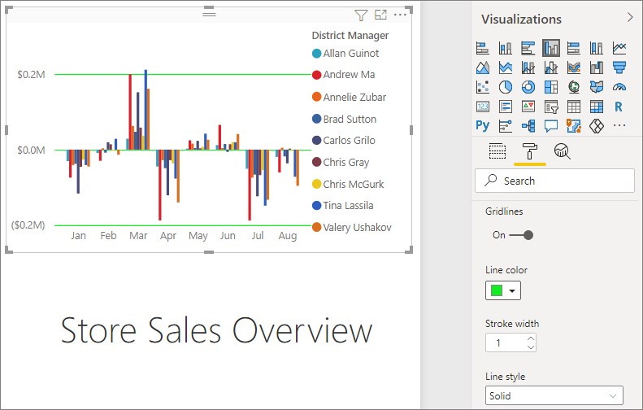
   
## Using snap-to-grid
When you enable **Snap objects to grid**, all visuals on the **Power BI Desktop** canvas that you move (or resize) are automatically aligned to the nearest grid axis, making it much easier to ensure two or more visuals align to the same horizontal or vertical location or size.

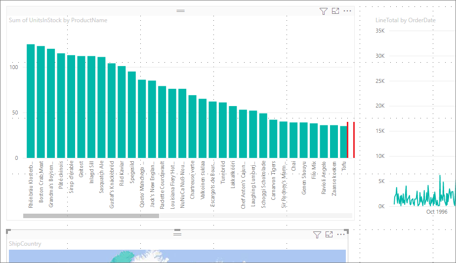

And, that's all there is to using **gridlines** and **snap-to-grid** to ensure the visuals in your reports are neatly aligned.

## Using z-order, align, and distribute
In Power BI Desktop, you can manage the front-to-back order of visuals in a report, often referred to as the *z-order* of elements. This feature lets you overlap visuals in any way you want, then adjust the front-to-back order of each. You set the order of your visuals using the **Bring forward** and **Send backward** buttons, found in the **Format** ribbon. The **Format** ribbon appears as soon as you select one or more visuals on the page.

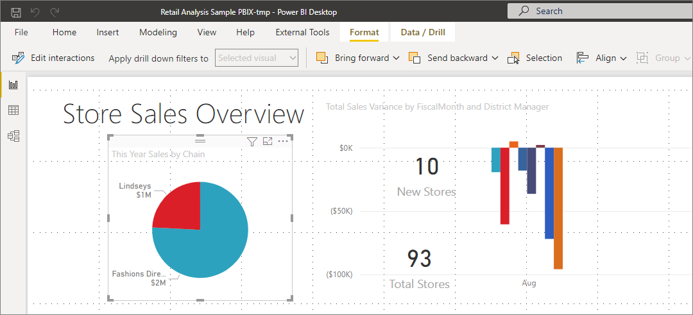

> [!NOTE]
> You can also set z-order when you're editing a report in the Power BI service. On the **View** menu, turn the **Selection pane** on. In the **Selection pane**, you change the z-order on the **Layer order** tab.

### Align and distribute visuals

In Power BI Desktop, the **Format** ribbon lets you align your visuals in many different ways, which ensures your visuals appear on the page in the alignment that looks and works best.

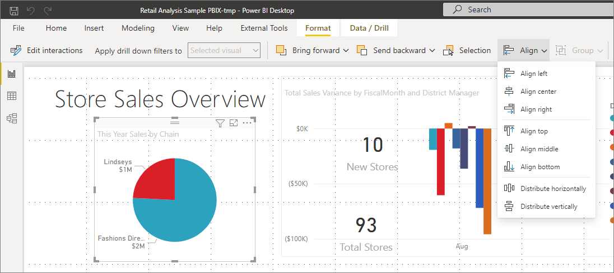

The **Align** button aligns a selected visual to the edge (or center) of the report canvas, as shown in the following image.

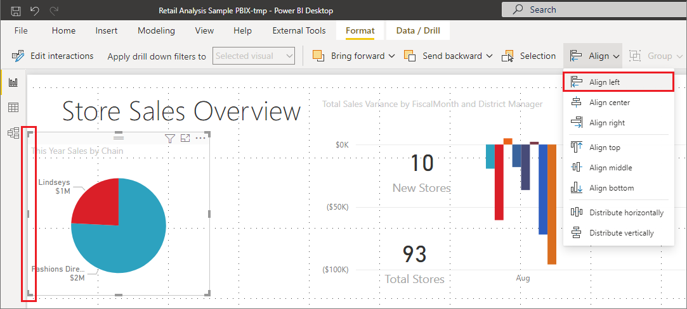

When two or more visuals are selected, they are aligned together and use the existing aligned boundary of the visuals for their alignment. For example, if you select two visuals and choose the **Align left** option, the visuals then align to the left-most boundary of all selected visuals.

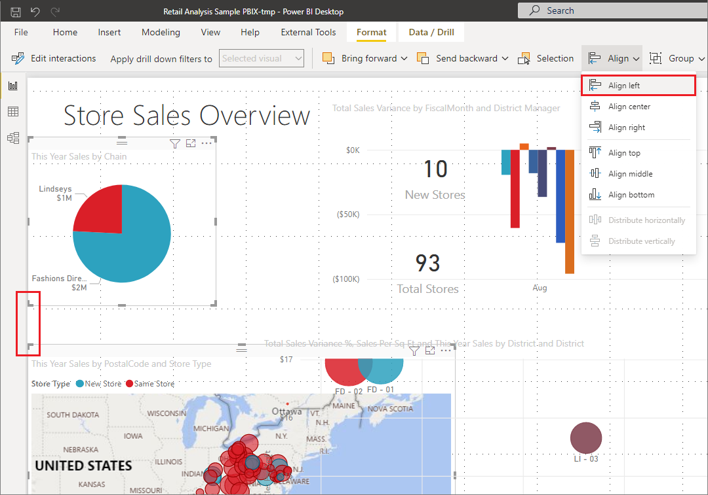

You can also distribute your visuals evenly across the report canvas, either vertically or horizontally. Just select more than one visual, and then select **Distribute horizontally** or **Distribute vertically** from the **Align** menu of the **Format** ribbon.

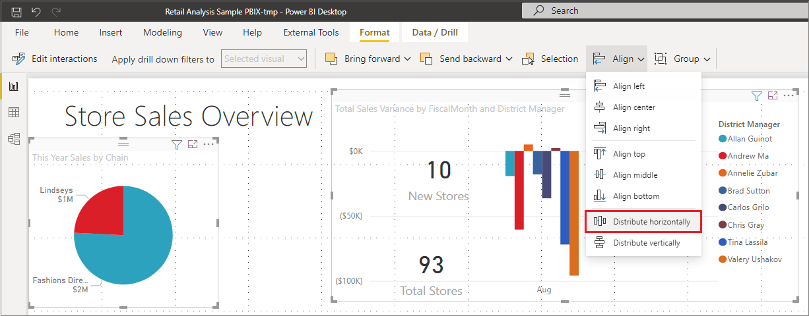

With a few selections from these gridlines, alignment, and distribution tools, your reports will look just how you want them to.
