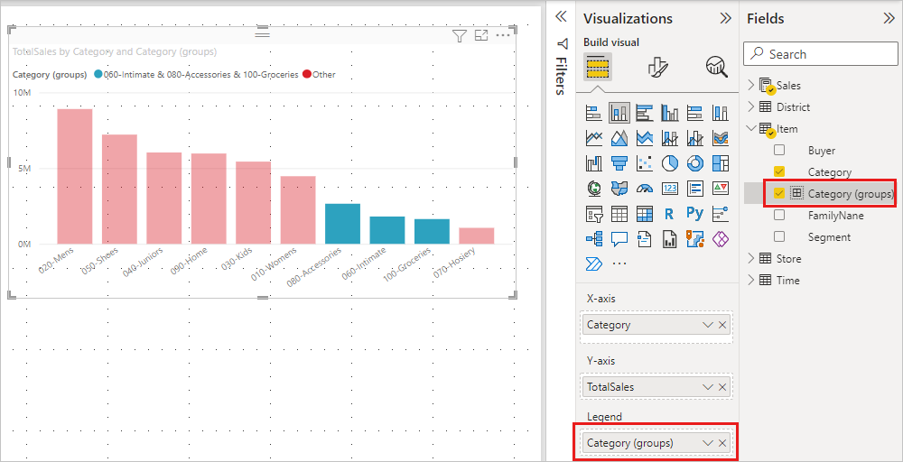
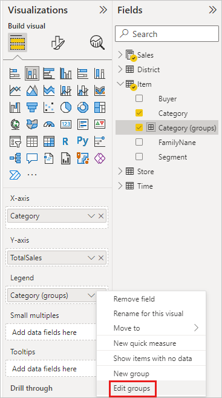
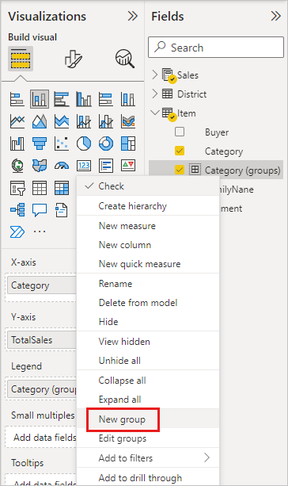
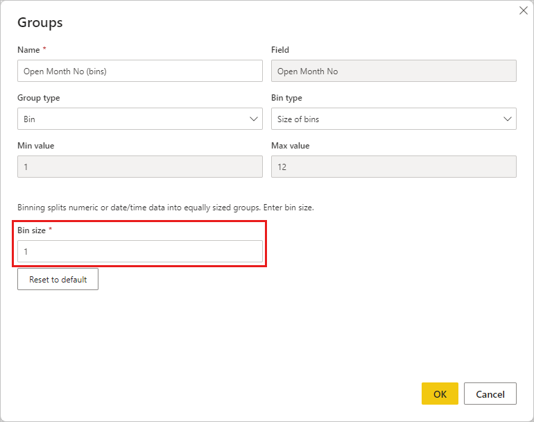
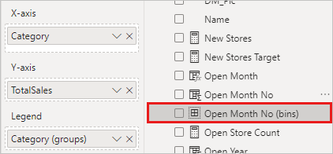

# Use grouping and binning in Power BI Desktop

[!INCLUDE [applies-yes-desktop-no-service](../includes/applies-yes-desktop-no-service.md)]

When Power BI Desktop creates visuals it aggregates your data into chunks, or groups, based on values it finds in the underlying data. Often that's fine, but there might be times when you want to refine how those chunks are presented.

For example, you might want to place three categories of products in one larger category or group, or you might want to see sales figures put into bin sizes of 1,000,000 dollars instead of chunks of 923,983-dollar sizes.

In Power BI Desktop, you can group data points to help you more clearly view, analyze, and explore data and trends in your visuals. You can also define the *bin size* to put values into equally sized groups that better enable you to visualize data in meaningful ways. This action is called *binning*.

## Using grouping
To use grouping, select two or more elements on a visual by using Ctrl+Select. Then right-click one of the selected elements, scroll to **Group**, and choose **Group** from the context menu.

:::image type="content" source="media/desktop-grouping-and-binning/grouping-binning_1.png" alt-text="Screenshot of a sample bar graph, highlighting the Group data selection in the dropdown menu.":::

Once it's created, the group is added to the **Legend** well for the visual with **(groups)** appended. The group also appears in the **Fields** list.

Once you have a group, you can edit its members.
 1. Right-click the group from the **Legend** well or from the **Fields** list, and then choose **Edit groups**.

 2. In the **Groups** dialog box, you can create new groups or modify existing groups.
  - To rename the group, type a new name in the **Name** box. You can also rename a group by double-clicking the group in the **Legends** or **Fields** list and entering a new name.
  - To add members, select items from the **Ungrouped values** list and then select **Group**.
  - To create a new group, select two or more items from the **Ungrouped values** and then select **Group**.
  - To remove items from the group, select them from **Groups and members** and then select **Ungroup**. You can also move ungrouped values into the **Other** group or leave them ungrouped.
3. When you're done editing the group, select **OK**.

> [!NOTE]
> You can create groups for any field in the **Fields** well, without having to select multiple items from an existing visual. Just right-click the field and select **New group** from the menu that appears.

## Use binning
Use binning to right-size the data that Power BI Desktop displays. You can set the bin size for numerical and time fields in Power BI Desktop. You can make bins for calculated columns but not for measures.

 1. To apply a bin size, right-click a **Field** and choose **New group**.

 2. From the **Groups** dialog box, set the **Bin size** to the size you want.

 3. Select **OK**. A new field appears in the **Fields** pane with **(bins)** appended. You can then drag that field onto the canvas to use the bin size in a visual.

To see binning in action, take a look at this [video](https://www.youtube.com/watch?v=BRvdZSfO0DY).

And that's all there is to using grouping and binning to ensure the visuals in your reports show your data just the way you want them to.

## Related content

You might also be interested in the following articles:

* [Use cross-report drillthrough in Power BI Desktop](desktop-cross-report-drill-through.md)
* [Using slicers Power BI Desktop](../visuals/power-bi-visualization-slicers.md)

