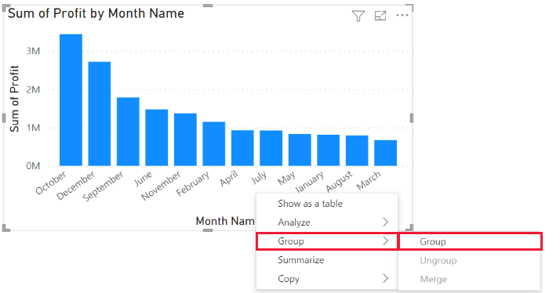

# Use grouping and binning in Power BI Desktop

[!INCLUDE [applies-yes-desktop-no-service](../includes/applies-yes-desktop-no-service.md)]

When Power BI Desktop creates visuals, it aggregates your data into chunks (or groups) based on values found in the underlying data. Often that's fine, but there might be times when you want to refine how those chunks are presented. For example, you might want to place three categories of products in one larger category (one *group*). Conversely, you might want to see sales figures put into bin-sizes of 1,000,000 dollars, instead of chunks of 923,983-dollar sizes.

In Power BI Desktop, you can *group* data points to help you more clearly view, analyze, and explore data and trends in your visuals. You can also define the *bin size* to put values into equally sized groups that better enable you to visualize data in ways that are meaningful. This action is often called *binning*.

## Using grouping
To use grouping, select two or more elements on a visual by using Ctrl+click to select multiple elements. Then right-click one of the multiple selection elements and choose **Group data** from the context menu.

Once it's created, the group is added to the **Legend** bucket for the visual. The group also appears in the **Fields** list.

Once you have a group, you can edit the members of that group. Right-click the field from the **Legend** bucket or from the **Fields** list, and then choose **Edit groups**.

In the **Groups** dialog box, you can create new groups or modify existing groups. You can also *rename* any group. Just double-click the group title in the **Groups and members** box, and then enter a new name.

With Groups, you can add items from the **Ungrouped values** list into a new group or into one of the existing groups. To create a new group, select two or more items (using Ctrl+click) from the **Ungrouped values** box, and then select the **Group** button below that box.

You can add an ungrouped value into an existing group. Select one of the **Ungrouped values**, then select the existing group to add the value to, and select the **Group** button. To remove an item from a group, select it from the **Groups and members** box, and then select **Ungroup**. You can also move ungrouped categories into the **Other** group or leave them ungrouped.

> [!NOTE]
> You can create groups for any field in the **Fields** well, without having to select multiple items from an existing visual. Just right-click the field, and select **New group** from the menu that appears.

## Using binning
You can set the bin size for numerical and time fields in **Power BI Desktop.** You can make bins for calculated columns, but not for measures. Use binning to right-size the data that Power BI Desktop displays.

To apply a bin size, right-click a **Field** and choose **New group**.

From the **Groups** dialog box, set the **Bin size** to the size you want.

When you select **OK**, you'll notice that a new field appears in the **Fields** pane with **(bins)** appended. You can then drag that field onto the canvas to use the bin size in a visual.

To see *binning* in action, take a look at this [video](https://www.youtube.com/watch?v=BRvdZSfO0DY).

And that's all there is to using *grouping* and *binning* to ensure the visuals in your reports show your data just the way you want them to.
