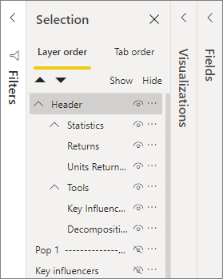
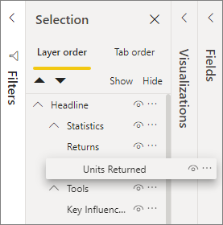
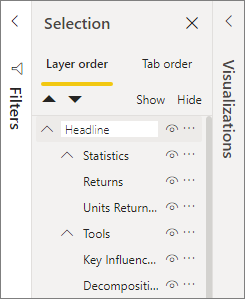
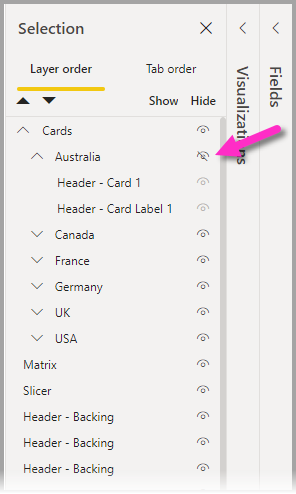
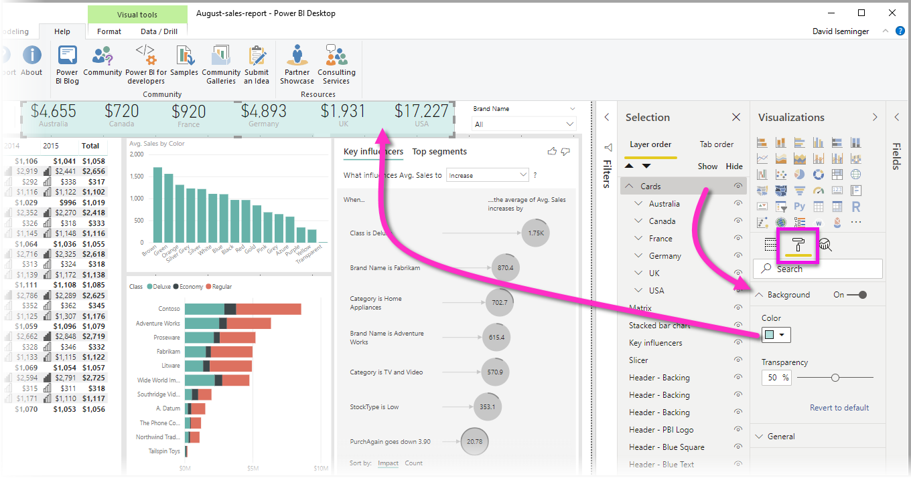

# Group visuals in Power BI Desktop reports
With **grouping** in **Power BI Desktop**, you can group visuals together in your report, such as buttons, textboxes, shapes, images, and any visual you create, just like you group items in PowerPoint. Grouping visuals in a report lets you treat the group like a single object, making moving, resizing, and working with layers in your report easier, faster, and more intuitive.

## Creating groups

To create a group of visuals in Power BI Desktop, select the first visual from the canvas, then holding the CTRL button, click one or more additional visuals that you want in the group, then right-click the collection of visuals and select **Group** from the menu that appears.

Groups are displayed in the **Selection** pane. You can have as many groups of visuals as your report needs, and you can also nest groups of visuals. In the following image, the *Statistics* and *Tools* groups are nested under the *Header* group. You can expand a group by selecting the caret beside the group name, and collapse it by selecting the caret again. 

Within the **Selection** pane, you can also drag and drop individual visuals to include them in a group, remove them from a group, nest a group, or remove a group or individual visual from a nest. Simply drag the visual you want to adjust, and place it where you want. Layering of visuals, if there is overlap, is determined by their order in the *Layer order* list.

Renaming a group is easy: just double-click the group name in the **Selection** pane, and then type in the new name of your group.

To ungroup just select the group, right-click and select **ungroup** from the menu that appears.

## Hide and show visuals or groups

You can easily hide or show groups using the **Selection** pane. To hide a group, select the eye button beside the group name (or any individual visual) to toggle whether the visual or group is hidden or displayed. In the following image, the *Statistics* group is hidden, and the rest of the items and groups nested in the *Headline* group are displayed.

When you hide a group, all visuals within that group are hidden, indicated by their eye button being grayed out (unavailable to toggle on or off, because the entire group is hidden). To hide only certain visuals within a group, simply toggle the eye button beside that visual, and only that visual in the group is hidden.

## Selecting visuals within a group

There are a few ways to navigate and select items within a group of visuals. The following list describes the behavior:

* Clicking on empty space within a group (such as white space between visuals) does not select anything
* Clicking a visual within a group selects the entire group, a second click selects the individual visual
* Selecting a group, and then another object on the report canvas, then selecting **Group** from the right-click menu creates a nested group
* Selecting two groups, then right-clicking displays an option to merge the selected groups, rather than nesting them

## Apply background color

You can also apply a background color to a group using the **Formatting** section of the **Visualizations** pane, as shown in the following image. 

Once you apply a background color, clicking on the space between visuals in the group selects the group (compare this to clicking on the white space between visuals in a group, which does not select the group). 

## Next steps
For more information about grouping, take a look at the following video:

* [Grouping in Power BI Desktop - video](https://youtu.be/sf4n7VXoQHY?t=10)

You might also be interested in the following articles:

* [Use cross-report drillthrough in Power BI Desktop](desktop-cross-report-drill-through.md)
* [Using slicers Power BI Desktop](../visuals/power-bi-visualization-slicers.md)
