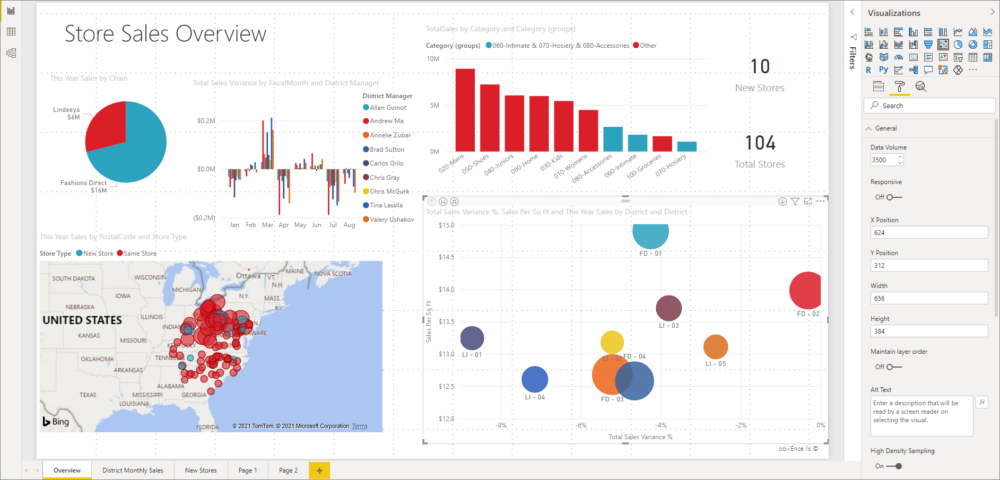
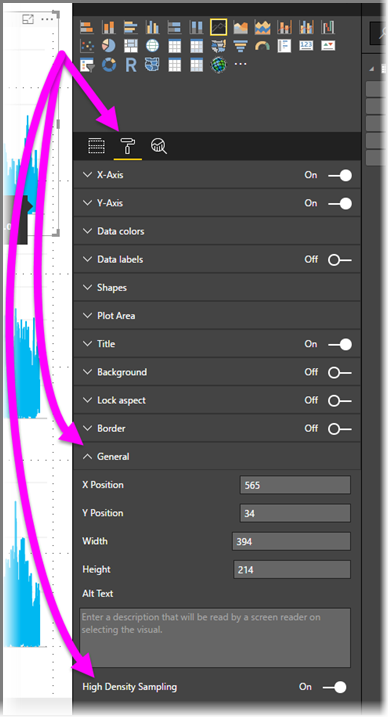

# High-density line sampling in Power BI

The sampling algorithm in Power BI improves visuals that sample high-density data. For example, you might create a line chart from your retail stores' sales results, each store having more than ten thousand sales receipts each year. A line chart of such sales information would sample data (select a meaningful representation of that data, to illustrate how sales vary over time) from the data for each store, and create a multi-series line chart that thereby represents the underlying data. This is common practice in visualizing high-density data. The details of high-density data sampling are described in this article.

> [!NOTE]
> The **High Density Sampling** algorithm described in this article is available in both **Power BI Desktop** and the **Power BI service**.

## How high-density line sampling works
Previously, **Power BI** selected a collection of sample data points in the full range of underlying data in a deterministic fashion. For example, for high-density data on a visual spanning one calendar year, there might be 350 sample data points displayed in the visual, each of which was selected to ensure the full range of data (the overall series of underlying data) was represented in the visual. To help understand how this happens, imagine plotting a stock price over a one-year period, and selecting 365 data points to create a line chart visual (that's one data point for each day).

In that situation, there are many values for a stock price within each day. Of course, there is a daily high and low, but those could occur at any time during the day when the stock market is open. For high-density line sampling, if the underlying data sample was taken at 10:30 AM and 12:00 PM each day, you would get a representative snapshot of the underlying data (the price at 10:30 AM and 12:00 PM), but it might not capture the actual high and low of the stock price for that representative data point (that day). In that situation – and others – the sampling is representative of the underlying data, but it doesn't always capture important points, which in this case, would be daily stock price highs and lows.

By definition, high-density data is sampled to create visualizations reasonably quickly that are responsive to interactivity. Too many data points on a visual can bog it down, and can detract from the visibility of trends. So, how the data is sampled is what drives the creation of the sampling algorithm to provide the best visualization experience. In Power BI Desktop, the algorithm is now improved to provide the best combination of responsiveness, representation, and clear preservation of important points in each time slice.

## How the new line sampling algorithm works
The new algorithm for high-density line sampling is available for line chart and area chart visuals with a continuous x-axis.

For a high-density visual, **Power BI** intelligently slices your data into high-resolution chunks, and then picks important points to represent each chunk. That process of slicing high-resolution data is specifically tuned to ensure that the resulting chart is visually indistinguishable from rendering all of the underlying data points, but much faster and more interactive.

### Minimum and maximum values for high-density line visuals
For any given visualization, the following visual limitations apply:

* **3,500** is the maximum number of data points *displayed* on most visuals, regardless of the number of underlying data points or series (see the *exceptions* in the following bullet list). As such, if you have 10 series with 350 data points each, the visual has reached its maximum overall data points limit. If you have one series, it may have up to 3,500 data points if the new algorithm deems that the best sampling for the underlying data.

* There is a maximum of **60 series** for any visual. If you have more than 60 series, break up the data and create multiple visuals with 60 or fewer series each. It's good practice to use a **slicer** to show only segments of the data (only certain series). For example, if you're displaying all subcategories in the legend, you could use a slicer to filter by the overall category on the same report page.

The maximum number of data limits is higher for the following visual types, which are *exceptions* to the 3,500 data point limit:

* **150,000** data points maximum for R visuals.
* **30,000** data points for Power BI visuals.
* **10,000** data points for scatter charts (scatter charts default to 3,500)
* **3,500** for all other visuals

These parameters ensure that visuals in Power BI Desktop render very quickly, are responsive to interaction with users, and do not result in undue computational overhead on the computer rendering the visual.

### Evaluating representative data points for high-density line visuals
When the number of underlying data points exceeds the maximum data points that can be represented in the visual, a process called *binning* begins, which chunks the underlying data into groups called *bins*, and then iteratively refines those bins.

The algorithm creates as many bins as possible to create the greatest granularity for the visual. Within each bin, the algorithm finds the minimum and maximum data value, to ensure that important and significant values (for example, outliers) are captured and displayed in the visual. Based on the results of the binning and subsequent evaluation of the data by Power BI, the minimum resolution for the x-axis for the visual is determined – to ensure maximum granularity for the visual.

As mentioned previously, the minimum granularity for each series is 350 points, the maximum is 3,500 for most visuals, with the *exceptions* listed in the previous paragraphs.

Each bin is represented by two data points, which become the bin's representative data points in the visual. The data points are simply the high and low value for that bin, and by selecting the high and low, the binning process ensures any important high value, or significant low value, is captured and rendered in the visual.

If that sounds like a lot of analysis to ensure the occasional outlier is captured and properly displayed in the visual, you are correct, but that's the exact reason for the new algorithm and binning process.

## Tooltips and high-density line sampling
It's important to note that this binning process, which results in the minimum and maximum value in a given bin being captured and displayed, may affect how tooltips display data when you hover over the data points. To explain how and why this occurs, let's revisit our example about stock prices.

Let's say you're creating a visual based on stock price and you're comparing two different stocks, both of which are using **High-Density Sampling**. The underlying data for each series has lots of data points (maybe you capture the stock price each second of the day). The high-density line sampling algorithm performs binning for each series independently of the other.

Now let's say that the first stock jumps up in price at 12:02, then quickly comes back down ten seconds later. That's an important data point. When binning occurs for that stock, the high at 12:02 will be a representative data point for that bin.

But, for the second stock, 12:02 was neither a high nor a low in the bin that included that time. Maybe the high and low for the bin that includes 12:02 occurred three minutes later. In that situation, when the line chart is created and you hover over 12:02, you will see a value in the tooltip for the first stock (because it jumped at 12:02 and that value was selected as that bin's high data point), but you will *not* see any value in the tooltip at 12:02 for the second stock. That's because the second stock had neither a high, nor a low, for the bin that included 12:02. So, there's no data to show for the second stock at 12:02, and thus, no tooltip data is displayed.

This situation will happen frequently with tooltips. The high and low values for a given bin might not match perfectly with the evenly scaled x-axis value points, and as such the tooltip will not display the value.  

## How to turn on high-density line sampling
By default, the new algorithm is turned **on**. To change this setting, go to the **Formatting** pane, in the **General** card, and along the bottom, you see a toggle slider called **High-Density Sampling**. To turn it off, slide it to **Off**.

## Considerations and limitations
The new algorithm for high-density line sampling is an important improvement to Power BI, but there are a few considerations you need to know when working with high-density values and data.

* Because of increased granularity and the binning process, **Tooltips** may only show a value if the representative data is aligned with your cursor. See the *Tooltips and high-density line sampling* section in this article for more information.
* When the size of an overall data source is too big, the new algorithm eliminates series (legend elements) to accommodate the data import maximum constraint.
  
  * In this situation, the new algorithm orders legend series alphabetically, starts down the list of legend elements in alphabetical order until the data import maximum is reached, and does not import additional series.
* When an underlying data set has more than 60 series (the maximum number of series, as described earlier), the new algorithm orders the series alphabetically, and eliminates series beyond the 60th alphabetically-ordered series.
* If the values in the data are not of type *numeric* or *date/time*, Power BI will not use the new algorithm, and will revert to the previous (non-high-density sampling) algorithm.
* The **Show items with no data** setting is not supported with the new algorithm.
* The new algorithm is not supported when using a live connection to a model hosted in SQL Server Analysis Services (version 2016 or earlier). It is supported in models hosted in **Power BI** or Azure Analysis Services.

## Next steps
For information about high-density sampling in scatter charts, see the following article.

* [High Density Sampling in Power BI scatter charts](desktop-high-density-scatter-charts.md)
