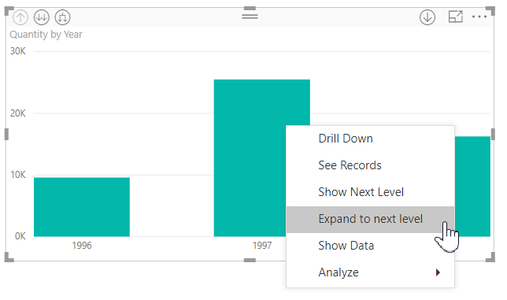
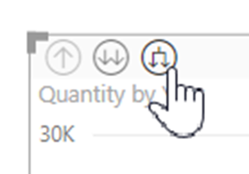
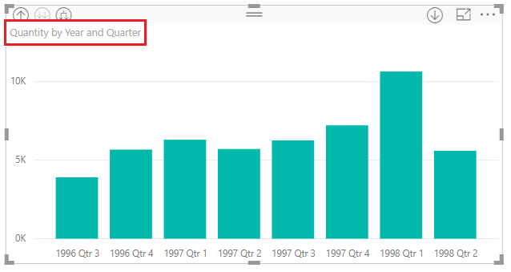
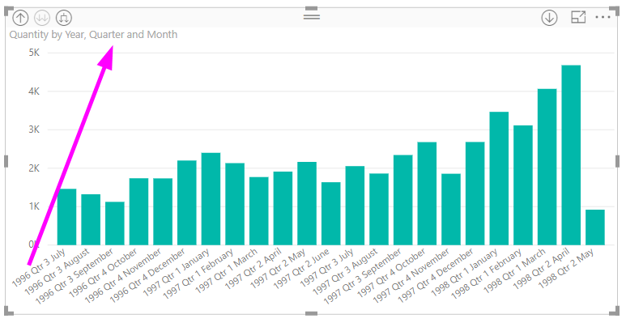
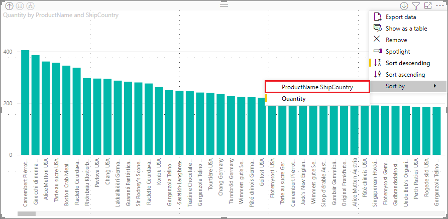
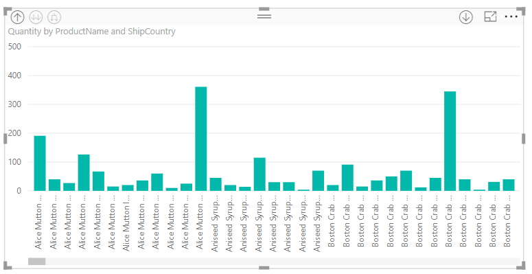

# Use inline hierarchy labels in Power BI Desktop
**Power BI Desktop** supports the use of **inline hierarchy labels**, which is the first of two features intended to enhance hierarchical drilling. The second feature, which is currently in development, is the ability to use nested hierarchy labels (stay tuned for that - our updates happen frequently).   

## How inline hierarchy labels work
With inline hierarchy labels, you can see hierarchy labels as you expand visuals using the **Expand All** feature. One great benefit to seeing these hierarchy labels is that you can also choose to **sort** by these different hierarchy labels as you expand your hierarchical data.

### Using the built-in Expand feature (without sorting by hierarchy labels)
Before we see inline hierarchy labels in action, let's review the default **Expand to next level** feature behavior. Doing so will help us understand (and appreciate) how useful inline hierarchy labels can be.

The following image shows a bar chart visual for annual sales. When you right-click on a bar, you can choose **Expand to next level**.

> [!NOTE]
> As an alternative to right-clicking on a bar, you can select the *Expand* button on the top left of the visualization.

  

Once **Expand to next level** is selected, the visual expands the date hierarchy from *Year* to *Quarter*, as shown in the following image.

Notice that the *Year* and *Quarter* labels are shown inline together - this labeling scheme continues as you **Expand All** down to the bottom of the hierarchy.

This is how the built-in *Date* hierarchy, associated with fields that have a *date/time* data type, behaves. Let's head to the next section, and see how the new inline hierarchy labels feature is different.

### Using inline hierarchy labels
Now let's look at a different chart - using data that has informal hierarchies. In the following visual, we have a bar chart with **Quantity**, using *ProductName* as the axis. In this data, *ProductName* and *ShipCountry* form an informal hierarchy. From here, you can again select *Expand to next level* to drill down into the hierarchy.

Selecting **Expand to next level** shows the next level with the inline display of hierarchy labels. By default, inline hierarchies are sorted by the measure value – in this case, **Quantity**. With inline hierarchy labels enabled, you can choose to sort this data by the hierarchy too, by selecting the ellipsis in the upper right corner (the **...**), then selecting **Sort by ProductName ShipCountry** as shown in the following image.

Once **ShipCountry** is selected, the data is sorted based on the informal hierarchy selection, as shown in the following image.

> [!NOTE]
> The inline hierarchy label feature doesn't yet allow for the built-in time hierarchy to be sorted by value; it's only sorted by hierarchy order.
> 
> 

## Troubleshooting
It's possible for your visuals to get stuck in an expanded inline hierarchy level state. In some cases, you might find that some of your visuals are stuck in the mode where they were expanded, in which case drilling up doesn't work. This can happen if you happened to take the following steps (the fix for this is *below* these steps):

Steps that might get your visuals stuck in an expanded state:

1. You enable the **inline hierarchy label** feature
2. You create some visuals with hierarchies
3. Then you **Expand All** and save your file
4. You then *disable* the **inline hierarchy label** feature, and restart Power BI Desktop
5. Then you re-open your file

If you happen to take those steps, and your visuals are stuck in expanded mode, you can do the following to troubleshoot them:

1. Re-enable the **inline hierarchy label** feature, then restart Power BI Desktop
2. Re-open your file, and drill back up to top of your affected visual(s)
3. Save your file
4. Disable the **inline hierarchy label** feature, then restart Power BI Desktop
5. Re-open your file

Alternatively, you can just delete your visual and recreate it.

