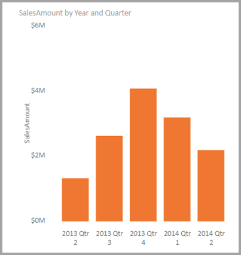
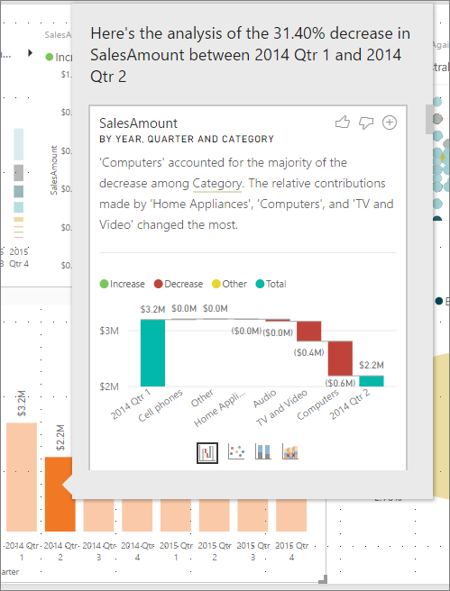
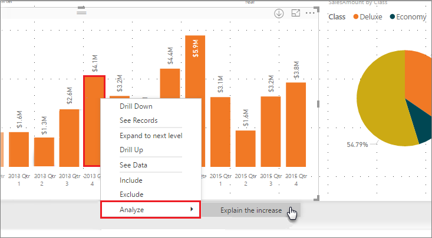
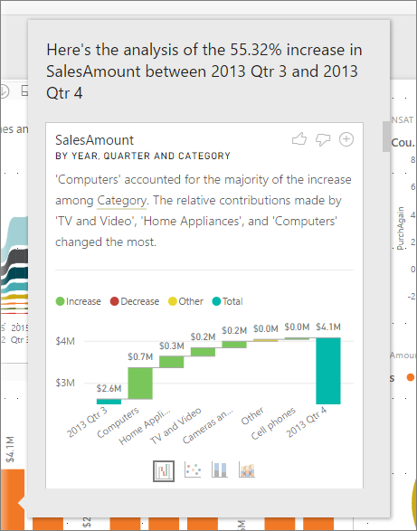
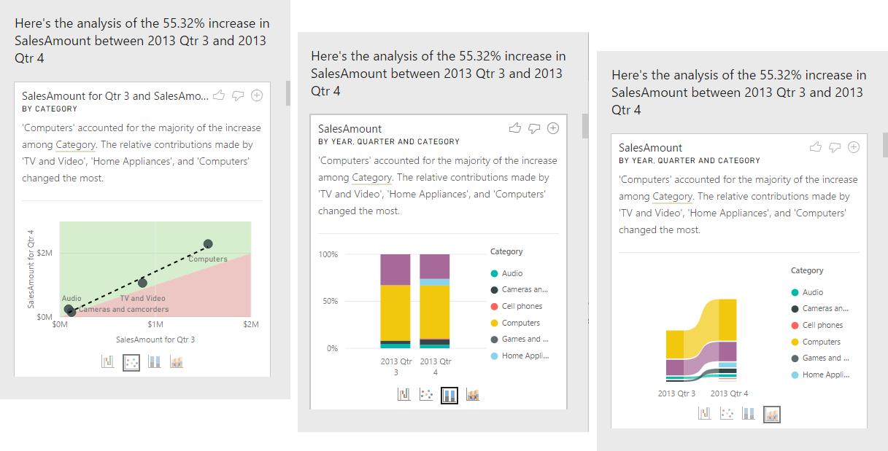
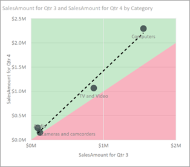
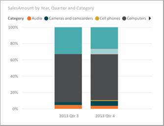
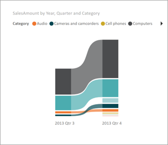
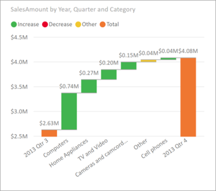

# Apply insights in Power BI Desktop to explain fluctuations in visuals

Often in visuals, you see a large increase and then a sharp drop in values, and wonder about  the cause of such fluctuations. With **insights** in **Power BI Desktop** you can learn the cause with just a few clicks.

For example, consider the following visual that shows *Sales Amount* by *Year* and *Quarter*. A large decrease in sales occurs in 2014, with sales dropping sharply between *Qtr 1* and *Qtr 2*. In such cases you can explore the data, to help explain the change that occurred. 

You can tell **Power BI Desktop** to explain increases or decreases in charts, see distribution factors in charts, and get fast, automated, insightful analysis about your data. Simply right-click on a data point, and select **Analyze > Explain the decrease** (or increase, if the previous bar was lower), or **Analyze > Find where this distribution is different** and insight is delivered to you in an easy-to-use window.

The insights feature is contextual, and is based on the immediately previous data point - such as the previous bar, or column.

> [!NOTE]
> The insight feature is enabled and on by default in **Power BI Desktop**.

## Using insights

To use insights to explain increases or decreases seen on charts, just right-click on any data point in a bar or line chart, and select **Analyze > Explain the increase** (or *Explain the decrease*, since all insights are based on the change from the previous data point).

**Power BI Desktop** then runs its machine learning algorithms over the data, and populates a window with a visual and a description that describes which categories most influenced the increase or decrease. By default, insights are provided as a *waterfall* visual, as shown in the following image.

By selecting the small icons at the bottom of the waterfall visual, you can choose to have insights display a scatter chart, stacked column chart, or a ribbon chart.

The *thumbs up* and *thumbs down* icons at the top of the page are provided so you can provide feedback about the visual and the feature. Doing so provides feedback, but it does not currently train the algorithm to influence the results returned next time you use the feature.

And importantly, the **+** button at the top of the visual lets you add the selected visual to your report, just as if you created the visual manually. You can then format or otherwise adjust the added visual just as you would to any other visual on your report. You can only add a selected insight visual when you're editing a report in **Power BI Desktop**.

You can use insights when your report is in reading or editing mode, making it versatile for both analyzing data, and for creating visuals you can easily add to your reports.

## Details of the results returned

The details returned by insights are intended to highlight what was different between the two time periods, to help you understand the change between them.  

For example, if *Sales* increased by 55% overall from *Qtr 3* to *Qtr 4*, and that is equally true for every *Category* of product (sales of Computer increased by 55%, and of Audio, and so on), and also true for every country, and for every type of customer, then there is little that can be identified in the data to help explain the change. However, that situation is generally not the case, and we might typically find differences in what occurred, such that among the categories, *Computers* and *Home Appliances* grew by a much larger 63% percentage, while *TV and Audio* grew by only 23%, and therefore *Computers* and *Home Appliances* contributed a larger amount of the total for *Qtr 4* than they had for *Qtr 3*.  Given this example, a reasonable explanation of the increase would be: *particularly strong sales for Computers and TV and Audio*. 

So the algorithm is not simply returning the values that account for the biggest amount of the change. For example, if the vast majority (98%) of sales came from the USA, then it would commonly be the case that the vast majority of the increase was also in the USA. Yet unless the USA or other countries had a significant change to their relative contribution to the total, *Country* would not be considered interesting in this context.  

Simplistically, the algorithm can be thought of as taking all the other columns in the model, and calculating the breakdown by that column for the *before* and *after* time periods, determining how much change occurred in that breakdown, and then returning those columns with the biggest change. For example, *Category* was selected in the example above, as the contribution made by *TV and Video* fell 7% from 33% to 26%, while the contribution from *Home Appliances* grew from nothing to over 6%. 

For each column returned, there are four visuals that can be displayed. Three of those visuals are intended to highlight the change in contribution between the two periods. For example, for the explanation of the increase from *Qtr 2* to *Qtr 3*.

### The scatter plot

The scatter plot visual shows the value of the measure in the first period (on the x-axis) against the value of the measure in the second period (on the y-axis), for each value of the column (*Category* in this case). Thus as shown in the following image, any data points are in the green region if the value increased, and in the red region if they decreased. 

The dotted line shows the best fit, and as such, data points above this line increased by more than the overall trend, and those below it by less.  

Note that data items whose value was blank in either period will not appear on the scatter plot (for example, *Home Appliances* in this case).

### The 100% stacked column chart

The 100% stacked column chart visual shows the value of the measure before and after, by the selected column, shown as a 100% stacked column. This allows side-by-side comparison of the contribution before and after. The tooltips show the actual contribution for the selected value.

### The ribbon chart

The ribbon chart visual also shows the value of the measure before and after. It's particularly useful in showing the changes in contributions when these were such that the *ordering* of contributors changed (for example, if *Computers* were the number one contributor before, but then fell to number three). 

### The waterfall chart

The fourth visual is a waterfall chart, showing the main actual increases or decreases between the periods. This visual clearly shows the actual changes, but does not alone indicate the changes to the level of contribution that actually highlight why the column was chosen as being interesting. 

When ranking the column as to which have the largest differences in the relative contributions, the following is considered: 

* The cardinality is factored in, as a difference is less statistically significant, and less interesting, when a column has a large cardinality. 

* Differences for those categories where the original values were very high or very close to zero are weighted higher than others. For example, if a Category  only contributed 1% of sales, and this changed to 6%, that is more statistically significant, and therefore considered more interesting, than a Category whose contribution changed from 50% to 55%. 

* Various heuristics are employed to select the most meaningful results, for example by considering other relationships between the data.
 
After examining different columns, those that show the biggest change to relative contribution are chosen and output. For each, the values which had the most significant change to contribution are called out in the description. In addition, the values that had the largest actual increases and decreases are also called out.

## Considerations and limitations
Since these insights are based on the change from the previous data point, they aren't available when you select the first data point in a visual. 

The following list is the collection of currently unsupported scenarios for **explain the increase/decrease**:

* TopN filters
* Include/exclude filters
* Measure filters
* Non-numeric measures
* Use of "Show value as"
* Filtered measures - filtered measures are visual level calculations with a specific filter applied (for example, *Total Sales for France*), and are used on some of the visuals created by the insights feature
* Categorical columns on X-axis unless it defines a sort by column that is scalar. If using a hierarchy, then every column in the active hierarchy has to match this condition
* RLS or OLS enabled data models

In addition, the following model types and data sources are currently not supported for insights:

* DirectQuery
* Live connect
* On-premises Reporting Services
* Embedding

## Next steps
For more information about **Power BI Desktop**, and how to get started, check out the following articles.

* [What is Power BI Desktop?](../fundamentals/desktop-what-is-desktop.md)
* [Query Overview with Power BI Desktop](../transform-model/desktop-query-overview.md)
* [Data Sources in Power BI Desktop](../connect-data/desktop-data-sources.md)
* [Connect to Data in Power BI Desktop](../connect-data/desktop-connect-to-data.md)
* [Shape and Combine Data with Power BI Desktop](../connect-data/desktop-shape-and-combine-data.md)
* [Common Query Tasks in Power BI Desktop](../transform-model/desktop-common-query-tasks.md)   
