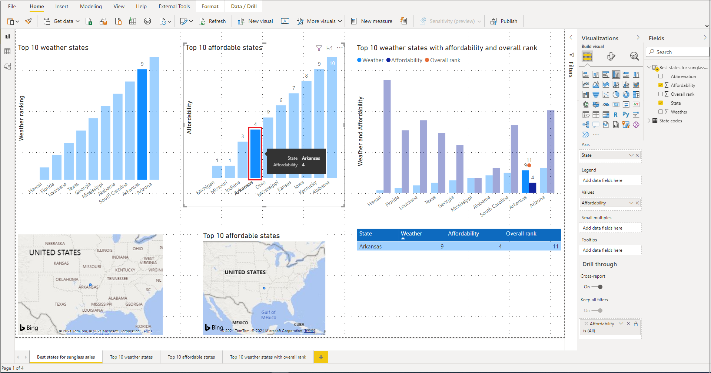
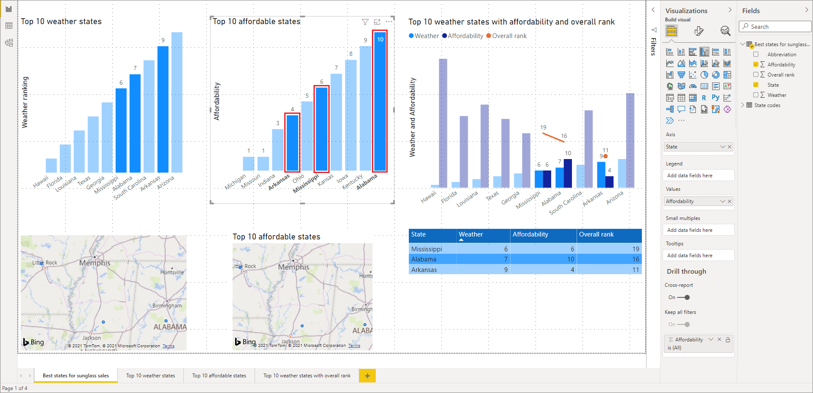
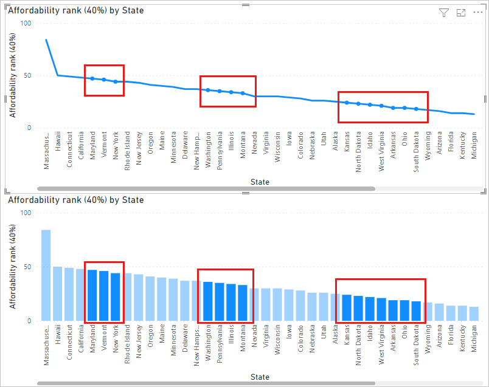

# Multi-select data elements, data points, and visuals in Power BI

[!INCLUDE [applies-yes-desktop-yes-service](../includes/applies-yes-desktop-yes-service.md)]

You can select multiple data points in a visual or multiple visuals in a report in Power BI Desktop or the Power BI service. The following sections describe each in turn. Depending on how many data points you select in a visual, you're changing the [cross-filtering and cross-highlighting](power-bi-reports-filters-and-highlighting.md#cross-filter-and-cross-highlight-visuals) the other visuals on the page.

## Select multiple data points

### Single-select highlighting

In Power BI reports, you can highlight a data point in a given visual by clicking the data point in the visual. For example, if you have an important bar or chart element, and you want other visuals on the report page to highlight data based on your selection, you can click the data element in one visual and see results reflected in other visuals on the page. This is basic single-select highlighting. The following image shows a basic highlight.

### Multi-select highlighting

With multi-select, you can select more than one data point in your report and highlight the results across the visuals on the page. This is equivalent to an **and** statement or functionality, such as "highlight results for Idaho **and** Virginia". To multi-select data points in visuals, use **Ctrl + Click** to select multiple data points. The following image shows **multiple data points** selected (multi-select).

This capability opens all sorts of opportunities when creating, sharing, and interacting with reports.

## Select multiple elements using rectangle select

You can select multiple data elements in a visual, or multiple visuals in a report, using rectangular select, often also referred to as *lasso select*.

### Select multiple visuals on the canvas

Select multiple visuals and other report elements by clicking and dragging over the canvas to create a rectangular lasso. All visuals that are entirely encapsulated within the lasso are selected. If you press the Ctrl or Shift key (as you multi-select by Ctrl + clicking individual visuals), further lassoing adds visual selections to the current multi-select.

If a visual is already selected and is lassoed, using Ctrl or Shift toggles off that selection. The lasso doesn't select single visuals within groups, but it can select groups by encapsulating the entire group.

The canvas doesn't automatically scroll with the rectangular lasso selection.

### Select multiple data points in a visual

You can select multiple data points within a visual using the same rectangular lasso steps in both Power BI Desktop and the Power BI service.

#### Rectangular multi-select with the Ctrl key

While holding down the Ctrl key, click and drag within a visual to select multiple data points. When you release the mouse button, all points overlapping the selection rectangle are selected, and any previous lasso selections are also preserved. If you lasso select an area that incorporates previously selected points using Ctrl while selecting, those data points are deselected (toggled off); using the lasso has the same effect as Ctrl + clicking each point individually.

#### Rectangular multi-select with the Shift key

When you hold down the Shift key while making a lasso selection, previous selections are preserved and already-selected data points remain selected. So using Shift while performing a lasso-select only adds data points to your selection, rather than toggling data points in the selected area.

You can clear your current selection by clicking an empty space on the plot area without pressing a keyboard key.

#### Rectangular multi-select using the keyboard

You can use keyboard controls to access data point rectangle select without a mouse.

1. Select a visual, then press the Ctrl and right arrow key to select a plot area or data point.
1. Press the **S** key to enter rectangle select mode, displaying a crosshair on the visual.

    :::image type="content" source="media/desktop-multi-select/multi-select-keyboard-crosshair.png" alt-text="Screenshot of crosshair on a visual, showing you're ready to use rectangle select.":::

1. Use the arrow keys to move the crosshair to your starting position.
1. When you’re ready to start drawing the rectangle from the crosshair's position, hold down the Spacebar and use the same crosshair movement controls to create the selection rectangle.
1. To keep previous selections preserved and add more, hold down the Shift key plus the arrow keys and Spacebar. Already-selected data points remain selected.
1. To deselect previous selections and select new ones, hold down the Ctrl key plus the arrow keys and Spacebar. Already-selected data points are no longer selected.
1. Selection is complete when you let go of the Spacebar.

## Considerations and limitations

There are a few considerations and limitations for multi-selecting data points within a visual:

* Line, area, scatter chart, treemap, and maps support lasso select.
* The maximum number of data points you can select at once is 3,500.

## Related content

You might also be interested in the following articles:

* [Use gridlines and snap-to-grid in Power BI Desktop reports](desktop-gridlines-snap-to-grid.md)
* [Filters and highlighting in Power BI reports](power-bi-reports-filters-and-highlighting.md)
