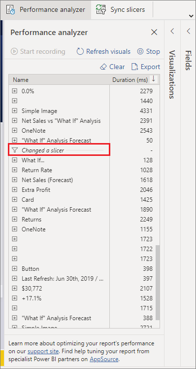
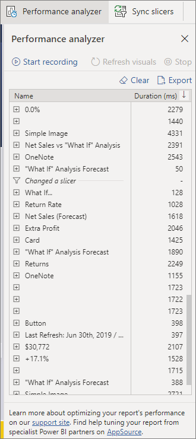
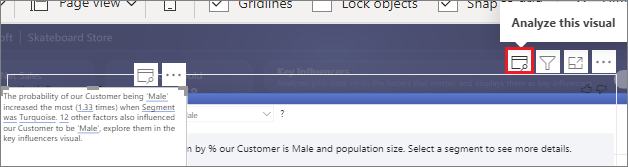
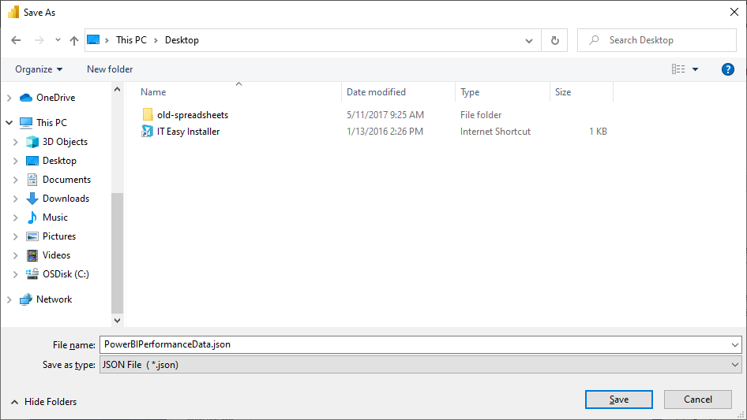

# Use Performance Analyzer to examine report element performance in Power BI Desktop

[!INCLUDE [applies-yes-desktop-no-service](../includes/applies-yes-desktop-no-service.md)]

In **Power BI Desktop**, you can find out how each of your report elements, such as visuals and DAX formulas, are performing. By using the **Performance Analyzer**, you can see and record logs that measure how each of your report elements performs when users interact with them and which aspects of their performance are most (or least) resource intensive.

:::image type="content" source="media/desktop-performance-analyzer/performance-analyzer-01-inline.png" alt-text="Screenshot that shows Performance Analyzer." lightbox="media/desktop-performance-analyzer/performance-analyzer-01-expanded.png":::

Performance Analyzer inspects and displays the duration necessary for updating or refreshing all visuals that user interactions initiate. It also presents the information so that you can view, drill down, or export the results. Performance Analyzer can help you identify visuals that affect the performance of your reports and identify the reason for the impact.

## Display the Performance Analyzer pane

In **Power BI Desktop** select the **Optimize** ribbon, and then select **Performance Analyzer** to display the Performance Analyzer pane.

:::image type="content" source="media/desktop-performance-analyzer/performance-analyzer-02-inline.png" alt-text="Screenshot of the View ribbon, highlighting Performance Analyzer." lightbox="media/desktop-performance-analyzer/performance-analyzer-02-expanded.png":::

Once selected, Performance Analyzer is displayed in its own pane to the right of the report canvas.

## Use Performance Analyzer

Performance Analyzer measures the processing time (including the time to create or update a visual) required to update report elements initiated as a result of any user interaction that results in running a query. For example, adjusting a slicer requires the slicer visual to be modified, a query to be sent to the data model, and affected visuals to be updated as a result of the new settings.

To have Performance Analyzer begin recording, select **Start recording**.

Any actions you take in the report are displayed and logged in the Performance Analyzer pane, in the order that the visual is loaded by Power BI. For example, perhaps you have a report that users have said takes a long time to refresh, or certain visuals in a report take a long time to display when a slider is adjusted. Performance Analyzer can tell you which visual is the culprit and identify which aspects of the visual are taking the longest duration to process.

Once you start recording, the **Start recording** button is grayed out (inactive, since you've already begun recording) and the **Stop** button is active.

Performance Analyzer collects and displays the performance measurement information in real time. Each time you select a visual, move a slicer, or interact in any other way, Performance Analyzer immediately displays the performance results in its pane.

If the pane has more information than can be displayed, a scroll bar appears to navigate to additional information.

Each interaction has a section identifier in the pane, describing the action that initiated the log entries. In the following image, the interaction was that the users changed a slicer.

Each visual's log information includes the time spent (duration) to complete the following categories of tasks:

* **DAX query** - If a DAX query was required, this is the time between the visual sending the query and Analysis Services returning the results.
* **Visual display** - This is the time required for the visual to draw on the screen, including the time required to retrieve any web images or geocoding.
* **Other** - This is the time required by the visual for preparing queries, waiting for other visuals to complete, or performing other background processing.
* **Evaluated parameters** (preview) - This is the time spent evaluating the field parameters within a visual. Learn more about [field parameters (preview)](../create-reports/power-bi-field-parameters.md).

The **Duration (ms)** values indicate the difference between a *start* and *end* timestamp for each operation. Most canvas and visual operations execute sequentially on a single User Interface thread, which is shared by multiple operations. The reported durations include time spent queued while other operations complete. The [Performance Analyzer sample](https://github.com/microsoft/powerbi-desktop-samples/tree/main/Performance%20Analyzer) on GitHub and its associated [documentation](https://github.com/microsoft/powerbi-desktop-samples/blob/main/Performance%20Analyzer/Power%20BI%20Performance%20Analyzer%20Export%20File%20Format.docx) provide details about how visuals query data and render.

After you've interacted with the elements of the report that you want to measure with Performance Analyzer, you can select the **Stop** button. The performance information remains in the pane after you select **Stop** for you to analyze.

To clear out the information in the Performance Analyzer pane, select **Clear**. All information is erased and isn't saved when you select **Clear**. To learn how to save information in logs, see the following section.

> [!TIP]
> When Power BI processes queries and their associated metadata, the processing of the query can be impacted by the complexity of the schema, the number of tables in the database(s), the complexity of the relationships between them, and the number of foreign key constraints on the tables. Such complexity can result in initial delays in returning or rendering a report.

## Refreshing visuals

You can select **Refresh visuals** in the Performance Analyzer pane to refresh all visuals on the current page of the report and thereby have Performance Analyzer gather information about all such visuals.

You can also refresh individual visuals. When Performance Analyzer is recording, you can select **Analyze this visual**, found in the top-right corner of each visual, to refresh that visual and capture its performance information.

## Save performance information

You can save the information that Performance Analyzer creates about a report by selecting the **Export** button. Selecting **Export** creates a .json file with information from the Performance Analyzer pane.

## Related content

For more information about **Power BI Desktop** and how to get started, see the following articles.

* [What is Power BI Desktop?](../fundamentals/desktop-what-is-desktop.md)
* [Query overview with Power BI Desktop](../transform-model/desktop-query-overview.md)
* [Data sources in Power BI Desktop](../connect-data/desktop-data-sources.md)
* [Connect to data in Power BI Desktop](../connect-data/desktop-connect-to-data.md)
* [Shape and combine data with Power BI Desktop](../connect-data/desktop-shape-and-combine-data.md)
* [Common query tasks in Power BI Desktop](../transform-model/desktop-common-query-tasks.md)

For information about the Performance Analyzer sample, check out the following resources.

* [Performance Analyzer sample](https://github.com/microsoft/powerbi-desktop-samples/tree/main/Performance%20Analyzer)
* [Performance Analyzer sample documentation](https://github.com/microsoft/powerbi-desktop-samples/blob/main/Performance%20Analyzer/Power%20BI%20Performance%20Analyzer%20Export%20File%20Format.docx)
