# Use R-powered Power BI visuals in Power BI

[!INCLUDE [applies-yes-desktop-yes-service](../includes/applies-yes-desktop-yes-service.md)]

In **Power BI Desktop** and the **Power BI service**, you can use R-powered Power BI visuals without any knowledge of R and without any R scripting. This enables you to harness the analytic and visual power of R visuals, and R scripts, without learning R or doing any programming yourself.

To use R-powered Power BI visuals, you first select and download the R custom visual you're interested in using from the [**AppSource**](https://appsource.microsoft.com/marketplace/apps?product=power-bi-visuals&page=1) gallery of **Power BI visuals** for Power BI.

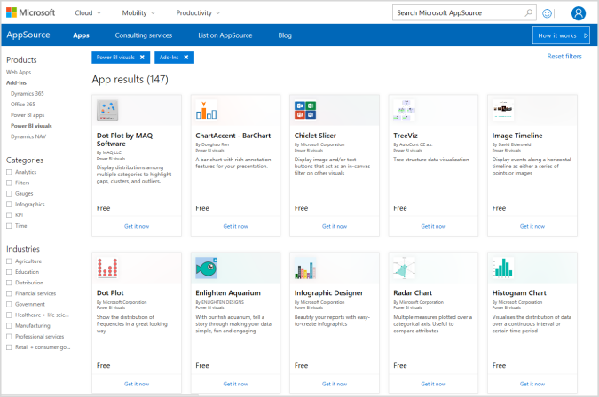

The following sections describe how to select, load, and use R-powered visuals in **Power BI Desktop**.

## Use R Power BI visuals

To use R-powered Power BI visuals, download each visual from the **Power BI visuals** library, then use the visual like any other type of visual in **Power BI Desktop**. There are two ways to get Power BI visuals: you can download them from the online **AppSource** site, or browse and get them from within **Power BI Desktop**. 

### Get Power BI visuals from AppSource

Following are the steps to browse and select visuals from the online **AppSource** site:

1. Navigate to the Power BI visuals library, found at [https://appsource.microsoft.com](https://appsource.microsoft.com/). Select the **Products** tab, select **Power Platform**, and then select **See all Power Platform apps**.

   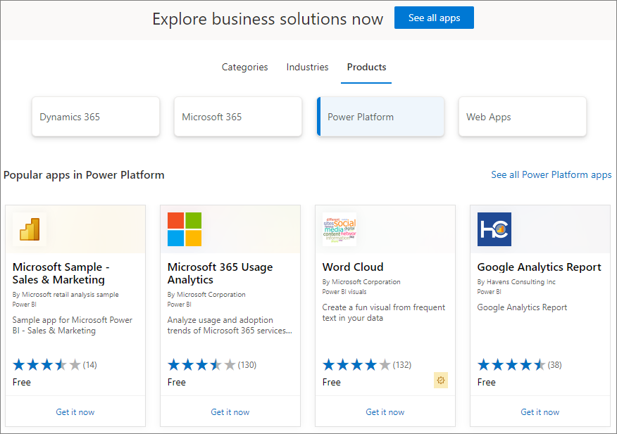

2. On the [Power BI visuals](https://appsource.microsoft.com/marketplace/apps?product=power-bi-visuals&page=1) library page, select **Power BI visuals** from the list of add-ins in the left pane.

   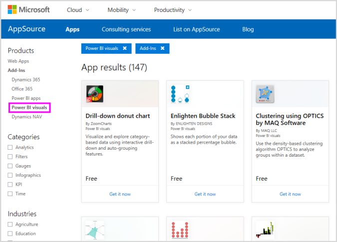

3. Select the **visual** you're interested in using from the gallery, and you're taken to a page that describes the visual. Select the **Get it now** button to download.

   > [!NOTE]
    > For authoring in **Power BI Desktop**, you need to have R installed on your local machine. But, when users want to view an R-powered visual in the **Power BI service** they do not need R installed locally.

   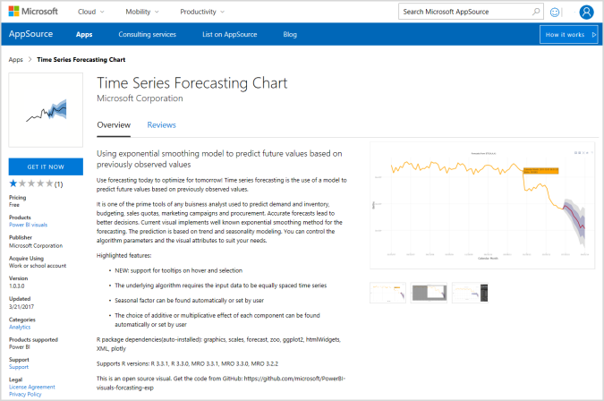

   You don't need to install R to use R-powered Power BI visuals in the **Power BI service**, however, if you want to use R-powered Power BI visuals in **Power BI Desktop** you *must* install R on the local machine. You can download R from [CRAN](https://cran.r-project.org/).

4. Once the visual is downloaded (which is like downloading any file from your browser), go to Power BI, select **More options** (...) in the **Visualizations** pane, and select **Import a visual from a file**.

   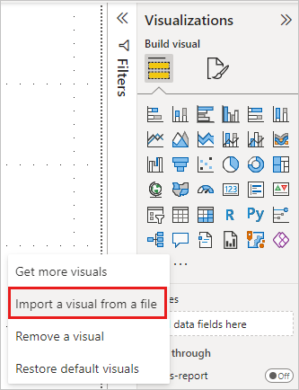

5. You're warned about importing a custom visual, as shown in the following image:

   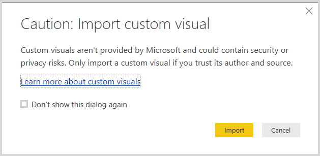
6. Navigate to where the visual file was saved, then select the file. **Power BI Desktop** custom visualizations have the .pbiviz extension.

   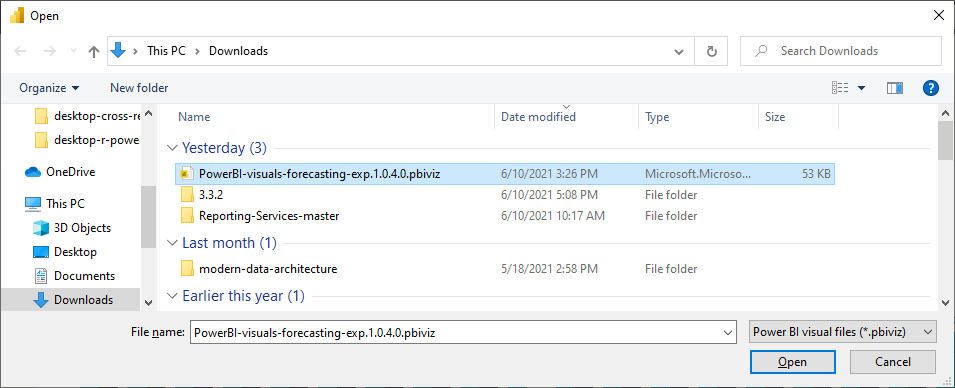
7. When you return to Power BI, you can see the new visual type in the **Visualizations** pane.

   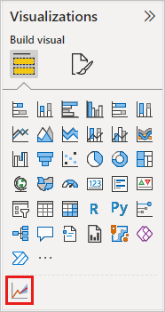

8. When you import the new visual (or open a report that contains an R-powered custom visual), **Power BI Desktop** installs the required R packages.

   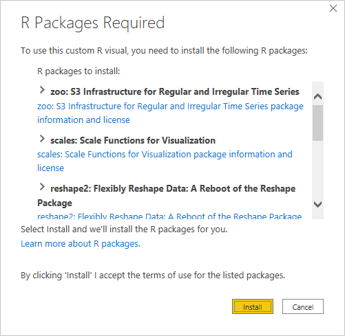

9. From there, you can add data to the visual just as you would any other **Power BI Desktop** visual. When complete, you can see your finished visual on the canvas. In the following visual, the **Forecasting** R-powered visual on the right was used with United Nations (UN) birth rate projections.

    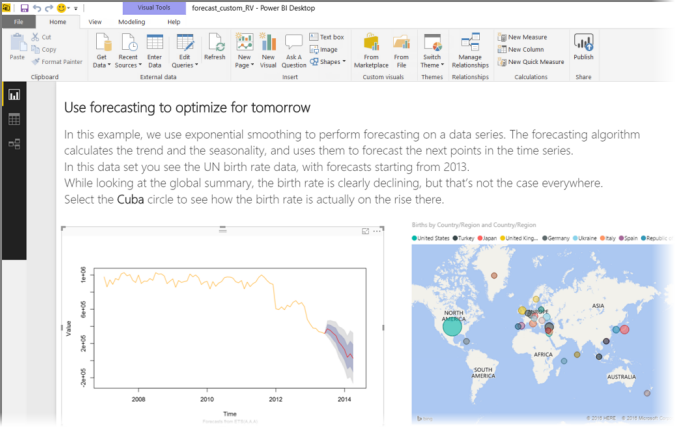

    Like any other **Power BI Desktop** visual, you can publish this report with its R-powered visuals to the **Power BI service** and share it with others.

    Check the library often, since new visuals are being added all the time.

### Get Power BI visuals from within Power BI

1. You can also get Power BI visuals from within Power BI Desktop or the Power BI service. Select the ellipsis (the ...) in the **Visualizations** pane, and select **Get more visuals**.

   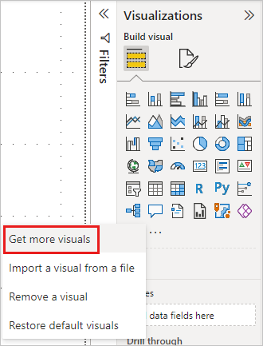

2. When you do so, the **Power BI visuals** dialog box appears, where you can scroll through the available Power BI visuals and select what you would like. You can search by name, select a category, or just scroll through the available visuals. When you're ready, just select **Add** to add the custom visual to Power BI.

   

## Contribute R-powered Power BI visuals

If you create your own R visuals for use in your reports, you can share those visuals with the world by contributing your custom visual to the **Power BI visuals gallery**. Contributions are made through GitHub, and the process is outlined in the following location:

* [Contributing to the R-powered Power BI visuals gallery](https://github.com/PowerBi-Projects/PowerBI-visuals#building-r-powered-custom-visual-corrplot)

## Troubleshoot R-powered Power BI visuals

R-powered Power BI visuals have certain dependencies that must be met for the visuals to work properly. When R-powered Power BI visuals don't run or load properly, the problem is usually one of the following:

* The R engine is missing
* Errors in the R script on which the visual is based
* R packages are missing or out of date

The following section describes troubleshooting steps you can take to help address trouble you might run into.

### Missing or outdated R packages

When attempting to install an R-powered custom visual, you can run into errors when there are missing or outdated R packages; this is due to one of the following reasons:

* The R installation is incompatible with the R package
* The firewall, anti-virus software, or proxy settings are preventing R from connecting to the Internet
* The Internet connection is slow or there's an Internet connection problem

The Power BI team is actively working on mitigating these issues before they reach you and the next Power BI Desktop will incorporate updates to address these problems. Until then, you can take one or more of the following steps to mitigate the issues:

1. Remove the custom visual, then install it again. This initiates a reinstallation of the R packages.
2. If your installation of R isn't current, upgrade your R installation, then remove and reinstall the custom visual as described in the previous step.

   Supported R versions are listed in the description of each R-powered custom visual, as shown in the following image.

     
    > [!NOTE]
    > You can keep the original R installation and only associate Power BI Desktop with the current version you install. Go to **File > Options and settings > Options > R scripting**.

3. Install R packages manually, using any R console. The steps for this approach follow:

   a. Download the R-powered visual installation script and save that file to a local drive.

   b. From the R console, run the following:

      ```console
      source("C:/Users/david/Downloads/ScriptInstallPackagesForForecastWithWorkarounds.R")
      ```

   Typical default installation locations are the following:

   ```console
       c:\Program Files\R\R-3.3.x\bin\x64\Rterm.exe (for CRAN-R)
       c:\Program Files\R\R-3.3.x\bin\x64\Rgui.exe (for CRAN-R)
       c:\Program Files\R\R-3.3.x\bin\R.exe (for CRAN-R)
       c:\Program Files\Microsoft\MRO-3.3.x\bin\R.exe (for MRO)
       c:\Program Files\Microsoft\MRO-3.3.x\bin\x64\Rgui.exe (for MRO)
       c:\Program Files\RStudio\bin\rstudio.exe (for RStudio)
   ```

4. If the previous steps don't work, try the following:

   a. Use **R Studio** and follow the step outlined in 3.b. above (run the script line from the R console).

   b. If the previous step doesn't work, change **Tools > Global Options > Packages** in **R Studio**, and enable the checkbox for **Use Internet Explorer library/proxy for HTTP**, then repeat step 3.b. from the above steps.

## Related content

Take a look at the following additional information about R in Power BI.

* [Power BI visuals gallery](https://app.powerbi.com/visuals/)
* [Running R Scripts in Power BI Desktop](../connect-data/desktop-r-scripts.md)
* [Create R visuals in Power BI Desktop](desktop-r-visuals.md)
* [Use an external R IDE with Power BI](../connect-data/desktop-r-ide.md)
