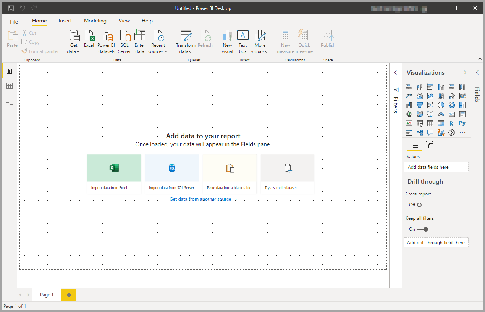
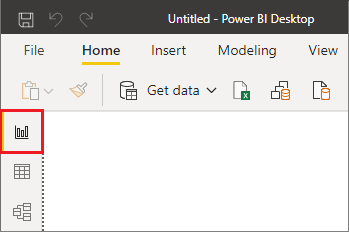
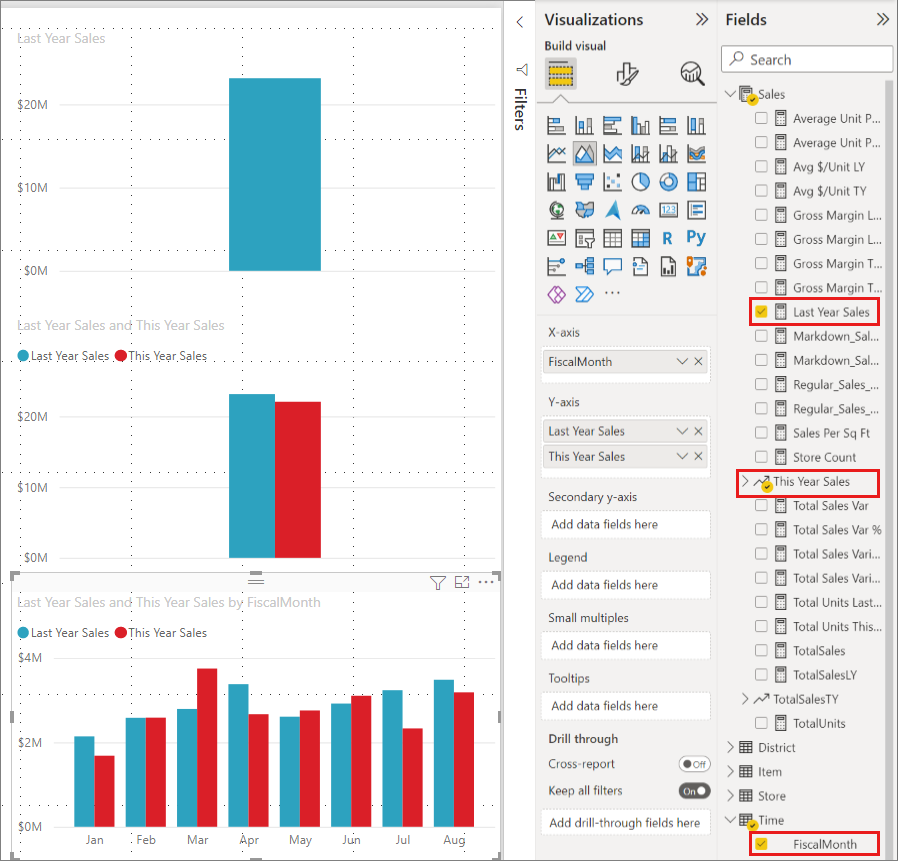
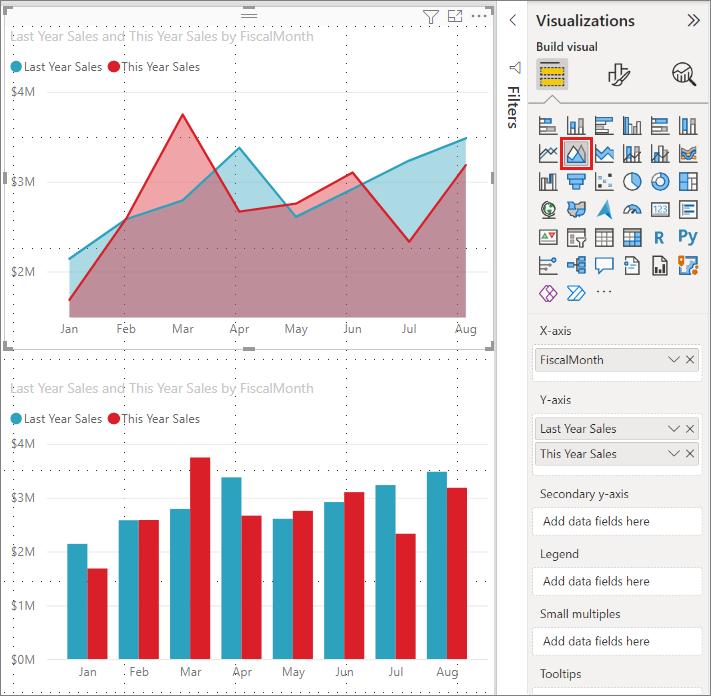
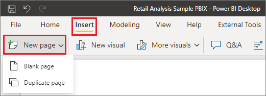
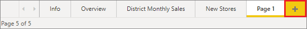
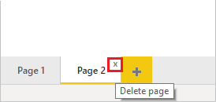
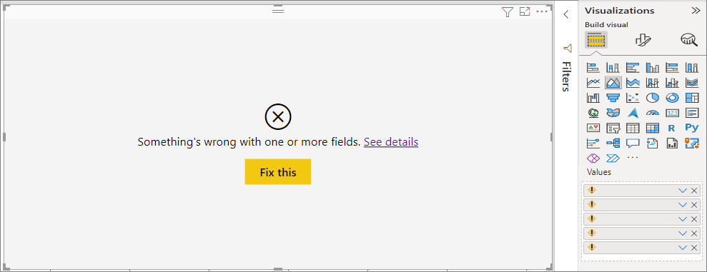
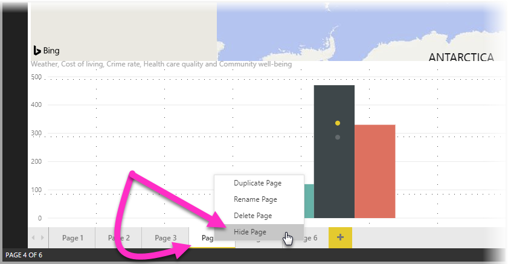
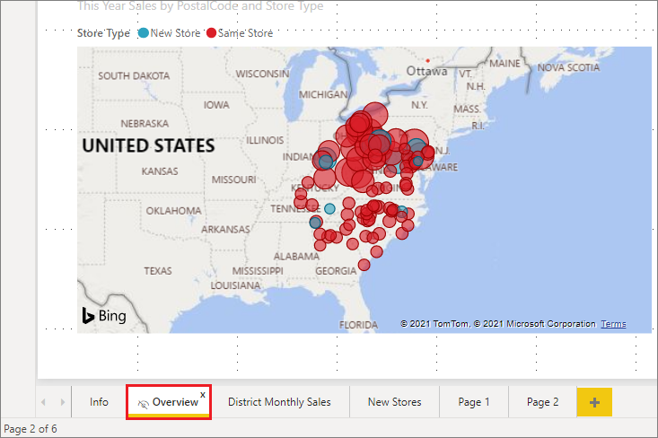

# Work with Report view in Power BI Desktop

If you've been working with Power BI, you know how easy it is to create reports providing dynamic perspectives and insights into your data. Power BI also has more advanced features in Power BI Desktop. With Power BI Desktop, create advanced queries, mashup data from multiple sources, create relationships between tables, and more.

Power BI Desktop includes a *Report view*, where you can create any number of report pages with visualizations. Report view in Power BI Desktop provides a similar design experience to the report's editing view in the *Power BI service*. You can move visualizations around, copy and paste, merge, and so on.

With Power BI Desktop, you can work with your queries and model your data to make sure your data supports the best insights in your reports. You can then save your Power BI Desktop file wherever you like, whether it's your local drive or to the cloud.

## Let's take a look

When you first load data in Power BI Desktop, you'll see the Report view with a blank canvas, with links to help you add data to your report.

You can switch between **Report**, **Data**, and **Model** views by selecting the icons in the left-hand navigation pane:

Once you've added some data, you can add fields to a new visualization in the canvas.

To change the type of visualization, you can select it on the canvas, then select a new type in **Visualizations**.

> [!TIP]
> Be sure to experiment with different visualization types. It's important your visualization convey information in your data clearly.

A report has at least one blank page to start. Pages appear in the navigation area at the bottom of the **Report** view. You can add all sorts of visualizations to a page, but it's important not to overdo it. Too many visualizations on a page make it look busy and difficult to find the right information. You can add new pages to your report. Just select **New page** from the **Insert** tab on the ribbon, and then select **Blank page**.

You can also select the **+** icon next to the pages in the navigation area below the canvas to create a new page.

To delete a page, select the **x** on the page's tab at the bottom of the Report view.

> [!NOTE]
> Reports and visualizations can't be pinned to a dashboard from Power BI Desktop. To do that, you'll need to publish to your Power BI site. For more information, see [Publish semantic models and reports from Power BI Desktop](desktop-upload-desktop-files.md).

## Copy and paste between reports

You can easily take a visual from one Power BI Desktop report and paste it into another report. Use the Ctrl+C keyboard shortcut to copy your report visual. In the other Power BI Desktop report, use Ctrl+V to paste the visual into the other report. You can copy one visual at a time, or all visuals on a page, then paste into the destination Power BI Desktop report.

The ability to copy and paste visuals is useful for people who build and updates multiple reports frequently. When you copy between files, settings and formatting that have been explicitly set in the formatting pane will carry forward, while visual elements relying on a theme or the default settings automatically update to match the theme of the destination report. When you get a visual formatted and appearing the way you want, you can copy and paste that visual into new reports and preserve your work.

If the fields in your model are different, you'll see an error on the visual and a warning about which fields don't exist. The error is similar to the experience you see when you delete a field in the model that a visual is using.

To correct the error, replace the broken fields with the fields you want to use from the model in the report to which you pasted the visual. If you're using a custom visual, you must also import that custom visual to the destination report.

## Hide report pages

When you create a report, you can also hide pages from a report. This approach might be useful if you need to create underlying data or visuals in a report, but you don't want those pages to be visible to others. Hiding pages can be useful when you create tables or supporting visuals that are used in other report pages. There are many other creative reasons you might want to create a report page then hide it from a report you want to publish.

Hiding a report page is easy. Right-click on the report page tab, and select **Hide** from the menu that appears.

There are a few considerations to keep in mind when hiding a report page:

* You can still see a hidden report view when in Power BI Desktop, even though the page shows a hidden page icon. In the following image, the **Overview** page is hidden.

  

* You *can't* see a hidden report page when you view the report in the Power BI service in **Reading** view, but you *can* see it in **Edit** view.

* If you're looking at the hidden page when you save the report, and then you publish it to the Power BI service, that page is the first one your report readers will see.

* Hiding a report page is *not* a security measure. The page can still be accessed by users, and its content is still accessible using drillthrough and other methods.

* No view-mode navigation arrows appear when a page is hidden in View mode.
